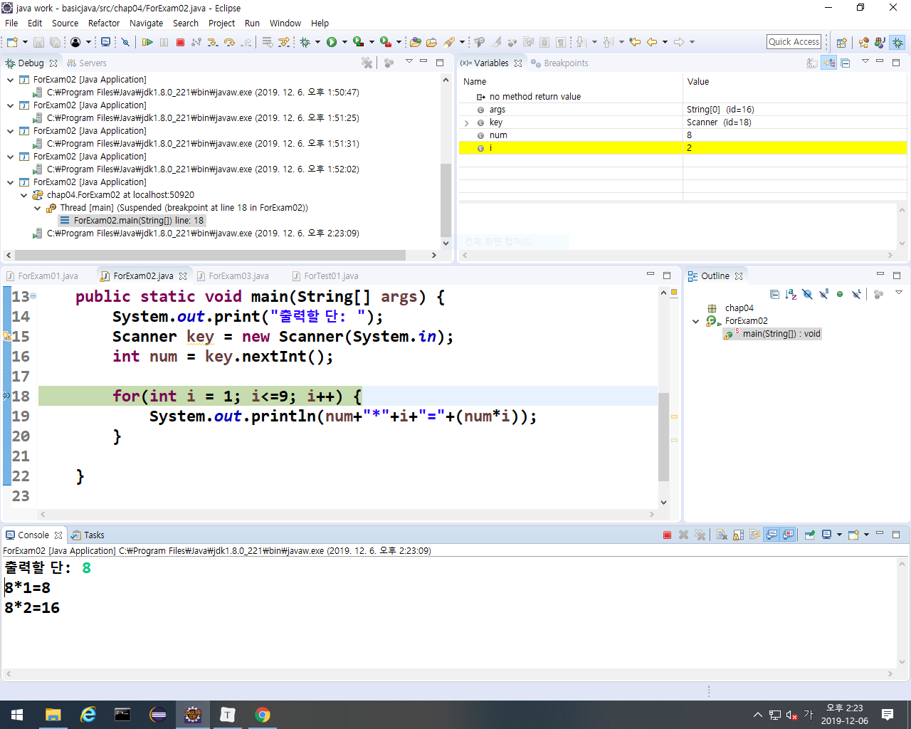

#### 참조형 

* 데이터를 어떻게 처리할 지 기능적인 부분인 API에 포함된 클래스를 메모리에 올릴 때
* 내가 만든 클래스를 메모리에 올릴 때
* 자바에서는 배열
* 할당되어 있는 주소를 heap에서 찾아서 참조해와서 쓰는 거니까 참조형.

* JVM이 인식할 수 있는 공간: static, stack, heap
  * stack: 현재 작업 공간.
  * heap: API에 있는 클래스를 올려놓는 공간 (new로 올림)
    * heap에 할당되어 있는 클래스: 객체 또는 인스턴스라 부름.

## eclipse

ctrl + shift + f : 코드를 보기 쉽게 자동정리.

기준이 같은데 여러개를 비교: if 중첩

기준 여러개를 비교: multi if => else if

### Switch문

* 형태: Switch(조건식){}
  * 여기서 조건식 자리에는 판단할 수 있는 값이 들어가야함.
    * 변수, 연산식, 메소드 호출문을 쓸 수 있는데 int와 String으로 casting할 수 있는 타입만 쓸 수 있다.
* case가 많이 나올경우 Switch문은 적합하지 않다. 근데 Switch문을 써야할 때는 조건식을 잘 설정해주면 된다.

## for문

* 반복횟수가 정해져 있는 경우에 사용.
* int형의 변수가 메모리에 올라와 있어야하고 이 값을 변화시키면서 횟수를 체크함. 횟수를 체크할 조건이 있어야함. i가 변해야 체크할 수 있음.
  * for(int i =1; i<=5; i++){}

## while문

* 조건이 true면 계속 반복. 조건식이 앞에 있음.

* do while문은 무조건 한번은 실행됨. 조건식이 뒤에있음

## 배열

* data를 저장하는 저장구조. 데이터 여러개를 한번에 저장하는 자료구조. 대신 동일한 타입!!
* 변수랑 비슷한 개념인데 배열은 값을 여러개를 저장할 수 있다. 배열을 쓰면 여러개의 data를 저장할 때 access하기 편리하다.
* 자바에서 배열은 참조형으로 다룬다.

##### 배열의 사용법

1. 배열의 선언
   * int[] arr;
2. 배열의 생성
   * arr = new int[5];
3. 배열의 초기화
   * arr[2] = 100;

