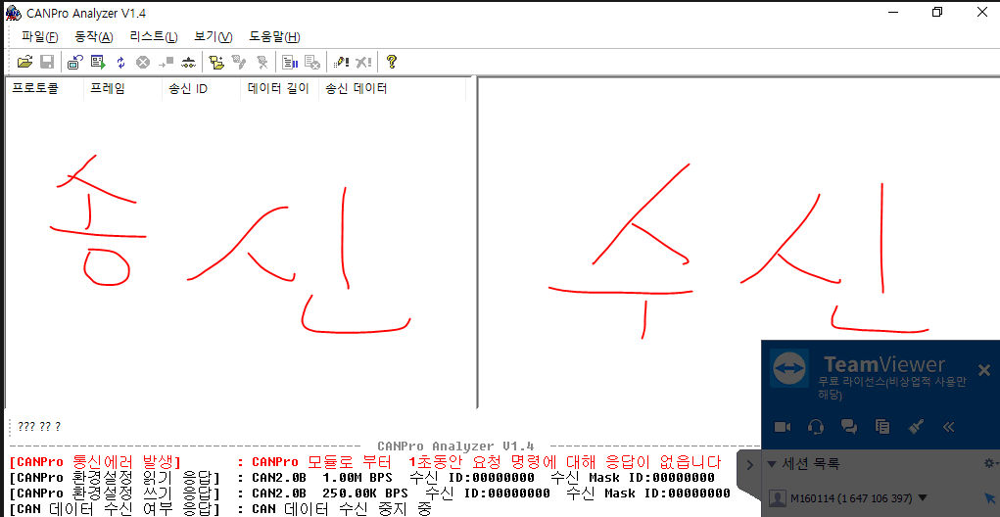
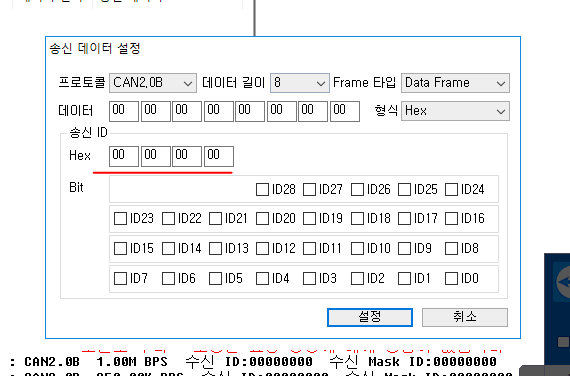

- 왼쪽이 송신된 데이터 리스트, 오른쪽은 수신된 데이터 리스트

- 모든 CAN 장비의 CAN_BPS가 똑같아야 CAN장비 끼리 통신할 수 있다.

- 송신부 우클릭 -> 송신데이터 추가
  - 메시지에 대한 구분 기호임

- 통신 장비니까 내부적인 규칙에 맞춰서 데이터를 보내야함.

<link rel="stylesheet"
	href="https://maxcdn.bootstrapcdn.com/bootstrap/3.3.6/css/bootstrap.min.css"
	integrity="sha384-1q8mTJOASx8j1Au+a5WDVnPi2lkFfwwEAa8hDDdjZlpLegxhjVME1fgjWPGmkzs7"
	crossorigin="anonymous">