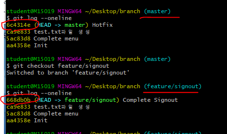
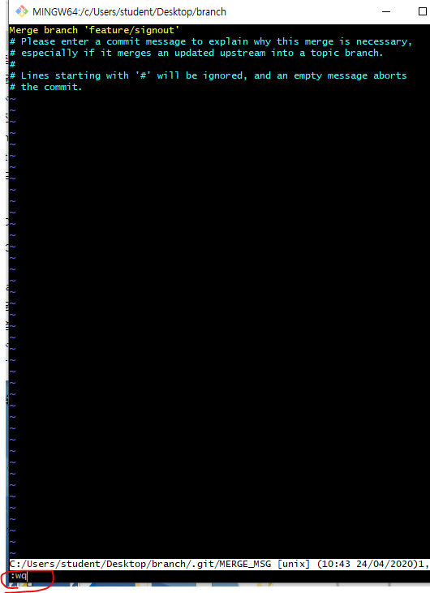
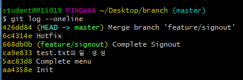
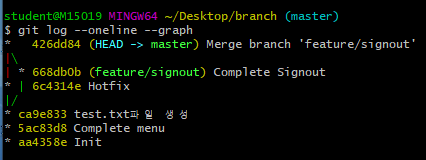
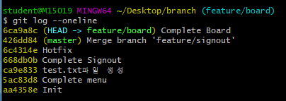
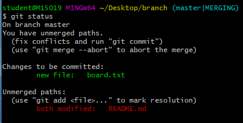
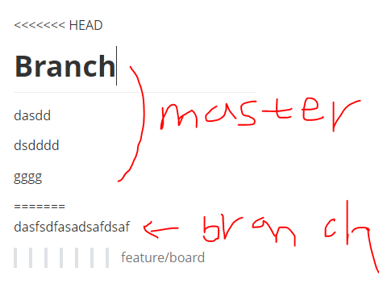
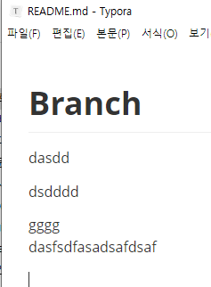
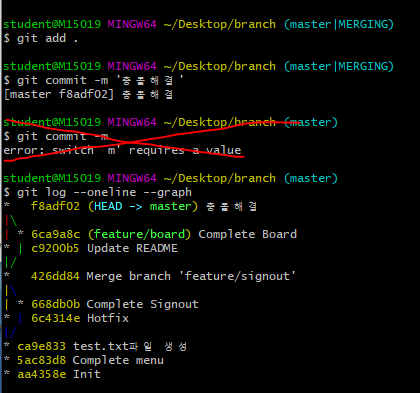

# Git branch

## 1. branch 관련 명령어

> Git 브랜치를 위해 root-commit을 발생시키고 진행하세요.

1. 브랜치 생성

    ```bash
    (master) $ git branch {브랜치명}
    ```

2. 브랜치 이동

    ```bash
    (master) $ git checkout {브랜치명}
    ```

3. 브랜치 생성 및 이동

    ```bash
    (master) $ git checkout -b {브랜치명}
    ```

4. 브랜치 삭제

    ```bash
    (master) $ git branch -d {브랜치명}
    ```

5. 브랜치 목록

    ```bash
    (master) $ git branch
    ```

6. 브랜치 병합

    ```bash
    (master) $ git merge {브랜치명}
    ```

	* master 브랜치에서 {브랜치명}을 병합

## 2. branch 병합 시나리오

> branch 관련된 명령어는 간단하다.
>
> 다양한 시나리오 속에서 어떤 상황인지 파악하고 자유롭게 활용할 수 있어야 한다.

### 상황 1. fast-foward

> fast-foward는 feature 브랜치 생성된 이후 master 브랜치에 변경 사항이 없는 상황

1. feature/test branch 생성 및 이동

   ``` bash
   # 엔터 탭 backspace => 레이아웃이 안 깨짐
   # 브랜치 만들면서 이동하는 명령어
   $ git checkout -b feature/test
   Switched to a new branch 'feature/test'
   ```

2. 작업 완료 후 commit

   ``` bash
   $ touch test.txt
   $ git add .
   $ git commit -m 'test.txt파일 생성'
   [feature/test ca9e833] test.txt파일 생성
    1 file changed, 0 insertions(+), 0 deletions(-)
    create mode 100644 test.txt
   ```


3. master 이동(작업을 완료했으니까 다시 마스터로 이동)

   ``` bash
   $ git checkout master
   Switched to branch 'master'
   ```


4. master에 병합(master에서 머지를 해야함.)

   ``` bash
   $ git merge feature/test
   Updating 5ac83d8..ca9e833
   Fast-forward
    test.txt | 0
    1 file changed, 0 insertions(+), 0 deletions(-)
    create mode 100644 test.txt
   ```


5. 결과 -> fast-foward (단순히 HEAD를 이동)

   ``` bash
   $ git log --oneline
   ca9e833 (HEAD -> master, feature/test) test.txt파일 생성
   5ac83d8 Complete menu
   aa4358e Init
   ```

6. branch 삭제(병합을 완료 했으니까 삭제)

   ``` bash
   $ git branch -d feature/test
   Deleted branch feature/test (was ca9e833).
   ```

---

### 상황 2. merge commit

> 서로 다른 이력(commit)을 병합(merge)하는 과정에서 **다른 파일이 수정**되어 있는 상황
>
> git이 auto merging을 진행하고, **commit이 발생된다.**
>
> *** 충돌이 발생하지 않는 상황 ***
>
> *** 다른 branch에서 작업하고 있는데 master에서 누가 작업함 -> merge commit ***

1. feature/signout branch 생성 및 이동

   ``` bash
   $ git checkout -b feature/signout
   Switched to a new branch 'feature/signout'
   ```

2. 작업 완료 후 commit

   ``` bash
   $ touch signout.txt
   $ git add .
   $ git commit -m 'Complete Signout'
   [feature/signout 668db0b] Complete Signout
    1 file changed, 0 insertions(+), 0 deletions(-)
    create mode 100644 signout.txt
   ```

3. master 이동

   ``` ba
   $ git checkout master
   Switched to branch 'master'
   
   ```

4. *master에 추가 commit 이 발생시키기!!* (commit merge상황 만들기 위한 과정임.)

   * **다른 파일을 수정 혹은 생성하세요!**

   ``` bash
   $ touch hotfix.txt
   $ git add .
   $ git commit -m 'Hotfix'
   [master 6c4314e] Hotfix
    1 file changed, 0 insertions(+), 0 deletions(-)
    create mode 100644 hotfix.txt
   ```

   

5. master에 병합

   ``` bash
   $ git merge feature/signout
   Merge made by the 'recursive' strategy.
    signout.txt | 0
    1 file changed, 0 insertions(+), 0 deletions(-)
    create mode 100644 signout.txt
   ```

6. 결과 -> 자동으로 *merge commit 발생*

   * vim 편집기 화면이 나타납니다.
   * 자동으로 작성된 커밋 메시지를 확인하고, `esc`를 누른 후 `:wq`를 입력하여 저장 및 종료를 합니다.
      * `w` : write
      * `q` : quit
   * 커밋이  확인 해봅시다.



- 마스터와 브랜치에서 만든 파일들이 합쳐지고 머지되었다는 이력이 추가됨



1. 그래프 확인하기

   ``` bash
   $ git log --oneline --graph
   *   426dd84 (HEAD -> master) Merge branch 'feature/signout'
   |\
   | * 668db0b (feature/signout) Complete Signout
   * | 6c4314e Hotfix
   |/
   * ca9e833 test.txt파일 생성
   * 5ac83d8 Complete menu
   * aa4358e Init
   ```

   

   

2. branch 삭제

   ``` bash
   $ git branch -d feature/signout
   Deleted branch feature/signout (was 668db0b).
   ```

   

---

### 상황 3. merge commit 충돌

> 서로 다른 이력(commit)을 병합(merge)하는 과정에서 **같은 파일의 동일한 부분이 수정**되어 있는 상황
>
> git이 auto merging을 하지 못하고, 충돌 메시지가 뜬다.
>
> 해당 파일의 위치에 표준형식에 따라 표시 해준다.
>
> 원하는 형태의 코드로 직접 수정을 하고 직접 commit을 발생 시켜야 한다.

1. feature/board branch 생성 및 이동

   ``` bash
   $ git checkout -b feature/board
   Switched to a new branch 'feature/board'
   ```

2. 작업 완료 후 commit

   ``` bash
   $ touch board.txt
   # README.md 파일 수정
   $ git add .
   $ git commit -m 'Complete Board'
   [feature/board 6ca9a8c] Complete Board
    2 files changed, 1 insertion(+)
    create mode 100644 board.txt
   ```




1. master 이동

   ``` bash
   $ git checkout master
   Switched to branch 'master'
   ```


4. *master에 추가 commit 이 발생시키기!!* (마스터와 브랜치가 동일한 파일을 수정한 상황발생)

   * **동일 파일을 수정 혹은 생성하세요!**
   
``` bash
   # README.md를 마스터에서도 수정
   $ git add .
   
   $ git commit -m 'Update README'
   [master c9200b5] Update README
    1 file changed, 8 insertions(+)
    
    $ git log --oneline
   c9200b5 (HEAD -> master) Update README
   426dd84 Merge branch 'feature/signout'
   6c4314e Hotfix
   668db0b Complete Signout
   ca9e833 test.txt파일 생성
   5ac83d8 Complete menu
   aa4358e Init
   ```
   
5. master에 병합

   ``` bash
   $ git merge feature/board
   Auto-merging README.md
   CONFLICT (content): Merge conflict in README.md
   Automatic merge failed; fix conflicts and then commit the result.
   
   => 자동 머지 실패. 충돌난거 고치고나서 커밋하라는 메시지임.
   => 이때 같은 파일을 동일하게 바꾼부분은 머지되고 다르게 바꾼부분은 충돌남.
   ```


6. 결과 -> *merge conflict발생*

   > git status 명령어로 충돌 파일을 확인할 수 있음.
   
   


7. 충돌 확인 및 해결

   
   
   


8. merge commit 진행(그래프도 확인하기)

    ```bash
    $ git commit
    ```

   * vim 편집기 화면이 나타납니다.
   * 자동으로 작성된 커밋 메시지를 확인하고, `esc`를 누른 후 `:wq`를 입력하여 저장 및 종료를 합니다.
      * `w` : write
      * `q` : quit
   * 커밋이  확인 해봅시다.
   
    

9. branch 삭제

