- 개발자 기술면접 github
  - https://github.com/JaeYeopHan/Interview_Question_for_Beginner


# git

- 분산형 버전관리 시스템 = DVCS

- git에서 제일 중요한 명령어
  - $ git status
  - GUI = Graphic User Interface
  - CLI = Command Line Interface

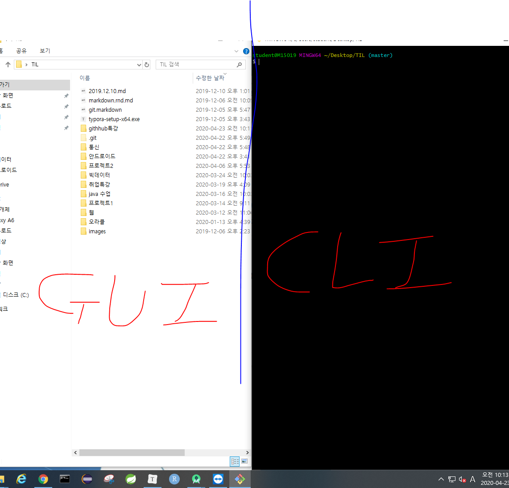

### git Status를 통해 정리하기

- git Status 구조
  - WD : working directory(작업 공간)
  - SA : Staging area(또는 index)
    - WD에서 add명령어
  - 버전(commits??)
    - SA에서 commit명령어

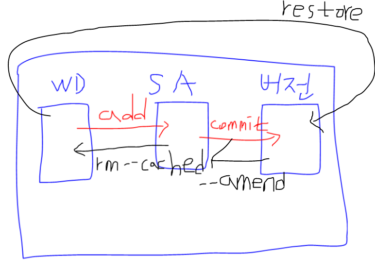

# Git status를 통해 정리하기

## 기초 명령어

``` bash
# list (파일 목록 보기)
$ ls
# change directory (디렉토리 변경)
$ cd
#빈 파일 생성
$ touch 파일명
```

## 상황

### 1. add

- git init을 한 후 add하는 상황

``` bash
$ touch a.txt
$ git status
On branch master

No commits yet
# Untracked files => 새로 생성된 파일
Untracked files:
  # Staging area로 이동시키려면(커밋 하려면), git add를 해라   
  (use "git add <file>..." to include in what will be committed)
        a.txt
# 위의 모든 내용을 총평, WD는 존재하는데 Staging area는 없다.
nothing added to commit but untracked files present (use "git add" to track)

```

``` bash
$ git add a.txt
$ git status
On branch master

No commits yet
# 커밋될 변경사항들(staging area가 있다)
Changes to be committed:
  # unstage를 위해서 활용할 명령어(add 취소)
  (use "git rm --cached <file>..." to unstage)
        new file:   a.txt


```

## 2. Commint

- 커밋하기

``` bash
$ git commit -m 'Create a.txt'
[master (root-commit) 25a6103] Create a.txt
 1 file changed, 0 insertions(+), 0 deletions(-)
 create mode 100644 a.txt
 
 $ git status
On branch master
nothing to commit, working tree clean
```


- 커밋 내역 확인

```bash
$ git log
commit 25a610345083609682c7d8927929328556521bec (HEAD -> master)
Author: tawn0414 <tawn0414@naver.com>
Date:   Thu Apr 23 10:34:42 2020 +0900

    Create a.txt

$ git log --oneline
25a6103 (HEAD -> master) Create a.txt
```

## 3. 추가 파일 변경상태

``` bash
$ touch b.txt

$ git status
On branch master
Changes not staged for commit:
  (use "git add/rm <file>..." to update what will be committed)
  (use "git restore <file>..." to discard changes in working directory)
        deleted:    a.txt

Untracked files:
  (use "git add <file>..." to include in what will be committed)
        11111.txt
        b.txt

no changes added to commit (use "git add" and/or "git commit -a")

```

## 4. 커밋 메시지 변경

> > 주의!! 커밋 메시지 변경 시 해시값 자체가 변경되서, 이미 원격저장소에 push한 이력에 대해서는 메시지변경을 하면 안된다.
>
> - 커밋 메시지 수정을 막 쓰면 안된다.
>   - 커밋을 수정하면 해쉬값이 달라지기 때문이다.
>   - 이력이 달라지니까 푸시를 실패할 수 있다.

``` bash
$ git commit --amend
```

- vim 텍스트 편집기가 실행된다.
  - i : 편집모드
  - esc를 눌러서 편집 모드를 종료하고, 명령모드에서 저장
    - :wq
      - write + quit

``` bash
[master 56006bf] a.txt 추가
 Date: Thu Apr 23 10:46:24 2020 +0900
 1 file changed, 3 insertions(+)
 create mode 100644 a.txt
```

### 4-1. 특정 파일을 빼놓고 커밋을 했을 때

``` bash
$ git add 빠뜨린 파일
$ git commit --amend
```

- 빠뜨린 파일을 add한 이후에 commit --amend를 하면, 해당 파일까지 포함하여 재커밋이 이뤄진다.

## 5.작업 내용을 이전 버전으로 되돌리기

- a.k.a. 작업 하던 내용을 버릴수도 있음.

```bash
## 파일의 내용이 삭제된 상태
$ git status
On branch master
Changes not staged for commit:
  (use "git add <file>..." to update what will be committed)
  (use "git restore <file>..." to discard changes in working directory)
        modified:   a.txt

no changes added to commit (use "git add" and/or "git commit -a")

$ git restore a.txt
$ git status
On branch master
nothing to commit, working tree clean

```

## 6. 특정 파일/폴더 삭제 커밋

> 해당 명령어는 실제 파일이 삭제되는 것은 아니지만, git에서 삭제되었다라는 이력을 남기는 것.

``` bash
$ git rm --cached b.txt
$ git status
On branch master
Changes to be committed:
  (use "git restore --staged <file>..." to unstage)
        deleted:    b.txt

Untracked files:
  (use "git add <file>..." to include in what will be committed)
        b.txt
# 주의!! 해당 파일이 물리적으로 삭제되는 것은 아니다.
```

- 일반적으로는 .gitignore와 함께 활용한다.

  1. .gitignore에 해당 파일 등록
  2. git rm --cached를 통해 삭제 커밋

  - 이렇게 작업을 하면, 실제 파일은 삭제되지 않지만 이후로 git으로 전혀 관리되지 않는다.

#### test폴더 만들고 시작

- git init
  - test폴더에서 깃 시작
  - 깃 명령어는 .git이 있는 폴더에서 하고 이 폴더의 하위폴더에서 또 init을 하면 안된다.

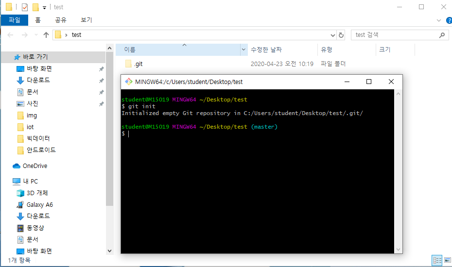

- git status
  - 현재 상태는 WD, SA, 버전 모두 비어있음

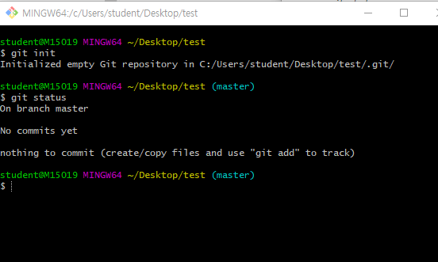

- touch a.txt
  - a.txt파일을 .git이 있는 폴더에 만들기

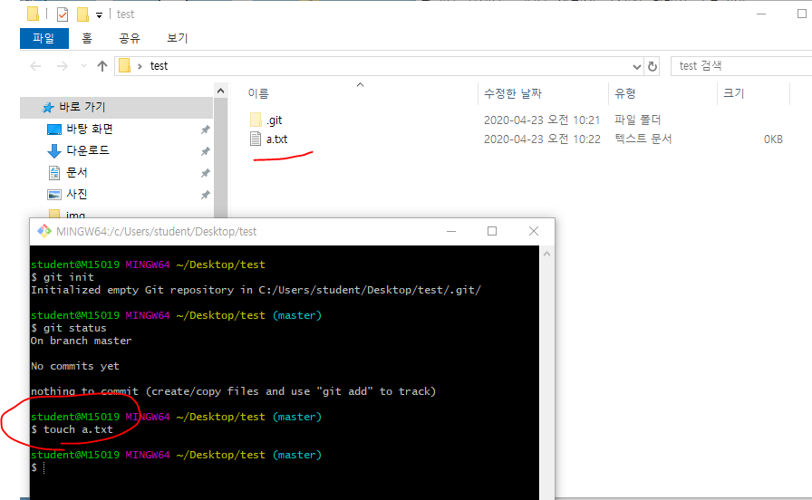

- 다시 git status
  - Untracked file인 a.txt.가 있음
  - 아래 표시는 add명령어를 통해서 SA로 옮길 수 있다는 의미

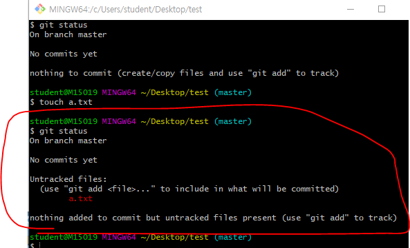

- add하고 status확인
  - git rm --cached 파일명
    - add한 파일 취소하기

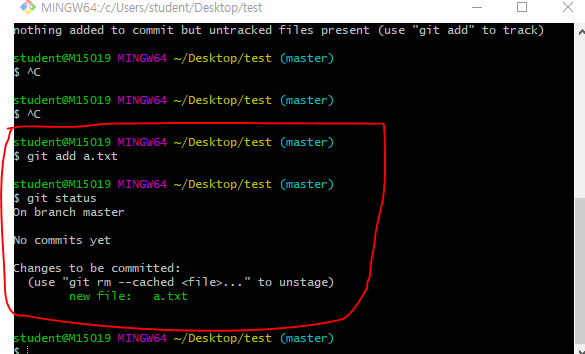

​	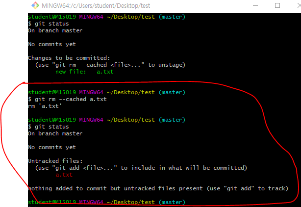

- 커밋하기
  - git commit -m '~~'

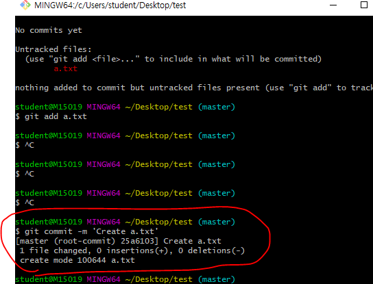

- log
  - 누가 작성했는지. 언제 뭘 했는지
  - git log --oneline
    - 한 줄로 출력

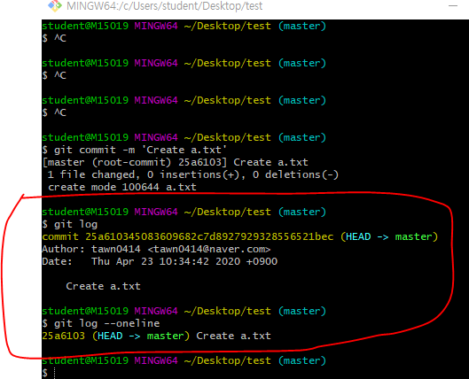

- 커밋 했으니까 이제 커밋할게 없어짐.

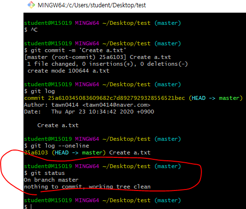

- 기존의 a.txt를 11111로 수정하고 b.txt파일 만들기
  - 추가 파일 변경상태를 보기 위해서

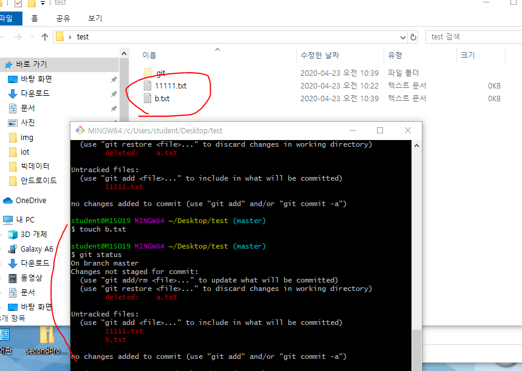

- untracked(관리가 안되고 있던거) 파일은 add를 취소할 때 ra --cached
- tracked(관리가 되고 있던거) 상태일 때 add를 취소할 때 restore --staged

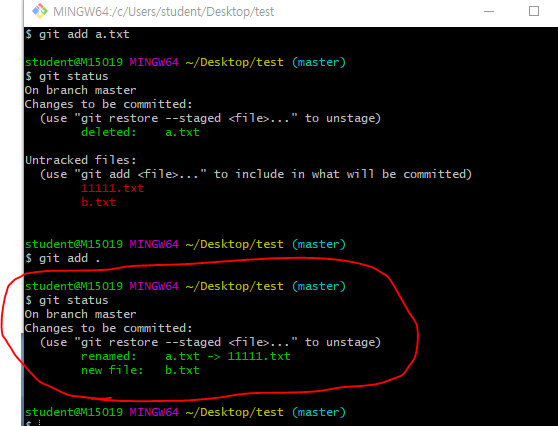

- 밑의 두개의 파일 수정하고 commit 할 때 메세지를 잘못 입력했을 때 

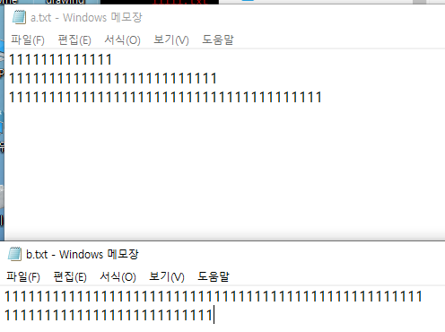

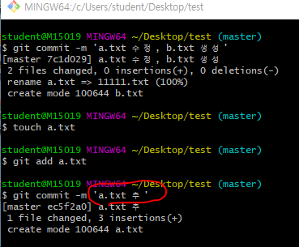

- i -> 커밋한거 수정 -> esc누르기 -> :wq누르기 -> 엔터
  - 커밋메시지를 수정하는것.
  - 아래 사진 창을 vim이라고 함.

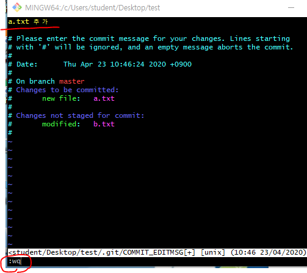

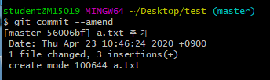

- 위에서 b.txt를 빠뜨리고 add했음. 이거처럼 빠뜨린 파일을 add할 때
  - b.txt를 add하고 amend하자.

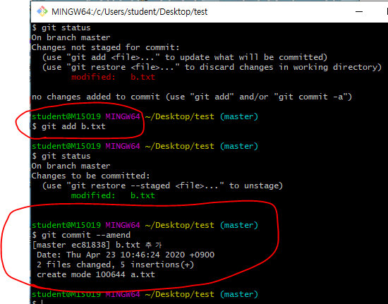

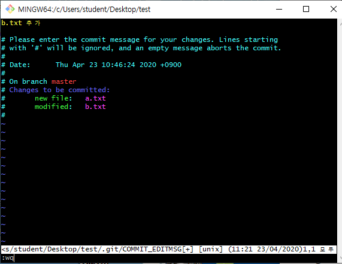 

- 파일의 내용이 사라졌을 때
  - 커밋되어있던거를 다시 불러올  수 있다.
    - git resotre a.txt

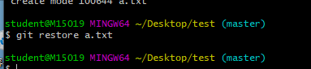


## .gitignore

- 커밋 이력에서는 지우고 실제로는 파일을 지우지 않기
  - git rm --cached 파일명

-  rm --cached => 커밋된 이력에서 지우는 명령어

- 민감하고 공개되면 안되는 정보를 ignore시킨다.
  - gitignore.io사이트

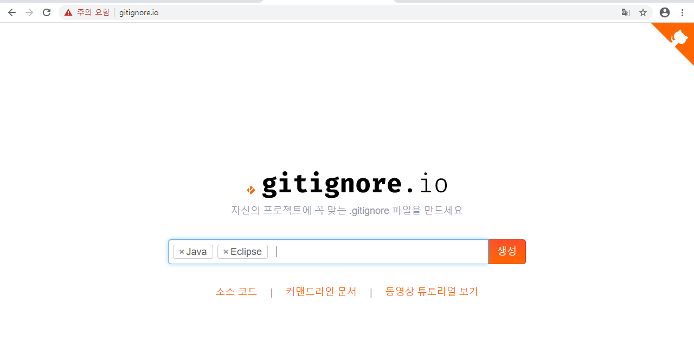

- ignore파일이 미리 만들어짐
  - 일반적으로 개발자들이 git으로 관리할 때 빼는 파일들

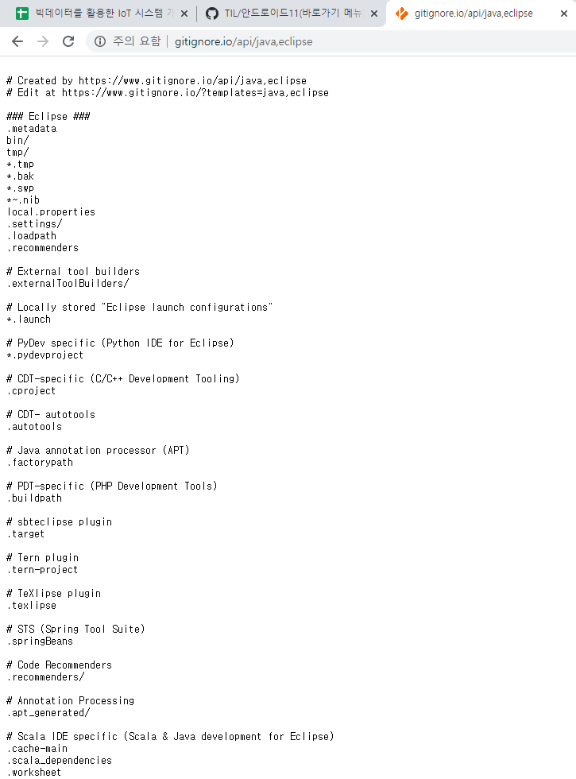

- bin폴더 처럼 구동에는 필요한데 git으로는 관리할 필요가 없는 폴더를 ignore시켜준 후 프로젝트를 진행하자.
  - 만약 이미 bin폴더가 tracking이 되고 있었다면 rm --cached로 이력을 지워주고 ignore해주면 된다.

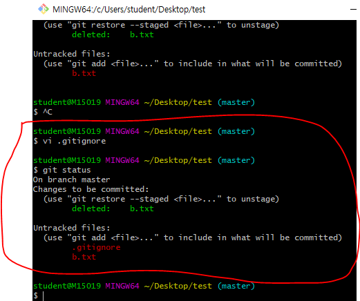

### 선생님 gitignore설명

- git으로 관리하고 싶지 않는 파일을 등록하여 활용할 수 있다.
- 일반적으로 프로젝트 환경(IDE, OS등)에 관련된 정보나 추가적으로 공개되면 안되는 데이터 파일등을 설정한다.
- 일반 프로젝트 환경에 대한 정보는 우선 [gitignore.io](https://gitignore.io)에서 프로젝트를 시작할 때마다 정의하는 습관을 가지자.

``` bash
# 특정 파일
secret.csv
# 특정 폴더(idea폴더를 이그노어)
idea/
# 특정 확장자(csv파일 모든것을 이그노어)
*.csv
# 특정 폴더에서 특정 파일 빼고(idea폴더에서 a.txt는 빼고 이그노어)
!idea/a.txt
```

### 원격저장소 활용 명령어

- push되는 거는 commit을 한 것들임

  - WD나 SA까지만 작업한 내용은 push되지 않음.

- 원격저장소에 이름을 추가하는 명령어

  - 깃아, 원격저장소에 추가해줘 오리진이라고, url을

    ``` bash
     git remote add origin url
     
     origin은 원격저장소 이름
    ```

- 원격저장소의 목록을 조회하는 명령어

  ``` bash
  git remote -v
  ```

- 원격저장소를 삭제

  ``` bash
  git remote rm 원격저장소 이름
  ```

- push

  ``` bash
  git push origin master
  ```

***마크다운으로 정리하기 팁***

- 테이블 추가

- 본문 -> 표

| 문제번호     | 풀이       | 링크       | 비고 |
| ------------ | ---------- | ---------- | ---- |
| 코딩 1번문제 | [링크](./) | [url](url) | DFS  |
| ...          | ...        | ...        | ...  |
| ...          | ...        | ...        | ...  |


# GitHub Pages

- 정적 사이트 생성기(블로그)
  - jekyll(ruby언어)
    - 오래되고, 자료 많고
  - gatsby(js언어, react + graphql)
    - 최신, 근데 유명해져서 자료가 많음

#### 포트폴리오 만들 때

- 우선 start bootstarap사이트에서 bootstarap 하나 다운로드 받기

- visual studio code를 다운받기
  - [링크](https://code.visualstudio.com/docs/?dv=win64user)

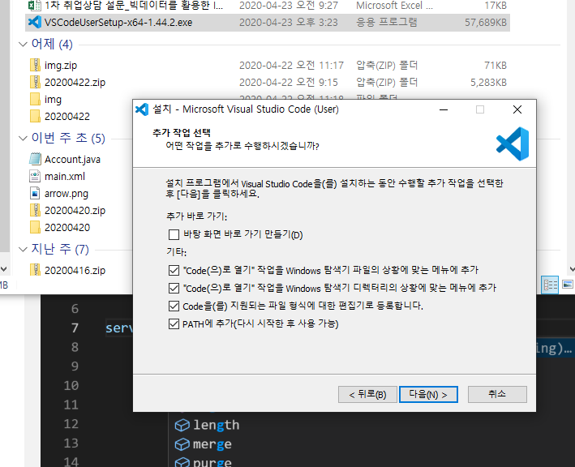

- 위에 체크한거는 아래처럼 폴더에서 우클릭 했을 때 Code로 열기가 뜨게 하기 위해서임

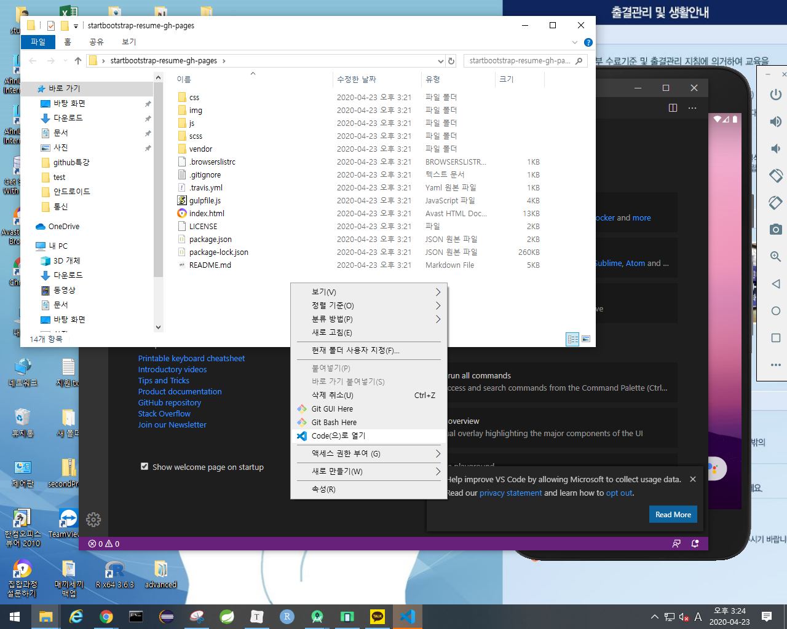

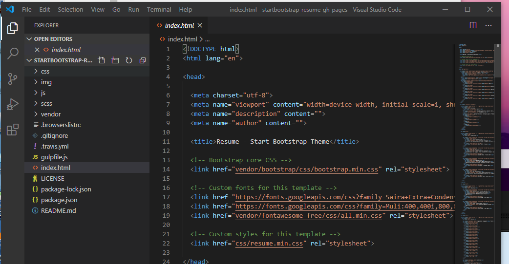

- index.html꺼 부트스트랩


