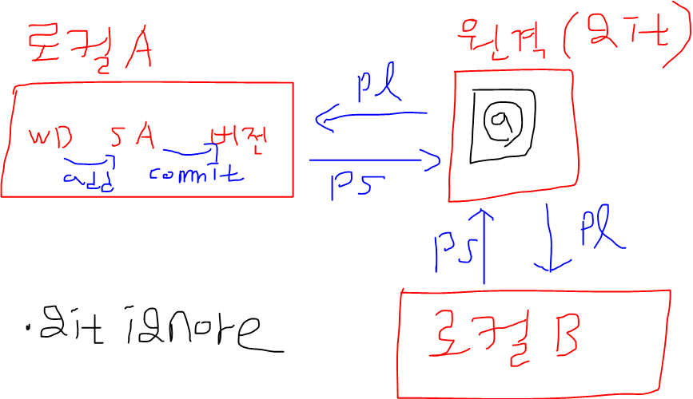
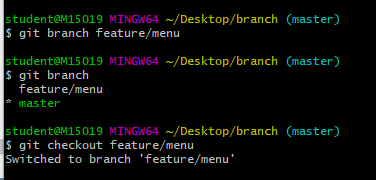
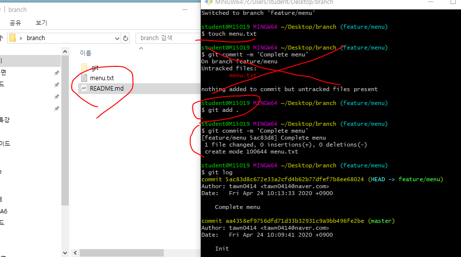
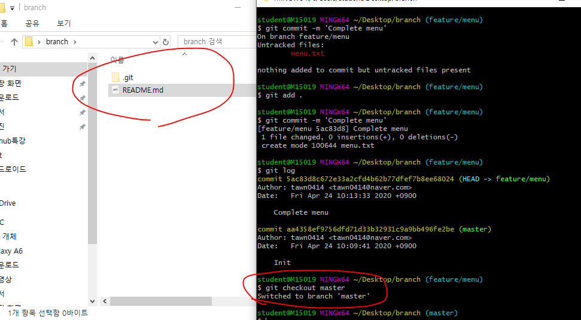
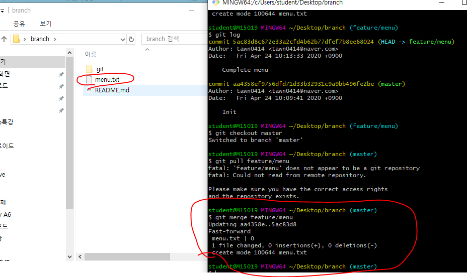

# Branch

- 안드로이드 스튜디오 상단에 VCS
  - Github연동.



- gitignore => 버전에 데이터가 올라가지 않게 막는거
- @ => commit해서 버전에 올린데이터가 git에 올라간 것.
- git을 두 사람 이상이 공유~~
  - branch를 쓰면 됨.

## Master에 직접 push/pull

- 로컬B에서 파일 만들어서 git에 푸시한 상태 -> 로컬 A에서 파일 만들어서 푸시하면 git에 푸시 안됨
  - 로컬 B에서 푸시한 파일의 이력을 로컬 A가 갖고있지 않으니까. git이력이랑 A가 갖고있는 이력이 다름.
  - 버전이 달라서 푸시를 못한다.
  - pull을 받아야함.
- A와 B가 계속 충돌이 나는 문제가 발생. 이 문제를 해결한것이 Branch


## Branch

- branch를 써서 이력을 따로 관리.

- feature/menu라는 브랜치를 만들고 feature/menu로 이동

``` bash
$ git branch 브랜치명
$ git checkout 브랜치명
```




- feature/menu에서 menu.txt와 README.md를 만들고 add + commit을 한 상태에서 master branch로 이동하면 폴더에 있던 파일이 안보임
  - 이력이 따로 관리된다는 뜻.



- checkout master명령어로 마스터 브랜치로 이동



- 마스터 브랜치에서 머지
  - feature/menu에서 만든 menu.txt를 가져올 수 있음




# Github flow

- 조장이 저장소를 만든 후 collaborator로 사람들을 초대해줘야함
  - settings -> manage access -> invite a collaborator
- 초대받은 사람은 메일로 초대를 받을 수 있음
  - 데스크탑에서 git clone 해주면 됨.
- 저장소를 시작하는 명령어
  - git init, git clone
  - init은 내가 저장소를 만드는거
  - clone은 만들어진 저장소를 가져오는 것

## master만 사용(github flow는 아님)

- 파일 수정하고

  ``` ba
  # 파일을 수정한 후
  $ git add .
  $ git commit -m ''
  $ git push origin master
  
  # 받을때는 
  $ git pull origin master
  
  # add랑 push를 동시에 할 수 있는 명령어
  $ git commit -a
  
  #fetch명령어
  => git에 있는 정보를 가져오는 명령어
  ```

- 동시에 push하면 조금이라도 늦게 push한 사람은 push오류 뜸

  - 거절된 사람은 push를 해결해야함.
    - pull -> 내용수정 -> add . -> commit -> push로 해결

  ``` bash
  # pull만 받은 상태는 오토머지 하다가 충돌난 상태임. 직접 수정해줘야함
  $ git pull origin master
  $ git add .
  $ git commit
  vim창에서 :wq
  $ git push origin master
  ```

## branch(pull request)

## branch(pull request,Fork)

- Fork
  - 다른 사람의 프로젝트를 내 깃으로 가져올 수 있음
  - 내 깃에서 수정한 다음에 pull request로 요청 보내서 내가 포크해온 사람한테 머지 요청을 할 수 있음.


## Stash

> 작업 내역을 임시 저장할 수 있음. 

``` bash
# 작업을 하던 파일을 stash공간에 임시저장 해놓고 다른 작업을 하고 push하는 용도
$ git stash
- WD랑 SA에 있는 거를 임시저장.

# stash list 보기
$ git stash list

# 임시공간 내용 가져오기
$ git stash pop
```

### 예시

- 로컬에서 작업하고 있던 중, pull을 받아서 원격 저장소에 새로운 내용을 반영 해야하는 경우

``` bash

```

- 해결방법 

``` bash
$ git stash
$ git pull origin master

# 만약 동일 파일 수정이 있으면, 충돌이 발생하긴 함.
$ git stash pop
```


## reset VS revert (이력 지우기)

#### 1. reset

- 특정 버전으로 되돌아가는 작업

  ``` bas
  $ git reset 커밋해시코드
  ```

  - reset 명령어의 결과는 다음과 같다.

    ``` bash
    $ git log --oneline
    ```

  - reset 옵션
    - 기본 : 이전 이력의 변경 사항을 WD에 보관
    - --hard : 이전 이력의 변경 사항은 모두 삭제. 주의~!!

#### 2. revert

- 특정 시점을 되돌렸다는 커밋을 발생시킴.

  ``` bash
  
  ```

- git에 DDD파일이 있다고 하자 . DDD파일을 git에 올린 이력을 지우고 싶을 때 
  - git reset
    - DDD파일을 원격지에서 지우고 WD로 이동시킴
  - git reset --hard 파일명
    - DDD파일을 아예 삭제

- git revert 
  - DDD파일을 지우는데 커밋 이력을 남김?.