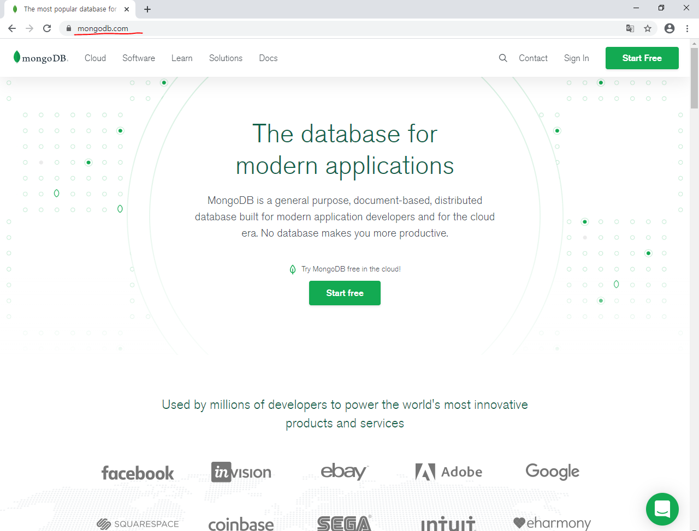
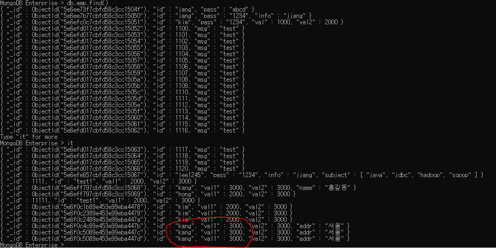
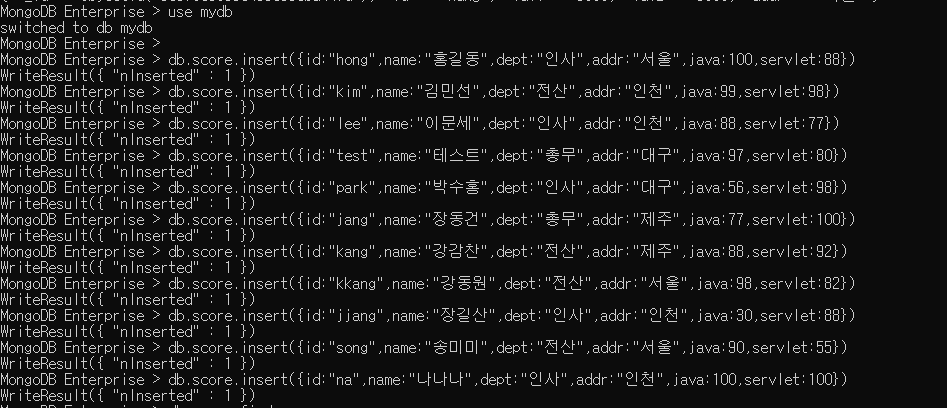
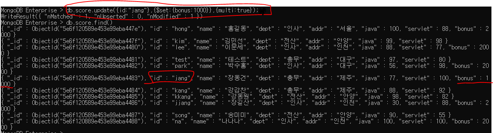

- NoSQL(Not Only SQL)
- 데이터를 처리할 때 JSON형태로 처리함.
- 사용 목적
  - 비정형 데이터 저장 목적
    - schema(규칙)가 없다. 컬럽에 타입 정해줬던거 같은게 없다.
    - 설문조사할 때 질문을 등록하는데 회사마다 질문 갯수가 다를것임. 이 갯수가 정해져 있지 않아서 MongoDB가 없을 땐 최대의 질문 갯수를 컬럼으로 등록해놓음. 그래서 회사에 따라서 비어있는 컬럼이 생길 수도 있음. 게다가 최대의 질문 갯수를 특정지을수도 없음. 이런 부분을 해결해주는게 MongoDB임.
  - 파이썬, spring 등 여러 프로그램과 연동해서 output을 저장하는 목적

- Join을 할 수 없다.
  - 문서기반임. 하나의 문서 안에 모든 데이터가 전부 들어가는 형태임.

## MongoDB 설치

- 상단에 software -> enterprise server

- MSI는 설치파일이라는 뜻

- 주소복사
  - C:\Program Files\MongoDB\Server\3.6\bin
  - 여기에 mongoDB명령어가 다 등록되어 있음.

- path등록하기(TIL -> JAVA폴더 -> 2019.12.02에 있음.)

- 시스템 변수 편집
  - 맨 앞으로가서 아까 주소복사한거 붙여넣기하고 세미콜론(;) 찍기

- 아래처럼 잘 되면 확인 누르기

- 서버올리기
  - 아직 아래처럼 하면 에러뜸
  - 내부에서 발생하는 데이터가 저장 될 폴더가 필요하다.

- 아래처럼 폴더 만들어주자

- 아래처럼 폴더 등록해주고 서버 올려주자
  - 리눅스 처럼 탭 누르면 경로가 자동으로 쳐짐

- 아래처럼 되면 서버가 올라간거임
  - 서버 올라가고 콘솔 절대 클릭하지 말기. interupt됨.

- 새로운 프롬프트 열기
  - mongo로 서버에 접속 할 수 있다.
  - show dbs는 그냥 작동되는거 확인하려고 해본거. 의미는 아직 안 설명해주심

- 이중 접속 가능

- 서버 콘솔보면 두개의 클라이언트가 접속한걸 볼 수 있음

- 웹에서도 접속가능
  - http://127.0.0.1:27017

- 몽고디비 매뉴얼
  - 상단 document -> server
    - Sharding 하둡처럼 분산저장(HDFS?) 해줄 수 있음. 하둡보다는 성능이 떨어짐.

- mongoDB에서 용어
  - collection = 테이블
  - document = record 
  - field = column
  - _id = 기본키

## MongoDB 사용하기

- use mydb => mydb를 쓰겠다. (mydb는 걍 내맘대로 지어준 이름임. database를 쓰겠다는 의미)
  - oracle에서 계정 접속한거랑 동일한 의미 => conn scott/tiger
- show dbs; => 아직 collection이 없어서 admin, config, local이 전부 0GB임

- db.stats() => db의 상태 확인하기
- db.logout() => 나가는거. ok 1 뜨면 잘 작동된거임.

1. collection만들기(rdbms에서 테이블과 동일한 개념)

   ​	=> 관계형 데이터베이스처럼 스키마를 정의하지 않는다.

   ​	1) 종류

     - capped collection

         - 고정 사이즈를 주고 생성하는 컬렉션.(size를 필수로 같이 줘야한다.)

           미리 지정한 저장공간이 모두 사용이 되면 맨 처음에 저장된 데이터가 삭제된다.

     - non capped collection

         - 일반적인 컬렉션

   ​     2) 생성

   - db.createCollection("컬렉션명")  => 일반 collection을 만들 때

   - db.createCollection("컬렉션명",{옵션 list})
     - 각각의 옵션을 설정해서 작업(json형태)

   ​     3) 삭제

   - db.collection명.drop()

   ​     4) 컬렉션명 변경

   - db.컬렉션 명.renameCollection("변경할 컬렉션 명");

- createCollection으로 test컬렉션 만들어주니까 mydb가 보이기 시작함.

- show collections; = select * from tab

- 매뉴얼 활용 예시

- [컬렉션 생성]
  - validate써서 컬렉션의 정보를 볼 수 있음.
  - 정보가 출력되어 나오는것도 Json형태임

- isCapped()명령어로 capped 컬렉션인지 아닌지 확인 가능
  - true = capped 컬렉션이다.
  - false = capped 컬렉션아니다.

- [컬렉션 삭제]
  - collection을 drop하기

- [컬렉션명 변경]
  - collection을 rename하기

[실습]

- mini라는 이름의 데이터베이스 생성
- emp (size : 10000 , capped컬렉션으로 만들기)
- shop (일반컬렉션)
- 데이터베이스 목록, 컬렉션 목록을 캡쳐
- 컬렉션 validate()화면 캡쳐

.PNG)

## mongoDB CRUD

1. Insert

   [구문]

   db.컬렉션 명.insert({데이터...})

   db.컬렉션 명.insertOne({데이터...}) => 하나 삽입

   db.컬렉션 명.insertMany({데이터...}) => 여러개 삽입

   -- document(관계형 db에서 레코드개념)에 대한 정보는 json의 형식(name:value, name:value)으로 작성.

   -- mongodb에서 document를 삽입하면 자동으로 _id가 생성된다. => 기본키 역할

   - 확인해보니까 우리가 안쓴 _id가 생김

     - find는 select * from 임

     - "_id" : ObjectId("5e6ee73f7cbfd58c3cc1504f"

       ​                             ---------------------------------------- 

       현재timestamp + machine ID + mongodb프로세스id + 순차번호(추가할때마다 증가)

   - 스키마가 없는거 확인

     - insert했을 때 처음껀 field가 두개, 지금은 field가 세개.
     - insert성공되고 select 해보니까 컬럼 수가 다른데도 괜찮을 것을 볼 수 있음.

- insert하는 다른 방법. mydata에 변수에 대한 값을 할당한 다음에 save()명령어로 insert

- for문으로 insert하기
  - mongoDB는 자바스크립트라서 for문 사용가능
  - it 을 치면 안보였던 데이터들도 다 볼 수 있음.

- 배열로도 입력 가능
  - 대괄호 이용.

- 여러개를 한 번에 삽입하고 싶을 때 배열로 GOGO
  - _id(primary key)도 바꿀 수 있음.

- 이미 _id가 있는데 같은 값으로 insert하면 아래 처럼 에러뜸

[실습]

김샘자바 mongo_실습1

2. Update

- document 수정
- 조건을 적용해서 수정하기 위한 코드도 json으로 구현
  - json => name : value 형태
- capped된 사이즈를 벗어나면 안됨.

[update를 위한 명령어]

$set : 해당 필드의 값을 변경(업데이트를 하기 위한 명령어) => set절

​           non capped  collection인 경우 없데이트할 필드가 없는 경우 추가해버린다.

$inc : increment(더하기), 해당 필드에 저장된 숫자의 값을 증가

$unset : 원하는 필드를 삭제할 수 있다.

$addToSet => 배열의 요소를 추가 : 없는 경우에만 추가함. 중복을 허용 안함, 주로 배열에서만 씀.

$push => 배열의 요소를 추가 : 중복을 허용

$pop : 배열에서 요소를 제거할 때 사용

 			1이면 마지막 요소를 제거, -1이면 첫 번째 요소를 제거

$each : addToSet이나 push에서 사용할 수 있다. 여러개를 배열에 추가할 때 사용

$sort : 정렬(1: 오름차순, -1: 내림차순)

$pull : 조건에 만족하는 데이터를 지우겠다.(조건은 한 개)

$pullAll => 배열에서 조건에 만족하는 요소를 제거 (조선을 여러개 줄 수 있다.)

업데이트 옵션:

​		multi => true를 추가하지 않으면 조건에 만족하는 document중 첫 번째 document만 update

- 아래 사진의 pass를 a,b,c,d로 바꿀꺼

[구문]

filter : 조건을 줄 field => sql의 update문에서 where절에 해당됨.

db.컬렉션명.update({조건필드:값}, 

​                                    {$set:{수정할 필드 : 수정값}},

​                                    {update와 관련된 옵션:옵션값})

- 아래처럼 그냥 업데이트를 옵션없이 하면 id가 일치하는 kang이 4갠데 그중 가장 위에 있는거 하나만 수정된다.

- 옵션주기
  - 이제 id가 kang인 애들 전부 바뀌었음.

- 내가 컬렉션을 안 만들었어도 insert하면 컬렉션이 자동으로 만들어짐
  - capped가 아닌 일반 컬렉션이면 없는 field값을 넣어줄때 자동으로 생김.

- $inc => increment(더하기), 해당 필드에 저장된 숫자의 값을 증가
  - 아래의 kang의 val1이 3000이었던것이 5000으로 바뀜

[update 실습]

1. id가 kang인 사람의 dept를 "총무"로 변경
2. dept가 "전산"인 모든 addr을 "안양"으로 변경
3. id가 jang인 document의 bonus를 1000추가하기
4. dept가 "인사"인 모든 document의 bonus에 2000을 추가하기

- $unset
  - 원하는 필드 삭제 가능

3. mongodb에서 배열 관리

db.score.update({id:"jang"},

{$set:

{info:

{city:["서울","안양"],

movie:["겨울왕국2","극한직업","쉬리"]}}});

[배열에서 사용할 수 있는 명령어]

$addToSet => 배열의 요소를 추가 : 없는 경우에만 추가함. 중복을 체크, 주로 배열에서만 씀.

​	db.score.update({id:"jang"},{$addToSet:{"info.city":"인천"}})

​	- info 안의 city에 인천이 추가됨. 같은 값인 인천은 또 추가가 되지 않음.

$push => 배열의 요소를 추가 : 중복을 허용

​	db.score.update({id:"jang"},{$push:{"info.city":"천안"}})

​	- info안의 city에 천안이 여러번 추가됨.

$pop => 지우는 용도, 1 ==> 오른쪽 끝에서부터 지운다.   -1 ==> 왼쪽 끝에서 부터 지운다.

​	db.score.update({id:"jang"},{$pop:{"info.city":1}})

​	db.score.update({id:"jang"},{$pop:{"info.city":-1}})

$each  => each를 이용해서 천안, 가평, 군산을 한번에 추가

​	db.score.update({id:"jang"},{$push:{"info.city":{$each:["천안","가평","군산"]}}})

​	db.score.update({id:"jang"},{$push:{"info.city":{$each:["천안","가평","군산"],$sort:1}}})

​	db.score.update({id:"song"},{$push:{"info.city":{$each:["천안","가평","군산"],$sort:1}}})

​			천안, 가평, 군산이 또 push되었고 오름차순으로 정렬됨.

$pull => info안의 city가 천안인 데이터를 지운다.

​	db.score.update({id:"jang"},{$pull:{"info.city":["천안"]}]}})

$pullAll => 배열에서 조건에 만족하는 요소를 제거 (조선을 여러개 줄 수 있다.)

​	db.score.update({id:"jang"},{$pullAll:{"info.city":["가평","군산"]}})

