## Rstudio 

- 관리자 모드로 설정하기

- 글자 설정하기
  - 상단 Tools -> global option

- R 실행시키기
  - R은 한줄씩만 실행시킬 수 있다
  - ctrl + enter누르면 한번에 실행됨.

- ctrl + L
  - 콘솔창 지우기

- 실행했던 코드, 변수나 객체에 저장되어있는 값등 확인가능
  - connection은 DBMS나 외부프로그램과 연동할 수 있는 곳

- help가 잘 나와있음

*** ctrl 1 => 스크립트창, ctrl 2 => 콘솔창 ***

## 프로젝트 만들기

- 좌상단 File -> new project 

- 아래대로 Create Project누르면 기존에 작업하던 Rstudio가 교체됨
  - Open in new session누르면 새로운 Rstudio가 생김

- 저장하기
  - 서로다른 스크립트끼리 변수를 공유한다.

- 아래 체크하면 스크립트 창에 코드를 작성할 때 스크립트 창의 크기를 넘어가면 자동으로 줄바꿈이 됨.

- 상단 Tools -> project option
  - 이런것도 있다.

## R사용하기

- 2번처럼 변수를 저장할 꺼임. 1번으로 저장하면 안 먹힐때도 있음.
  - #은 주석문

- 비교연산자

- 코드 전체 범위지정하고 shift + ' 하면 코드전체에 큰 따옴표 쓸 수 있음.
  - 코드 전체 범위지정하기 => shift + Home

- Alt + - 쓰면 변수에 값 저장할때 쓰는 <- 가 생김

- class 함수

- as.character와 as.numeric함수로 형변환

- = 와 <-의 차이점
  - 앞으로 <-를 쓰자

## vector(arraylist느낌)

- c()로 벡터를 만들 수 있음.
  - combine
  - 변수에 여러개의 값을 넣기

- 에러났을 때 빠져나오기
  - 스크립트 17번 라인에서 닫는괄호를 실행안해줘서 에러난것. 
  - 에러에서 빠져나오려면 콘솔창 아무데나 클릭하고 ESC눌러주기

- 덧셈, 뺄셈, 변수끼리 덧셈도 가능

- 나머지 => 짝수만 TRUE

- 벡터의 이름 정해주기
  - 처음엔 이름을 안정해줘서 null나왔다가 c() 이름 정해주니까 이름 출력됨.

- dataframe은 타입이 열마다 다를 수 있다.

## matrix(행렬인데 저장할 수 있는 데이터타입이 같아야함)

- 그냥 아무것도 없이 출력했을 때 1열임

- 아래처럼 열의 수를 지정해줄 수도 있고 행방향으로 출력하게해줄 수도 있다.
  - ncol, byrow

 

- cbind()
  - 아래는 행이 5개인데 cbind에 4개짜리 행만 값을 넣어줘서 경고 먹은거

- rbind()

- comnames, rownames

- 행렬의 평균구하기

- 미니 실습

- 내 풀이

- 선생님 풀이

- byrow는 행렬을 생성할 때 주는 옵션임. 행렬을 만든 후에 값의 위치를 바꾸고 싶을때는??

## list

## dataframe(행렬인데 저장할 수 있는 데이터 타입이 달라도됨)

- matrix를 dataframe으로 변환

- 아래는 dataframeMat1의 1열만 character로 바꾸고 싶어서 코드를 짠건데 모든 값들이 다 character로 바뀌었다.

- str함수써서 dataframe의 1열이 int형에서 char형으로 바뀐것을 볼 수 있음

-  $사용

- dataframe에 열 추가

- dataframe을 matrix로 변환

- 벡터로 dataframe만들기
  - 열로 만들어지네
  - 각 열당 평균도 구할 수 있음

- dataframe을 직접 만들기

## 제어구문(if, while...)

### if(자바랑 똑같음)

### for

- print()를 이용해서 출력

- 합 구하기
  - version 1 => 평소에 하던대로 로직 짜는거
  - version 2 => 함수 이용하기

## csv파일 실행하기

- 조건주기

- csv파일 쓰기

[실습]

csv_exam.csv를 읽어서 데이터를 수정한 후 csv_exam_result.csv로 저장하기

- science가 80이상인 데이터를 추출
- 추출된 데이터에 mytotal과 myavg컬럼을 추가
- mytotal: 모든 과목(math,eng,science)의 총점
- myavg: 모든 과목의 평균

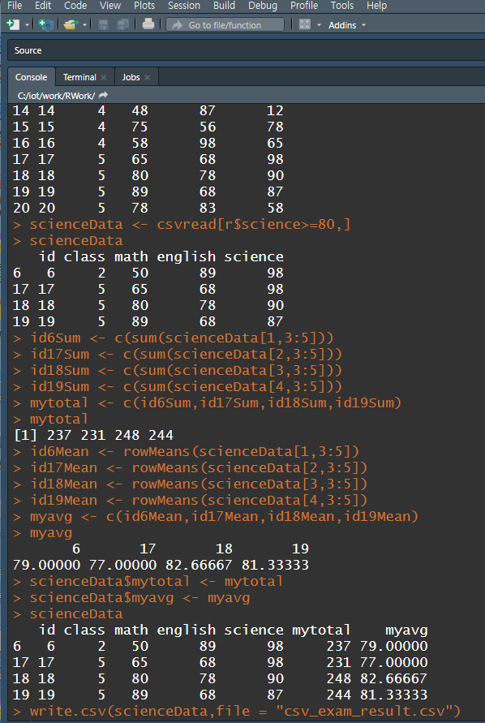

[실습 선생님 풀이]

## 인코딩

- 가져온 데이터가 깨졌을 때 복원하기
- 보통 파일이 깨졌을 때
  - File -> reopen with encoding

- 위에처럼 말고 우리가 직접 변환하기?
  - letters => a~z까지의 모든 값이 들어있음

- ''' #### ~~~~ #### 사용하면 코드를 더 쉽게 읽을 수 있음

- 인코딩하기

- 아래 보면 utf8만 깨져있다.

- 깨진 utf8을 읽으니까 데이터를 읽을 수 없다.

- readLines으로 실행해보면 파일이 깨져서 보임.

- UTF-8을 인코딩해주면 아래처럼 파일 깨진게 복원됨.

### data.table

- data.table패키지 설치 -> 라이브러리에 등록
- 깨진 파일을 fread함수로 읽고 head로 보면 깨져있는것을 확인할 수 있다.
  - fread함수는 data.table라이브러리에서 지원해주는 함수임.

- 아래처럼 인코딩 해주면 한 컬럼을 인코딩해줄 수 있다.

  - dftable$mydata3 을 해줬으니까 한 컬럼만 인코딩된거.

  - head로 읽으면 위에서부터 몇줄을 읽을 수 있다. (tail도 있음)

### ggplot(데이터 시각화)

- 패키지 설치 -> 라이브러리 등록

- 시각화시키기
  - qplot

- mpg는 제공해주는 예제 데이터임

- geom
  - 그래프의 타입

## 외부 데이터 읽어오기

- 데이터가 어떻게 구성되어 있는지를 알아야 분석하기 좋다.

- n=3을 붙여주니까 3줄을 볼 수 있다.

- 위에서 csv파일을 3줄 읽었는데 이거를 아래 사진은 하나의 컬럼에 다 넣었음.
  - 하나의 컬럼에 데이터들이 다 있을 때 여러 컬럼으로 분리하려고 이렇게 만든거임.

- 1번 -> 콤마로 분리 안되고 그대로 출력됨.
- 2번 -> 콤마를 기준으로 분리. 탭으로 분리하는것도 가능

- 근데 콤마로 분리는 되지만 list로 결과가 리턴되어서 불편하다.
  - 아래는 list의 원하는 요소를 뽑아볼 수 있는 방법

- 

- dfcsv2는 data.table이기도 하고 data.frame이기도 하다.
  - 이러면 데이터 작업을 하기가 어려워서 하나로 통일해줘야한다.

*** 크롤링 할때 데이터 정제하고 가공하는게 우선임. ***

*** readLines쓰면 구조파악이 편하다는거지 꼭 쓰라는건 아님 ***

- 데이터 타입 변경하기

- 아래는 각 컬럼들의 타입도 다 확인해보는 것.
  - 문자열은 chr인데 다 factor라고 뜨네.
  - factor 의미

- str함수로 각 컬럼의 타입 확인.

- 타입 변경하기.
  - 컬럼의 갯수를 세주는 함수 => ncol(dfcsv2)

### tsv파일 읽기

- read.delim => stringTokenizer같은 거.
  - head는 위에서 부터 6줄을 읽는게 기본임.

### xml파일 읽기

- 얘는 패키지가 있어야함.
  - xmlTreeParse로 읽음.
  - 아래는 전부 다 읽었을 때

- root 엘리먼트만 읽었을 때 
  - root꺼만 뽑힘. 위 사진의 내용이 빠져있음.

- xml에 있는 모든 태그(<>)의 name과 value를 추출

  - for문을 대신하는 함수는 apply임.

  - 위의 사진을 보면 record태그 안에 id,names...태그들이 하위로 있는 형태임. 
    - depth가 있는거.
  - 사용자 정의로 function만들어줄 수도 있음 
    - function(x)
  - dfxml에있는 데이터가 하나씩 꺼내져서 x로 전달됨. 그리고 x에 있는 데이터가 xmlvalue로 전달됨.

- 보면 결과가 하나씩 뽑아지긴 함.

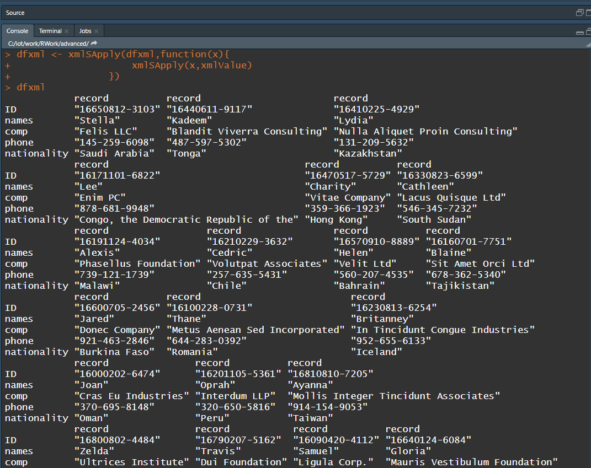

- 데이터를 뽑은 dfxml을 dataframe으로 변경해줘야함.

### 엑셀파일 읽기(xlsv)

- 라이브러리를 설치해야됨.
  - 리턴 타입이 tibble이라는 또 다른 타입으로 나왔음.
    - tibble => data.frame과 비슷한 다른 종류의 라이브러리임.

## 데이터 분석

1. 데이터 가져오기
   - 외부파일
   - 크롤링
   - DB(오라클, mongodb, hadoop....)

==> 지금까지 R에서 사용할 수 있는 여러 형태의 데이터로 변환하고 변환된 데이터를 액세스 했음.

2. 데이터의 정보를 확인하기(데이터 구조 확인하기),100p
   - 컬럼갯수, row갯수, 타입, 유형, 실제 저장된 데이터....
   - 실습 data_info 스크립트 파일

- head는 위에서부터 6개, tail은 아래서부터 6개, n은 생략가능(n써주면 써준만큼 가져오기)

- 실제 뷰어로 보기

- 행의 갯수 확인하기

- 컬럼의 갯수 확인하기

- 행과 열의 갯수를 확인

- 타입과 구성확인
  - 컬럼 이름인 id,class,math...앞에 $가 붙어 있음.

- 데이터에 대한 요약정보 
  - summary
    - 최대,최소,평균,중간, 1/4

- 컬럼의 이름 변경하기.
  - 라이브러리를 추가해야함.
    - dplyr
  - english컬럼명이 eng로 바뀜.

- sample함수
  - 랜덤값을 만들때 사용하는 함수
    - 아래는 1~10의 랜덤수고 5개마 a에 저장하는것임.
    - 1번 라인을 실행시킬 때 마다 숫자들이 바뀜.

- replace를 TRUE를 하면 중복가능, FALSE로하면 중복 불가능
  - FALSE가 디폴트임

- set.seed(숫자)
  - 숫자는 아무거나 줘도 상관없음, 숫자를 뭘 주느냐에 따라 어떻게 랜덤으로 배치할껀지 정해진게 있나봄
  - 숫자는 랜덤수 발생시켰던게 어떤건지 찾아갈 수 있는 key값임. 한마디로 이거 쓰면 sample함수를 처음 호출했을때의 값이 고정된다는 말.

- 데이터가 많으면 for문과 if문을 써서 아래처럼 값을 비교하기가 비효율적임.  그래서 ifelse함수로 처리하자.

- if문의 역할을 하는 함수.
  - ifelse

- 조건이 두개 이상인 경우
  - 아래의 ifdf는 spring, bigdata, android 세개의 조건이 있음.

- table() , qplot() 

## 수치형 변수

- L붙이면 numeric을 integer로 타입을 바꿀 수 있음
  - numeric과 integer를 더하면 numeric이 됨.

## apply

- R 내부의 샘플데이터셋을 가져올 때 사용하는 함수
  - data()
  - 아래는 MASS패키지에 있는 데이터를 가져온 후 library로 업로드 -> data()로 BOSTON데이터 가져옴.

- apply사용
- margin 1

- margin 2

- round함수로 소수점4자리까지 표현
  - 소수점 5째 자리에서 반올림

- sapply

## filter(데이터 정제, 이상데이터 잘라내기)

- 주어진 데이터에서 원하는 데이터만 추출

- dplyr라이브러리

- 아래 조건을 만족하는 행들의 열을 보겠다는 의미임.
  - 조건이 True인것만 리턴됨.

- 아래처럼 sum을 하면 true인거의 행의 갯수가 리턴됨

- filter함수 : 조건에 맞는 것을 걸러냄.
  - 콤마 뒤에는 조건들을 써주면 됨.

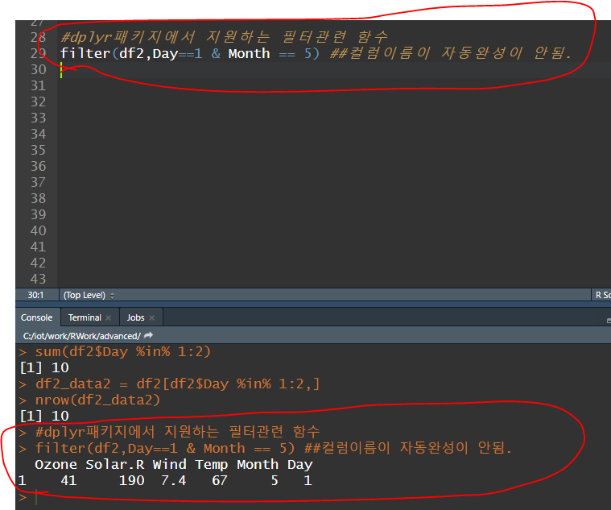

- chaining operator %>% , ctrl + shift + m
  - 위 기호를 쓰면 함수를 나열해서 쓸 수 있다.
  - 원래는 <- 로 변수에 값을 저장해서 변수를 실행시켜야 결과가 보이는데 아래는 %>%으로 된거만 실행시켜도 결과가 나옴
  - exam 데이터에 필터를 적용해서 class가 1인것과 math가 50이상이다.

- select함수 : 추출하고 싶은 변수를 정의
  - 오라클에서 select와 같음
  - 원하는 컬럼 조회

- arrange

- class에대해 오름차순으로 정렬한 후 english에대해 내림차순으로 정렬

-  mutate : 컬럼을 추가하는 것.

- 두개를 추가하는 것도 가능

- ifelse넣어도 됨
  - test, yes, no안써도됨. 중첩할 때도 안써도 됨.

- group by로 그룹으로 묶은 후 연산
  - n()을 쓰기 전까지 조건을(group_by, filter 등) 적용한 후 그룹들의 행의 갯수
  - summarise

### 데이터 합치기(가로합치기, 세로합치기)

- 아래는 같은 id를 갖고 있는 애들을 합쳐야 하니까 두개를 합쳤을 때 열이 늘어나야함.
  - 열방향으로 붙인다 => left_join

- factor로 만들면 level때문에 원하는 데이터가 안나올 수 있다. factor타입으로 만들지 않도록 하자
  - stringsAsFactors = F

- left_join

- 행 방향으로 합치기
  - bind_rows

## 정규표현식 + 메소드

### R에서 쓰는 라이브러리 찾기

- mongolite가 R과 mongodb를 연동할 수 있는 것임

### stringr(정규표현식 , 문자열관련)

#### 패턴

- str_extract()
  - 패턴을 실행해주는 함수

- 아래는 패턴과 일치하는 문자열도 리턴됨
  - . 자리는 아무글자나 와도됨(?)

- 아래는 패턴과 일치하는 문자 제외하고 일치하는 문자 바로 전까지 리턴
  - 전방탐색 (?=)

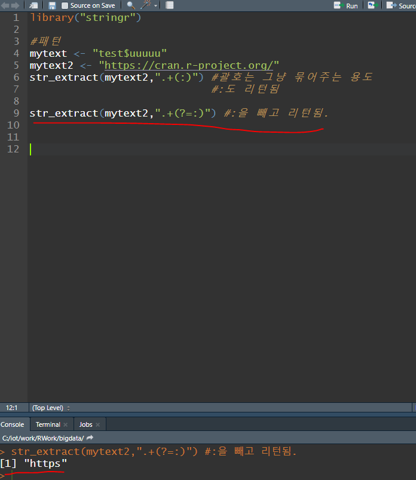

- $는 패턴에서 쓰는 기호이기 때문에 \ \를 써주면 $도 제외한 후 리턴됨.

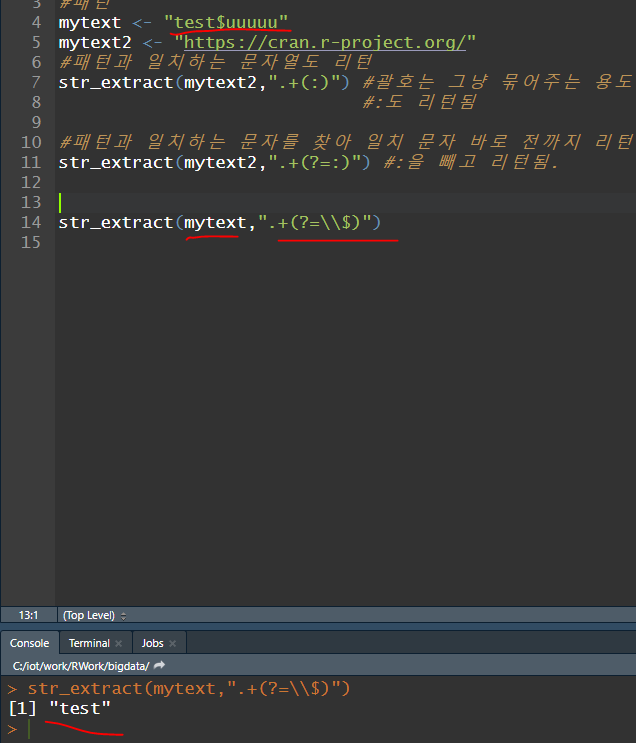

- 패턴과 일치하는거 뒤에꺼를 리턴
  - 후방탐색(?<=)

#### 문자열관련 함수

- paste()

- paste0()

- gsub()

- str_trim함수

## crawl(크롤링)

- 웹페이지에서 데이터를 추출(csv로 저장)

- 크롤링을 하려면 문서를 분석해야함. 그리고 반복되는 패턴을 찾아내야하는게 우선임.
  - F12눌러서 개발자 도구로 보든지 우클릭해서 페이지 소스를 보든지

- mongolite 다운로드하기

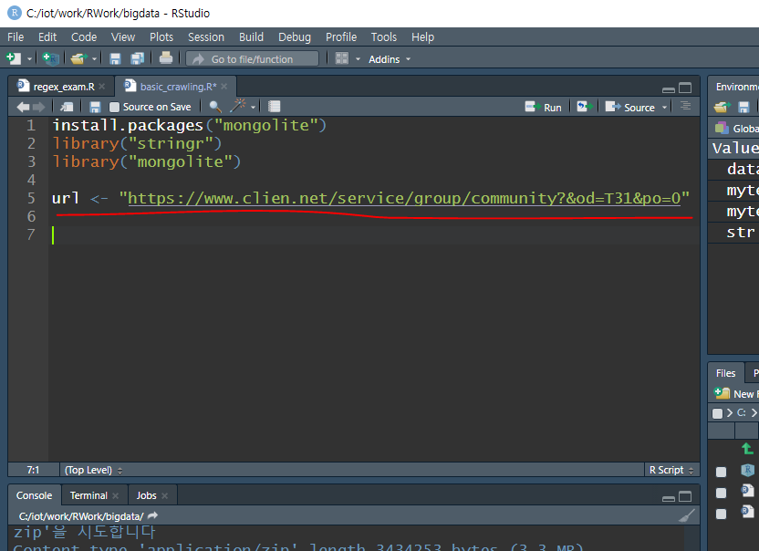

- readLines
  - 사이트의 데이터를 받아오거나 csv파일의 데이터를 받아오거나 등등...
  - 인코딩이 어떻게 되어있나 우선 확인해줘야됨.
  - 아래가 utf-8이니까 인코딩을 맞춰줘야함

- 개발자도구에 있는 소스 뽑아볼 수 있음
  - 웹페이지를 다 긁어온 것.

- 아래처럼 정보들을 확인할 수도 있음

- 제목 (빨간네모)만 뽑고 싶을 때 그 제목에 해당하는 태그를 선택해야함

-  이제 긁어온 웹페이지 소스를 우리가 원하는 것만 필터링 해야함
  - str_detect함수
    - 문자열에 패턴을 적용해서 일치여부를 True와 False로 리턴함.
    - 패턴에 만족해? 안 만족해?

- 아래 사진은 span태그에 subject fixed라고 되어있는 애들을 다 긁어온 것

- 위의 긁어온 것들을 보니까 title안에서 문자열 앞에는 \ "> 가 있고 뒤에는 이 있는 규칙이 있다. 
  - str_extract()로 원하는 데이터만 골라서 사용할 수 있다.
  - 전,후방 탐색을 동시에 해서 원하는 데이터를 고르자
  - .*은 내가 뽑고 싶은 문자열이라는 뜻
    - .은 문자 하나, *은 문자 전체

#### hit 필터링

- class="hit"인 것을 가져와보자

- 아래는 "를 인식시키기 위해 \ 를 넣어준 것.
  - 이 전에는 클래스 명으로만 뽑은거고 지금은 태그전체로 뽑은 것

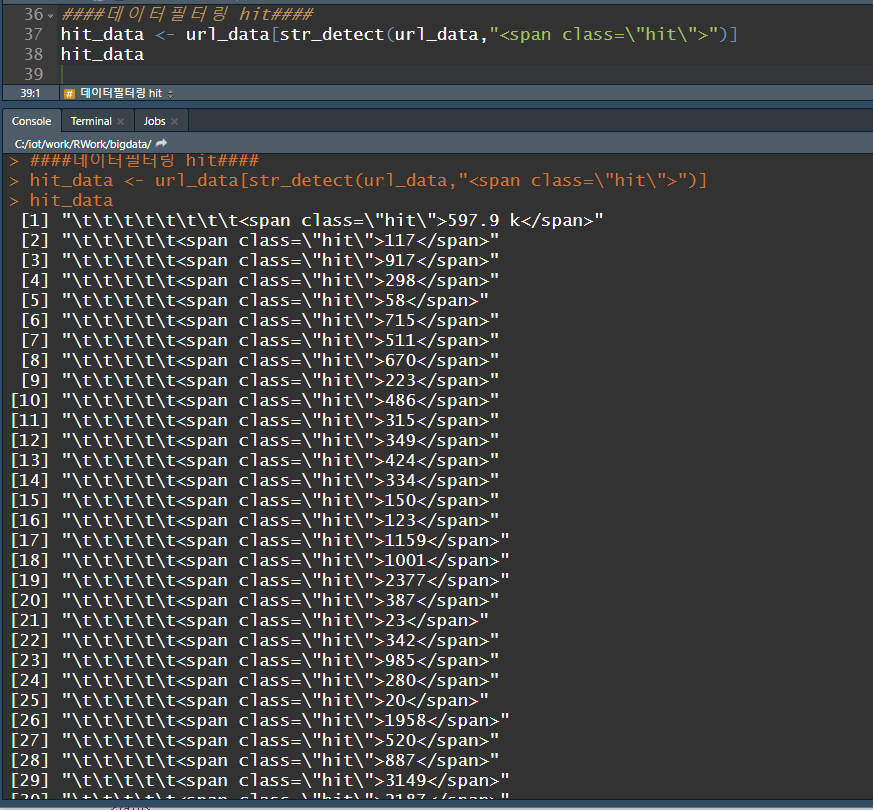

- 패턴 적용

#### url필터링

- 원하는 문자의 뒤에는 data-role, 앞에는 href="
  - 우리가 원하는 url은 class="subject_fixed"의 위에 위에 있음.
    - 이건 규칙이 확실하지 않을때 쓰는 방법

- which() -> True인 위치의 값을 뽑아내는 함수
  - 아래 결과를 비교해보면 subject_fixed인 것들의 위치가 나옴. 여기에 -3를 해주면 우리가 원하는 href가 있는 곳의 위치가 된다.

- 근데 뽑아낸 링크들을 바로 쓰려면 아래처럼 https://www.clien.net도 넣어줘야 링크를 사용할 수 있음
  - paste0로 추가해주자

- 결과창의 뒤에서 뒷줄에 3개를 잘라내야 링크를 써먹을 수 있음

- 이제 아래 링크를 복사해서 직접 실행했을 때 되야한다.
  - 크롤링한 후 링크를 타고타고 가야할 경우가 생길 수 있기 때문에 실행이 되야됨.

#### csv파일로 생성

- 지금까지 크롤링한거를 묶어주자

- csv파일을 만들어주자

- 결과를 보면 길이가 다른것을 볼 수 있다. 이건 웹사이트에서 공지 부분에 title과 url_val은 내 패턴과 일치하는게 없는데 hit은 일치해서 하나가 뽑혔다. 더 정확하게는 이렇게 뽑힌 hit를 제거해줘야한다.

- copy selector, copy xpath
  - 아래 표시된 곳 우클릭 -> copy에 있음
  - 위의 두개중 하나를 지정해서 뽑아야 할 수도 있다.

- 아래 과정으로 hit의 첫번째꺼를 지워주자.
  - 아래 동그라미는 공지사항꺼라서 제외해줘야한다.

- 아래는 크롤링 다 마친 후 write한거.

### mongodb에 넣기

- 이제 크롤링한거를 몽고디비에 넣을꺼임.

### mongodb에 저장하기

- 기존에 있는 것을 지우고 시작하고 싶을 때
  - if문
  - insert로 저장
  - 아래는 final_data가 matrix로 되어있어서 에러뜬거. 기본적으로 insert하려면 dataframe타입이어야함.

- dataframe으로 변환 후 저장

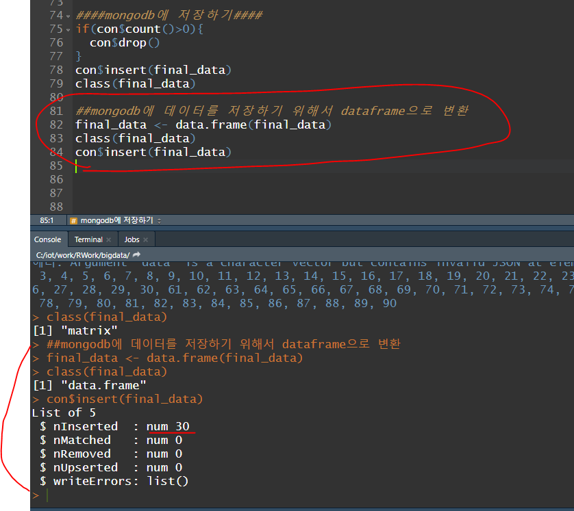

- mongodb에 데이터가 들어갔음.

- csv에 저장하고 작업하는 것 보다 RData로 저장하고 작업하는게 더 속도가 빠르다.

- 위의 save한거를 다른 스크립트에서 import하는것 처럼 load하는 법
  - 아래처럼 스크립트 짜면 final_data에 있는 데이터들을 다 뽑아서 볼 수 있다.

[실습]

위 사진에서 크롤링 한 URL안의 본문 내용을 가져오고 싶음

- final_data의 1번 글의 내용을 출력

[실습 내용으로 다르게 크롤링 하는 방법]

- 본문 내용은 article안의 post_article fr-view와 article 밖의 post_ccls사이에 있다.

- 아래 사진은 post_content의 위치

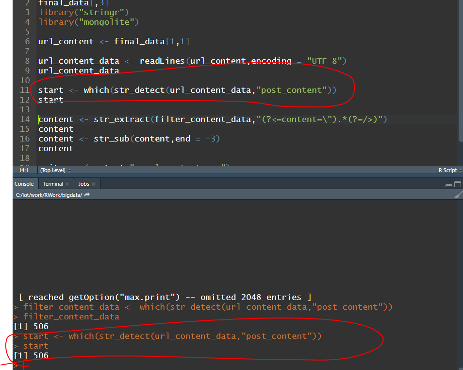

- 아래 사진은 post_ccls의 위치

- 아래 사진은 start위치와 end위치의 데이터를 뽑는 것 = 본문내용

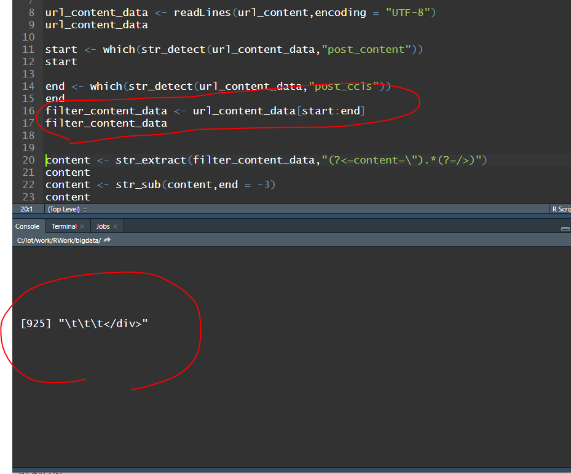

- 띄어쓰기가 많으니까 하나로 합치기

- P랑 br태그들 다 없애기
  - <.*  =========> '<' 안의 모든 것들
  - ?> ===========> '>'로 끝나는 것들
    - <>안에 있는 것들을 다 ""로 대체하겠다는 의미

- space랑 tab을 같이 지우겠다.
  - \t => tab
  - &nbsp ;  => space

***ctrl + shift + c => 지정한 영역 전체 주석처리***

## 한 페이지 전체의 게시물과 각 게시물 안의 내용들 한번에 크롤링하기

- 10개의 페이지를 크롤링해보자.

- cat() => for 문 안에서 변수들이 어떻게 출력되고 있는지 확인하는 명령어

### 네이버 기사 크롤링(N2H4)

- 77 => 내부에서 컬럼의 갯수

- 유저의 이름별 댓글들이 뽑아짐

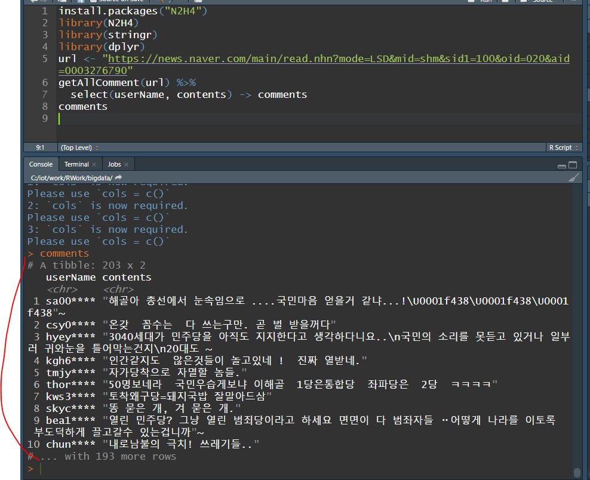

- 댓글들만 뽑아짐.

### rvest

- node는 태그 하나 뽑아오는거, nodes는 태그 여러개 뽑아오는 것.
  - html_node, html_nodes
  - subject_fixed는 span태그고 class로 명시되어 있음. -> span과 .

### KoNLP

- 형태소분석에 관련된 라이브러리, R의 내부 사정으로 라이브러리 지원을 안해줌. 

  - 선생님 블로그에서 파일 다운로드 후 아래 사진 파일에 붙이면 install 가능함

  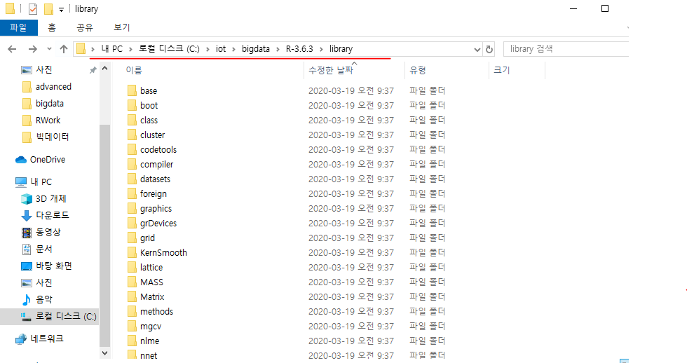

- KoNLP 깃허브 주소

  - https://github.com/haven-jeon/KoNLP/blob/master/etcs/KoNLP-API.md
  - 여기서 KoNLP꺼 함수들 가져다 씀.

  - 아래 사진은 기호 별 명사, 동사 , 형용사 등 형태소를 분류해놓은 것.

- 아래는 stringr 라이브러리 제외하고는 다 KoNLP를 위해서 패키지들을 install한 것.

- extractNoun함수
  - 명사만 추출되는 함수

- SimplePos09
  - 더 자세히 분석하는 함수임. 형용사, 명사 등

- 댓글의 형태소를 분석하기 위해 분석할 데이터를 선생님블로그에서 받아오자.

- 아래 링크는 감정분석을 위한 정보임. 군산대 한국어 감성사전 github주소
  - https://github.com/park1200656/KnuSentiLex

- 댓글을 형태소 분석하려면 공백으로 분리해준 후 (함수가 알아서해줌) 저장해야함. 근데 댓글마다 길이가 다 다름. 그래서 list를 써줘야함
  - list => 사이즈가 다 다르고 여러개를 보관할 수 있는 자료구조임.
  - 보통 형태소 분석을 할 때 명사, 동사, 형용사 3개를 분리함

- 위의 사진의 결과에서 명사만 골라줄꺼임.
  - 보통 명사는 앞에 있음. /N 이 있는 것을 걸러주면 명사만 가져올 수 있음.
    - /가 있는 것을 분리하고 N이 뒤에 있으면 가져오자.

- 아래는 반복작업 할 데이터

  ​	- Sapply함수를 활용 

- 아래는 반복작업할 함수
  - 컬럼당 첫번째 것만 꺼내라

- 이제 슬래시를 기준으로 분리

- 타입이 list였는데 sapply하고나서 타입이 character로 바뀜.

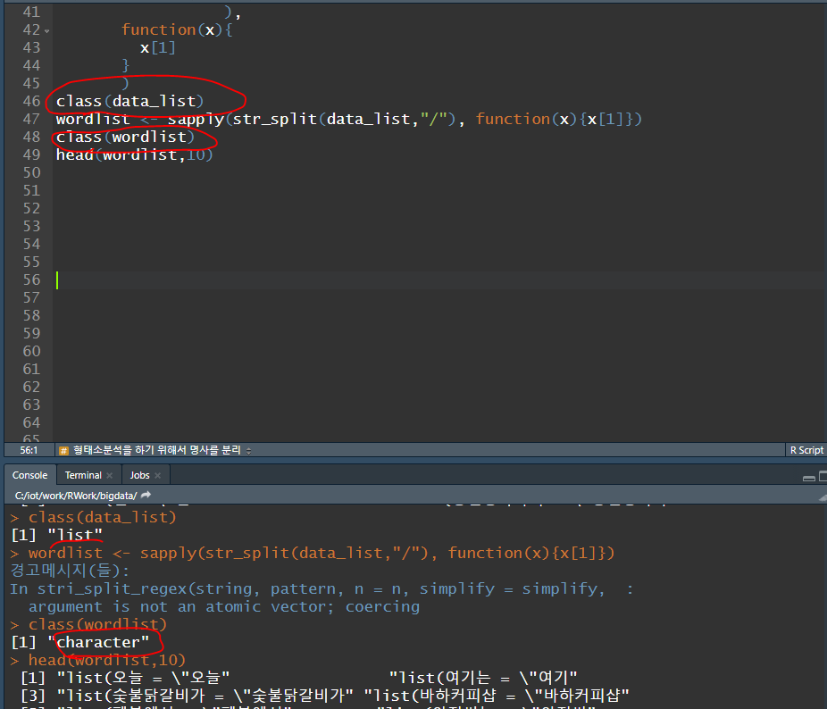