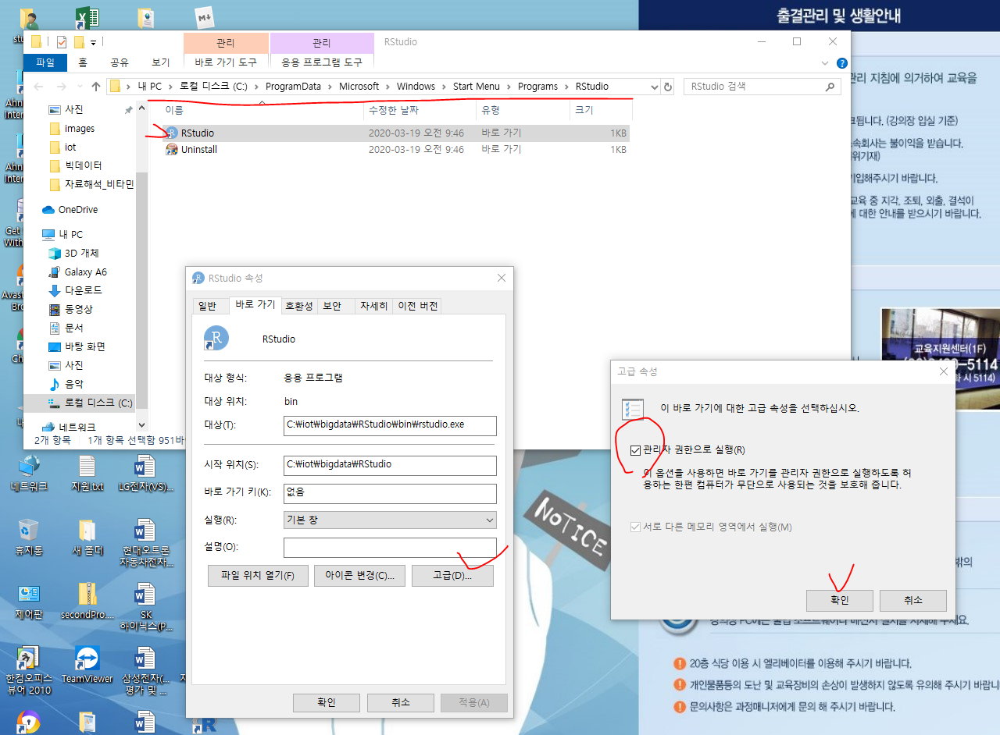
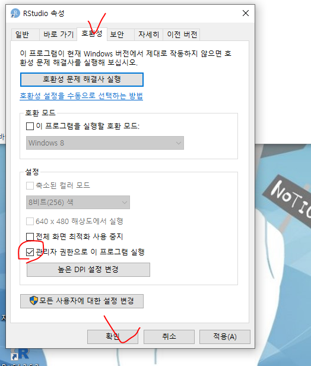

## Rstudio 

- 관리자 모드로 설정하기

- 글자 설정하기
  - 상단 Tools -> global option

- R 실행시키기
  - R은 한줄씩만 실행시킬 수 있다
  - ctrl + enter누르면 한번에 실행됨.

- ctrl + L
  - 콘솔창 지우기

- 실행했던 코드, 변수나 객체에 저장되어있는 값등 확인가능
  - connection은 DBMS나 외부프로그램과 연동할 수 있는 곳

- help가 잘 나와있음

*** ctrl 1 => 스크립트창, ctrl 2 => 콘솔창 ***

## 프로젝트 만들기

- 좌상단 File -> new project 

- 아래대로 Create Project누르면 기존에 작업하던 Rstudio가 교체됨
  - Open in new session누르면 새로운 Rstudio가 생김

- 저장하기
  - 서로다른 스크립트끼리 변수를 공유한다.

- 아래 체크하면 스크립트 창에 코드를 작성할 때 스크립트 창의 크기를 넘어가면 자동으로 줄바꿈이 됨.

- 상단 Tools -> project option
  - 이런것도 있다.

## R사용하기

- 2번처럼 변수를 저장할 꺼임. 1번으로 저장하면 안 먹힐때도 있음.
  - #은 주석문

- 비교연산자

- 코드 전체 범위지정하고 shift + ' 하면 코드전체에 큰 따옴표 쓸 수 있음.
  - 코드 전체 범위지정하기 => shift + Home

- Alt + - 쓰면 변수에 값 저장할때 쓰는 <- 가 생김

- class 함수

- as.character와 as.numeric함수로 형변환

- = 와 <-의 차이점
  - 앞으로 <-를 쓰자

## vector(arraylist느낌)

- c()로 벡터를 만들 수 있음.
  - combine
  - 변수에 여러개의 값을 넣기

- 에러났을 때 빠져나오기
  - 스크립트 17번 라인에서 닫는괄호를 실행안해줘서 에러난것. 
  - 에러에서 빠져나오려면 콘솔창 아무데나 클릭하고 ESC눌러주기

- 덧셈, 뺄셈, 변수끼리 덧셈도 가능

- 나머지 => 짝수만 TRUE

- 벡터의 이름 정해주기
  - 처음엔 이름을 안정해줘서 null나왔다가 c() 이름 정해주니까 이름 출력됨.

## matrix(행렬인데 저장할 수 있는 데이터타입이 같아야함)

- 그냥 아무것도 없이 출력했을 때 1열임

- 아래처럼 열의 수를 지정해줄 수도 있고 행방향으로 출력하게해줄 수도 있다.
  - ncol, byrow

 

- cbind()
  - 아래는 행이 5개인데 cbind에 4개짜리 행만 값을 넣어줘서 경고 먹은거

- rbind()

- comnames, rownames

- 행렬의 평균구하기

- 미니 실습

- 내 풀이

- 선생님 풀이

- byrow는 행렬을 생성할 때 주는 옵션임. 행렬을 만든 후에 값의 위치를 바꾸고 싶을때는??

## list

## dataframe(행렬인데 저장할 수 있는 데이터 타입이 달라도됨)

- matrix를 dataframe으로 변환

- 아래는 dataframeMat1의 1열만 character로 바꾸고 싶어서 코드를 짠건데 모든 값들이 다 character로 바뀌었다.

- str함수써서 dataframe의 1열이 int형에서 char형으로 바뀐것을 볼 수 있음

-  $사용

- dataframe에 열 추가

- dataframe을 matrix로 변환

- 벡터로 dataframe만들기
  - 열로 만들어지네
  - 각 열당 평균도 구할 수 있음

- dataframe을 직접 만들기

## 제어구문(if, while...)

### if(자바랑 똑같음)

### for

- print()를 이용해서 출력

- 합 구하기
  - version 1 => 평소에 하던대로 로직 짜는거
  - version 2 => 함수 이용하기

## csv파일 실행하기

- 조건주기

- csv파일 쓰기

[실습]

csv_exam.csv를 읽어서 데이터를 수정한 후 csv_exam_result.csv로 저장하기

- science가 80이상인 데이터를 추출
- 추출된 데이터에 mytotal과 myavg컬럼을 추가
- mytotal: 모든 과목(math,eng,science)의 총점
- myavg: 모든 과목의 평균

