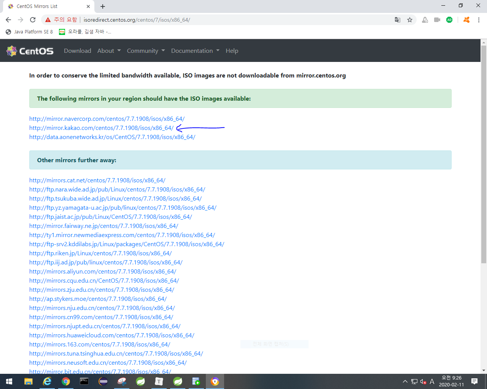
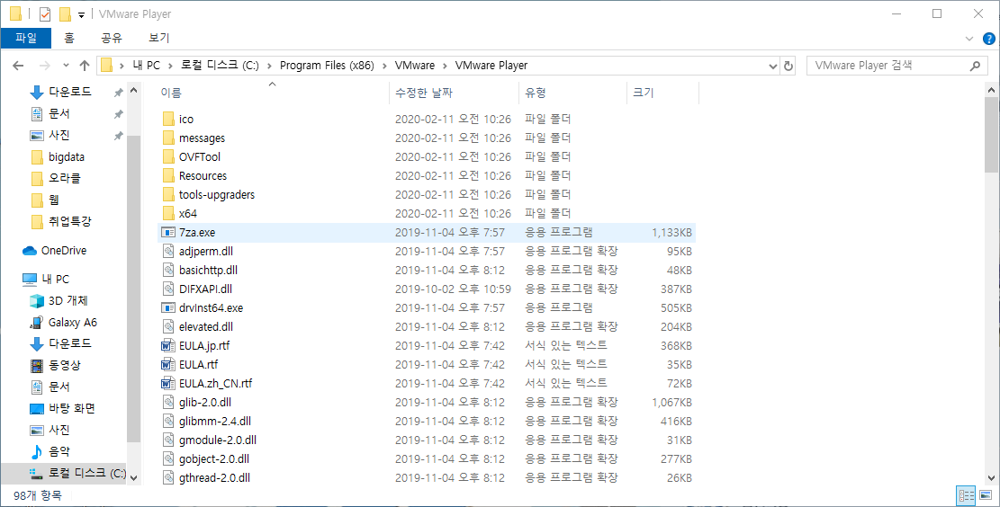
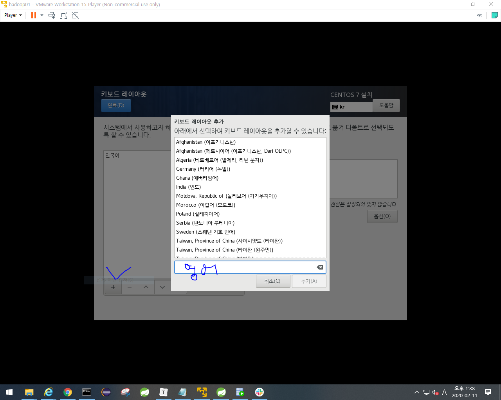
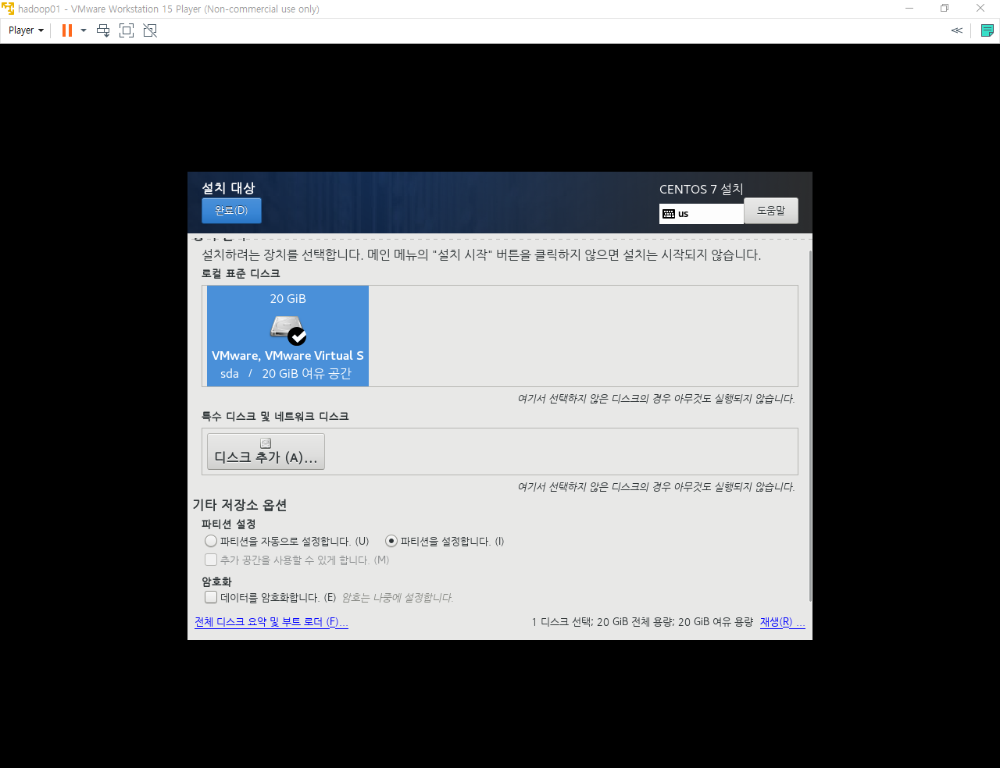
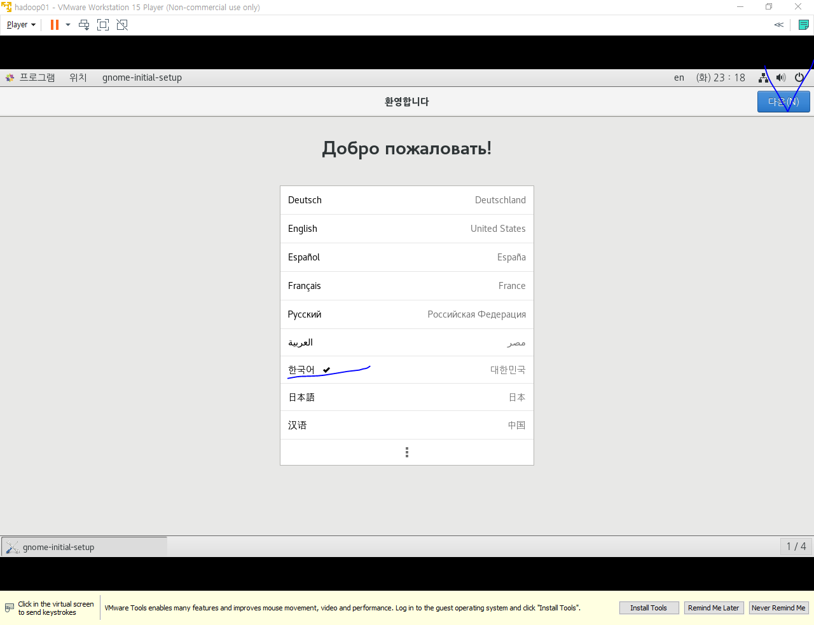

virtual machine 설치하기

- 김샘자바 -> iot커넥티드카 -> 빅데이터에 **vmware**, **Securable**,**vmnetcfg**,**CentOS** 다운로드 경로 있음.
  - 

1. **CentOS**  설치([**https://www.centos.org/**])

- 우리는 7점대 버전 사용함.

- 아래 클릭해서 iot -> setup -> tool -> bigdata에 저장하기
  - 영문경로여야됨.

2. **vmware** 설치하기(player버전)
   - [**https://www.vmware.com/**](https://www.vmware.com/)
   - 다운로드 -> 무료제품 다운로드 -> workstation player

3. **Securable** 설치

- [**https://www.grc.com/securable.htm**](https://www.grc.com/securable.htm)

- 선생님이 올려주신 pro.zip파일 받으면됨.
- 아래는 내 pc의 사양을 읽어서 사용 가능하다고 YES를 뿌린거임.

4. **vmnetcfg** 설치

- 선생님이 올려주신 vmnetcfg.zip파일 받으면됨.

#### 위의 과정대로 전부 다운 받은 후 상황

- 윈도우에 리눅스를 설치하고 리눅스 안에 가상머신 4대를 설치할 거임.
  - 윈도우를 host라고 부르고, 리눅스를 guest라고 부름.

- VMware-player설치
  - 버전은 다르지만 교과서 34~38쪽 설치 방법이랑 유사함.

- 아래꺼 더블클릭

- next -> accept -> next -> enhanced 체크 -> Check for product~~, Join the VMware~ 체크해제

-> next -> desktop, start menu 체크 -> next -> install -> 설치 완료되면 restart

- 아래 사진이 VMware의 홈 디렉토리

- VMware Workstation 15 player실행

- 위에 처럼 continue -> finish하면 아래사진 뜸.

- 가상머신 설치하기
  - 좌상단 player -> file -> new virtual machine

  

- VMware에 설치한 guest에 리눅스를 깔꺼고 버전은 CentOS 7 64-bit를 깔꺼다.

- 가상머신 이름을 hadoop01, 02, 03, 04로 할꺼임
  - 아래의 경로도 매우 중요

- disk size를 20GB로하기, 

- 아래 보여지는건 사양인데 Customize Hadware...누르면 설정 가능
  - 걍 보기만 한거고 우리는 finish 하자.

- 우리가 설정한 경로에 파일이 생성됨.

- master-slave구조에서 hadoop01이 master역할.

- master의 메모리를 2GB를 줄거임.
  - slave는 1GB씩 줄거임.

- 아래 중 하나 선택해서 가상머신 키기

- Edit virtual machine은 가상머신이 power off되어 있을때 설정가능.
  - suspend = 저장후 종료(?)

- 아래꺼 우클릭 후 
  - remove :가상머신 목록에서 제거. (데이터가 없이지지는 않음.)
  - delete: 완전히 삭제

- remove했을때 다시 불러오기

- VMware Player의 VMnet8의 IP주소를 동일하게 설정해줘야한다.
  - 3번째인 174를 동일하게 맞출 수 있도록 변경해줘야한다.

- 무료판이라서 모듈이 없는거임.

- 선생님이 준 파일 => vmnetcfg.exe 복사 후 위의 파일 경로 안에 붙여넣기
- 오른쪽 하단에 change setting눌러줘서 3번째의 숫자를 변경하기

- 변경완료

- cd/dvd 

- / => c드라이브

  swap => 가상메모리

- ROOT = 관리자계정

- 암호: bigdata

- 전부 hadoop (우리가 테스트 할 계정임.)

- 완료되면 재부팅

- 다음버튼 누르고 암호는 bigdata

- 계속 다음 누르고 시작하면됨.

- 프로그램 -> firefox -> 인터넷 사용가능
  - 우상단에 동그라미 연결되어있어야함(인터넷)

- 우클릭 -> 터미널 열기 (명령 프롬프트와 같은 의미)

  - shell prompt

  - localhost = 호스트
  - ~ -> 홈 디렉토리를 의미 , 처음에 접속하면 물결이 있음.
  - 

- ls => 도스에서 dir

## 반드시 할 수 있어야 하는 것.

1. 계정 변경하기
   - root계정이 hadoop계정으로 바뀜
   - $ => 일반계정, # => 관리자 계정

- 다시 root(관리자)계정으로 변경하기
  - 암호를 물어봄 : bigdata ()
  - 암호는 안보임.

- clear로 화면 지울 수 있다.(tip)

- root가 사용하는 홈 디렉토리
  - root계정에서 ls했을 때.

- 빨강은 하둡으로 로그인 했을 때.

- root => 프롬프트에 # 있었음
- 일반계정 => 프롬프트에 $ 있었음.

- home(홈디렉토리): 특정 계정으로 로그인 했을 때 자동으로 위치하는 폴더

  ​								  모든 계정은 홈디렉토리를 갖고 있다.

  ​								  기본 설정은 홈디렉토리명이 계정명과 동일하다. 

  ​							   	root의 홈 디렉토리 명 = root폴더

  ​								   

- 명령어로 폴더명 확인하기.
  - root계정에서 cd / -> ls 하면 아래 사진에서 다른위치에 있는 폴더들을 확인할 수 있음.

- root 상태일 때와 hom디렉토리에서의 ls가 다르다.

#### etc폴더

- 리눅스 입장에서 아주 중요한 파일들, 시스템 관리를 위해 각종 설정파일을 보관하는 폴더.
  - 리눅스를 돌리기 위해서 필요한 설정 정보를 갖고있는 폴더.

#### usr

윈도우의 program files와 비슷

#### dev

장치들이 위치하는 폴더. (장치에 대한 정보 포함)

#### 디렉토리 만들기

- cd.. -> 한단계 상위
- cd / -> 
- cd ~ -> 홈 디렉토리