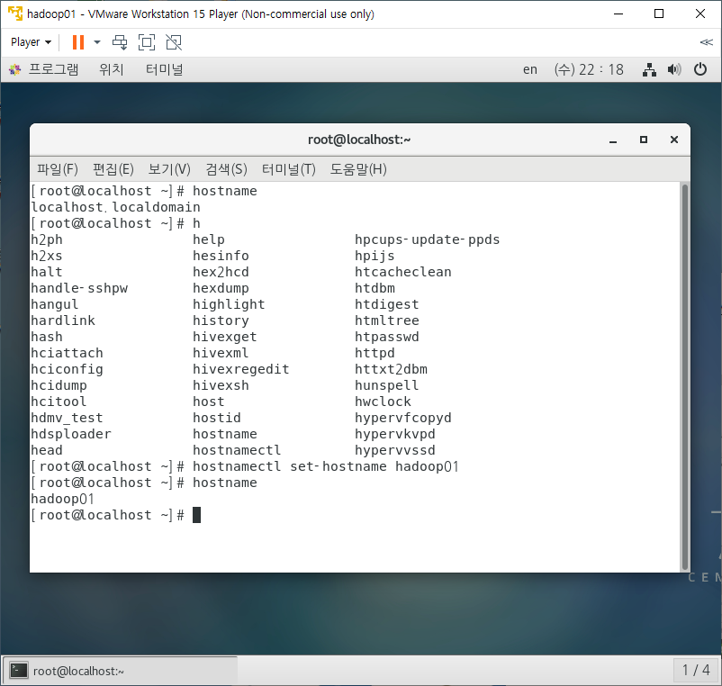

## 순서

1. 머신 복세 
   - ip확인
2. 머신 4대를 클러스터링
   - 박화벽 해제
   - hostname변경
   - DNS설정(도메인 등록)
     - hosts파일 등록(IP와 hadoop01,02,03,04를 매칭.)
     - 네트워크 프로세스를 restart
     - 설정확인 - 설정을 성공 완료했는지 확인하자.
     - 머신 4대에 모두 적용되도록 hadoop01머신에서 02,03,04에 직접 접속해서 작업.  [원격 서버로 copy]
3. 프로그램 설치
   - hadoop 설치
   - jdk설치
   - 설정하기

- 가상머신 복제하기


- VMwarePlayer에서 open 해서 아래꺼 열기 누르면 VMwarePlayer에 추가됨.


- Edit virtual machine settings -> 좌상단 options -> working directory확인하고 virtual machine name을 바꿔주기(hadoop01 -> hadoop03)


- 추가된 가상머신에 접속
  - move it => 원래꺼 IP를 가져감
  - COPY it => IP를 새로받음(우리는 이거)


## 클러스터링

- 가상머신 4대를 하나의 하둡 서버인것 처럼 사용한다.
  - 4대를 1대처럼 작동시킴.
  - 4대가 서로 통신해야하니까 방화벽을 해제해줘야함
  - 각 4대가 고유의 IP를 갖고 있어야함.


- ip확인하기
  - ifconfig


- hadoop01의 IP : 192.168.111.130 
- hadoop02의 IP : 192.168.111.144 
- hadoop03의 IP : 192.168.111.128 
- hadoop04의 IP : 192.168.111.145


- 시간지나면 화면 잠기는거 해제하기
  - 프로그램 -> 시스템도구 -> 설정-> 아래 사진


- hadoop01에서 01,02,03,04모두 접속 가능한지 확인한 것.
  - 반드시 작업이 끝난 다음에는 exit로 로그아웃 해야함
  - hadoop01에서 작업했는데 hadoop03이 바뀔수도 있으니까.


- exit = 로그아웃 


### ssh 통신

- 설정해놓은 빅 데이터를 sts에서 활용하기.

- hadoop01머신 연결


- windows -> perspective -> open perspective -> other


- local files => Host
  - local 우클릭 -> new -> connection


- Host name에 hadoop01의 IP입력


- host only -> 가상머신끼리 통신가능
  - guestPC들끼리 통신하게 만드는 것.
  - HOST는 공유기를 통해 인터넷에 접근함
- NAT(우리가 취한 방식) 
  - guest랑 HOST 모두 공유기를 통해 인터넷에 접근함
  - GUEST를 HOST인것 처럼 사용한것.


- host name 변경하기
  - h + tab => h로 시작하는 명령어 볼 수 있음. 

```
set-hostname => host이름을 바꾸겠다.
hadoop01 -> 이 이름으로 바꾸겠다.
```



- 닫았다 키니까 localhost가 hadoop01로 바뀌어 있음을 알 수 있다.


- 이제 hadoop01에서 hadoop02로 접속할때도 이름이 바껴있다.


## 방화벽 해제

- 설정 파일을 모아 놓는 곳인 etc 파일에 hostname => 우클릭 => 텍스트편집기로 열기 -> 내가 설정을 변경한 내용을 볼 수 있음


- 방화벽 확인하기

1. 현재 방화벽이 올라와 있는지, 어떤게 실행중인지 확인하기.

- systemctl : 서비스 관리
  - 서비스 상태보기, disable시키기, 서비스 start시키기 등

- 리눅스에서 사용하고 있는 전체 서비스 목록 확인하기
  - 마지막에 ctrol + c로 빠져나올 수 있음. 

``` 
systemctl list-units --type=service
```


- firewalld가 방화벽에 관련된 서비스임.


- 전체 목록 말고 하나에 대한 status확인하기

```
방화벽 상태를 확인 하겠다.
systemctl status firewalld
```


- 방화벽이 start되어 있으므로 방화벽 해제시켜주자.


- reboot 후 firewalld 상태 확인하기
  - 방화벽이 start상태...


- disable시키고 reboot하면 해결 됨.


- 방화벽이 죽어있음.


- 도메인 등록하기
  - hadoop01에서 IP로 hadoop02로 접속을 해왔는데 그냥 hadoop02로 접속하는게 편하니까 DNS설정해주자.

- 아래 hosts파일 우클릭해서 텍스트 편집기로 열기


- 다 지우고 아래처럼 해주기


- 네트워크 프로세스 restart하기

```
/etc/init.d/network restart
```

- 이제 hadoop02라는 도메인으로 접속가능함.


- local에서 원격지로 copy하기

  ```
  scp copy할파일(위치까지 명시) copy받을서버의 위치
  
  scp     /etc/hosts     root@hadoop02:/etc/hosts
  ----    --------      -------------------------
  명령어   cpoy할 파일     target서버의 위치와 파일명
  ```

  - hosts파일을 100% copy완료


- 원격 서버에 실행명령 입력하기

```
ssh 서버 "실행할 명령문"
    ----
    ip,도메인
```


```
scp /etc/hosts root@hadoop03:/etc/hosts
ssh hadoop03 "/etc/init.d/network restart"
위의 두 명령어로 hosts파일을 복사하고 hadoop01에서 hadoop03을 원격으로 restart해주면
hadoop01 -> hadoop02 -> hadoop03 -> hadoop04 -> hadoop01 로 접속(ssh)가능함.

ssh => 보안이 된 통신
```


- 암호화된 통신을 위해서 공개키 생성 후 배포하기
  - 공개키, 비공개키 만들어서 공개키를 hadoop02,03,04에게 배포
  - 하둡과 관련된 모든 작업은 하둡계정에서 해야한다.

hadoop의 root 디렉토리로 이동 -> cd ~ => hadoop의 home디렉토리로 이동


- id,비번 둘다 hadoop, hadoop


- ssh에 있는 파일들 볼 수 있음
  - id_rsa가 비공개키고, id_rsa.pub이 공개 키임.


- 카피할 파일이 공개키임
  - 공개키를 홈디렉토리로 보냄.
    - 이렇게 공개키를 보내주면 hadoop01에서 02,03,04로 ssh할때 비번 입력 안해도 된다.
      - 01에서 02, 03, 04로 접속할때만 비밀번호 안물어본다. 02에서 03같은 경우는 물어봄.

```
ssh-copy-id -i id_rsa.pub hadoop@hadoop02
```


- 이제 하둡을 설치하기 위해서 플랫폼을 구축하기가 마무리됨.

- 권한이 일치해야 엑세스할 수 있다.
  - 리눅스의 윈도우 상태에서 파일들을 깔면 root권한임. hadoop에서 사용하려면 hadoop권한이어야함.