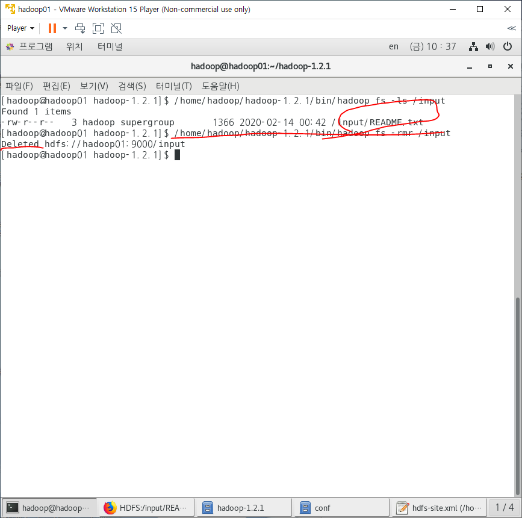
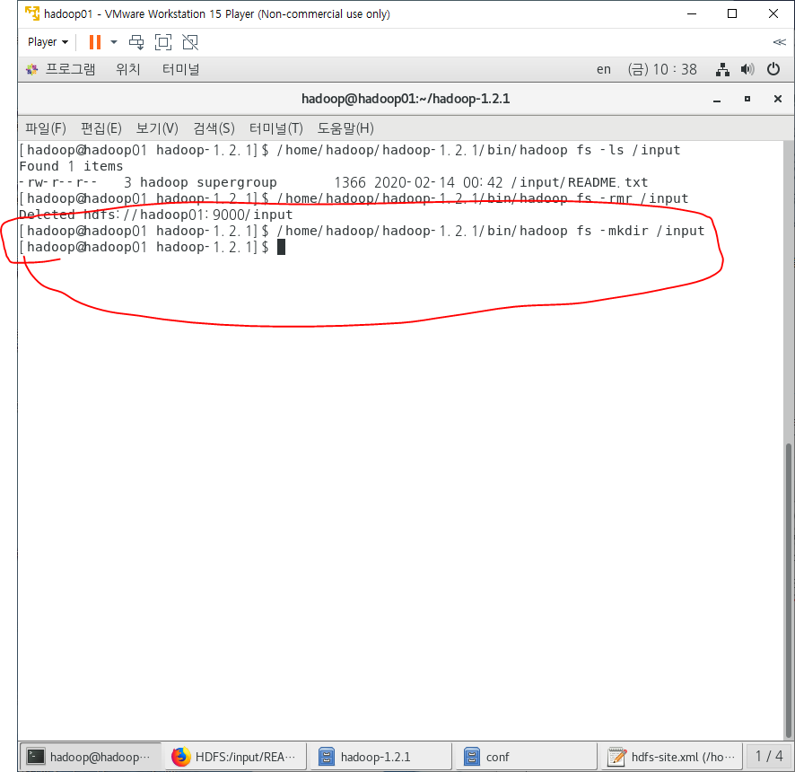
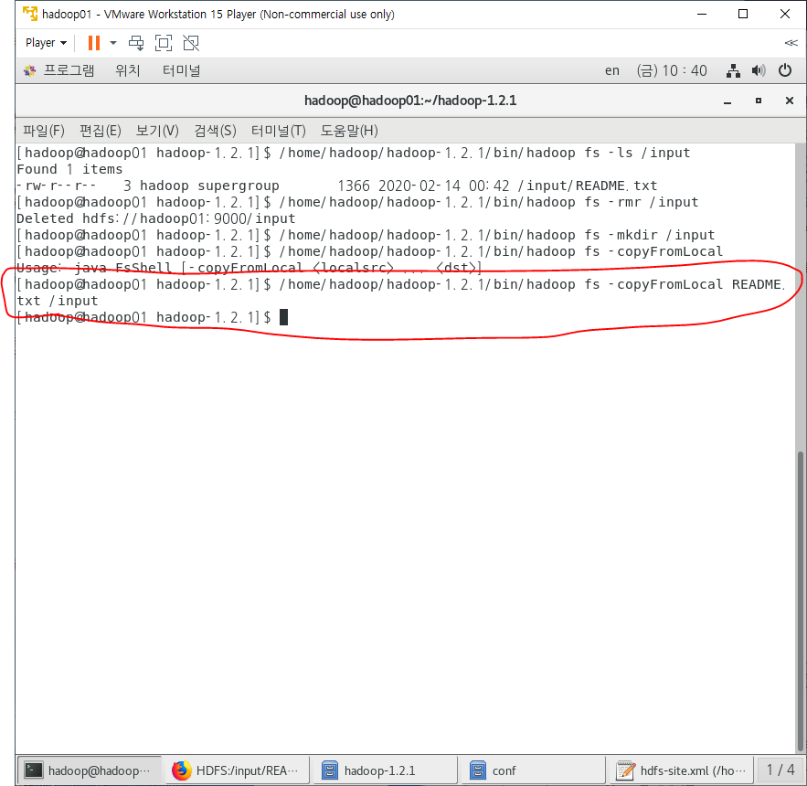
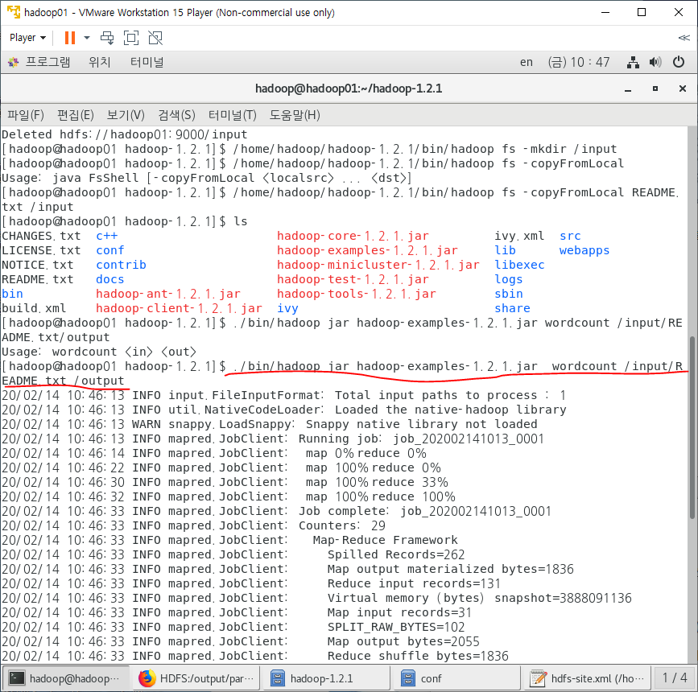
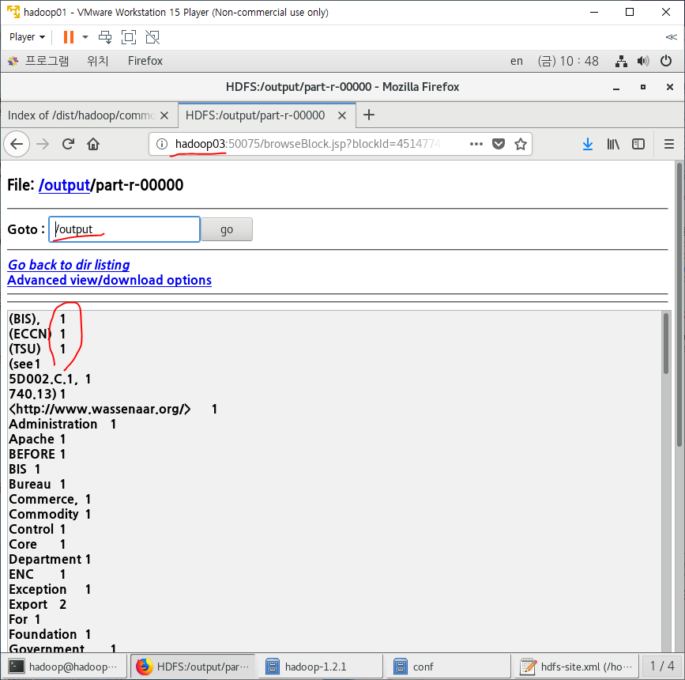

- 명령어를 절대경로로 줄꺼라서 경로가 hadoop-1.2.1에서부터 시작하던지 아니든지 아무상관없다.
  - 아래 명령어는 input태그에 있는 README.txt파일 확인과 삭제

- 다시 input파일 만들기

- README파일을 카피해서 input에 넣겠다.

- 지금 명령어 친거는 상대경로임
  - hadoop-examples에 있는 jar명령어로 작업을 할 것임. (jar)
  - wordcount라는 클래스를 불러서 쓰겠다.
    - wordcount는 input(뭐가지고 작업할꺼냐), output데이터가 들어가야 한다.
  - input/README.txt = 분석할 파일 (input)
  - /output = 결과를 저장할 파일(output)

- 아래는 output된거(wordcount한거,  숫자는 단어가 몇번 쓰였는지를 나타냄)를 firefox에서 보여줌

