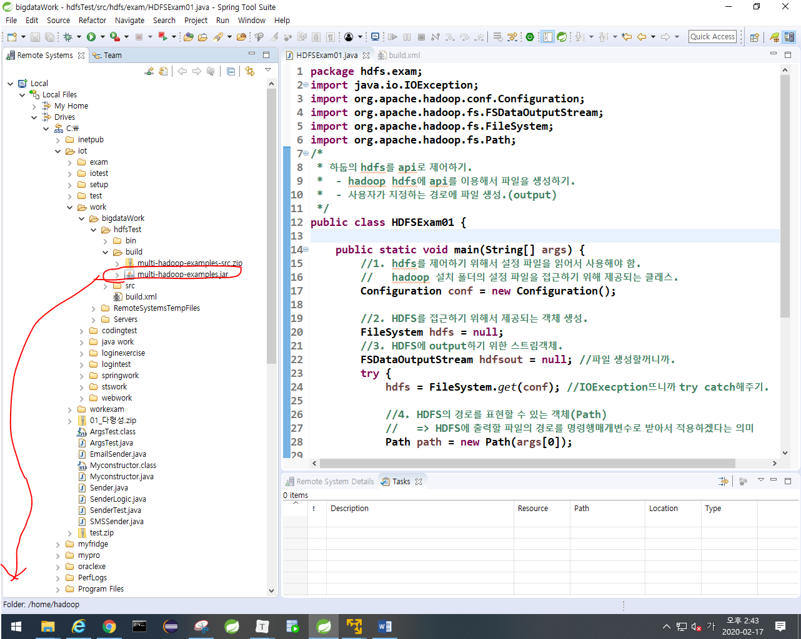
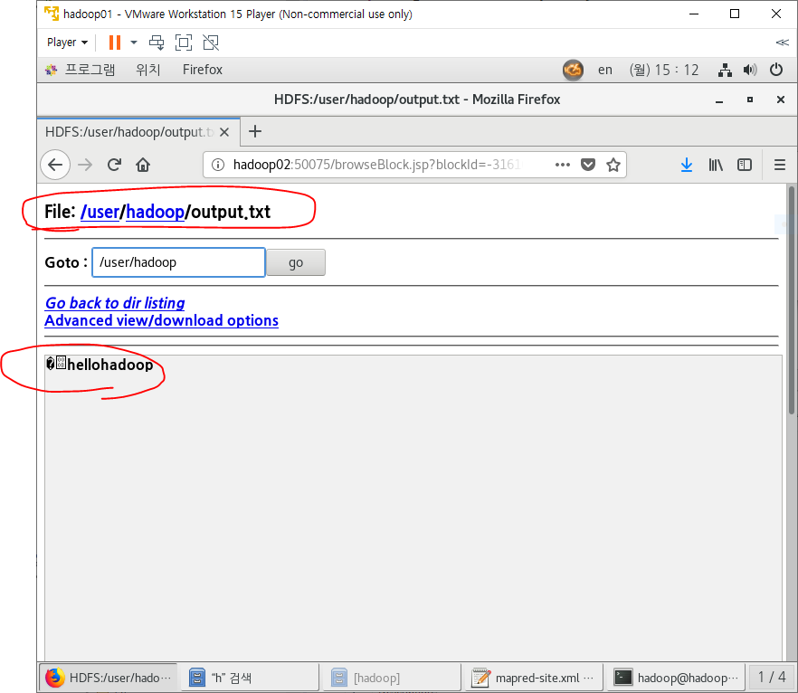

- ip 바뀌었을 때
  - /etc/hosts
  - scp 해서 모든거 copy
  - 네트워크 프로세스, restart(모든 머신에 작업하기.)


- 앞으로 root로 접속하고 hadoop으로 이동해서 작업하자.

## 빅데이터

1. 데이터 수집 (어디에서 데이터를 수집하는지)
   - IOT장비(센서)
   - log
   - RDBMS
   - 웹페이지
   - 크롤링
   - SNS
2. 데이터 저장
   - HDFS사용(하둡에서 데이터를 저장함)
   - NO-SQL 사용
3. 데이터 처리
   - MapReduce작업.
4. 데이터 분석
   - 감정분석, 자연어처리, 키워드분석, 패턴분석, 데이터마이닝

5. 데이터 분석 결과 활용


### 앞으로 할꺼

- log발생시키기 , 분석 (이게 빅데이터의 기본임)
  - HDFS에 저장
  - flume사용
- RDBMS분석
  - sqoop사용
- 웹페이지, 크롤링, SNS수집
  - R 사용

- 맵리듀스로 데이터 처리한거 R로 분석.


- 인코딩 확인(책 48쪽)

  - UTF-8임.

  ```
  echo $LANG
  ```


- 책 51쪽
  - hadoop01에서 비공개키, 공개키 만들어서 hadoop02에게 공개키 카피해줌
    - hadoop01에서 02,03,04로 접속해서 데이터를 각가 나눠서 처리하도록 할껀데 01에서 02,03,04한테 접속 할때마다 비밀번호를 계속 쓰기 귀찮음.


## HDFS(책 66p)

- bigdataWork로 STS실행.

  - UTF-8로 변경

  - tern설치

  - DATA-TOOL설치

    

### 대용량 데이터가 발생했을 때 HDFS에 적재하는 방법

- 우선 명령어로 적재하기.
  - 1번 = hadoop-1.2.1/에 들어가서 명령어 쓸꺼임
  - 2번 = /home/hadoop/hadoop-1.2.1/bin/hadoop fs를 써서 NOTICE.txt를 input에 복사.
    - fs명령어는 HDFS를 제어하는 명령어임.


- wordcount이용해보기
  - input과 output을 써준다.


#### sts에서 spring <hdfs 제어하기.>

하둡은 자바프로젝트로 작업하면 됨.

- java project 생성 -> next -> finish -> perspective no


- spring에서 쓸 라이브러리를 remote explore에서 가져오자.


- hdfsTest우클릭 -> buildpath -> configure buildpath


- 여태까지는 명령어로 NOTICE.txt나 README.txt를 넣고 카피해서 HDFS에 데이터를 적재했는데 이제는 java로 HDFS에 데이터를 적재해보자. (책 98p~100p)
  - api를 써서 HDFS객체생성, HDFS에 데이터 가져오고 읽고 쓰고 데이터 내보내는 등을 함.
  - 김샘자바 -> 빅데이터 -> hadoop_build.xml
    - 하둡에서 실행하려면 jar로 묶어줘야 하는데 위의 xml을 통해서 할 꺼임.
      - jar명령어 = 파일들을 jar로 묶어라
      - zip명령어 = 파일들을 zip으로 묶어라.


- build.xml우클릭 -> run AS -> ant Build
  - build.xml에 있는 명령어 다 실행함.


#### 소스가 하나라도 변경되면 아래처럼 hadoop01에 추가해주자.

- 만약 HDFSExam01에서 뭔가 하나라도 변경하면 build.xml을 다시 ant build해줘야 한다.
- jar가 생긴거를 hadoop01에 복사해주자.




#### 소스가 하나라도 변경되면 위처럼 hadoop01에 추가해주자.

- hadoop01에서 실행시키자. (하둡 명령어로 jar파일로 패키징해놓은 것을 실행시켜보자.)
  - hadoop에 있는 jar명령어를 쓸꺼임. 패키지명, 클래스명도 다 언급해줘야함. 전에 했던 wordcount는 패키지명, 클래스명이 없었던거임.

- cd .. => 한단계 위로 올라가라


```
jar파일을 실행시키는 명령어
./hadoop-1.2.1/bin/hadoop jar

jar파일
multi-hadoop-examples.jar

jar파일의 패키지명 + 클래스명
hdfs.exam.HDFSExam01

여기에 hellohadoop이라는 내용을 쓰겠다.
output.txt hellohadoop
---------- -----------
args[0]      args[1]

```


- 위 사진의 output.txt앞에 경로를 안써줘서 아래사진처럼 user라는 이름으로 생긴거임.




- InputStream으로 HDFS에 저장된 데이터 읽기


- Configuration = 설정정보 읽기
- FileSystem = HDFS
- FSDataOutputStream = 파일생성
  - FileSystem.create = 경로생성
  - FSDataOutputStream.writeUTF('입력할 내용') = 사용자가 입력한 내용을 출력
- FSDataInputStream = 파일읽기
  - FileSystem.open = 경로에 있는 파일 읽을준비.
  - FSDataInputStream.readUTF() = 파일에 적혀있는 내용을 읽기.
    - sysout으로 묶어주셈.

```리눅스
./hadoop-1.2.1/bin/hadoop jar multi-hadoop-examples.jar hdfs.exam.HDFSExam02 output.txt

. = 현재파일에서 부터
/hadoop-1.2.1/bin/hadoop jar = hadoop-1.2.1안의 bin폴더안의 hadoop 파일에 있는 jar명							   령어를 쓰겠다.
multi-hadoop-examples.jar    = sts로 작성하고 ant로 jar파일로 묶은애들 중에
hdfs.exam.HDFSExam02         = 이런 패키지와 클래스명을 갖고있는 애를 실행시키겠다.
output.txt                   = args[0]이 output.txt라는 뜻.(내가 자바파일에 쓴거.)
```


## copy하기

- pathin = 읽을 파일의 경로
  - args[0] = 읽을 파일의 이름
  - InputStream에서 open
- pathout = 생성할 파일의 경로
  - args[1] = 생성할 파일의 이름
  - OutputStream에서 파일생성(create)
- 파일을 읽고 읽은거를 쓰기
  - hdfsout.writeUTF(hdfsin.readUTF());


