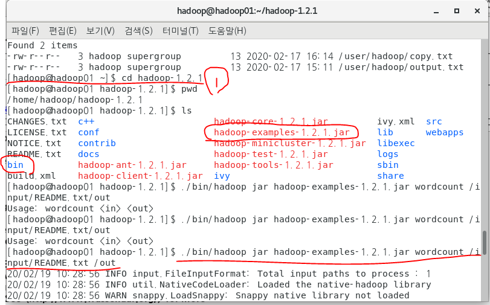
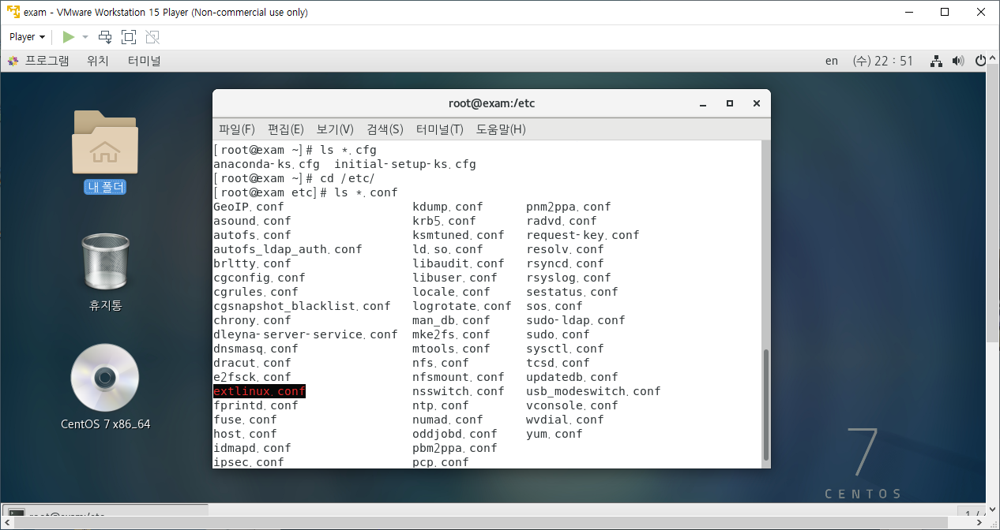
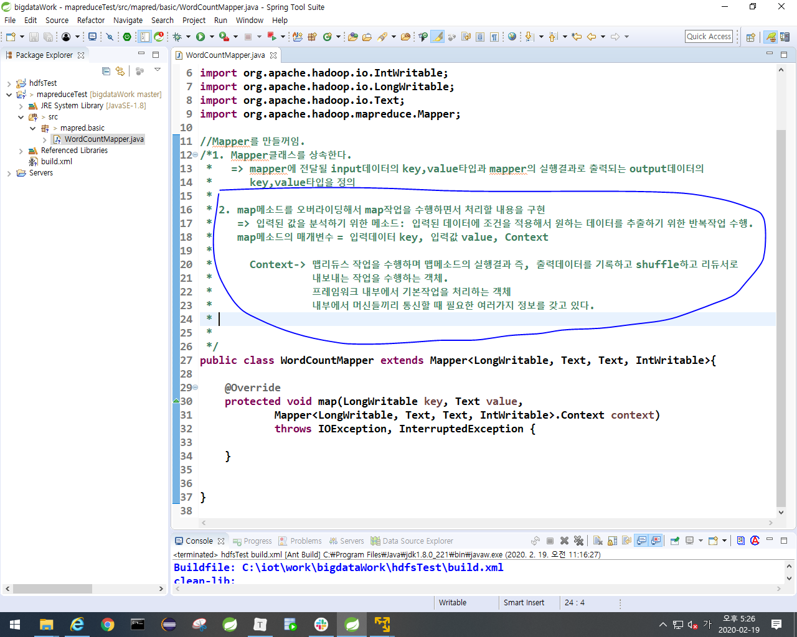

- 하둡
  - 빅데이터를 저장하고 처리하는 목적
    - 처리방법: 맵리듀스
    - 저장방법: HDFS사용 (하둡이 갖고 있는 분산파일시스템)
  - hadoop fs -mkdir /input
    - 물리적으로 input폴더가 있는게 아니라 하둡 내부에 존재. input폴더와 그 안의 파일들을 직접 눈으로 볼 수 없다. 그래서 hadoop01:50070을 통해서 볼 수 있다.
  - hadoop fs -copyFromLocal README.txt /input
    - input 폴더 안에 README.txt를 넣는 명령어

## HDFS


- client가 namenode(masterPC)에게 요청 -> namenode는 요청받은것을 64MB로 쪼개고 복제해서 전체 datanode에 block단위로 쪼개서 보냄 -> namenode는 이 block이 어느 datanode에 있는지 위치정보를 알고 있음. -> datanode는 주기적으로 namenode에게 hearbeat를 보냄 -> 이걸 통해서 namenode는 datanode의 생사여부를 체크함 -> datanode가 죽어서 hearbeat를 보내지 않으면 namenode는 죽은 datanode가 갖고 있는 block을 복제해서 다른 datanode에게 뿌림.
- 왜 64MB일까? (다른 크기로 조정가능)
  - blcok이 커질수록 metadata는 작아진다.
- namenode에 문제가 생기면 걍 끝나니까 namenode와 다른 서버에 secondary node를 만들어줘야함 -> secondary node는 namenode에 check point를 계속 보내서 백업을 요청함. -> namenode는 백업본을 secondary node에게 만든다.


## 실습시작

- 모든 머신에 적용(계속 파란색 잠금화면 뜨니까.)
  - 프로그램 -> 시스템 도구 -> 설정 -> 전원 -> 절전 안함


- root -> hadoop으로 변경, root 디렉토리에서 ~(홈 디렉토리로 변경)
  - su hadoop 
  - cd ~


- 명령어들은 home -> hadoop -> hadoop-1.2.1 -> bin 폴더에 있음.


- 아래 밑줄처럼 bin에 있는 명령어를 쓰려면 경로를 전부 다 써줘야함.


- 경로를 계속 다 써주기 귀찮으니까 아래처럼 해줄 수도 있다. (상대경로)
  - 폴더는 파란색
  - 현재경로에서 bin폴더의 hadoop명령어를 쓸 껀데 jar명령어를 쓰겠다. wordcount를 쓰고 싶은데 이건 hadoop-examples-1.2.1.jar에 있다.
  - wordcount -> 패키지를 포함하고 있는 클래스 명
  - /input/README.txt /out 는 wordcount에서 실행되는 명령행 매개변수임. input폴더의 README.txt




-  hadoop-data(hdfs에서 관리하고 저장되는 데이터가 위치하는 곳.)
- 우리는 하둡을 실행할때 발생하는 것을 hadoop-data에 저장할 것
  - 우리가 -mkdir을 해준 폴더들은 여기에 다 있음. (우리 눈에 안보이는 폴더들)


- hadoop02의 hadoop-data의 hdf (hdfs임)
  - data: data들에 대한 block들이 모여 있는곳. datanode들임
  - namesecondary : secondary node임.
  - mapred는 맵리듀스 하면서 발생되는 데이터들.


- sts에서 FileSystem 클래스
  - HDFS에 접근하기 위한 클래스
  - FileSystem으로 부터 InputStream, OutputStream이 만들어짐. (FileSystem의 정보를 씀.)


- 디렉토리 지우는 명령어

```
multi-hadoop-examples.jar (지우려는 폴더명)
```


- copytest폴더에 output을 주고 싶은데 아래사진처럼 하면 copytest파일이 만들어진다.
  - 자주하는 실수임.


## 리눅스 책 182p(기본명령어)

- #
  - 관리자
- $
  - 일반


change directory (cd)

- cd ~
  - home 디렉토리로 이동(= 다른위치 -> 컴퓨터 -> home)
- cd /
  - root 디렉토리로 이동. (= 홈)
- cd .
  - 현재 디렉토리
- cd ..
  - 상위 디렉토리


pwd(print working directory)

- 현재 작업중인 위치를 알고 싶을 때


### ls(list)





### cd


### pwd, rm, cp


### touch


### mv, mkdir, rmdir, cat, head & tail


- test폴더 안에 anaconda를 현재 폴더로 이동


- 현재폴더에 있는 anaconda의 이름을 바꿀 수도 있다.


- 폴더 삭제


- mytest1안에 mytest2 폴더 만들고 mytest2안에 mytest3 폴더 만들기


- 디렉토리 지우기


- 전체 파일의 내용을 보기 (cat)


### more, less, file, clear


### 맵리듀스(하둡 책 101p, 분류와 집계)

- datanode에서 작업을 처리해야 loss가 줄어드니까 TaskTracker가 datanode에 있다. => datanode에 mapper와 reducer가 있다.
- namenode는 Job tracker역할을 한다. 
  - Job tracker => datanode의 맵리듀스가 작업을 처리하는 것을 관리한다.

- 맵리듀스는 데이터를 처리함.
  - 맵 = 입력 받은 파일의 내용을 한줄 씩 읽어서 분류함.
    - key,value형태
  - 셔플(중앙 저장소)
    - 같은 종류의 데이터들이 같은 서버에 있으면 처리하는게 더 빠르니까 셔플을 하는거임
    - 맵의 결과를 모아서 분류함.
    - 여러 머신에 있는 데이터를 그대로 리듀서한테 보낼 수 없으니까 여기서 정렬(sort)하고 합쳐(merge)서 리듀스로 보내는거임.
  - 리듀스 = 셔플단계를 거친 결과를 집계함.
    - key value(=list)형태 
  - driver = application (Job)
    - 리듀스를 거친 후 실행시켜주는 애


### 맵리듀스 프로그래밍(하둡 책 108p)

##### 매퍼 만들기(111p)

- 새 프로젝트 생성


- mapreduceTest-> build path -> configure build path


- 내가 만드는 클래스가 매퍼가 되기 위해서는 매퍼클래스를 상속받아야 한다.
  - 우클릭 -> source -> implement methods -> map선택





- 머신끼리 네트워크로 int, text등을 주고받으니까 writable임.
  - IntWritable