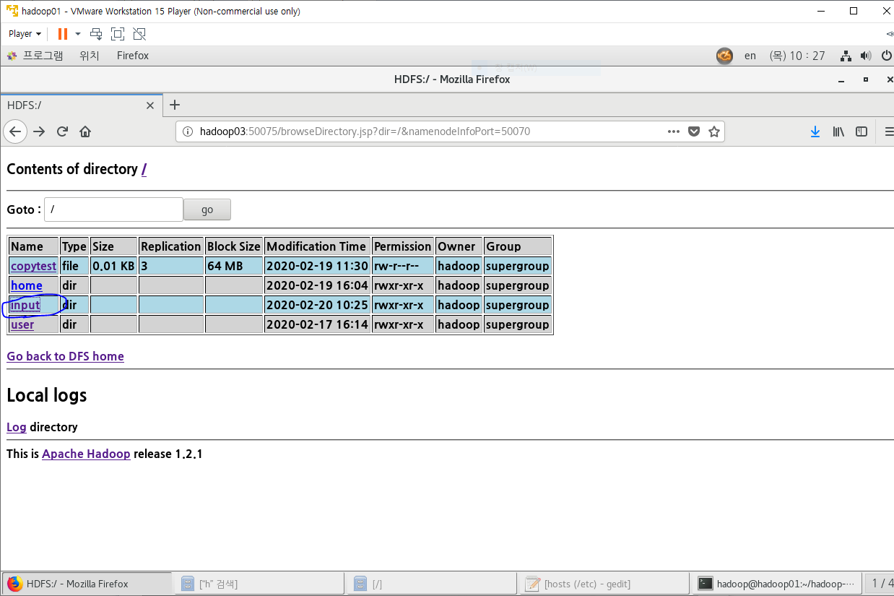
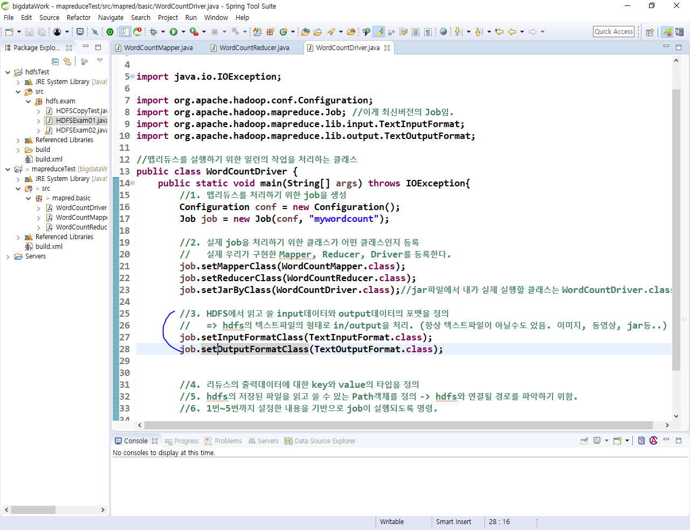
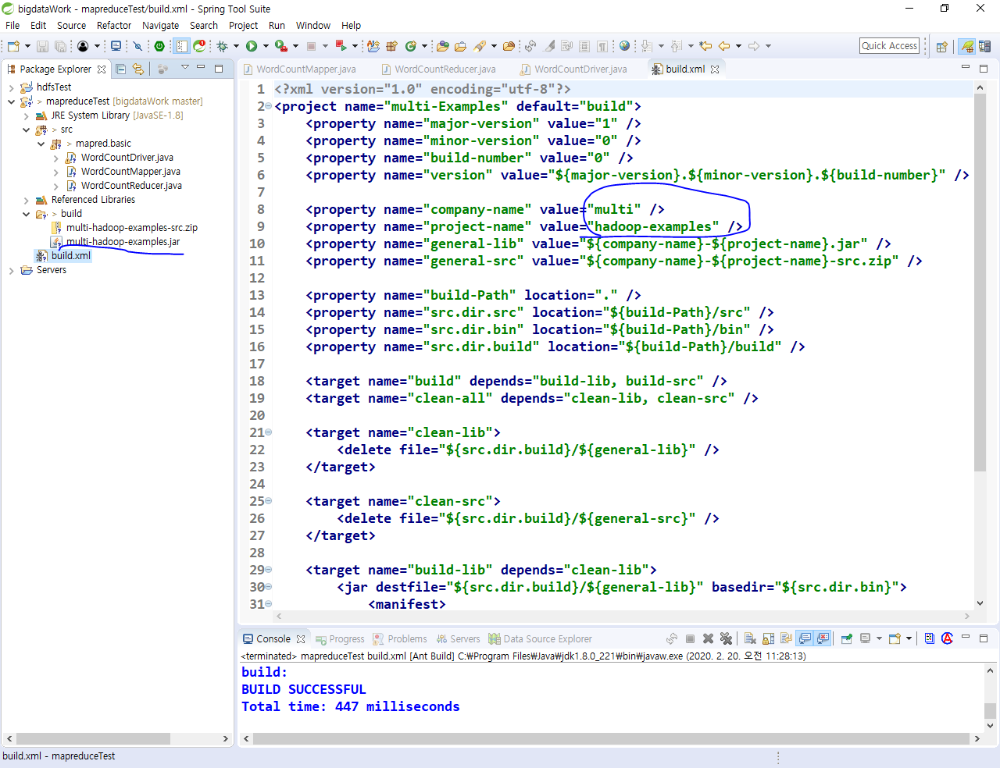
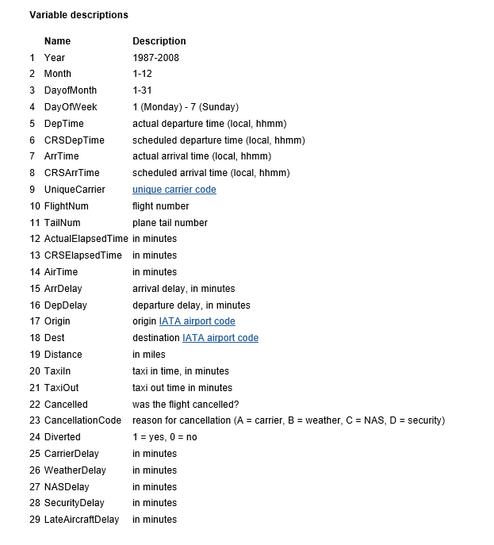
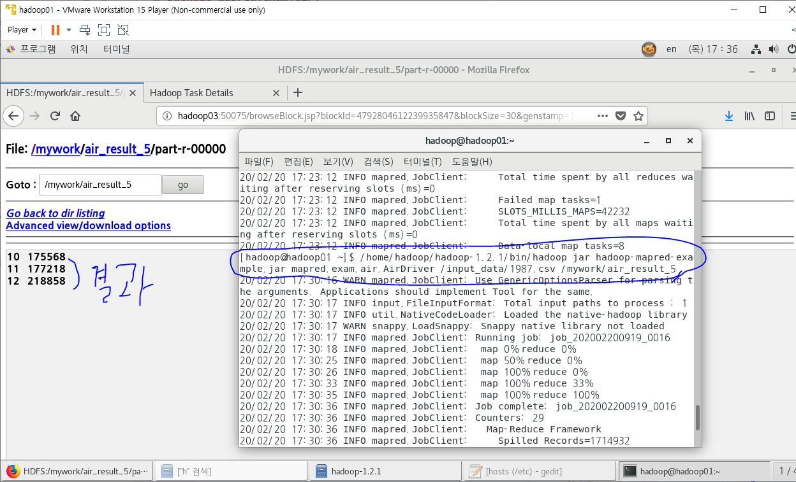

## Reduce만들기


- input폴더 만들기 -> README.txt를 input폴더에 넣기 -> input의 README.txt를 조회 





## Driver만들기


- 1. Job생성

  - configuration = 설정파일에 접근하기 위해 생성
  - job생성 =  job에 설정파일을 등록하고 job이름을 mywordcount라고 정해줌
    - jobTracker = job마다 Task를 할당시켜줌
    - TaskTracker = Task를 수행(맵리듀스 작업 실행)


- hadoop01:50030 
  - Job을 관리하는 admin페이지
    - hadoop01:50070은 HDFS를 관리하는 admin페이지
  - Job객체가 아래의 일들을 실행함
    - 우리는 자바코드로 실행시켜야 하기때문에 mapper가 뭔지 reduce가 뭔지 등록해줘야함.


- 2. job에게 일을 시키려면 매퍼, 리듀서, 드라이버가 뭔지 등록해줘야함.

  - job은 맵과 리듀스를 처리해주는 역할
    - 리눅스에 명령어 입력해서 실행시켜주기 전까지의 과정을 담당. 


- 3. HDFS에서 읽고 쓸 Input과 output의 형식을 정의



- 4. 리듀스의 실행 결과에 대한 key와 value의 타입 정의


- 5. In/Output파일의 경로 지정

  - 명령행 매개변수로 경로를 받을꺼임.


- 6. job 실행시키기


- 지금은 예외처리 안할꺼라서 아래처럼 해주기


- build.xml을 run as 시키면 아래사진 왼쪽의 jar파일이 생기는데 내가 원하는대로 이름을 바꿔줄 수도 있다.




- job을 머신에서 실행시켜주기 위해 remote systems에서 jar파일 복사


- 머신에서 job실행시키기


## 나스닥 예제


- 아래는 선생님이 주신 파일.
  - 이거 갖고 예제 푸는거임
  - 상승마감 =  [종가 - 시가] >0 


- 윈도우에서 선생님이 주신 첨부파일 다운받고 아래처럼 Remote systems에서 복붙해주기


- mkdir로 inputdata폴더를 만든 후 아래처럼 put으로 첨부파일 넣기.
  - /home/hadoop/hadoop-1.2.1/bin/hadoop fs -mkdir /inputdata -> 이렇게 폴더 만듬(HDFS명령어)


- 매퍼
  - 지금까진 단어들이 공백기준으로 나뉘어 졌는데 이번엔 콤마 기준으로 나눠져 있음
    - split사용.
  - map의 outputKey가 1995, 2005 이런식이니까 24번째 줄 처럼 substring해준거.


- 리듀서


- 드라이버


- HDFS명령어로 드라이버 실행하기 + 결과


- HDFS에서 디렉토리 지우는 법.
  - 아래처럼 하둡으로 들어가서 하는게 HDFS명령어
  - 리눅스06에서 연습한건 리눅스 명령어


## 예제 2 (1987csv파일 분석)


- 컬럼들



- 첨부파일


- hadoop-1.2.1에 1987.csv를 복붙해놨기 때문에 아래처럼 hadoop-1.2.1로 이동한 후 put해줘야함.


- 매퍼


- 리듀서


- 드라이버


- 결과




*** 순서 ***

1. HDFS명령어로 폴더 만들기

   ```
   /home/hadoop/hadoop-1.2.1/bin/hadoop fs -mkdir /(폴더명)
   ```

2. 폴더에 분석하고자 하는 파일을 put해서 넣기

   ```
   /home/hadoop/hadoop-1.2.1/bin/hadoop fs -put (넣을 파일) /(넣을 폴더명)
   ```

3. mapper, reducer, driver작성하기

   - mapper작성할 때 파일의 데이터를 신경써서 작성하기.

4. HDFS명령어로 실행해주기.  

   ```
   /home/hadoop/hadoop-1.2.1/bin/hadoop jar (build한 .jar파일) (드라이버의 패키지,클래스이름) /(읽을 폴더와 파일) /(넣을 폴더)
   ```

   