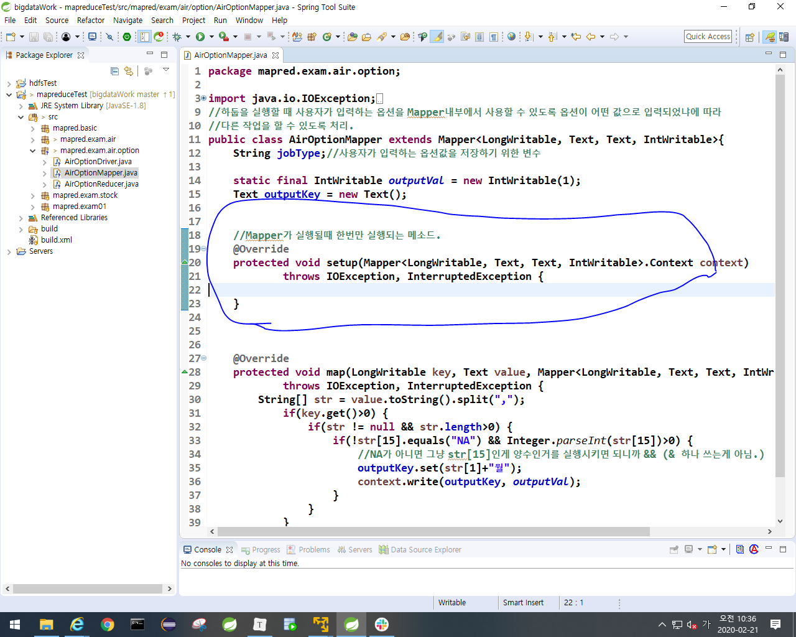

# 하둡 책154p

- 사용자가 원하는 옵션에 맞는 매퍼가 동작하게 해주는것. (변경되는건 매퍼밖에 없으니까.)
  - 같은 데이터로 작업할 때 매퍼, 리듀스, 드라이버가 계속 중복되는것을 막을 수 있음.
-  변경되는건 매퍼와 드라이버임.

- 드라이버 수정

GenericOptionParser

- 리눅스에서 HDFS명령어로 자바를 실행할 때 사용자가 정의한 옵션인지, 인풋에 대한 명령행 매개변수인지, 아웃풋에 대한 명령행 매개변수인지를 구분해주는 역할을 함.

- 공통옵션
  - 책 155쪽에 있는 옵션들을 뺀 나머지.
  - 아래의 두개를 getRemainingArgs()로 구분해줘야함.
    - -D를 입력하고 설정한 옵션은 Mapper에서 쓸꺼임.
    - in/output 명령행 매개변수는 Driver에서 쓸꺼임.

- 사용자 정의 리눅스에서 실행법 & 결과
  - -D만 바껴도 데이터를 분석할 수 있다.

## 다수의 파일 출력(책 168p)

- 근데 지금까지는 데이터 하나 분석할 때 하나씩 명령어 실행시키고 기다렸다. 
  - 지금까지는 매퍼에서 선별적으로 골라서 셔플로 보냈음.
- 앞으로 배울꺼는 리듀서를 조작해서 선별적이 아니고 한번에 작업하는거임.
  - MultipleOutputs -> 여러개의 출력 데이터를 쉽게 생성하도록 돕는 기능
  - 한번의 작업으로 다수의 데이터를 분석하기.

- setup : 한번만 실행됨
- cleanup : 쓸때마다 실행됨.

- 리눅스 HDFS명령어로 실행 & 결과
  - equal, up, down이 한번에 분석되었음.

