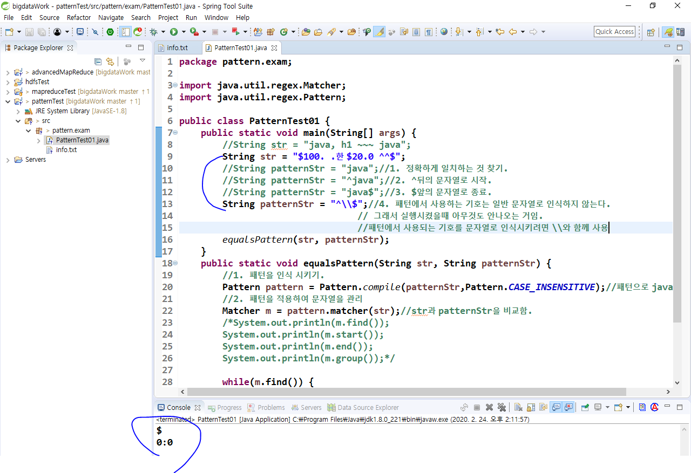
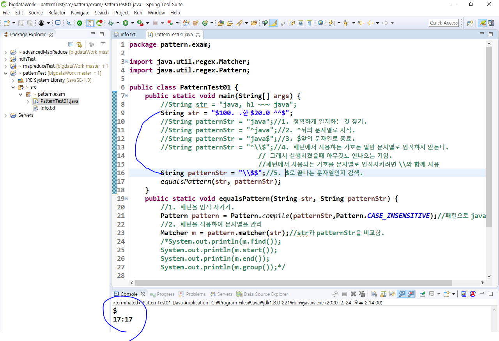
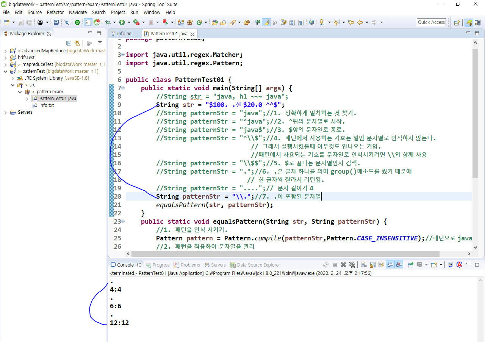

- 한번에 여러개를 put할 수도 있다.
  - 별(*) 사용

- 지금까지는 동적할당으로 ip를 자동으로 받았음.
  - 아래는 ip를 고정하는 작업.
  - 나머지 머신들도 ip고정하려면 아래처럼 작업해주기
  - #은 주석처리.

## 이클립스에서 하둡을 요청해서 실행하기

- 드라이버를 자바 실행시키는거처럼 자바 어플리케이션으로 실행할거임.

- 외부에서는 hadoop01이라고 하면 모르니까 IP로 바꿔주자.

- 외부에서 폴더에 접근할 때 내가 아래 사진에서 정해준 폴더에만 접근할 수 있다.
  - /는 모든 폴더를 오픈해놓는다는 의미임.

- 위 사진의 /와 아래사진의 /는 같은 의미

- hadoop1에서 설정바꿨으니까 2,3,4번 머신에 모두 카피해야됨.

- 새로운 자바 프로젝트 만들기

- 이제 이클립스에서 맵리듀스를 실행시킬거임.
  - 라이브러리 담을 lib폴더랑 설정파일 담을 conf폴더 만들어주기

- 아래의 hadoop-1.2.1의 lib에는 하둡 내부에서 쓰는 외부 라이브러리들이 모여있음.
  - 이거를 이클립스의 lib로 가져다놓기

- 지금은 파일만 가져온거고 프로그램 실행할 때 인식 못하니까 라이브러리 등록해주자.

- conf는 class폴더로 등록해주자

- 프로젝트에 느낌표 뜨니까 문제있는 라이브러리를 지워주자

- 드라이브에 명령행 매개변수에 되어있는것을 실행시키기 위한 작업을 하자.

- 권한이 없다는 에러가 뜸.
  - permission denied
  - 외부 프로그램(이클립스)으로 하둡에 접근하니까 읽기는 되는데 쓰기에 대한 권한이 없기때문에 에러 뜬거임.
    - HDFS는 외부에서는 쓰기 권한이 없음. 읽기 권한은 있음.

- permission 에러 해결하기
  - hadoop01의 hdfs-site.xml에 들어가서 permission을 false(해제) 시켜주자.
  - 그리고 hadoop02,03,04에 전부 복사
    - scp ~~~ 

- 이클립스에서도 수정해주자

- 다시 실행해보자

- 윈도우 계정인 student를 디폴트로 찾고 있기 때문에 에러가 뜨고 있음.
  - 상대경로로 명령행 매개변수를 주고 있어서 에러뜨는거임.

- 아래처럼 절대경로로 바꿔주고 나스닥 csv는 필요없으니까 1로 시작하는 모든것을 실행시켜보자.

- air_eclipse폴더가 생기긴 했음. 근데 아무 파일도 들어있지 않음.

- jar파일로 안 묶어서 아래 에러가 뜸

- 개미로 안하고 jar파일을 수동으로 묶어주는 방법임 => export

- 위의 과정을 거쳤기 때문에 jar파일이 생김. 아래 사진의 jar파일 우클릭 -> build path -> add to build path
  - 등록 시켜줘야 하니까.

- air_eclipse가 있으니까 air_eclipse2로 만들어준거임

- 위 사진처럼 실행해서 맵리듀스가 다 완성되면 아래처럼 폴더가 생김.

- 실행 완료됨

 *** 여기 까지가 외부에서 하둡을 실행시키는 방법임. ***

- 위의 결과에서 10,11,12월은 1987,1988꺼가 합쳐진거임. 그리고 뭐가 어떤 년도의 데이터인지도 모름. 
  - 맵리듀스 할 때 정렬해보자. 맵에서 리듀스로 넘어가는 사이에서 우리가 커스터마이징 하자.
    - sort와 join~!! => 맵리듀스 끝판왕.
  - 아래처럼 변경

- jar파일 인식시켜줘야 하니까 아래처럼 remove하고 왼쪽의 jar파일도 remove하고 다시 export해주자.

- 정렬되서 나왔음.

### 빅데이터 흐름

### pattern

- 비정형 데이터로 작업하기 -> 내가 원하는 데이터를 가져올 수 있어야함.

- find()

- start()

- end()

- group()
  - 우리한테 제일 필요한 것.

- 반복문으로 원하는 문자열과 위치정보 추출하기

- 대소문자 구별함

- CASE_INSENSITIVE쓰면 대소문자 구분안함.

- 위 사진이랑 아래사진 차이점
  - 한번 출력된 글자는 또 출력되지 않는다.

- a가 3개, i가 3개, a랑i가 합쳐서 3개

- 영문자 한개 숫자 한개
  - 숫자영어는 안되고 영어숫자만 나옴

- 아래는 숫자가 아닌게 들어있기 때문에 false임

- 숫자가 없거나 하나면 true

- 이메일 체크

- IpCheck -> ip타입으로 적절한지 체크

- Password체크 -> 8글자 이상, 대문자, 소문자, 특수문자, 숫자가 모두 포함
  pattern연습하면서 작업했던 코드 rename