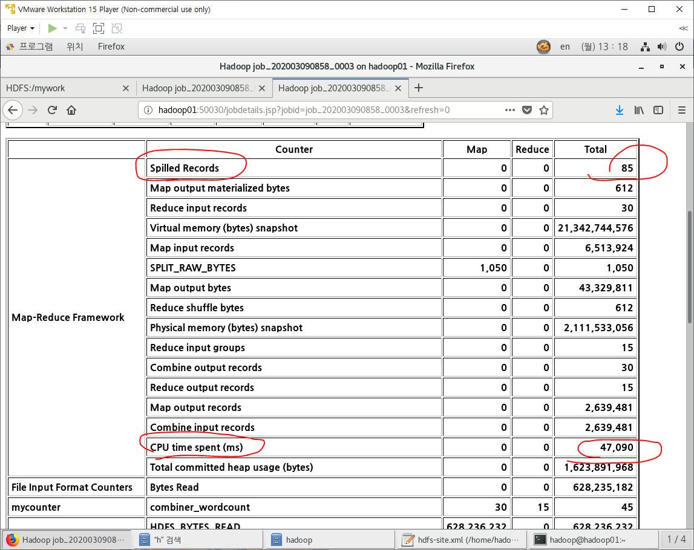

- 각 Task Tracker에서 매퍼로 분류한거를 하나로 모아서 한번에 집계를 해야함. 이때 Task Tracker끼리 네트워크를 통해 통신해서 분류한거를 하나로 모아줌. 분류한거를 하나로 모아줄 때 더 간단하게 빠르게 만드는게 커스터마이징임.
  - 셔플을 커스터마이징함.

- 리듀서를 몇개 썼느냐에 따라서 파일이 여러개 생김.
  - 지금은 하나썼으니까 하나 있는거.
  - r은 reducer라는 뜻.

## Combiner (하둡 책 116P, 개념이 아주 중요)

- 셔플할 데이터의 크기를 줄이는 것
  - 네트워크로 데이터가 전송되기 때문에 셔플할 데이터의 크기를 줄여주면 job의 성능이 좋아짐.
- 매퍼의 출력데이터를 받아서 연산을 진행한 후 리듀서에게 보내줌.
- Combiner는 항상 사용하는게 아님. 뭔가를 더하는거 처럼 집계할 때만 사용함.

- 아래는 컴바이너 안쓴거.

### 이제 컴바이너 적용 시작.

- 매퍼에 미니 리듀서 만들어주기

- 드라이버에서 미니 리듀서 실행시키기 위한 셋팅 하기.

- 아래 사진대로 Next누르고 Finish하기.

- 드라이버 실행

- 컴바이너 안 쓴거랑 비교해보자.
  - 아래 사진들은 컴바이너 쓴거.
    - 컴바이너 쓴게 더 효율적임. 

### 정렬

### 이제 셔플단을 커스터마이징 해보자(하둡 책 106P)

- Partitional(리듀서의 갯수와 동일한 갯수가 생성됨. 하둡 책 113P,184P)

  - 매퍼의 출력데이터가 어떤 리듀서로 전달될지 결정해주는 애

  - 들어오는 데이터들을 key를 기준으로 정렬처리해서 같은 것들을 리듀서로 넘김
  - 이런 부분을 내가 원하는 기준으로 하는게 커스터마이징임.

- 파티셔너 구현
  - numpartitions로 나눠서 나머지 구한거 = 리듀서의 번호
    - 만약 numpartitions가 3이면 0,1,2 중 하나가 나옴. 해쉬코드를 나눴을 때 같은 나머지가 나오면 같은 리듀서로 보내짐. 
    - getYear() 는 String 타입 -> hashcode() 해주면 같은 year는 같은 hashcode(int타입)를 갖게됨

- 그룹키 비교하기.(하둡 책 185p)
  - 파티셔너를 지나면 같은 리듀서로 보내질 key끼리 나눠지는데 아직 정렬이 안되어 있음. 리듀서가 집계하기 편하게 같은 key끼리 그룹핑 해줘야함.

- 복합키 비교하기(하둡 책 182p)
  - 우리는 그룹키비교기에서 연도별로 정렬한거를 복합키 비교기에서는 월 별로 정렬함.
  - 그룹키 비교기랑 같은데 아래사진 밑줄만 다름.
    - 연도랑 월을 둘다 비교해야함.

#### 복합키(CustomKey) 구현(하둡 책 178P, 보조정렬만 볼 것임.)

- WritableComparable이라는 인터페이스를 상속해야 네트워크 통신 가능.

- 멤버변수, 생성자, getter, setter, toString 생성.
  - 여기에서 정렬할 기준이 year와 month임.

- 아래의 toString은 계속 객체가 생성이 됨.

- 아래의 toString은 하나의 객체로 내용이 계속 변경되는 StringBuffer사용
  - 객체가 적을수록 좋음.
  - toString에 쓴 형식이 리듀스의 결과로 나오는 key의 형식이 됨.

- 데이터 읽고 쓰기, 데이터 비교하기(compareTo)

- 매퍼의 출력 key값이 셔플될 때 기준을 여러개로 잡아서 key값을 정렬해야 하니까 Customkey타입.
  - 여기서 우리가 만든 기준은 year와 month임.

- 드라이버에 등록해주기.

- 이제 리듀서 작성할꺼임.

- 리듀서에서 집계할 때 같은 년도, 같은 월에 대해서만 합산해줘야함.

- 결과

*** compareTo ***

- 아스키 코드로 평가함. data1이 기준임.

*** hashcode ***

- 파티셔너에서 같은 key값 기준으로 정렬하는데 아래처럼 해시코드 문자열로 비교하면 같은거끼리 묶을 수 있다.

*** SQL스킬 ***

- rownum : 오라클 자체적으로 갖고 있는 명령어.
  - 상위 3개의 값을 조회하고 싶을 때 가상의 뷰를 만들어라.
  - 아래 1번은 가상의 뷰 안 만들었을때 원하는 조회가 안나온거. 2번은 가상의 뷰를 만들어서 조회한거

