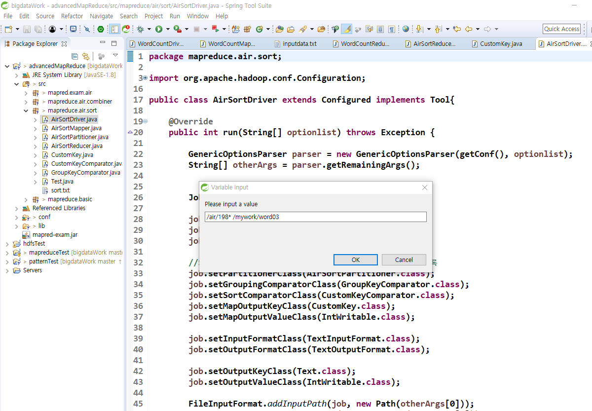

#### datanode에서 어떤 작업이 실행되는지

- disk
  - local과 HDFS가 있는데 여기에 데이터가 저장됨.
- InputFormat
  - disk에 쓰여져 있는 데이터를 읽음
- Record Reader
  - 데이터를 읽기 위한 객체
- MapTask작동
- Partitioner 동작
  - 어떤 리듀스 태스크로 보낼지 판단하는 애. 같은 애들끼리 모아줌.
    - 특정 원하는 Key의 hashcode 구해서 비교함
- 그룹핑과 정렬작업 됨.
  - 여기까지 하고나면 다른 datanode와 통신해서 같은 key끼리 모아줌.

- Reducer

#### 리듀스 메소드가 몇번호출되는지 확인하고 싶을 때(sysout같이 확인할 수 있는거)

##### 커스터마이징 했을때랑 안 했을때의 차이를 보여주고 싶음.

- 맵리듀스 처리결과의 key나 value부분에서 확인할 수 있음.
  - 우리는 key로 확인함.

- key의 갯수만큼 reduce가 호출됨.

- 이제는 커스터마이징 한거.

- 해쉬코드가 같음 = 똑같은 커스텀 키로 사용함., 리듀서가 그룹별로 한번만 호출됨.

- 내부에서는 key가 계속 바뀌고 있다.

- 매퍼에서 나가고 리듀서로 들어오는 key들이 다 커스텀 key인데  이게 다 같은 key인지 다른 key인지 확인해보자.

- 아래처럼 해줘야 맵에서 리듀스로 들어오고 나가고 하는게 가능함.

- 맵에서 전달한 키는 계속 달라진다.

- 복합키 비교기
  - 복합키의 정렬 순서를 부여하기 위한 클래스임. 각 멤버변수를 비교해서 정렬 순서를 정한다.

- 그룹키 비교기
  - 리듀서가 처리를 할 때 같은 멤버변수 끼리 묶어주는게 그룹키 비교기의 역할이다.
  - 우리는 같은 ProductId로 묶었음.
  - 이게 호출되면 알아서 compare메소드가 그룹끼리 묶어줌

- 이제 앞으로 빅데이터 분석할 때 그룹키 비교기, 파티셔너, 복합키 비교기는 안 바뀌고 매퍼랑 리듀스만 수정해주면 됨.

  

- 아래는 매퍼를 통과했을 때 IntWritable타입이 아니고 Text타입일때 매퍼, 파티셔너, 리듀서임. 타입을 맞춰줘야함

## Sqoop

- 오라클이나 MySql에서 만들어진 sql데이터를 하둡으로 가져올 때 사용함.

