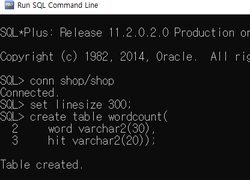
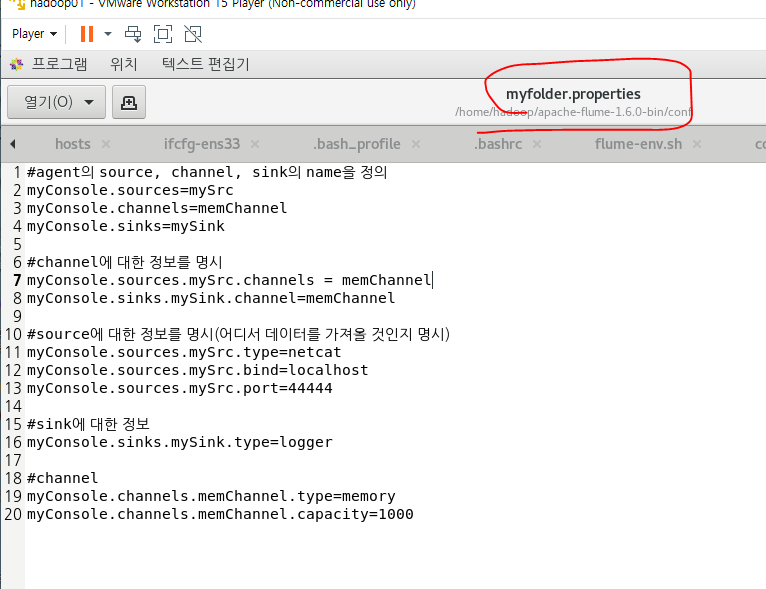

#### sqoop을 써서 oracle로 export하기

##### 에러잡기

- 아래처럼 하면 에러뜸

- 아래꺼가 방금 맵리듀스 한거

- 한 컬럼을 두개로 나누려고 해서 생기는 문제임

- 아래처럼 더 붙여 써주면 한 컬럼을 두개로 나눌 수 있음
  - 원화기호는 sqoop에서 원래 있는 표시라서 원화기호 두개 써준거임.
    - wordcount한 파일이 tab으로 구분되어 있으니까 원화t로 탭을 표현

- export완료

## Flume(data수집을 위한 프로그램)

- 시스템로그, 웹 서버의 로그, 클릭로그, 보안로그 등 비정형 데이터를 HDFS에 적재하기 위해 사용하는 프로그램. 대규모의 로그데이터가 발생하면 효율적으로 수집하고 저장하기위해 관리.
  - Flume, chukwa, scribe, fluentd, splunk

- Web server에서 데이터를 뽑아서 Agent(Flume)를 써서 HDFS에 적재함.
  - Flume의 구성 = Source, Channel, Sink

- Source(데이터의 유입)에 내가 뽑아보고 싶은 유형의 데이터 저장 -> Source에서 데이터를 가져와서 채널링  -> Sink(Output으로 내보내는 역할)
- Source의 유형
  - file system, 네트워크, 콘솔, 또 다른 Flume의 Sink
- Sink의 유형
  - file, 콘솔, HDFS, 또다른 Flume의 source
- Channel
  - Source의 데이터를 모아놨다가 Sink로 보내는 역할. 저장소 역할임.

- documentation -> user guide
  - agent = Flume
  - 일반적인 구성들

- Source, Sink, Channel의 종류들도 다 볼 수 있음

### 다운로드

- 하둡01머신에서 테스트, 하둡02머신에 구축할거임.

[설정]

1. 다운로드(압축풀기)

2. .bashrc에 설정정보 등록

3. flume-env.sh rename하고 정보등록

   -jdk 홈 디렉토리

   -hadoop 홈 디렉토리

4. flume 설정 파일에 등록

   -flume-conf.properties.template을 XXXX.properties으로 rename하기

   -flume agent의 source,channel,sink에 대한 정보를 등록

[Flume의 구성 요소]

- flume의 실행 중인 프로세스를 agent라 부르며 source, channel, sink로 구성

1.  source

   => 데이터가 어떤 방식으로 유입되는지 type으로 명시

   agent명.source.source명.type=값

   1) type

   ​	=> netcat : telnet을 통해서 터미널로 들어오는 입력 데이터

   ​						(bind : 접속IP, port : 사용할 port)

   ​	=> spoolDir : 특정 폴더에 저장된 파일을 가져올 때 사용

   ​						(spoolDir : 폴더명)

2. channel

   => 데이터를 보관하는 곳(source와 sink사이의 Queue(앞뒤가 열려있으니까))

3. sink

   => 데이터를 내보내는 곳(어떤 방식으로 내보낼지 type으로 정의)

   1) type

   ​	=> logger : flume서버 콘솔에 출력이 전달

   ​						flume을 실행할 때 -Dflume.root.logger=INFO,console를 추가해야됨

   ​	=> file_roll : file을 읽어서 가져오는 경우

   ​						  (directory : 읽어온 파일을 저장할 output폴더를 명시)

[flume의 실행]

실행명령어: ./bin/flume-ng agent

옵션(conf-file이랑 name은 내가 어떻게 주느냐에 따라 바뀜 )

​	--conf : 설정파일이 저장된 폴더명(= -c)

​	--conf-file : 설정파일명(= -f)

​	--name : agent의 이름(= -n)

​	-Dflume.root.logger=INFO,console : flume의 로그창에 기록, source가 telnet으로 입려하는 데이터인 경우

### 설정

- 압축풀기

- 깔았으니까 설정해주기
  - /home/hadoop/.bashrc에 설정 정보 등록

- .bashrc 실행

- 뒤에 template가 붙으면 설정파일로 인식을 못함. (conf폴더는 설정파일 모아놓는 곳)
  - flume-env.sh.template가 Flume의 설정파일이 모여있는 곳임.

- cp는 로컬에서 복사, scp는 remote에서 복사할때임
  - cp로 rename해서 복사해줘야 template를 설정파일로 사용할 수 있음.

## Flume의 구성요소

- '#' = 주석
- agent의 이름
  - source,channel,sinks의 이름을 지어줌
- channel
  - source가 사용하는 채널은 s를 붙이고 sink가 사용하는 채널은 s를 안붙임
- sink
  - 콘솔에 찍을때 사용하는게 logger
- channel
  - 저장한거를 memory라고 하고 수용가능용량을 1000으로 지정

## flume의 실행

- telnet실행하기 => text통신하는게 telnet임.
  - yum이라는 명령어로 설치

- telnet으로 text를 치면 다른 터미널에 입력됨.

- telnet 빠져나오는 법
  - ctrl + ] -> quit

- 이제 폴더에서 폴더로 옮겨봅시다(파일에서 파일로)
  - input(source) 폴더에서 output(sink)폴더로 옮겨보자

- flume을 시작하기 위한 명령어
  - -n : agent 이름
  - -c  : 설정 폴더
  -  -f : 설정 파일

- input파일에 console.properties넣으니까 COMPLETED로 바뀌고 output에 동일한 파일이 생긴다.

- rollInterval=0
  - 원래 롤링해서 input폴더에 있는 파일을 계속 읽고 output폴더에 넣는데 이렇게 하면 롤링을 하지 않음

- input 폴더에 있는거를 HDFS로 옮기기

