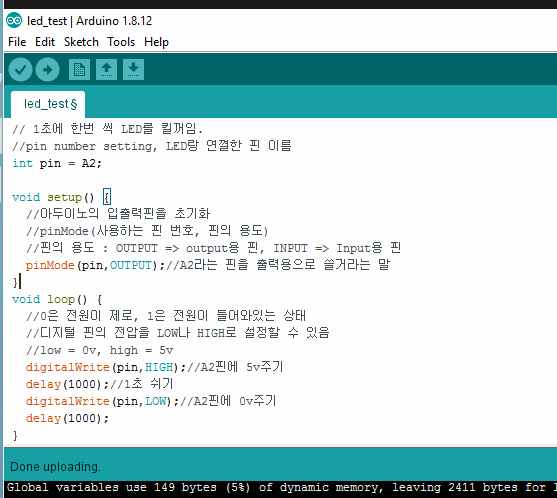
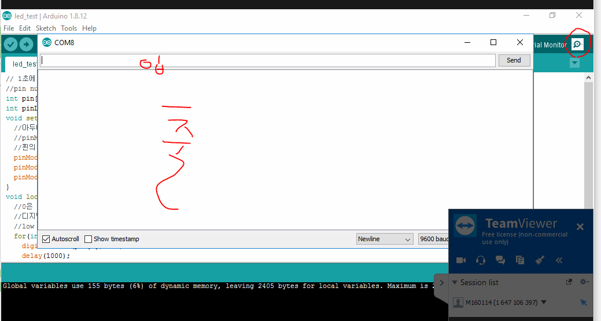

- 라떼판다의 A0, A1 ...은 아날로글 입출력할 때 쓰는 핀임.



- 3개의 핀을 번갈아가면서 LED_BLINK하기
  - 배열 쓰는법. length못씀

```
int pin[] = {A0,A1,A2};
int pinLength = sizeof(pin)/sizeof(int);
void setup() {
  pinMode(pin[0],OUTPUT);
  pinMode(pin[1],OUTPUT);
  pinMode(pin[2],OUTPUT);
}
void loop() {
  for(int i = 0; i<pinLength;i++){
    digitalWrite(pin[i],HIGH);
    delay(1000);
    digitalWrite(pin[i],LOW);
    delay(1000);
    }
}
```

- sizeof는 사이즈를 구하는거.
- int를 signed로 쓰면 2바이트, unsigned로 쓰면 4바이트??
  - sizeof(int) = 2바이트
  - sizeof(pin) = 2곱하기 3(배열 요소가 3개) 해서 6
  - pinLength = 3 


## Serial통신으로 LED 제어하기

- Serial monitor
  - 외부에서 아두이노로 들어온 값을 입력하는 거
  - 출력값



- 내가 A0를 입력하면 A0 LED가 켜지고 A1을 입력하면 A1 LED가 켜짐~~~
- readStringUtil('\n')
  - \n(엔터?)를 제외하고 읽으라는 의미


## 통신

- 라떼판다와 아두이노사이의 캔통신. Serial 통신