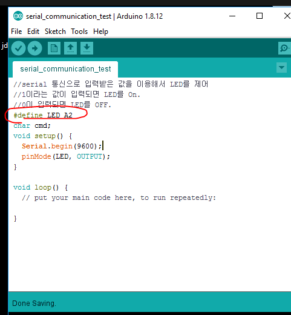
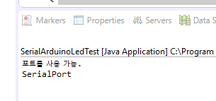
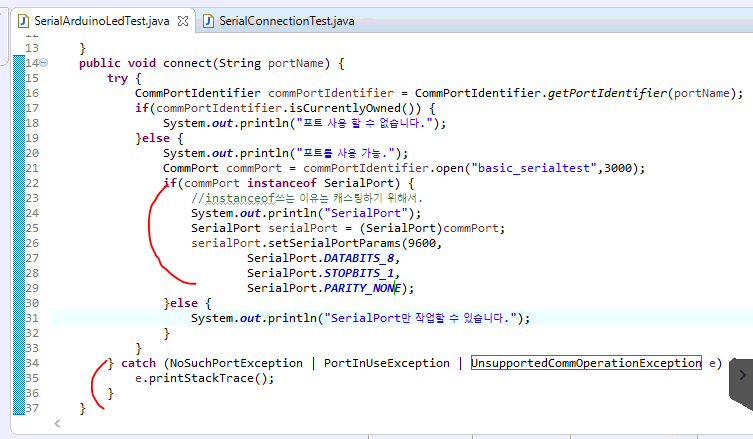
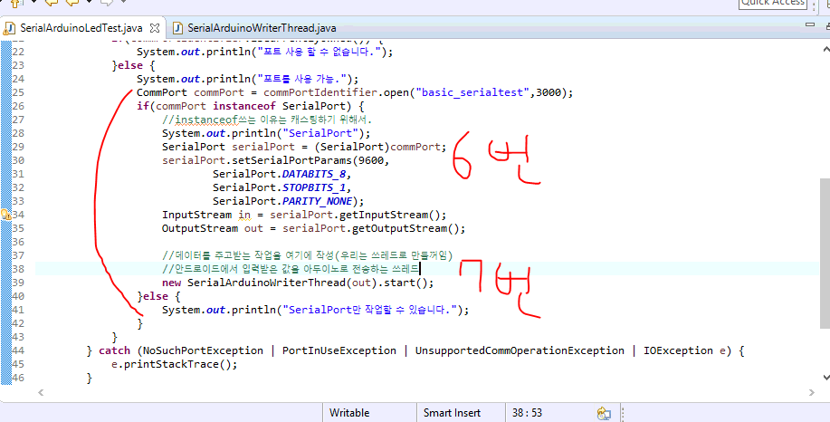
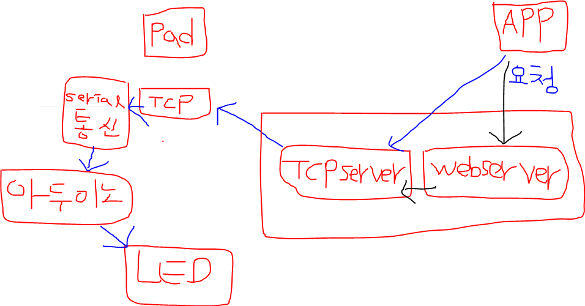
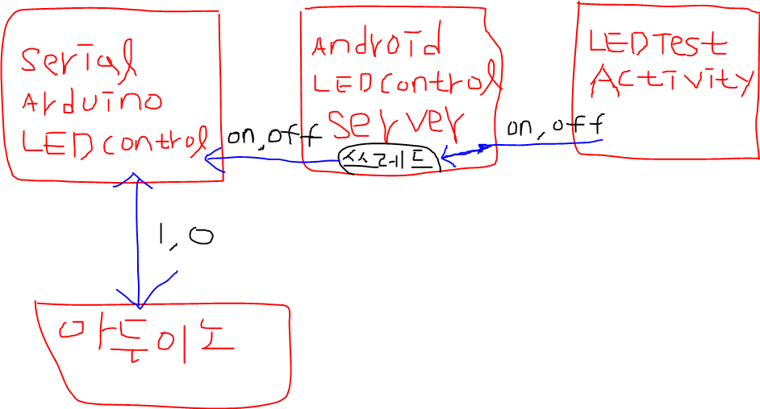

- c언어에서 define으로 변수를 정해주면 세미콜론 안씀
  - LED = A2랑 같은 의미



- serial 모니터에서 1을 입력하면 LED 켜지고 0을 입력하면 LED 꺼짐

```
//serial 통신으로 입력받은 값을 이용해서 LED를 제어
//1이라는 값이 입력되면 LED를 On.
//0이 입력되면 LED를 OFF.
#define LED A2
char cmd;
void setup() {
  Serial.begin(9600);
  pinMode(LED, OUTPUT);
}

void loop() {
  if(Serial.available()>0){
    cmd = Serial.read();
    if(cmd=='1'){
      digitalWrite(LED,HIGH);
    }else if(cmd=='0'){
        digitalWrite(LED,LOW);
      }
   }
}
```

- 이제부터는 시리얼모니터가 아니라 자바프로그램에서 들어오는 거를 통해서 제어할꺼임.
  - 아두이노의 시리얼 모니터를 열어둔 상태에서 이클립스에서 자바 프로그램을 실행하면 에러남
    - 시리얼 모니터가 라떼판다랑 통신하고 있는 상태이기 때문임.

# 시리얼 통신

1. commPortIdentifier를 포트의 유효성과 통신가능 상태인지 점검

2. commPortIdentifier의 open메소드를 이용해서 시리얼 통신을 할 수 있는 준비상태로 셋팅

   => 시리얼 통신을 하기 위해 필요한 포트객체(CommPort)가 리턴 

3. CommPort는 종류가 2가지
   - serial
   - Paralel

- CAN통신은 Serial통신, 아두이노와 라떼판다도 Serial통신
  - 각 상황에 맞는 CommPort객체를 얻어야 작업할 수 있다.

4. CommPort를 SerialPort로 캐스팅

5. SerialPort객체의 setSerialPortParams메소드를 이용해서 Serial통신을 위한 기본내용을 설정

   serialPort.setSerialPortParams(9600, ----------> Serial port의 통신속도(아두이노 시리얼 모니터 아래랑 동일)
   							SerialPort.DATABITS_8,---------> 전송하는 데이터의 길이
   							SerialPort.STOPBITS_1,---------> stop bit를 쓴다는 의미
   							SerialPort.PARITY_NONE);-----> PARITY비트를 사용하지 않겠다고 설정

   ​																					PARITY비트 = 오류를 검증하기 위한 비트임.

   *** 여기까지가 Serial포트를 open하고 설정을 잡아놓은 상태임 ***

   *** 전달되는 데이터(data frame)를 받을 수 있는 상태 ***

6. 데이터를 주고 받을 수 있도록 SerialPort객체에서 Input/Output스트림을 얻는다.

   => 바이트 단위(io클래스관점)로 데이터가 송수신되므로 Reader,Writer계열의 스트림을 사용할 수 없고 InputStream, OutputStream객체를 사용해야 한다.

   시리얼포트객체.getInputStream()

   시리얼포트객체.getOutputStream() 

7. 데이터 수신과 송신에 대한 처리

   1) 쓰레드로 처리

   2) 이벤트에 반응하도록 처리

``` SerialArduinoLedTest
위의 1,2,3번 내용 코드
package basic;

import gnu.io.CommPort;
import gnu.io.CommPortIdentifier;
import gnu.io.NoSuchPortException;
import gnu.io.PortInUseException;
import gnu.io.SerialPort;

public class SerialArduinoLedTest {
	public SerialArduinoLedTest() {
		
	}
	public void connect(String portName) {
		try {
			CommPortIdentifier commPortIdentifier = CommPortIdentifier.getPortIdentifier(portName);
			if(commPortIdentifier.isCurrentlyOwned()) {
				System.out.println("포트 사용 할 수 없습니다.");
			}else {
				System.out.println("포트를 사용 가능.");
				CommPort commPort = commPortIdentifier.open("basic_serialtest",3000);
				if(commPort instanceof SerialPort) {
					//instanceof쓰는 이유는 캐스팅하기 위해서.
					System.out.println("SerialPort");
				}else {
					System.out.println("SerialPort만 작업할 수 있습니다.");
				}
			}
		} catch (NoSuchPortException | PortInUseException e) {
			e.printStackTrace();
		}
	}
	public static void main(String[] args) {
		new SerialArduinoLedTest().connect("COM8");
	}

}
```

- 위의 코드 결과



``` SerialArduinoLedTest
위의 4,5번 내용 코드 추가한거
package basic;

import gnu.io.CommPort;
import gnu.io.CommPortIdentifier;
import gnu.io.NoSuchPortException;
import gnu.io.PortInUseException;
import gnu.io.SerialPort;
import gnu.io.UnsupportedCommOperationException;

public class SerialArduinoLedTest {
	public SerialArduinoLedTest() {
		
	}
	public void connect(String portName) {
		try {
			CommPortIdentifier commPortIdentifier = CommPortIdentifier.getPortIdentifier(portName);
			if(commPortIdentifier.isCurrentlyOwned()) {
				System.out.println("포트 사용 할 수 없습니다.");
			}else {
				System.out.println("포트를 사용 가능.");
				CommPort commPort = commPortIdentifier.open("basic_serialtest",3000);
				if(commPort instanceof SerialPort) {
					//instanceof쓰는 이유는 캐스팅하기 위해서.
					System.out.println("SerialPort");
					SerialPort serialPort = (SerialPort)commPort;
					serialPort.setSerialPortParams(9600,
							SerialPort.DATABITS_8,
							SerialPort.STOPBITS_1,
							SerialPort.PARITY_NONE);
				}else {
					System.out.println("SerialPort만 작업할 수 있습니다.");
				}
			}
		} catch (NoSuchPortException | PortInUseException | UnsupportedCommOperationException e) {
			e.printStackTrace();
		}
	}
	public static void main(String[] args) {
		new SerialArduinoLedTest().connect("COM8");
	}

}

```

- 코드 추가한거



```SerialArduinoLedTest
6번내용 코드 추가한거
package basic;

import java.io.IOException;
import java.io.InputStream;
import java.io.OutputStream;

import gnu.io.CommPort;
import gnu.io.CommPortIdentifier;
import gnu.io.NoSuchPortException;
import gnu.io.PortInUseException;
import gnu.io.SerialPort;
import gnu.io.UnsupportedCommOperationException;

public class SerialArduinoLedTest {
	public SerialArduinoLedTest() {
		
	}
	public void connect(String portName) {
		try {
			CommPortIdentifier commPortIdentifier = CommPortIdentifier.getPortIdentifier(portName);
			if(commPortIdentifier.isCurrentlyOwned()) {
				System.out.println("포트 사용 할 수 없습니다.");
			}else {
				System.out.println("포트를 사용 가능.");
				CommPort commPort = commPortIdentifier.open("basic_serialtest",3000);
				if(commPort instanceof SerialPort) {
					//instanceof쓰는 이유는 캐스팅하기 위해서.
					System.out.println("SerialPort");
					SerialPort serialPort = (SerialPort)commPort;
					serialPort.setSerialPortParams(9600,
							SerialPort.DATABITS_8,
							SerialPort.STOPBITS_1,
							SerialPort.PARITY_NONE);
					InputStream in = serialPort.getInputStream();
					OutputStream out = serialPort.getOutputStream();
					//데이터를 주고받는 작업을 여기에 작성(우리는 쓰레드로 만들꺼임)
					
				}else {
					System.out.println("SerialPort만 작업할 수 있습니다.");
				}
			}
		} catch (NoSuchPortException | PortInUseException | UnsupportedCommOperationException | IOException e) {
			e.printStackTrace();
		}
	}
	public static void main(String[] args) {
		new SerialArduinoLedTest().connect("COM8");
	}

}

```

```SerialArduinoWriterThread
7번내용 코드 추가한거
쓰레드 작성
package basic;

import java.io.IOException;
import java.io.OutputStream;

//키보드로 입력하는 값을 아두이노로 내보내기 위한 쓰레드 -> Serial통신
public class SerialArduinoWriterThread extends Thread{
	OutputStream out;
	
	
	public SerialArduinoWriterThread(OutputStream out) {
		super();
		this.out = out;
	}


	@Override
	public void run() {
		int ledstate=0;
		try {
			while( (ledstate = System.in.read())>-1) {//-1인 이유 = 더이상 입력받는게 없을때 -1임
				out.write(ledstate);
			}
		} catch (IOException e) {
			e.printStackTrace();
		}
	}
}

```

``` SerialArduinoLedTest
7번 내용 코드 추가
package basic;

import java.io.IOException;
import java.io.InputStream;
import java.io.OutputStream;

import gnu.io.CommPort;
import gnu.io.CommPortIdentifier;
import gnu.io.NoSuchPortException;
import gnu.io.PortInUseException;
import gnu.io.SerialPort;
import gnu.io.UnsupportedCommOperationException;

public class SerialArduinoLedTest {
	public SerialArduinoLedTest() {
		
	}
	public void connect(String portName) {
		try {
			CommPortIdentifier commPortIdentifier = CommPortIdentifier.getPortIdentifier(portName);
			if(commPortIdentifier.isCurrentlyOwned()) {
				System.out.println("포트 사용 할 수 없습니다.");
			}else {
				System.out.println("포트를 사용 가능.");
				CommPort commPort = commPortIdentifier.open("basic_serialtest",3000);
				if(commPort instanceof SerialPort) {
					//instanceof쓰는 이유는 캐스팅하기 위해서.
					System.out.println("SerialPort");
					SerialPort serialPort = (SerialPort)commPort;
					serialPort.setSerialPortParams(9600,
							SerialPort.DATABITS_8,
							SerialPort.STOPBITS_1,
							SerialPort.PARITY_NONE);
					InputStream in = serialPort.getInputStream();
					OutputStream out = serialPort.getOutputStream();
					
					//데이터를 주고받는 작업을 여기에 작성(우리는 쓰레드로 만들꺼임)
					//안드로이드에서 입력받은 값을 아두이노로 전송하는 쓰레드
					new SerialArduinoWriterThread(out).start();
				}else {
					System.out.println("SerialPort만 작업할 수 있습니다.");
				}
			}
		} catch (NoSuchPortException | PortInUseException | UnsupportedCommOperationException | IOException e) {
			e.printStackTrace();
		}
	}
	public static void main(String[] args) {
		new SerialArduinoLedTest().connect("COM8");
	}

}

```



- 위 처럼 코드짜고 1이나 0 누르고 엔터 누르면 LED가 켜지고 꺼짐.


## 안드로이드로 LED컨트롤






- 라떼판다에 TCP서버를 구동해놓고 안드로이드 앱에서 LED제어.
  - 앱을 실행하면 TCP서버와 연결. LED를 키면 데이터 1이 서버로 전송
  - 서버입장에서는 언제 LED를 킬지 모르니까 쓰레드에서 리스닝을 하면됨.

- 라떼판다의 이클립스(서버)

``` AndroidLEDControlServer
package androidLEDControl;

import java.io.IOException;
import java.net.ServerSocket;
import java.net.Socket;

import basic.SerialArduinoLedTest;
//안드로이드(클라이언트)의 요청을 받으면 차 안에서 장치와 통신하는 시리얼통신 객체 쪽으로 요청을 전달하는 서버
public class AndroidLEDControlServer {
	private ServerSocket server;
	
	
	public void connect() {
		try {
			server = new ServerSocket(12345);//12345포트로 서버를 열었음
			
			
		} catch (IOException e1) {
			e1.printStackTrace();
		}
		Thread th = new Thread(new Runnable(){
			@Override
			public void run() {
				while(true){
					try {
						Socket client = server.accept();//서버를 리스닝 시켜놓은 코드.
						String ip = client.getInetAddress().getHostAddress();
						System.out.println(ip+"사용자접속!!\n");
						//ReceiverThread => 클라이언트의 요청을 계속 읽고 있는 쓰레드(클라가 언제 LED버튼을 누를지 모르니까)
						new ReceiverThread(client).start();
					} catch (IOException e) {
						e.printStackTrace();
					}
				}
			}
		});
		th.start();
	}
	public static void main(String[] args) {
		new AndroidLEDControlServer().connect();
	}

}

```

```ReceiverThread
package androidLEDControl;

import java.io.BufferedReader;
import java.io.IOException;
import java.io.InputStreamReader;
import java.io.OutputStream;
import java.io.PrintWriter;
import java.net.Socket;
import java.security.PublicKey;

//TCP서버쪽에서 클라이언트의 요청을 계속 읽는 쓰레드
public class ReceiverThread extends Thread{
	Socket client;
	BufferedReader br; //클라이언트의 메시지를 읽는 스트림
	PrintWriter pw; //클라이언트에게 메시지를 전달하는 스트림
	SerialArduinoLedControl serialobj;
	OutputStream os; //시리얼통신에서 아두이노로 데이터를 내보내기 위한 스트림
	
	public ReceiverThread(Socket client) {
		this.client = client;
		//클라이언트가 보내오는 메시지를 읽기 위한 스트림생성
		try {
			br = new BufferedReader(new InputStreamReader(client.getInputStream()));
			//클라이언트에게 메시지를 전송하기 위한 스트림생성
			pw = new PrintWriter(client.getOutputStream(),true);
			//아두이노와 시리얼 통신을 하기 위해 아두이노로 데이터를 내보내기 위한 스트림
			serialobj = new SerialArduinoLedControl();
			serialobj.connect("COM8");
			os = serialobj.getOutput();
			
		} catch (IOException e) {
			e.printStackTrace();
		}
	}
	public void run() {
		//클라이언트의 메시지를 받아서 아두이노로 데이터를 전송
		while(true) {
			try {
				String msg = br.readLine();
				System.out.println("클라이언트가 보낸 메시지"+msg);
			} catch (IOException e) {
				e.printStackTrace();
			}
			
		}
	}
}
```

```SerialArduinoLedControl
package androidLEDControl;

import java.io.IOException;
import java.io.InputStream;
import java.io.OutputStream;

import gnu.io.CommPort;
import gnu.io.CommPortIdentifier;
import gnu.io.NoSuchPortException;
import gnu.io.PortInUseException;
import gnu.io.SerialPort;
import gnu.io.UnsupportedCommOperationException;
//아두이노와 통신이 목적인 클래스
public class SerialArduinoLedControl {
	OutputStream out;
	public SerialArduinoLedControl() {
		
	}
	public void connect(String portName) {
		try {
			CommPortIdentifier commPortIdentifier = CommPortIdentifier.getPortIdentifier(portName);
			if(commPortIdentifier.isCurrentlyOwned()) {
				System.out.println("포트 사용 할 수 없습니다.");
			}else {
				System.out.println("포트를 사용 가능.");
				CommPort commPort = commPortIdentifier.open("basic_serialtest",3000);
				if(commPort instanceof SerialPort) {
					//instanceof쓰는 이유는 캐스팅하기 위해서.
					System.out.println("SerialPort");
					SerialPort serialPort = (SerialPort)commPort;
					serialPort.setSerialPortParams(9600,
							SerialPort.DATABITS_8,
							SerialPort.STOPBITS_1,
							SerialPort.PARITY_NONE);
					InputStream in = serialPort.getInputStream();
					out = serialPort.getOutputStream();
					
					//데이터를 주고받는 작업을 여기에 작성(우리는 쓰레드로 만들꺼임)
					//안드로이드에서 입력받은 값을 아두이노로 전송하는 쓰레드
				}else {
					System.out.println("SerialPort만 작업할 수 있습니다.");
				}
			}
		} catch (NoSuchPortException | PortInUseException | UnsupportedCommOperationException | IOException e) {
			e.printStackTrace();
		}
	}
	//시리얼출력을 위한 필요한 OutputStream리턴
	public OutputStream getOutput() {
		return out;
	}
	public static void main(String[] args) {
		new SerialArduinoLedControl().connect("COM8");
	}

}
```

- 안드로이드 스튜디오 코드

```LedControlActivity
package multi.android.network.arduino;

import androidx.appcompat.app.AppCompatActivity;

import android.os.AsyncTask;
import android.os.Bundle;
import android.util.Log;
import android.view.View;

import java.io.BufferedReader;
import java.io.IOException;
import java.io.InputStream;
import java.io.InputStreamReader;
import java.io.OutputStream;
import java.io.PrintWriter;
import java.net.ServerSocket;
import java.net.Socket;
import java.net.UnknownHostException;

import multi.android.network.R;

public class LedControlActivity extends AppCompatActivity {
    AsyncTaskExam asyncTaskExam;
    InputStream is;
    InputStreamReader isr;
    BufferedReader br;
    Socket socket;
    OutputStream os;
    PrintWriter pw;

    @Override
    protected void onCreate(Bundle savedInstanceState) {
        super.onCreate(savedInstanceState);
        setContentView(R.layout.activity_led_control);
        asyncTaskExam = new AsyncTaskExam();
        asyncTaskExam.execute(10,20);
    }
    public void send_msg(final View view){
       new Thread(new Runnable() {
           String message = "";
           @Override
           public void run() {
               if (view.getId()==R.id.btn_led_on){
                    message = "led_on";
               }else{
                   message = "led_off";
               }
               //서버로 메시지 전송
               pw.println(message);
               pw.flush();
           }
       }).start();
    }
    class AsyncTaskExam extends AsyncTask<Integer,String,String> {
        @Override
        protected String doInBackground(Integer... integers) {
            try {
                //서버와 연결, 서버에 데이터 주기, 서버에서 데이터 받기 모두 쓰레드로 돌려야함
                socket = new Socket("70.12.226.160", 12345);//서버에 접속하는 코드
                if (socket != null) {
                    ioWork();
                }
                //서버에서 전달되는 메시지를 읽는 쓰레드
                Thread t1 = new Thread(new Runnable() {
                    @Override
                    public void run() {
                        while (true) {
                            String msg;
                            try {
                                msg = br.readLine();
                                Log.d("chat", "서버로 부터 수신된 메시지>>"
                                        + msg);
                            } catch (IOException e) {

                            }
                        }
                    }
                });
                t1.start();
            } catch (UnknownHostException e) {
                e.printStackTrace();
            } catch (IOException e) {
                e.printStackTrace();
            }
            return "";
        }
         void ioWork(){
            try {
                is = socket.getInputStream();
                isr = new InputStreamReader(is);
                br = new BufferedReader(isr);

                os = socket.getOutputStream();
                pw = new PrintWriter(os,true);
            } catch (IOException e) {
                e.printStackTrace();
            }
        }
    }

    @Override
    //액티비티가 꺼질 때 소켓 닫는 메소드
    protected void onDestroy() {
        super.onDestroy();
        try {
            socket.close();
        } catch (IOException e) {
            e.printStackTrace();
        }
    }

}
```

```activity_led_control.xml
<?xml version="1.0" encoding="utf-8"?>
<LinearLayout xmlns:android="http://schemas.android.com/apk/res/android"
    xmlns:app="http://schemas.android.com/apk/res-auto"
    xmlns:tools="http://schemas.android.com/tools"
    android:layout_width="match_parent"
    android:layout_height="match_parent"
    android:orientation="vertical"
    tools:context=".arduino.LedControlActivity">
    <Button
        android:id="@+id/btn_led_on"
        android:layout_width="match_parent"
        android:layout_height="wrap_content"
        android:onClick="send_msg"

        android:text="LED켜기" />

    <Button
        android:id="@+id/btn_led_off"
        android:layout_width="match_parent"
        android:layout_height="wrap_content"
        android:onClick="send_msg"
        android:text="LED끄기" />
</LinearLayout>
```

### 결과

- 아두이노에서 serial_communication_test를 업로드

  - ```serial_communication_test
    //serial 통신으로 입력받은 값을 이용해서 LED를 제어
    //1이라는 값이 입력되면 LED를 On.
    //0이 입력되면 LED를 OFF.
    #define LED A2
    char cmd;
    void setup() {
      Serial.begin(9600);
      pinMode(LED, OUTPUT);
    }
    
    void loop() {
      if(Serial.available()>0){
        cmd = Serial.read();
        if(cmd=='1'){
          digitalWrite(LED,HIGH);
        }else if(cmd=='0'){
            digitalWrite(LED,LOW);
          }
       }
    }
    ```

- 이클립스에서 AndroidLEDControlServer 실행
- 안드로이드 LedControlActivity 실행