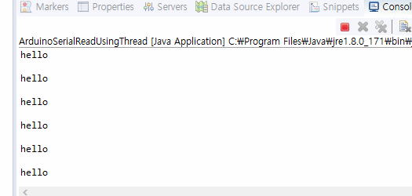

## Serial통신

- 쓰레드 작업

- 

- 아두이노에 시리얼 코드 작성

```serial_output
void setup() {
  Serial.begin(9600);
}

void loop() {
  Serial.println("hello");
  Serial.flush();
  delay(1000);
}
```

- 이클립스에서 아두이노꺼 시리얼 출력인 "hello"를 읽기
  - 아두이노가 hello를 1초에 한 번씩 내보내고 이클립스에서는 이거를 읽음.

```ArduinoSerialReadUsingThread
package serial.read;

import java.io.IOException;
import java.io.InputStream;
import java.io.OutputStream;

import basic.SerialArduinoWriterThread;
import gnu.io.CommPort;
import gnu.io.CommPortIdentifier;
import gnu.io.NoSuchPortException;
import gnu.io.PortInUseException;
import gnu.io.SerialPort;
import gnu.io.UnsupportedCommOperationException;
//아두이노에 시리얼로 작성한 코드를 이클립스에서 읽을 수 있음
//센서 장치에 있는 데이터를 뺄 때 이 방법을 쓰자
public class ArduinoSerialReadUsingThread {
	public static void main(String[] args) {
		try {
			CommPortIdentifier commPortIdentifier = CommPortIdentifier.getPortIdentifier("COM8");//어떤 포트를 쓸껀지
			if(commPortIdentifier.isCurrentlyOwned()) {
				System.out.println("포트 사용 할 수 없습니다.");
			}else {
				System.out.println("포트를 사용 가능.");
				CommPort commPort = commPortIdentifier.open("basic_serialtest",3000);
				if(commPort instanceof SerialPort) {//시리얼 포트면 시리얼 포트 설정하기
					//instanceof쓰는 이유는 캐스팅하기 위해서.
					System.out.println("SerialPort");
					SerialPort serialPort = (SerialPort)commPort;
					serialPort.setSerialPortParams(9600,
							SerialPort.DATABITS_8,
							SerialPort.STOPBITS_1,
							SerialPort.PARITY_NONE);
					InputStream in = serialPort.getInputStream();//시리얼 포트에 인풋
					OutputStream out = serialPort.getOutputStream();//시리얼 포트에 아웃풋
					
					//Arduino를 통해서 반복해서 들어오는 데이터를 읽을 수 있도록 코드 작성 -> 쓰레드 처리
					Thread readThread = new Thread(new Runnable() {
						
						@Override
						public void run() {
							byte[] buffer = new byte[1024];//1024라는 버퍼 사이즈는 내맘대로 만든거
							int len=-11;
							try {
								while((len=in.read(buffer))!=-1) {
									//-1이 아닌 이상은 게속 반복해서 읽겠다.
									//읽은 데이터를 -1로 바꿔서 계속해서 출력하겠다.
									//byte단위로 오니까 버퍼에 쌓아놨다가 한번에 처리
									System.out.println(new String(buffer,0,len));
									Thread.sleep(1000);
								}
							}catch (IOException | InterruptedException e) {
								e.printStackTrace();
							}
						}
					});
					readThread.start();
							
				}else {
					System.out.println("SerialPort만 작업할 수 있습니다.");
				}
			}
		} catch (NoSuchPortException | PortInUseException | UnsupportedCommOperationException | IOException e) {
			e.printStackTrace();
		}
	}

}

```

- 결과
  - 1초에 한 번씩 hello가 이클립스 콘솔에 찍힘

