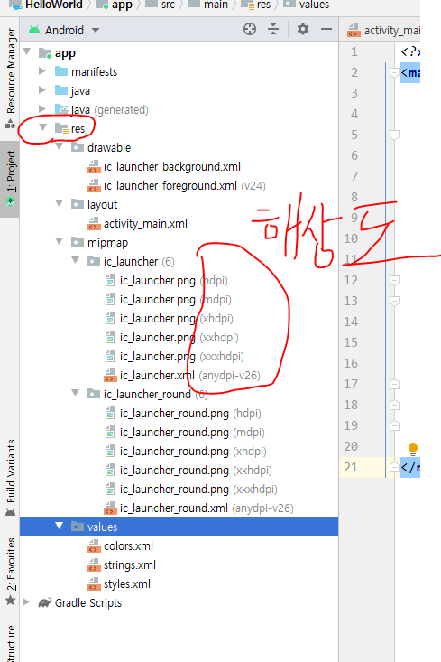
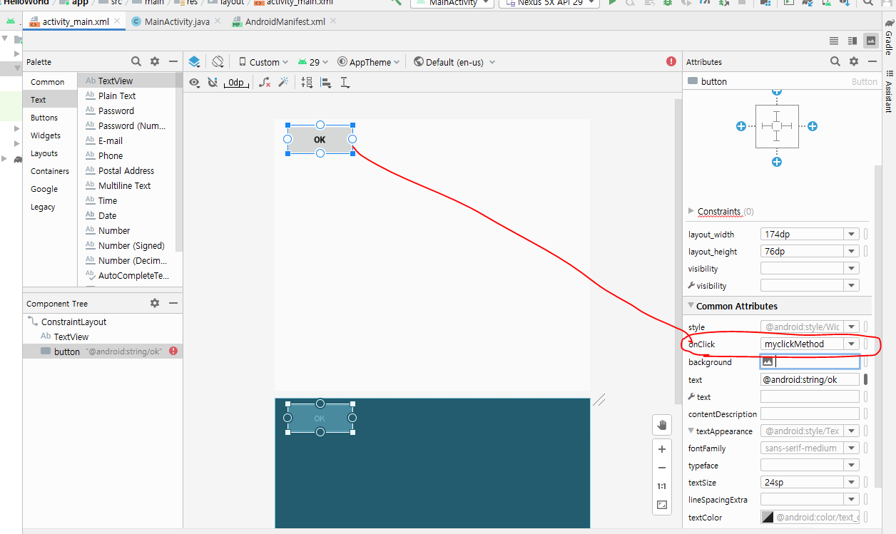
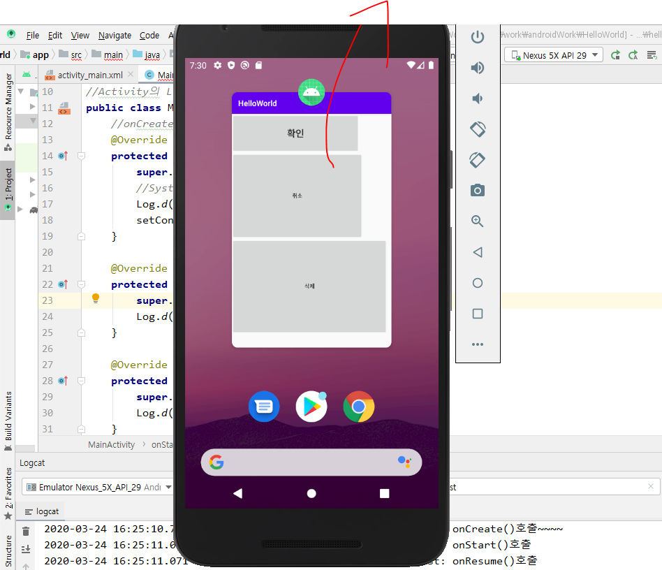

## 안드로이드의 특징

#### 컴포넌트 기반

- life cycle을  안드로이드 내부에서 관리한다. 안드로이드에서 다루는 대표적인 컴포넌트가 4개
  - Activity = 앱의 화면
  - Service = 화면없이 back 단에서 실행되는 것. 카톡에서의 메시지 알람이나 앱의 push알람 등. 눈에 보이지는 않지만 뭔가 계속 실행되고 있는 것
  - ContentProvider = A라는 앱에서 사용하는 데이터를 B라는 앱에서 사용할 수 있게 공유해줌.
  - BroadCastReceiver = 현재 핸드폰의 상태를 알려주는 역할.

***Intent = 하나의 컴포넌트에서 다른 컴포넌트들을 실행시켜줄 수 있는 객체*** 

#### 리소스의 외부화

- 리소스를 외부파일에 저장

  - 리소스 = 정적요소들 -> 문자열, 이미지, 화면 디자인 등

  - R.java라는 파일에 모든 리소스에 대한 정보를 저장 -> 이게 외부화임.

- 유지보수 GOOD. 

- 안드로이드는 java와 코틀린 언어로 개발할 수 있음.

- 안드로이드에서는 sysout안하고 Logcat에 작업할꺼
  - 로그기록

- 상속을 받고 있다. = 스펙이 정해져 있다 = life cycle을 내가 관리하는게 아니고 안드로이드 내부에서 관리한다.
  - onCreate는 반드시 호출되어야하는 메소드임.
  - 내가 만들 앱의 이름인 HelloWorld가 어디에도 없다. 

- 아래 동그라미가 나의 앱임

- 에물레이터 미리보기 화면

- TextView = display

- 아래 사진처럼 텍스트 수정 가능

- 아래 화면에서 우클릭 -> Run MainActivity
  - 에뮬레이터 업로드

- 아래 사진은 내 앱에 대한 설명서
  - 아이콘 이미지, 앱의 이름 등...

- 아래는 자동으로 만들어지는 파일이라서 우리가 만들면 안됨.

- 아래는 리소스를 관리하는 폴더임
  - layout은 화면 디자인에 관련된 파일

- 해상도에 따라 이미지가 분류됨.

- 자바 파일이 있는 위치.

- 에러가 있는지 이벤트를 받았는지 등 정보가 떠있다.

- 미리보기 화면

- 버튼이 생김
  - 이벤트 Driven방식으로 코드가 작성된거

[실습]

- 새로운 프로젝트 작성
  - App명 : firstPro
  - package: exam.day01.first
  - 프로젝트명 : firstPro
  - 화면에 표시된 레이블을 지우고 버튼 세개를 추가
    - 확인, 취소, 삭제
  - 글꼴 변경
  - avd에 실행해보기

- 아래처럼 화살표로 연결해줘야 버튼 세개가 다 보임

- 버튼 클릭했을 때 뭔가를 실행시키기
  - 이 메소드를 작성해줘야 onClick이 생김.
  - 매개변수는 Button의 상위타입인 View로
  - Toast는 안드로이드에서의 메시지 (alert)
    - Toast.LENGTH_LONG은 버튼을 눌렀을 때 긴 시간동안 메시지를 띄워놓는 것.
    - Toast.LENGTH_SHORT는 버튼을 눌렀을 때 긴 짧은시간동안 메시지를 띄워놓는 것.

- logcat보기
  - 찾기가 어려움 그래서 sysout과 같은 역할을 하는 Log를 쓸꺼임
  - 아래는 sysout을 쓴거

- 아래는 Log로 한거
  - test는 내가 작성한 메시지인 onCreate()호출~~~ 에 달리는 태그명이다.

- 아래처럼 test라는 태그명으로 찾을 수 있음.

- 상단에 Code -> override method
  - 아래처럼 메소드 추가가능

- 위 처럼 아래메소드들 다 만들어주자

- 실행시켰을 때 create, start, resume 세개만 자동 호출됨
  - create -> start -> resume순서대로 호출됨.

- 아래 사진의 네모 누르니까 Pause와Stop이 호출됨. (일시정지 구간)
  - Pause -> Stop
    - 이 상태에서 다시 앱 실행시키면 start -> resume

- 아래처럼하니까 창을 지우니까 Destroy()가 호출됨

