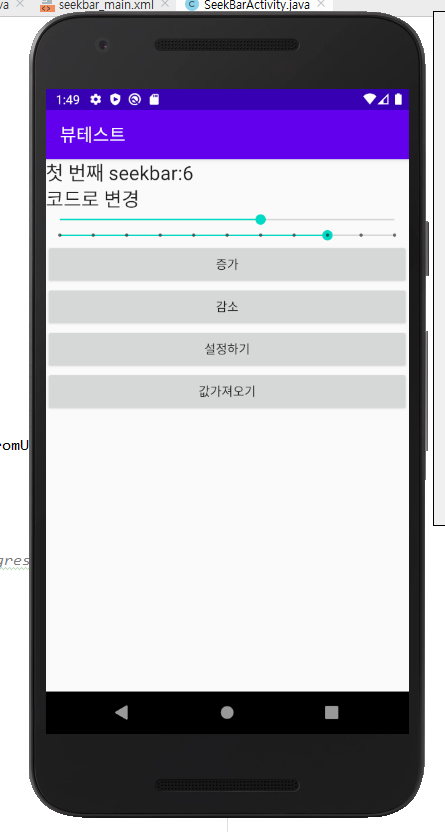
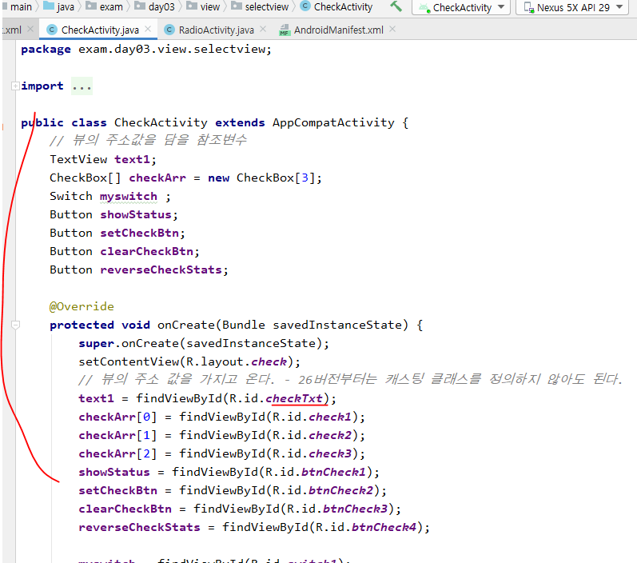
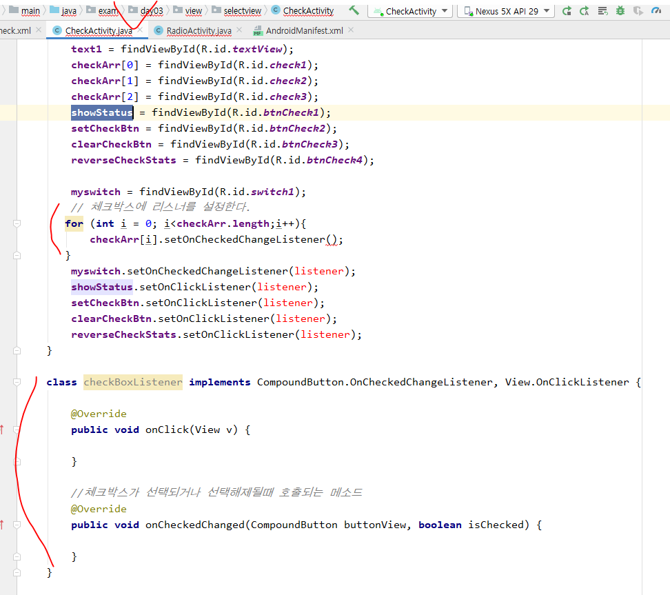
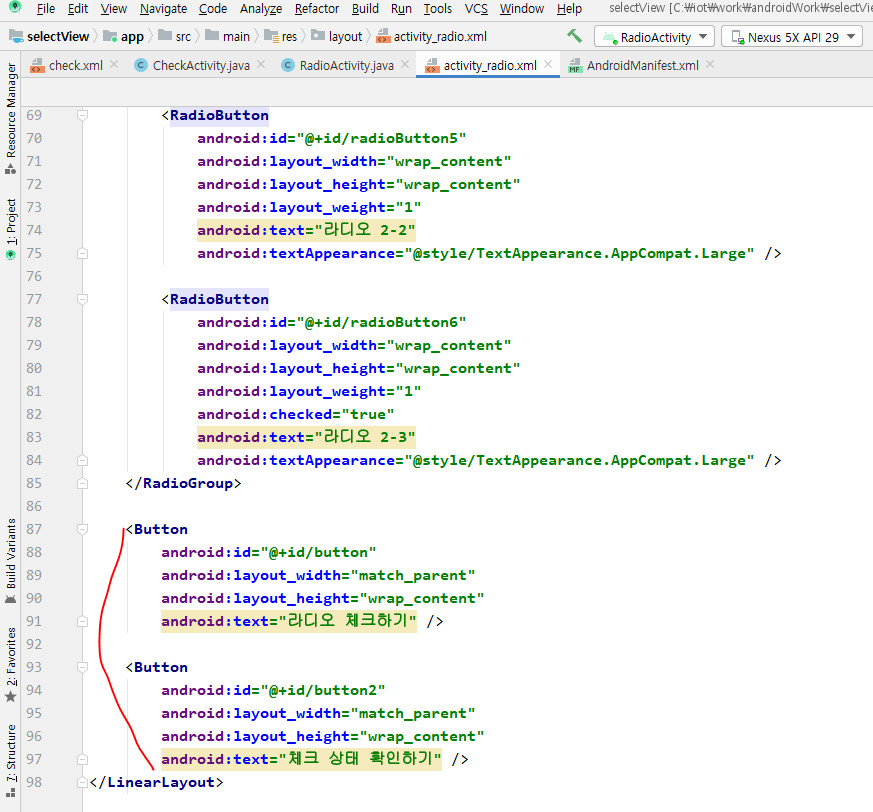
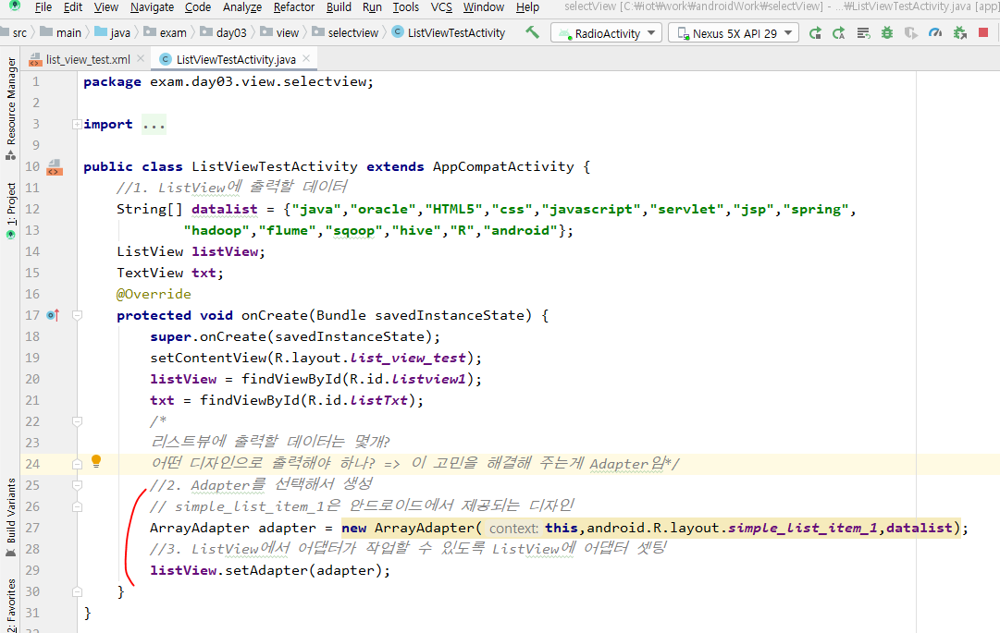
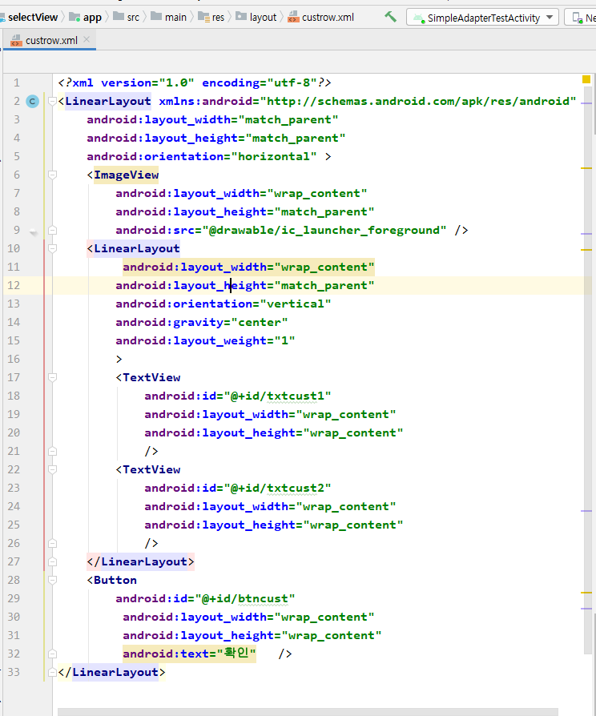

# Progress Bar

***모든 액티비티는 manifests파일에 올려줘야 함. 실습중에는 사용할 액티비티만 올려놓을꺼***

- style = @style/Widget.AppCompat.ProgressBar.Horizontal
  - max = 100 ->100을 하나로 보겠다.
  - progress = 30 -> 30%진행

- 위의 코드에 아래 코드 추가해서 버튼과 onClick연결해주기
  - xml에서 onclick써서 해줘도 되는데 지금은 버그때문에 아래처럼해준거임.

## SeekBar

- seekBar는 진행상황을 표현해주는 것.

- 두번째꺼 seekBar의 max와 progress를 10과 5로 설정 후 버튼 4개 만들어주기

- ProgressBar처럼 익명inner클래스로 이벤트를 만드는 방식이 아니고 implements로 이벤트 만들어주기.

- 스위치함수로 버튼 1,2,3,4가 눌렸을 때 어떻게 작동할 지 

- 버튼을 눌렀을땐 코드로변경이라고 뜸. 
  - 첫 번째 seekbar: ? -> 물음표 자리는 위의 코드에서 progress에 나오는 값임. progress에서 60% 자리에 있다고 생각하면 될듯?
  - 내가 직접 마우스로 progressBar를 움직이면 사용자가 변경이라고 뜸.

- 프로그래스 바를 터치시작과 종료할 때

- 아래 동그라미를 누르면 첫 번째 SeekBar를 터치 시작이라는 내용이 뜸. 눌렀던거를 놓으면 터치 종료가 뜸

# etc

- DatePicker

- CalendarView
  - 스케줄 등록, 알람등록 등...

- 이제 뷰 테스트 프로젝트는 끝. selectView 프로젝트 시작

# 체크박스

- if 문 써서 체크상태에 따라 판단해주는 코드를 꼭 짜줘야함. 위에처럼 체크박스를 하나씩 만들면 if~else문이 계속 생겨서 코드가 길어질 것. 그래서 원래는 그룹핑해서 관리해줘야함.
  - 아직 그룹핑 안 배웠으니까 배열로 관리.

- 체크상태 확인하기

- 체크상태 설정, 해제, 변경

- onCheckedChanged

- 스위치 on/off했을 때 Toast띄우기

- 체크박스 on/off했을 때 Toast띄우기

- 이제 아래 메소드를 호출하는 것과 index를 어떻게 for문을 안쓰고 해줄지 고민만 해주면 된다.
  - index = 몇번째 체크박스인지

- 이제 index를 어케줄지만 생각해보면 됨

- 위 처럼 tag를 해주면 아래처럼 getTag써줄 수 있음

- 그래서 아래처럼 display메소드의 매개변수에 적용해주자

# Radio(한 그룹에서 하나만 선택)

# 리스트 뷰(리사이클러뷰 이전 꺼)

- 문자메시지 리스트, 카톡 채팅방 리스트 등...
- Adapter 객체 = > 아래 세개를 묶은 것.
  - TextView, ListView
  - Data(Arraylist)
    - ListView에 뿌려질 데이터 
  - Design(안드로이드에서 제공, 사용자정의)
    - 데이터를 어떤식으로 뿌릴지. row하나에 대한 디자인임. 어차피 디자인해놓은 row하나가 계속 반복될 꺼라서.

- 아래의 코드가 모든 리스트 뷰의 기본 코드임

- 아래처럼 목록이 뜸. 스크롤이 자동으로 만들어짐

- 선택하는거 뽑아내는 작업

## 리소스 데이터를 활용할 꺼임.

- values에서 배열을 관리할 수 있음 -> 정적 리소스 관리 (한번 연결되면 변경되지 않는 데이터들)
  - values 우클릭 -> new -> values resource file

## SimpleAdapter(두 줄 텍스트)

- 두줄 텍스트니까 해쉬맵, 여러개를 담아야 하니까 ArrayList

- 두 줄 처리할 때 사용하는 것이 SimpleAdapter임.

###  안드로이드에서 제공하는 레이아웃을 썼는데 이번엔 내가 만든 레이아웃을 써보자

- 내 맘대로 뷰를 만들긴 했는데 확인을 눌렀을 때 발생하는 개별적인 이벤트는 안됨.

- 근데 위의 Adapter로 한거는 단점이 좀 있음. 카톡 채팅방 목록 같은경우를 생각하면 프로필 사진, 채팅방 이름 등 데이터 타입이 다른게 있음. 이 경우를 만져줘야 하는데 Adapter는 내부에서 스스로 일을 처리하기 때문에 개발자가 만질 수 없음. 그리고 위의 사진에서 확인버튼 누를 때 어떤 이벤트를 발생시켜주고 싶은데 마찬가지로 Adapter내부에서 일을 처리하기 때문에 개발자가 이벤트를 붙일 수 없음.
  - 따라서 Adapter를 커스터마이징 해줘야 한다.