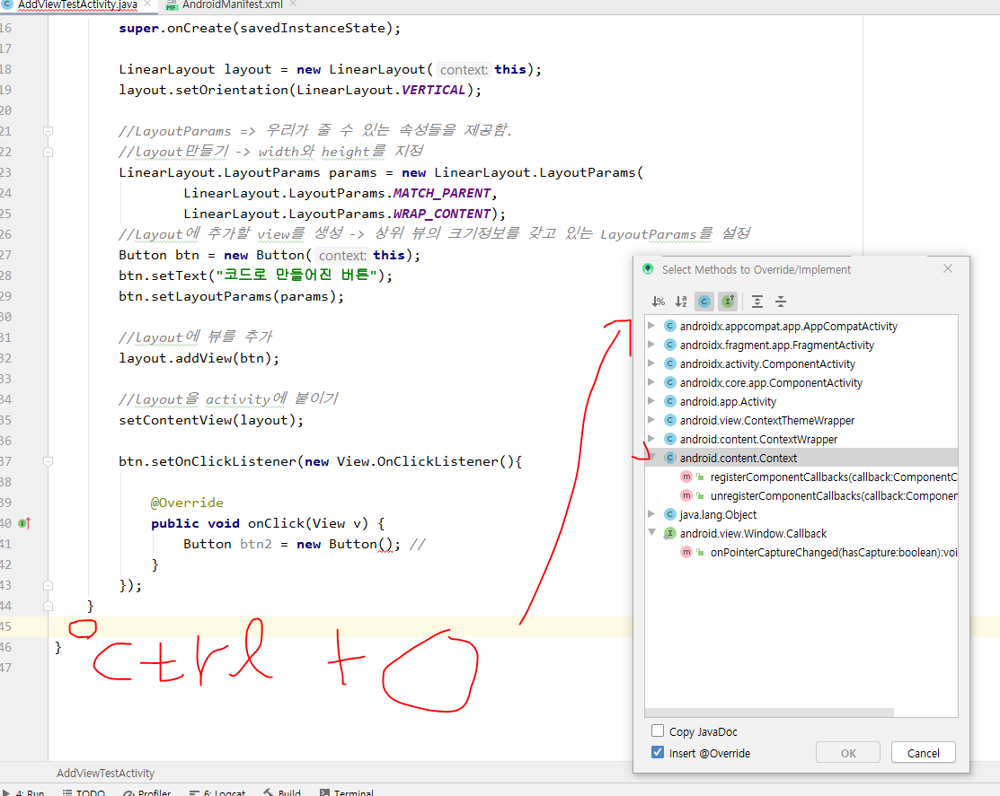
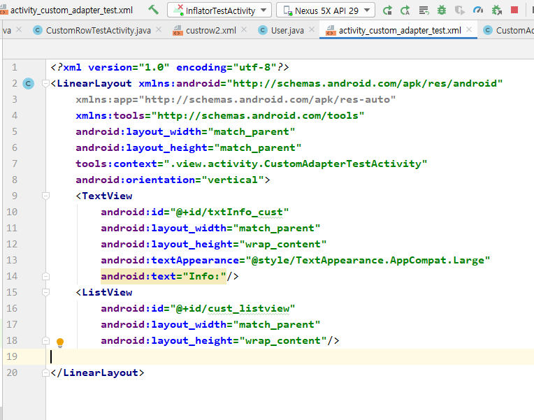
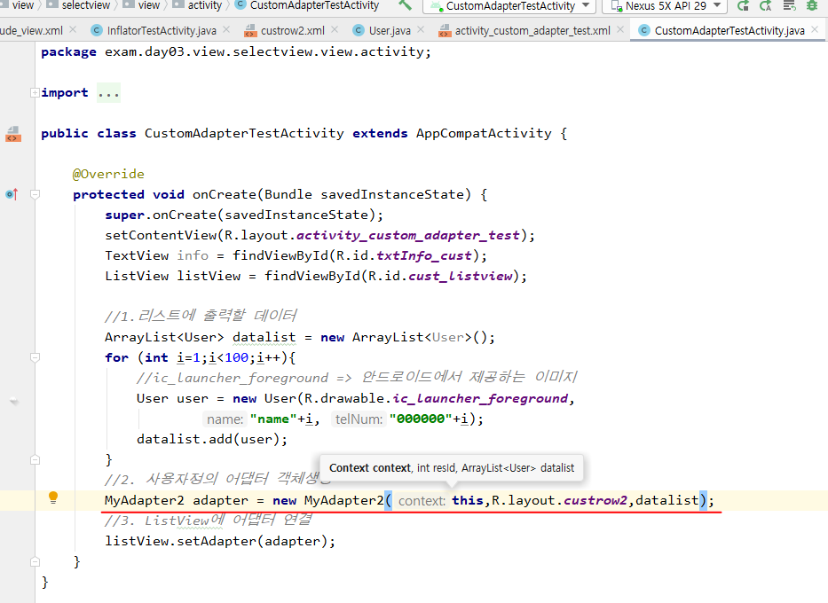

# 인플레이션

- 인플레이션
  - XML 레이아웃의 내용이 메모리에 객체화되는 과정

- setContentView() 가 xml을 레이아웃에 뿌려주는 코드
- 패키지 만들어서 커스터마이징 할 것들을 묶어서 보관할 수 있다.

- view 패키지 안에 activity패키지 만듬

- 아래 과정으로 파일들을 패키지로 옮길 수도 있음.

### 인플레이션 하기 전에 코드로 레이아웃 작성해보기

- params의 첫번째 항은 width, 두 번째 항은 height

- 안드로이드에서는 문자열을 CharSequence라고 함

- 코드 버튼 누를때마다 이벤트 객체가 생성됨.

- 그런데 위 처럼 사용하기 보다는 보통 인플레이션을 이용해서 작업한다.

## Inflator

- 뷰 추가하기 버튼을 누르면 추가된 버튼1,2가 한번만 만들어짐
  - activity_inflator_test/xml에 include_view.xml을 붙였음.

## Adapter 커스터마이징

- 사용자정의 Adapter만들기
  - 안드로이드에서 앱을 구성할 때 목록형식을 가장 많이 사용함
  - 사용자정의로 디자인한 뷰를 목록으로 사용하고 싶은 경우
  - 안드로이드 내부에서 제공하는 Adapter로 표현하고 싶은 내용을 모두 표현할 수 없다.(이벤트연결 또는 각 목록의 구성을 다르게 만들다던가)

[구성요소]

1. 뷰 안에서 목록의 구성이 다르다(사진, 문자열 등) 그래서 Adapter를 이용해서 출력할 데이터를 저장하는 객체가 필요함

2. 사용자정의 Adapter

   1) 안드로이드에서 제공하는 Adapter클래스를 상속

   ​	-> 리스트뷰를 만들때 필요한 정보를 저장할 수 있도록 멤버변수 정의(Context,row디자인 리소스, 데이터)

   2) 생성자 정의

   ​	-> 상속받고 있는 ArrayAdapter의 생성자 호출

   3) ArrayAdapter에 정의되어 있는 메소드를 오버라이딩

   ​	-> getView : 리스트뷰의 한 항목이 만들어질 때마다 호출

   ​			-> 전달된 리소스를 이용해서 뷰를 생성(LayoutInflator)

   ​			-> 한 row를 구성하는 뷰를 찾아서 데이터와 연결

   4) getView메소드를 성능개선을 위한 코드를 작성

   ​	-> 한 번 생성한 view를 재사용

   ​	-> findViewById는 한 번만 찾아오기

   5) ViewHolder객체를 생성

   ​	-> 역할 : row를 구성하는 뷰를 한번 findViewById하기

   ​	-> row에 대한 구성 View를 멤버변수로 선언

   ​	-> 생성자에서 findViewById처리를 구현

   ​	-> 최초로 뷰를 만들때(row에 대한 뷰) 이 객체를 생성해서 활용

   6) row를 구성하는 뷰에 상태값을 저장하기

   ​	-> 각 뷰의 이벤트를 통해 저장

   ​	-> 각 뷰의 상태값을 저장할 수 있도록 객체 생성

   ​			-> 상태값을 저장한 객체를 자료 구조에 저장, focus를 잃어버릴 때 상태를 저장.

   ​			

3. Adapter를 통해 만들어진 리스트뷰를 보여줄 액티비티

   --> main layout필요

#### 구성요소 1. 

- DTO와 비슷한 느낌(java클래스)

- 우클릭 -> generate -> constructor

***카톡채팅내용은 서버에 저장됨(양방향이니까), 문자메세지는 내 폰에(로컬)저장됨.***

#### 구성요소 2

- 멤버변수 정의

- getView는 row를 하나 만들 때 마다 호출되는 메소드
  - ctrl + O 눌러서 아래 세개 만들기

- 이제 내가만든 어댑터의 객체를 생성해주고 메인 레이아웃에 연결시켜주자

#### 구성요소 3

#### 결과

- 지금 100개를 만들어서 에뮬레이터를 밑으로 내리면 getView되는 번호가 계속 바뀌면서 호출한다. -> 성능에 대한부분을 개선해줘야함.

- 어댑터는 데이터 테이블이랑 한 row에 대한 디자인을 입력받아서 ListView에 찍어내는 역할. 이때 ListView의 한 row는 getView가 찍어냄
  - 한 row에 대한 디자인을 위해 데이터 테이블에 저장되어있는것을 하나씩 꺼내서 찍어내야함.
    - 이거를 getView에서 함.
    - 위의 사진은 데이터를 연결을 안했기 때문에 에뮬레이터에 아무것도 안보이는 거임.

- 각 요소에 데이터를 연결하기
  - 각 요소를 찾아와야함. convertView에 저장되어 있음.

- 근데 Logcat을 보면 에뮬레이터의 화면이 바뀔때마다 계속 view를 찍어냄 -> 개선해야함.

#### 성능 개선 버전

- 위 처럼 해주면 수행 속도가 더 빨라짐.
- 지금까지는 계속 findViewById를 해서 데이터를 가져왔음. 이제 findViewById를 해서 찾아온 데이터를 어딘가에 저장시켜놓고 필요할 때 가져와서 쓰자

#### 뷰 홀더 만들기

- 아래처럼 findViewById하는 작업을 하는 뷰 홀더를 만들고 디자인 할 한 row에 뷰 홀더를 붙인다.

#### row를 구성하는 뷰에 상태값 저장

- 이거 처리 안해주면 에뮬레이터에 이상한 값들이 저장됨.
- 상태값을 작성하고 포커스를 바꿀 때 상태값을 저장할꺼임.

- 자료구조에 저장하려면 row넘버와 데이터를 같이 저장해줘야함.

- 이제 2번이랑 5번에 완료라고 상태값을 작성하면 에뮬레이터 스크롤을 내리고 올려도 그대로 저장되어 있음
  - 이거 해주기 전에는 2번이랑 5번에 글을 썼을 때 잘 저장이 안되거나 다른 위치에도 글이 쓰여졌음.

***이너클래스 => 클래스 안의 클래스***

***익명함수 => 이름이 없는 함수, 그래서 한 번 호출일때만 사용함. 여러번 호출할꺼면 이름을 정해줘야함.***

***체크박스의 이벤트는 setOnClickLitener를 쓰는게 국룰***

[정리]

- DTO같은 자바클래스 생성 -> 메인 뷰 생성 -> ArrayAdapter<User>를 상속하는 커스터마이징 할 어답터 만들기 -> 

### spiner

- 아래가 Autocomplete

# Intent(246p~260p)

- 액티비티로 화면을 만들고 이 화면 간 전환할때 인텐트를 씀.
- 두가지 방법으로 구현가능
- 액티비티 A에서 버튼 클릭 -> 인텐트를 통해 안드로이드 OS로 전달 -> 안드로이드 OS내부에서 인텐트 정보를 보고 실행하려는 액티비티 B를 호출, 이때 인텐트에 있는 정보도 같이 전달

[안드로이드 앱의 4가지 구성요소]

- Activity
  - 화면 생성
- Service
  - 화면없이 back 단에서 실행되는 것. 카톡에서의 메시지 알람이나 앱의 push알람 등. 눈에 보이지는 않지만 뭔가 계속 실행되고 있는 것
- Broadcast Receiver
  - 현재 핸드폰의 상태를 알려주는 역할.
- Content Provider
  - 전혀 다른 앱끼리의 화면간 공유가 가능. 데이터 공유도 가능

