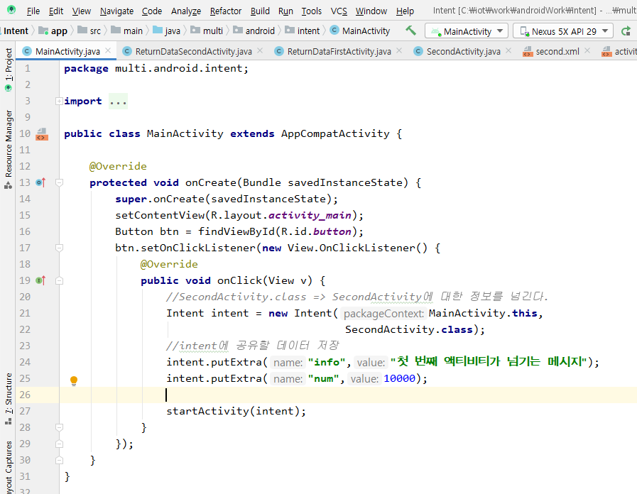
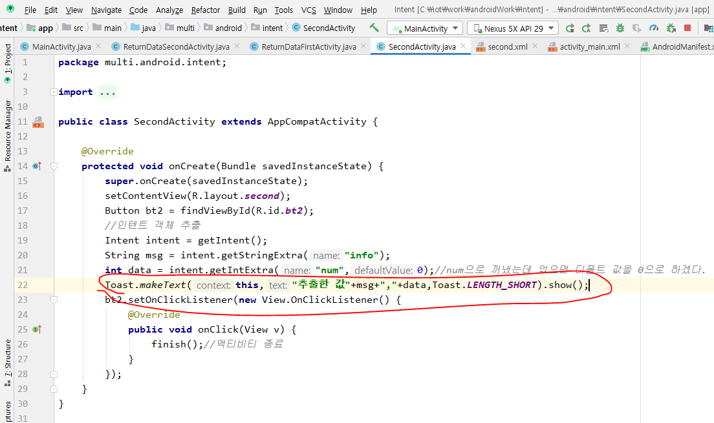
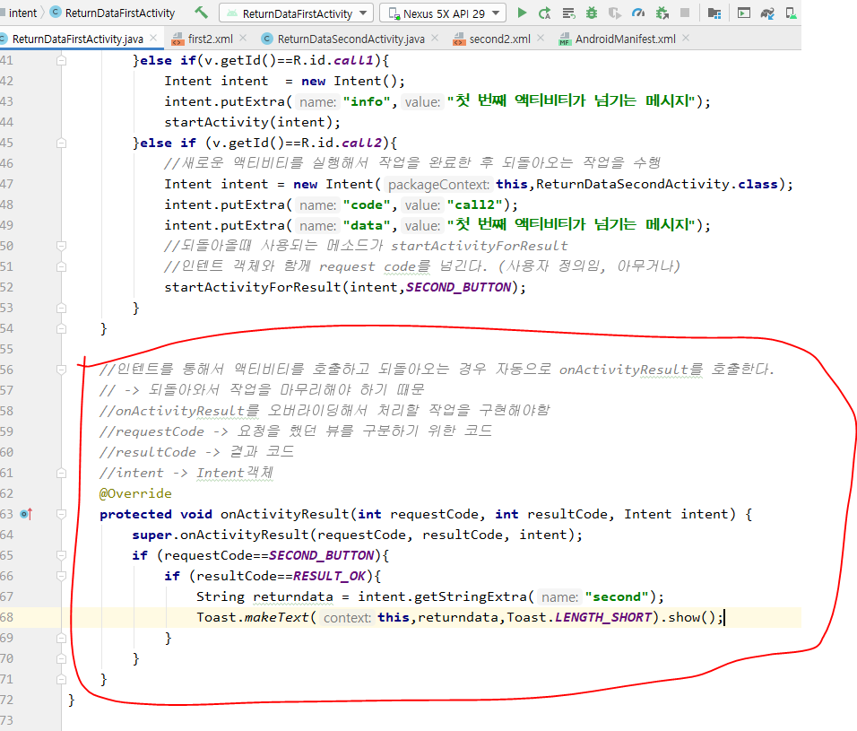
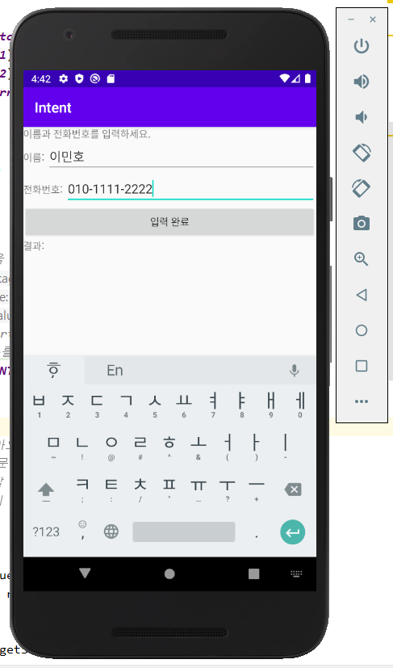
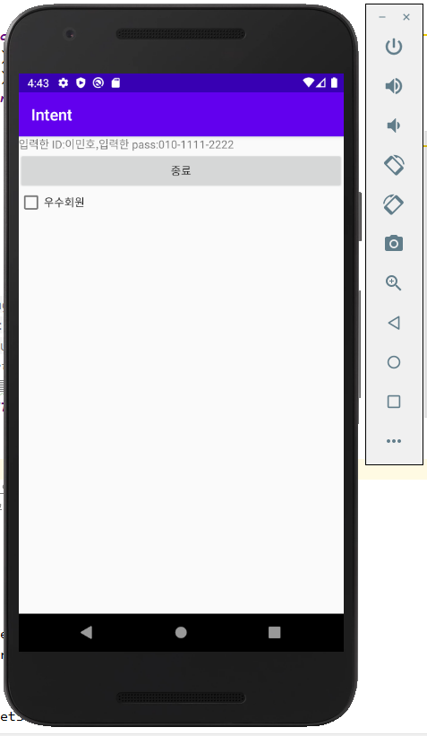
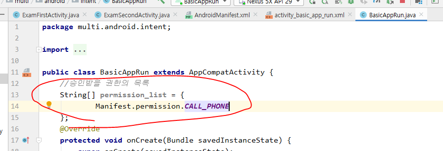

- 안드로이드의 구성요소 4가지는 new로 실행 못함. 그래서 Intent를 통해서 안드로이드 OS에 의해서 실행되게 만들어줘야함.
- StartActivity() 메소드를 이용해서 Intent에 담음. 데이터를 공유하고 싶을 때 Intent에 담음.

# Intent

[Intent 사용 순서] -> 기본 실행일때

1. 인텐트 객체를 생성. 실행할 액티비티의 정보와 데이터를 셋팅

   =>

2. 안드로이드 OS에 인텐트 객체를 넘기며 의뢰

   => startActivity

3. 인텐트에 설정되어 있는 액티비티 호출

4. 호출된 액티비티에서는 안드로이드OS가 넘겨준 인텐트를 가져오기

5. 인텐트에 저장되어있는 데이터를 꺼내서 활용


- 매니페스트에서 새로 생긴거 한상 지웠었는데 이번엔 주석처리


### Intent사용

1. Intent 사용순서 1번


2. Intent 사용순서 2번 => OS에 의뢰작업


3. Intent 사용순서 3번

   - 안드로이드 OS에서 호출 되었다고 가정하고 넘어감

4. Intent 사용순서 4번 => 인텐트 호출

   => 이대로 앱 실행시키면 매니페스트에 아까전에 주석처리했기 때문에 에러 뜰꺼임.


- 결과


#### 이제 데이터를 셋팅해보자

- intent.putExtra로 데이터 셋팅할꺼
  - key,value형태임.
  - key는 내가 넣을 데이터의 이름, value는 내가 넣을 데이터의 타입


- 아래 사진 방법으로 값을 넘김



- 값을 받는 애
  - 인텐트에서 공유된 값을 꺼냄
  - intent.get~~~Extra로 꺼냄.




- 결과
  - 실행되는 액티비티로 값을 넘겼음.


- 액티비티 A 에서 액티비티 B를 부를 때
  - startActivity()
- 액티비티 B에서 다시 A로 돌아갈 때
  - ???

### 액티비티 B에서 다시 A로 돌아갈 때

- 매니페스트 등록
  - ReturnDataFirstActivity로 run시킬꺼


- startActivityForResult()를 씀.
  - request code는 내가 맘대로 정해줌.
    - 액티비티 A에서 액티비티 B를 부른 버튼이 어떤건지 알아야 하니까 request code가 필요한거.


- 아래사진이 내가 쓸 request code임. 변수명, 값 둘다 내맘대로 정한거.


- 실행 후에 호출한 액티비티로 되돌아가기

  - ```
    setResult();
    ```


- setResult로 나 되돌아갈래~ 했는데 되돌아가서 뭘 할지도 정해줘야됨.
  - onActivityResult 사용.




- 결과


- 요청을 하고 말꺼다 -> startActivity
- 요청을 하고 돌아올꺼다 -> setResult, onActivityResult 


[실습]

- ```
  ExamFirstActivity.java
  ExamSecondActivity.java
  firstexam.xml
  exam_secondview.xml
  ```


[실습 결과]






- 위의 실습 한거로 객체공유하는법도 배울꺼

- 객체공유 버튼 추가


- 결과
  - 아직까지는 객체공유 안한거.


- 이제 객체공유 해보자


- DTO같은거 만들어주기 => User
  - 액티비티 A에서 공유하고 싶은 데이터를 Parcelable에 담고 여기에서 데이터를 빼서 액티비티 B로 옮긴다.


## 앱 공유하기

selectView의 selectViewActivity를 공유

- 조건주는 방법(나중에 호출될때 조건의 기준에 의해서 거를꺼 거르고 실행)

  - 액션
    - 이 액티비티가 이런 일을 하는 것이다라고 알려주는거.
  - 카테고리 
    - 런쳐에 의해서 실행되는 범위다.
    - 디폴트는 일반적인 컴포넌트다 라는 뜻

  - 데이터

- 아래처럼 해주고 ListViewTestActivity를 run해주면 공유된거임.


### intent에서 selectViewActivity를 써보겠다.


- 결과
  - 전혀 다른 앱의 액티비티를 호출했다


- 선생님이 준 intentApp을 임포트
  - 마니페스트의 action에 이름이 아까 공유한 애 이름이랑 똑같음


- 아래꺼 실행


- 공유된 앱이 두갠데 둘중에 뭘 쓸래?


- 


- ACTION_VIEW는 뭔가를 보여주는거. 보여줄 데이터를 갖고 있는게 uri


- 구글맵 실행 완료


### 웹브라우저 실행


### 전화걸기 화면


### 전화걸기





- test_avd의 전화번호를 확인!!
  - 5556


