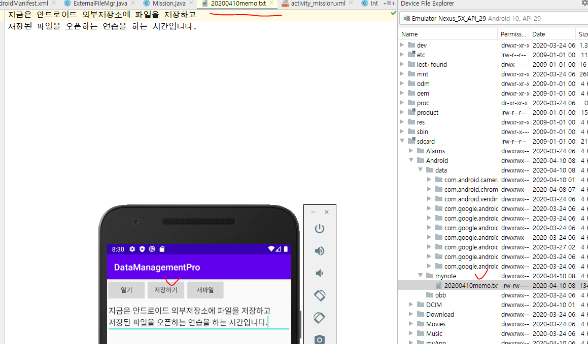

## 사용자 정의 권한 만들기(377p)

- 사용자정의를 등록하고 어떻게 사용하는지만 볼 것.

- permission의 name은 내 마음대로.
  - label => JAVA_PERMISSION이라고 알려주는 것
  - description => 어떤 퍼미션인지 설명을 쓰는 것.
  - 퍼미션 걸어놨으니까 사용하는 쪽에서 퍼미션 쓸라면 잘 확인하고 써~

- protectionLevel => normal Permission(일반권한)
  - 낮은 수준의 보안.

- Dangerous Permission
  - 앱을 실행할 때 권한을 부여함.

- 이제 DataManagementPro에서 작업

- 다시 PermissionTestPro로 이동
  - 주석처리한거 해제

- 퍼미션 설정하기
  - 그다음에 MainActivity를 run 시켜줘서 배포하기

- 퍼미션은 설정을 변경했으면 삭제를 하고 다시 배포해야함.
- 다시 DataManagementPro로 이동해서 run.
  - PermissionTestPro는 안보임.
  - Permission을 설정했기 때문에 그냥 접속했을 때 PermissionTestPro에 접속할 수 없음

- PermissionTestPro에서 퍼미션을 걸어놨기 때문에 DataManagementPro에서도 퍼미션을 쓴다고 명시해야함

- 이제 생겼음

### 일반 권한 만들기(Internet Permission)

- 위험권한이 아니라서 권한 처리를 하지않고 매니페스트에 등록만 해도 된다. 이런 것들을 시스템 권한이라고 부른다.

- WebView => 내 앱에서 인터넷 사이트와 연결할 때 씀.

- 권한을 설정했을 때 앱을 삭제하고 다시 run 시켜야 한다.
  - 기본권한은 이렇게 걍 run시키면 실행이 된다.

## 위험 권한 만들기(Dangerous Permission)

- 위험 권한에 관련된 것
  - = runtime permission

- 카메라 권한 설정을 안하면 카메라가 실행됨. 근데 Permission을 설정하면 카메라가 실행안됨.

1. 내가 사용할 권한을 매니페스트에 등록

2. checkPermissions() 메소드로 권한이 있는지 없는지 확인하기.

   => 권한이 이미 부여되면 Permissiongranted반환

   ​		=> 권한이 있으면 그냥 사용하면 됨.

   => 권한이 없으면 denied가 리턴됨.

   ​		=> 권한 없으면 사용자한테 물어봐야 하니까 RequestPermission.

   ​					=> '예'를 누르면 앱 실행

   ​					=> '아니오'를 누르면 다른 뭔가를 실행하게 만들어주자(앱이 종료되든 메시지르 띄우						든)

***shouldShowRequestPermissionRatinale() => 왜 권한이 필요한지 메시지를 나타냄***

## 내부 저장소(권한 체크 필요 X)

- 앱을 지울 때 같이 지워질 애들

- 저장하기 누르면 내부저장소에 저장, 열기 누르면 내부 저장소에 있는것을 꺼내서 액티비티에 뿌리기.

- 밑의 두 사진의 fis와 dis는 fos랑 dos로 수정

- 실행하면 DataManagementPro안에 myfile.txt파일이 생기고 이 파일 안에 테스트 중...이 쓰여있음
- 밑의 사진의 fis와 dis는 fos랑 dos로 수정

- 파일 읽기

## 외부 저장소(권한 설정 필요)

- 지금 버전에서는 write할 때는 권한 필요없고 read할 때만 권한 필요함. 예전에는 둘 다 권한이 필요했음.

- 저장하기 누르면 외부저장소에 저장, 열기 누르면 외부 저장소에 있는것을 꺼내서 액티비티에 뿌리기.

- 권한 체크는 액티비티에서

- 저장버튼 눌렀을 때
  - 권한 설정이 되어 있으면 : Toast("권한 설정 완료")
  - 권한 설정이 안 되어 있으면 : Toast("권한 설정 하세요")

- 거부 눌렀을 때

- 이 상태에서 저장하기 눌렀을 때

- 허용 눌렀을 때

- 이 상태에서 저장하기 눌렀을 때

- 권한을 허용한 상태에서 저장하기 누르면 아래 사진 처럼 외부 저장소에 파일이 만들어짐.

- 위의 방법은 파일을 생성하고 앱을 지워도 파일이 안 지워진다.

- 아래 방법은 앱을 지우면 파일이 같이 삭제됨

### 실습 

- 소스 작성해보기

- 레이아웃

#### 결과

- 텍스트 저장

- 텍스트 불러오기

- 새 파일 버튼

***여기까지가 내가 작성한 실습코드***

