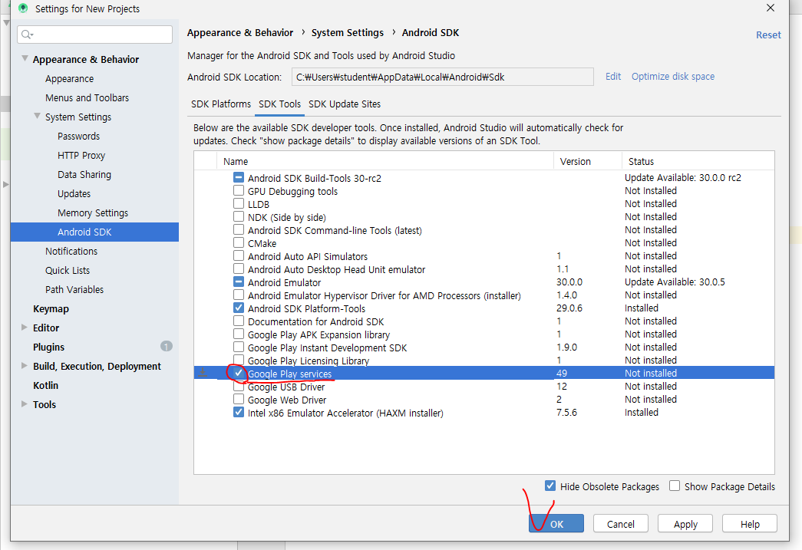
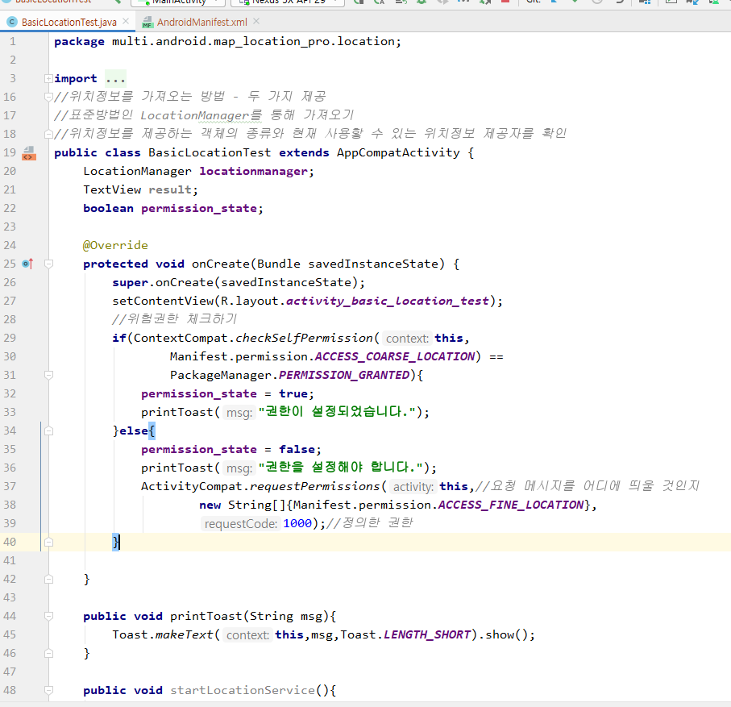
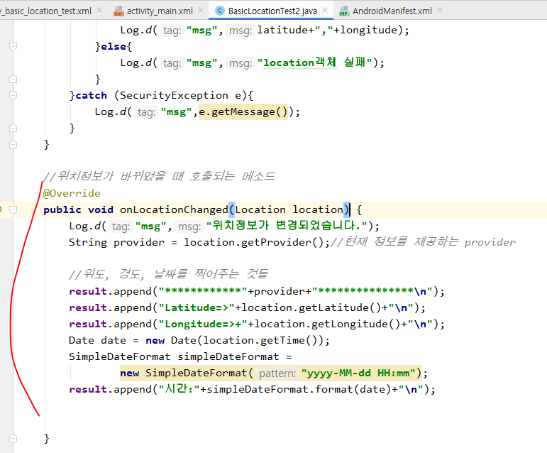

# Google Map 라이브러리 사용


새 프로젝트 생성 : map_location_pro


location, map 패키지 추가


* API발급 사이트에서 발급받기

  https://console.developers.google.com/


패키지명을 등록해야한다. 


Project Structure > dependency 목록을 볼 수 있다. -추후 사용할 예정





* 선생님 블로그에 있는 implementation 복붙해서 gradle에 넣는다.

  ```xml
  implementation 'com.google.android.gms:play-services-maps:17.0.0'
  implementation 'com.google.android.gms:play-services-location:17.0.0'
  ```

  


* 그 다음 Linear로 변경


* xml 에 fragment추가


* manifest에 use permission이랑 meta-data 추가한다.

* value에는 api사이트의 key번호가 들어간다.


* java에서 실행

  

  


## LocationManager(668p)


### BasicLocationTest 액티비티 추가


* 빨간줄이 뜨는 이유는 권한 등록을 안해줬기 때문이다.

* 매니페스트에 가서 권한 등록 해준다.


* java에서 권한체크 부분 써준다.




### LocationListener

- 위도경도가 바뀔때 호출되도록.


- 4개 메소드 오버라이드


- 위치 바뀔때 호출되는 메소드



- 위의 메소드를 연결하자


## 구글지도에서 마커


### Location코드


## Fragment사용방법(스프링에서 타일즈개념)

- 우선 Fragment를 여러개 만들어 놓음. ->  화면을 여러개 만들어놓는다는 의미 -> Fragment는 화면?
  - 프래그먼트 1,2,3...
- 버튼 1 누르면 Fragment1이 보이게
  - 2 누르면 2가 보이게 ....

- Fragment만들기


- fragment를 교체해서 보여줄 메소드
  - 트랜잭션 처리


- 결과


### 실습

- 버튼 1 -> fragment1, 버튼 2 -> fragment2, 버튼 3 -> fragment3 나오게 하기


- weight를 1 주는 이유
  - weight는 여백을 채우는 애임
    - 근데 다 match_parent 로 하면 여백이 없음. 그래서 weight가 채울 여백이 없어서 지워지는 것.


- 결과


***xml에 fragmaent를 추가하면 코드로 제어할 수가 없다.***

### 실습 풀이

- activity_view_pager_main.xml에서 fragment의 weight=1을 지우고 Linearlayout을 FrameLayout으로 바꿔주면 똑같이 결과가 나옴.

