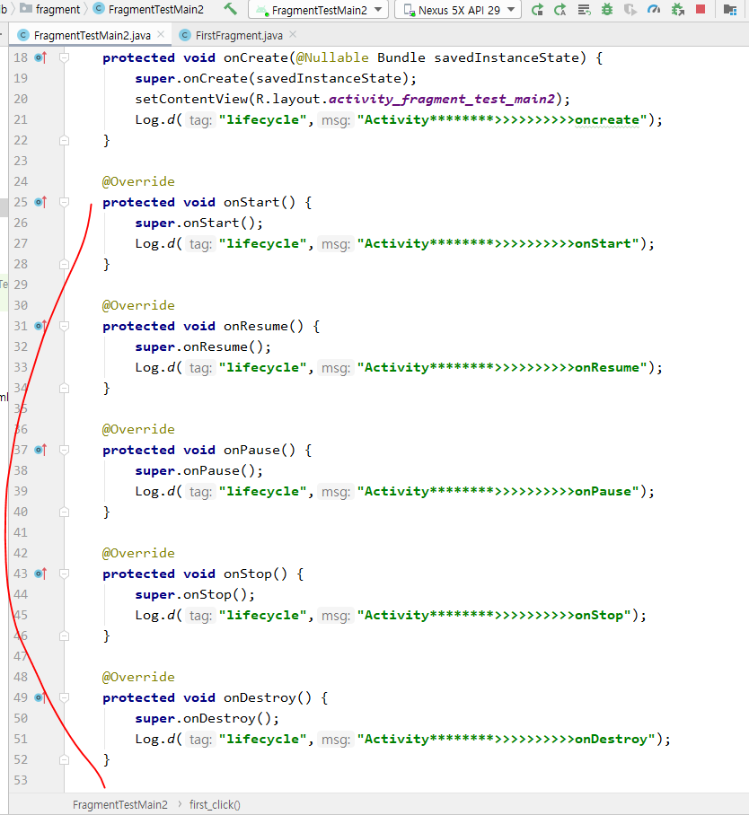
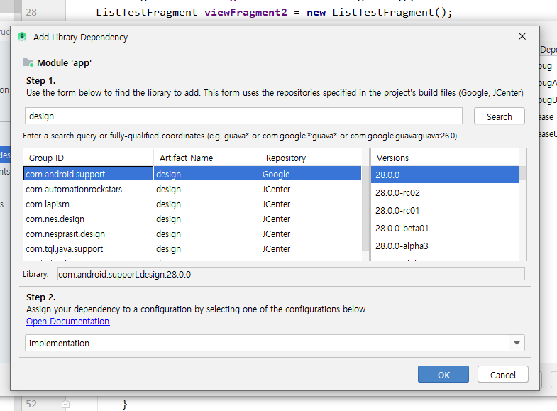

- 프래그먼트관리 1, 2 버튼을 누르면 밑에 버튼이 추가되어야 하는데 리니어레이아웃이면 레이아웃 특성상 영역 바깥에 추가되어서 안보이는거임.

- transaction.add로 프래그먼트를 생성할 수 있음. 근데 얘는 똑같은 객체는 한 개만 생성할 수 있다. 
  - 이거로 생성한 프래그먼트를 두번 누르면 앱이 나가짐.

- 그래서 리니어레이아웃말고 프레임레이아웃으로 바꾸면 프래그먼트관리2를 눌렀을 때 버튼위에 프로그레스 바가 생김.
  - 리니어 레이아웃보다 프레임 레이아웃이 더 좋다.

- 프래그먼트관리1을 누르면 버튼이 프로그레스 바 위에 생김
  - 근데 뒤로버튼 누르면 앱이 종료되면서 생성된 프레그먼트도 다 지워진다.

- transaction.addToBackStack
  - 뒤로버튼 누르면 앱이 종료되면서 생성된 프레그먼트도 한번에 다같이 종료됨. 근데addToBackStack를 쓰면 액티비티가 여러개 쌓여있는거처럼 뒤로버튼 누를때 프레그먼트가 한번에 없어지지 않음.

- 프레그먼트관리2를 세번 눌렀으면 뒤로버튼을 세번눌러야 앱이 종료됨.

- 라이프 사이클에 관련된 추가해야되는 메소드들(11개)
  - 밑에꺼에 onDestroy도 추가

- 실행시킬 메인 액티비티에 메소드 추가

- resume이랑 pause도 추가

- backStack은 주석처리

- lifecycle

  - 앱 실행하면

    - oncreate -> onStart -> onResume

  - 프레그먼트관리1 누르면

    

- 라이프 사이클은 기억할 필요 없을듯. 

- 라이프사이클 메소드 별 의미

### 복잡한 뷰를 하나의 화면에 다 담아야 할 때 프레그먼트를 쓴다. 이외에는 액티비티 쓰기.

## 뷰페이저로 화면 전환

- 이미지나 기능을 한 화면에 많이 보여줘야 할 때 씀.
- 버튼 클릭 말고 드래그해서 화면 전환 할 때 씀.

### 프래그먼트 말고 일반뷰로 뷰페이저 하기

- Containers -> 뭔가를 담을 수 있는거

#### 결과

- 화살표방향으로 마우스 드래그

### 프래그먼트로 뷰페이저 하기

#### 실습

- Fragment로 작업한 예제를 ViewPager에 추가해서 동작하도록 작성
- Fragment를 한개 추가, 지도가 출력되는 MainActivity도 추가

4개의 Fragment가 ViewPager로 실행될 수 있도록

프래그먼트랑 관련된 페이지어댑터를 extends하기

- 이제 버튼을 눌렀을 때 같이 움직이게 해보자
  - ViewPager에 들어있는 page숫자가 0번 부터 시작하는데 tag를 0,1,2 해주면 ViewPage의 순서를 정해줌??

- 이제 이벤트도 붙여보자

- 두번째 뷰 버튼 누르면 토스트 이벤트가 뜸.

- 이제 맵을 다뤄보자

- 이제 ListView형태의 Fragment를 다뤄보자
  - ListFragment가 ListView를 내장하고 있다.

- 이제 우리가 만든 맵과 ListFragment를 적용해보자.

- 맵을 쓸 때 한 API키로 하나밖에 못함. 그래서 두개의 앱이 API키가 겹치면 둘중 하나를 앱을 삭제해야함.

- 앱에서 메뉴 튀어나오기
  - 기본 라이브러리는 아님. 지원이 안되서 앱을 설치할 때 같이 라이브러리가 설치되게 해야함.

- 메뉴 튀어나오게 하는건 나중에 함.

- Map은 오늘 한거랑 다른형태로 플젝에 쓸꺼임.
  - 맵 자체가 프래그먼트임.

