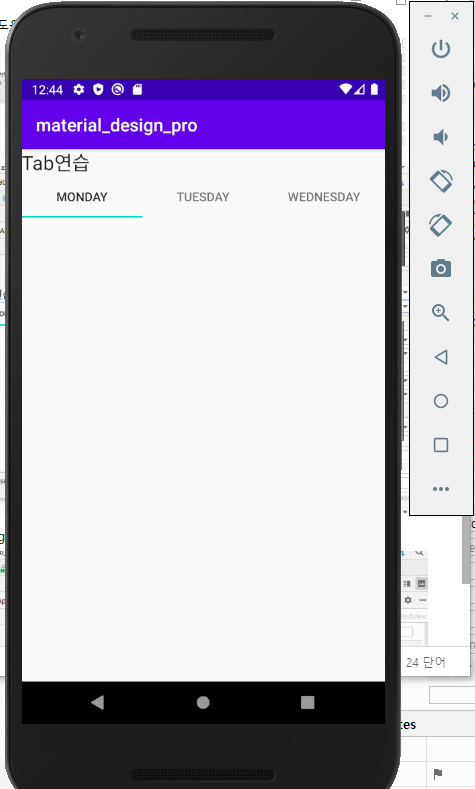
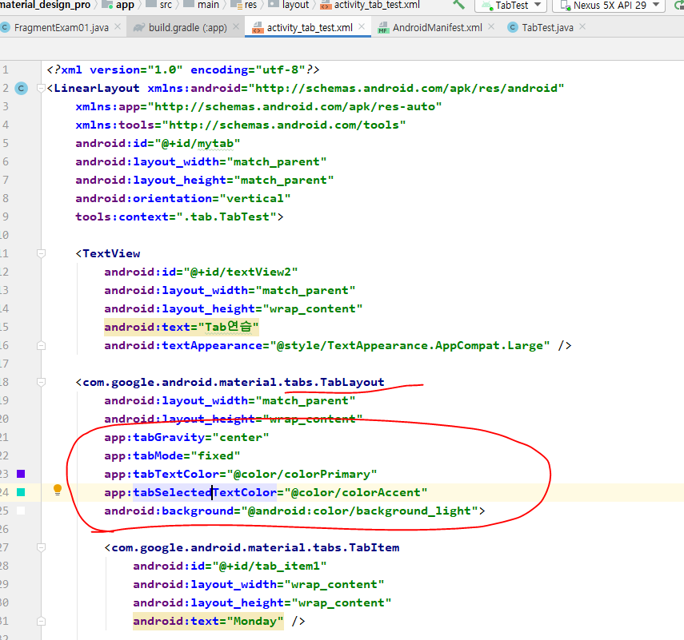
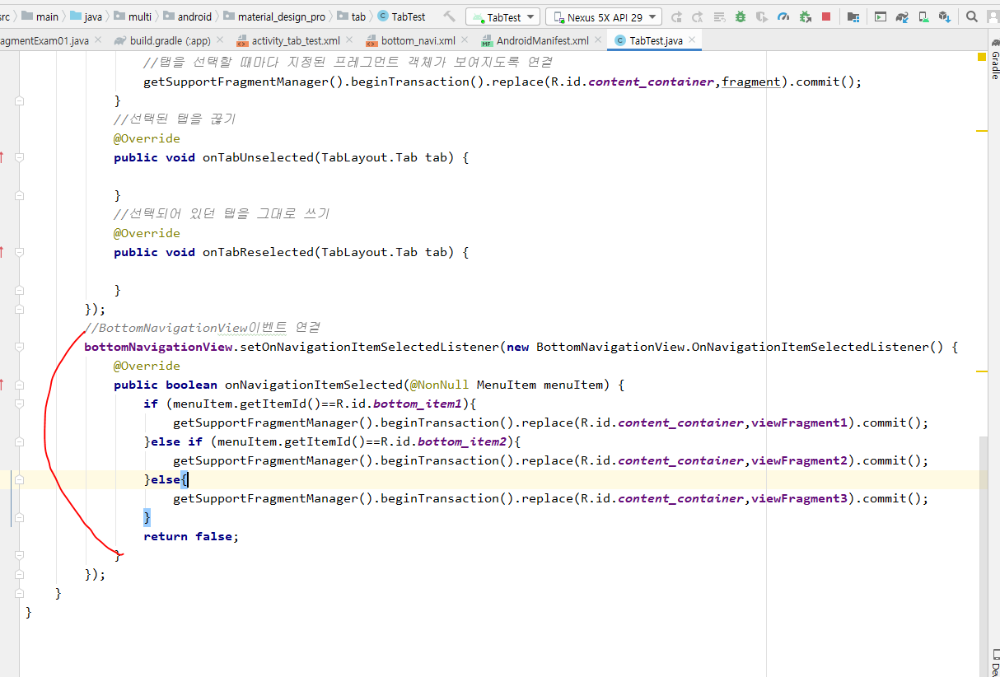
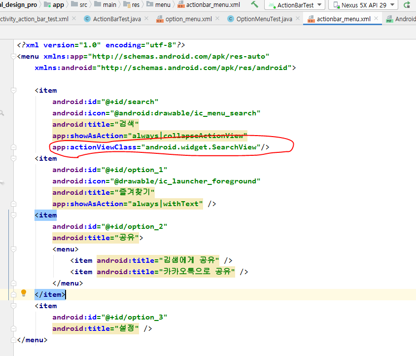
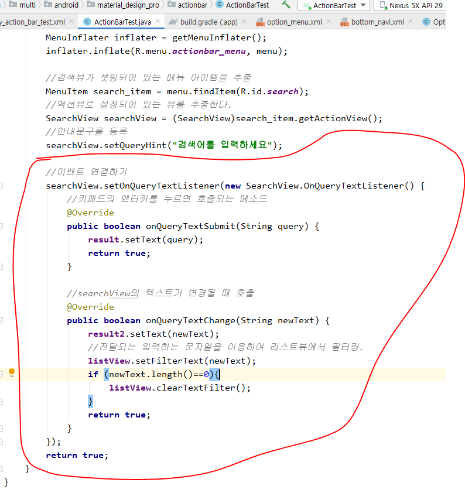
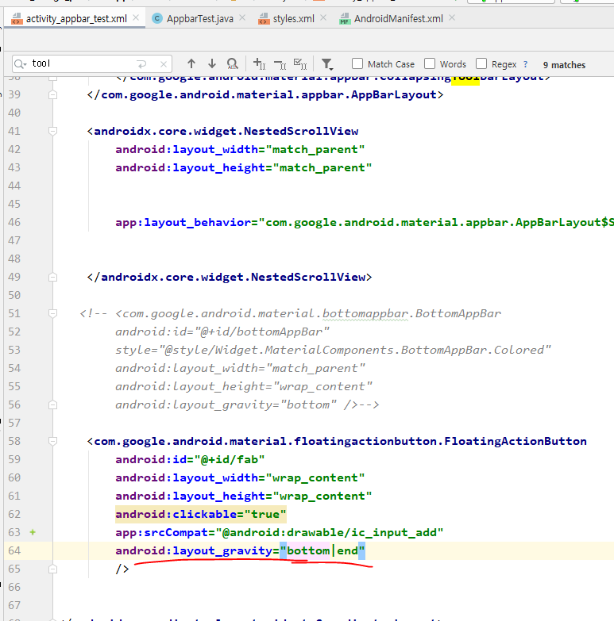
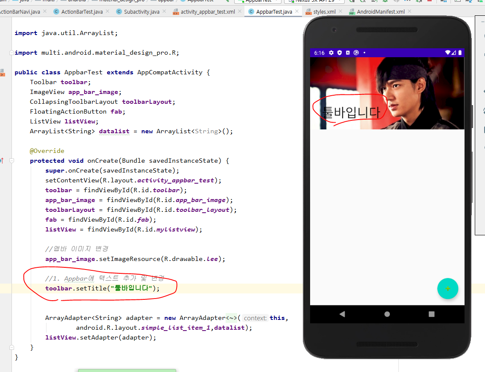
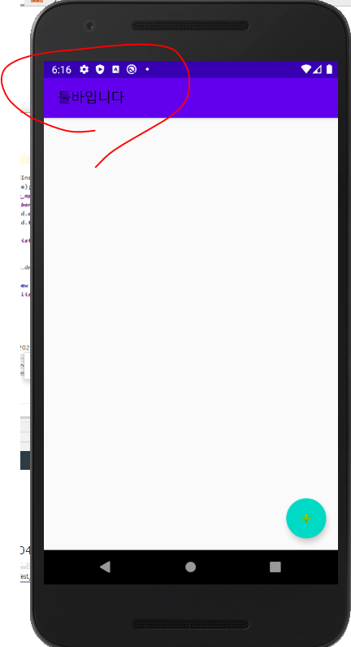
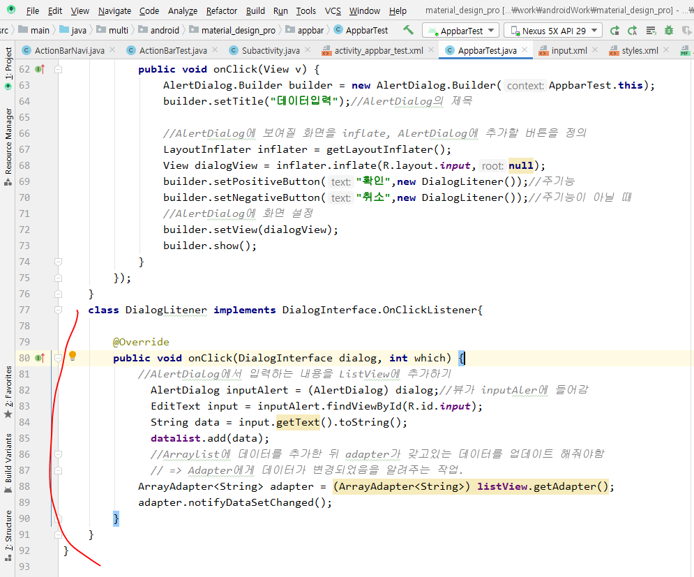
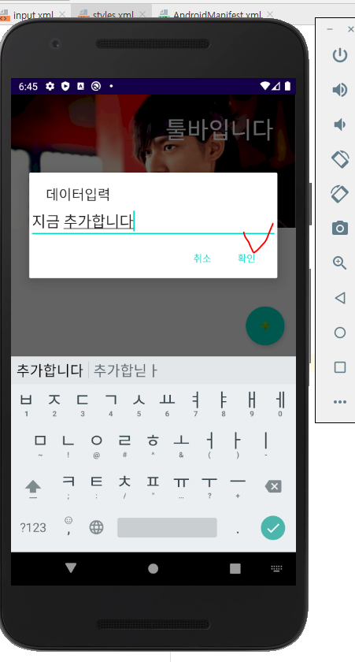

## 머티리얼 디자인

- 위젯 제공. 화면 디자인


- File -> Project Structure


## tab

- 프로젝트때는 뷰가 복잡해지니까 디자인 화면을 적극 활용하자.




- ```
  tabGravity -> center로주면 가운데로 몰림
  tabMode ->
  tabTextColor -> 텍스트의 색
  tabSelectedTextColor -> 텍스트가 선택됬을 때 색
  ```




### Menu

- res에 menu폴더 만들기


- always는 항상화면에 노출되게 한다는 의미


- 정보가 액션바 영역에 올라감.


- 아이콘 설정하기


- 지금 만든거를 activity_Tab_test.xml에 추가하자


- 이제 TabTest로 이동


- 이제 탭을 누를 때 마다 프레그먼트가 뜨게 이벤트를 연결해주자


- 이제 탭을 선택할 때마다 프레그먼트가 바뀜
  - TUESDAY누르니까 화면 바뀜.


- 이제는 bottomNavigation에 이벤트를 연결해보자



- 이메일 누르니까 화면 바뀜


### OptionMenu


- id를 option_1,2,3로 변경


- 우리는 xml로 메뉴를 만들었음
  - 코드로 메뉴를 만드는 방법도 있음.


- 코드로 메뉴를 만드는 방법


- 메뉴의 아이템에 이벤트 연결하기


### 액션바 제어하기

- 자주 사용하는 거를 액션바에 보이게

always = 메뉴를 액션바에 항상 표시

never = 메뉴를 액션바에 표시 x

ifRoom = 공간이 허락하면 표시, 허락 안하면 표시x

collapseActionView = 접었다 펼쳤다 하면서 표시

withText = Text와 아이콘을 같이 보여주겠다.


- 아래 검색은 always랑 collapseActionView 


- 즐겨찾기라는 문자열이랑 아이콘이 같이 나오는거 확인


- 이제 아래의 검색 창 누르면 검색화면이 뜨게 하고싶음


- 아래꺼 추가해주면 됨



- 이제 검색아이콘 누르면 아래 사진처럼 검색화면이 뜸.


- 이제 검색창에서 검색해보자


- 이벤트 연결하기
  - 필터링(연관 검색어)



- 일번이라고 치기만 했을 때


- 일번이라고 치고 엔터 눌렀을 때


- search item에 이벤트 연결하기


- 검색어 아이콘 누르면 메뉴가 펼쳐짐이 뜸


- 위 상태에서 검색화면을 접으면 메뉴가 접혀짐이 뜸.


### ToolBar

- 액션바는 디폴트로 쓰는거고 툴바는 사용자가 직접 디자인할 수 있음.
- 유튜브처럼 재생되던 동영상이 작은 화면으로도 재생되는거


- values -> styles.xml
  - 스타일정해놓는거


- 툴바 주석처리


- 액션바가 안보임


- 툴바 사용하기


- 액션바랑 형태는 같은데 더 사용자가 직접 디자인 할 수 있음.


- 액션바에 했던거처럼 툴바에도 이벤트를 붙일 수 있음.


### AppBar


- 스크롤 올리면 위의 파란부분이 다 안없어짐


- 파란 부분이 없어지게 디장니해보자


- 이미지 추가하기


- 





- 


- 알아서 Floating Action Button이 위치를 잡고있음


- NestedScrollView
  - 내용이 들어가는 부분
  - listview를 추가


- ScrollView는 항상 fillviewport를 true로 정해줘야함.


- 앱바에 텍스트 추가 및 변경






- toolbarLayout.setExpandedTitleGravity(Gravity.RIGHT+Gravity.TOP); 때문에 아래사진


- toolbarLayout.setCollapsedTitleGravity(Gravity.CENTER);때문에 아래사진처럼됨


- FloatingActionButton을 눌렀을 때 대화상자가 뜨고 입력한 데이터가 리스트 뷰에 추가되도록 구현
  - 아래의 input.xml로 대화상자를 만들꺼임.


- 이제 이너클래스로 이벤트에 반응하게만 만들어줘보자






- tab -> appbar -> withtab


- fragment랑 viewPager연결


- 코드로 tabItem을 만들꺼임
  - 액티비티에서 타이틀을 전달받을꺼임. 액티비티와 프레그먼트의 통신
  - ChildFragment생성


- TabTest에 탭을 추가하는 코드를 for문에 넣어주면 탭이랑 프레그먼트가 연동이 안됨


- 아래꺼 메소드를 써야 탭의 문자열이 보임.


- 이제 탭이랑 뷰가 같이 움직임


## 실습

- FragmentExam01에 TabLayout이 추가되어 실행되도록 작업
  - 버튼과 연결되어 있는 프레그먼트를 탭과 연결되도록 수정하기
  - 구조를 변경하지 말고 버튼 대신에 TabLayout을 추가
    - layout xml파일을 변경
    - 버튼을 지우고 Tab추가
  - TabTest2를 참고해서 코드로 ViewPager와 TabLayout이 연결되도록 수정


- 결과


