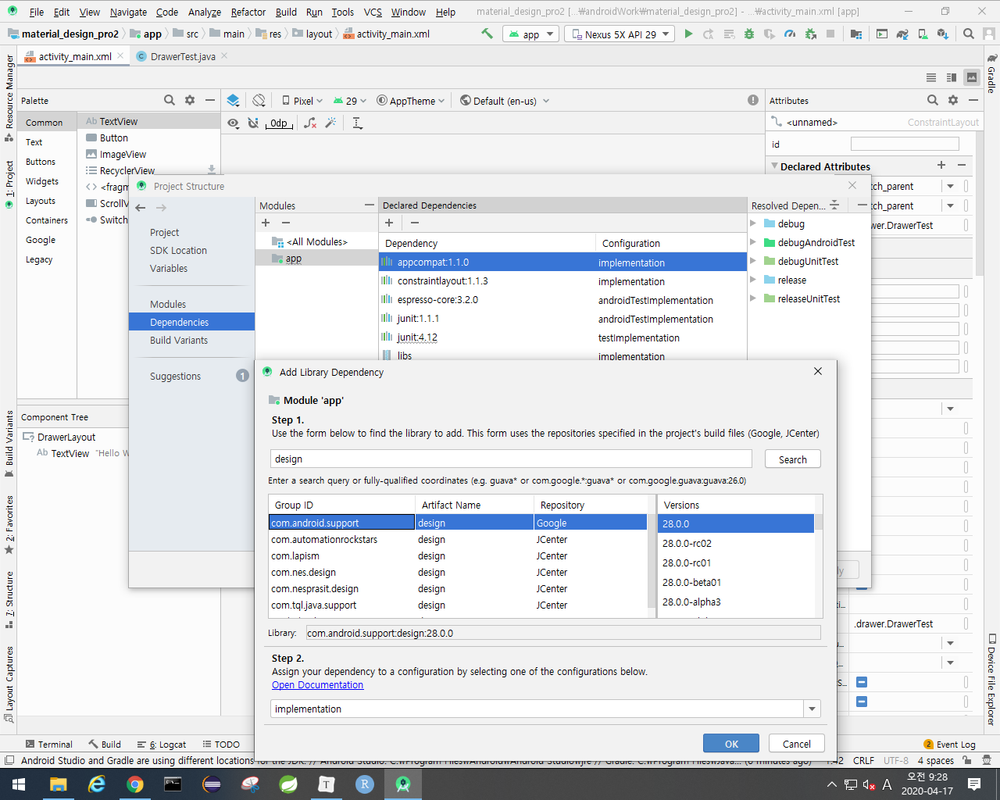
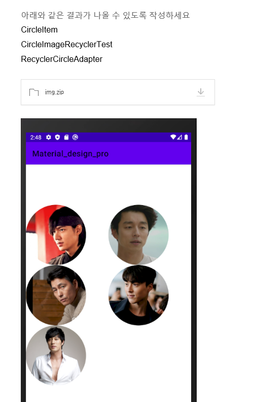

- 342p에 템플릿으로 만드는거 나와있음. 우린 일단 코드로 만드는거 하고 템플릿 알려주심
- 라이브러리 설치 -> drawerlayout 설정 -> NavigationView 만들기

- 네비게이션뷰에서 헤더부분이랑 메뉴부분의 xml을 따로 만들어줘야함
  - 위 사진의 헤더는 선생님이 준거. 아래 사진의 메뉴부분은 수업때 만든거

- android:layout_gravity = "start" 을 적용하면 네비게이션 뷰가 숨겨짐
  - 미리보기를 보면 안보임

- 이제 숨긴화면이 보여질 수 있게 코딩해주자
- 우선 String을 설정
  - ActionBarDrawerToggle()메소드에 리소스형식으로 들어가야해서...(open, close)

- 아래 코드 적용하면 숨겨졌던 네비게이션이 나옴

- 이제 위의 네비게이션뷰의 메뉴에서 아이템중 하나를 클릭하면 네비게이션바가 사라지고 이벤트를 발생시켜줘야함.
  - 액티비티 띄울라면 인텐트 써주면 됨. 지금은 토스트만 걸어준것

- 네이버 앱 밑에 동그라미 아이콘 같은거 만드는거

- AppbarTest에서 실행

- 테마가 materialComponent여야 작업할 수 있다??

## cardview

- cardCornerRadius적용
- cardElevation(음영) 적용

- materialcompat으로 바꾸기

- 라이브러리 추가 (동그란 이미지)
  - implementation 'de.hdodenhof:circleimageview:3.0.1'

## RecyclerView(416p) 마지막 디자인기술

- 리사이클러 뷰는 무조건 커스터마이징 해야함.
  - 어댑터 커스터마이징이랑 비슷함
  - 데이터만 가지고 뿌리는게 아니고 레이아웃을 설정할 수 있음.
  - ViewHolder를 내장하고 있음.
  - ListView의 업그레이드 버전

- DTO + 어댑터(뷰홀더 포함) 

### 리스트뷰를 뽑아보자

- simple_item.xml
- SimpleItem -------------------------------------------------> DTO
- SimpleRecyclerTest
- activity_simple_recycler_test.xml
- SimpleItemAdapter

1. 데이터 준비하기

2. Adapter 생성

- 어댑터 커스터마이징 구조는 항상 아래사진 구조임.

- 2,3,4를 한번에 코딩
  - 어댑터 생성. 리사이클러뷰의 레이아웃 설정, 리사이클러와 어댑터 연결

- 어댑터에서
  - onBindViewHolder

- 결과
  - 항목 하나하나가 나옴
  - 이제 여기부터는 디자인싸움임 -> 패딩, 마진 등등

- 리사이클러의 레이아웃을 그리드 레이웃으로 설정해보기
  - spancount => 열방향 span
    - spancount 2 => 2열

- 디자인
  - 나중에 더 예쁘게 꾸밀 수있도록 선생님이 알려주심

## 실습

- 코드

- 이미지 넣을 때 for문 안됨.
  - 아래 사진처럼 하거나 더 밑의 사진처럼 하거나...

## CardView 실습

