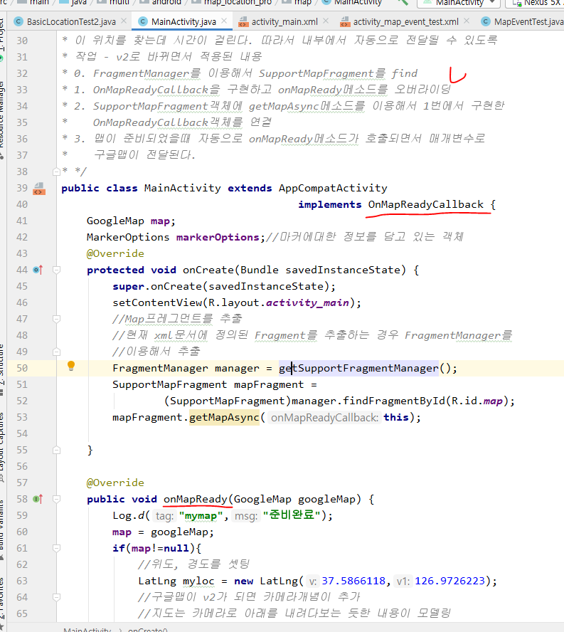
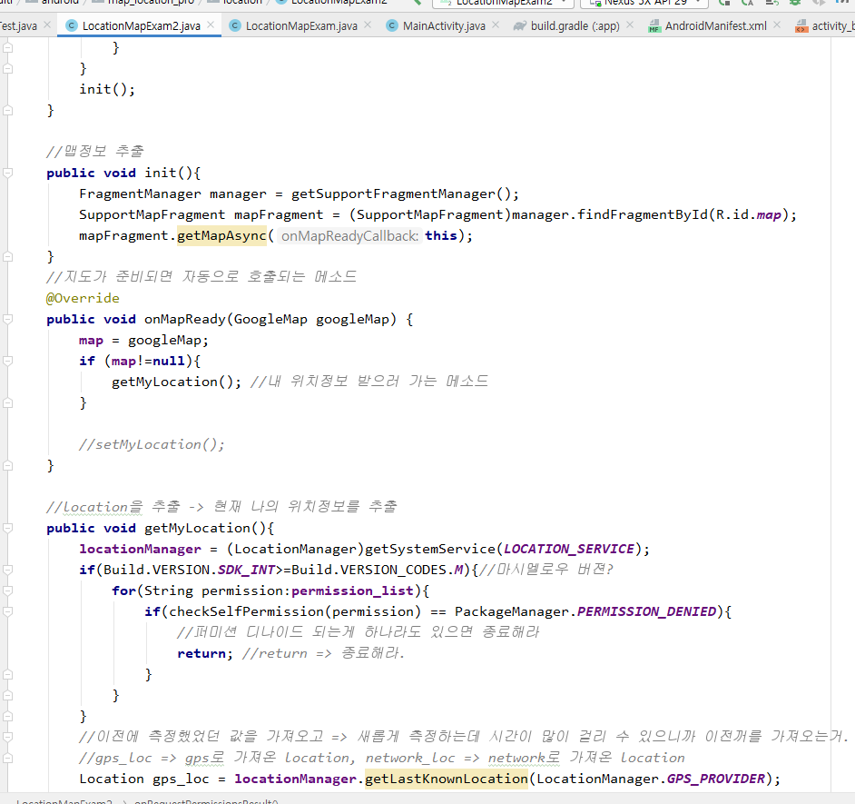

## 지도 출력

0. FragmentManager를 이용해서 SupportMapFragment를 find

1. OnMapReadyCallback을 구현하고 onMapReady메소드를 오버라이딩

2. SupportMapFragment객체에 getMapAsync메소드를 이용해서 1번에서 구현한  OnMapReadyCallback객체를 연결

### 결과

- 처음 동작시켰을 때

- 멀티캠퍼스 버튼 누르면 setPosition 메소드 실행

- 원출력, 마커 버튼

## 지도에 이벤트 연결하기

### 현재위치를 받아서 맵에 출력하기

- 위에 까지는 이전 위치를 받아서 맵에 표시한 것.
- 아래는 현재 위치도 받는것.

### 쓰레드 사용하기(필수!, 자바책722P)

- 프로세스 = 실행 중인 프로그램

- 버튼을 누르면 Progress Bar가 움직이는 것을 보는게 목적.
- 화면

- 버튼 누르면 for 문을 100번 돌리면서 1초 쉼 그리고 Progress Bar가 채워짐.  근데 AVD는 한 작업만 할 수 있음(쓰레드 안할 때)
  - for문만 100번 돌리면서 1초 쉬고있고 이벤트에 대한 리스닝을 못함.

- 따라서 동시에 여러개의 동작을 수행시킬 때 Thread가 필요하다.
  - 하나의 프로세스에서 동시에 여러개의 실행흐름을 가져야할 때 Thread가 필요함.
  - 하나의 프로세스 안에서 여러개의 실행흐름(게임, 채팅, 쪽지 등)은 공유데이터를 동시에 사용할 수 있음. 개발자는 실행흐름이 공유데이터를 쓸 수 있게 스케줄링 해줘야함.

- 멀티 쓰레드
  - 하나의 프로그램을 띄워놓고 그 프로그램 안에서 여러개의 실행흐름이 동시에 작업할 수 있게 해주는 방식
  - 프로세스 안의 프로세스를 쓰레드라고 한다.

### STS로 쓰레드 공부 시작

- 1부터 20까지 출력하는 코드를 다른 실행흐름이랑 동시에 출력하는게 목적
  - Thread 클래스 안에 run메소드가 무조건 있어야 함. 

- 아직은 동시실행이아님. run메소드를 실행하고 main의 for문을 실행하는 단순한 메소드 호출임.

- start메소드로 쓰레드 실행

- main이라는 글자가 찍히면서 다른 글자들도 찍히고 있음.
  - main은 종료됐는데 t1과 t2는 계속 돌고 있음.

### 미션

1. 쓰레드 프로그래밍으로 구현

- 1부터 100까지 출력하는 DigitThread
- A부터 Z까지 출력하는 AlphaThread
- ThreadExam01의 main메소드에서 DigitThread와 AlphaThread를 동시에 실행해보자.

