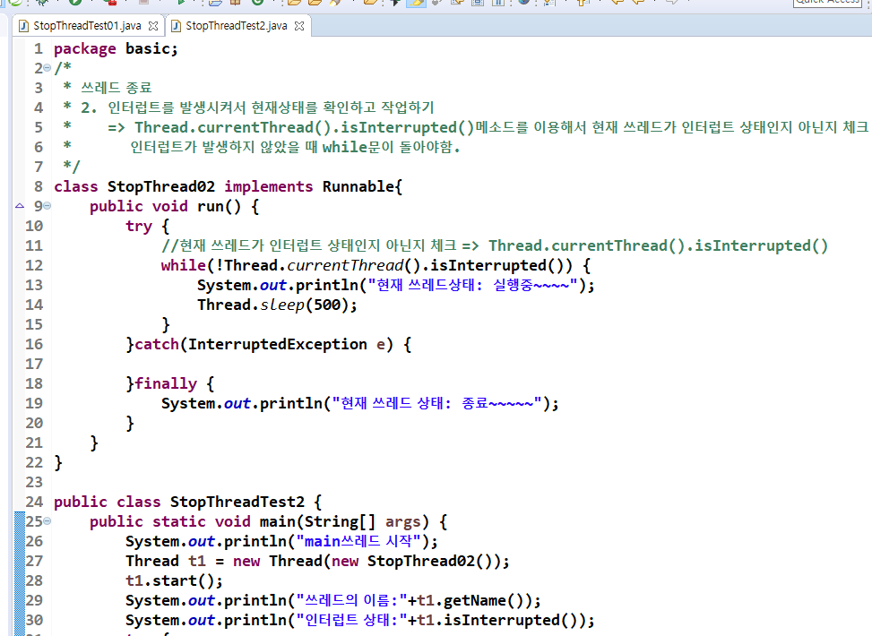
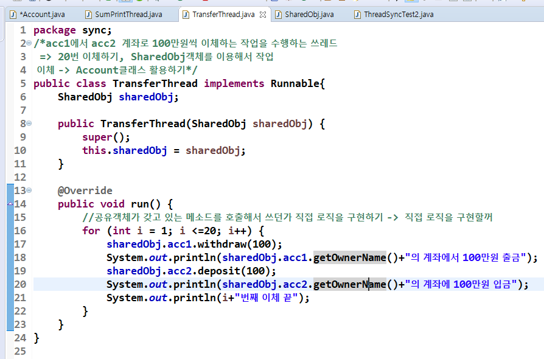
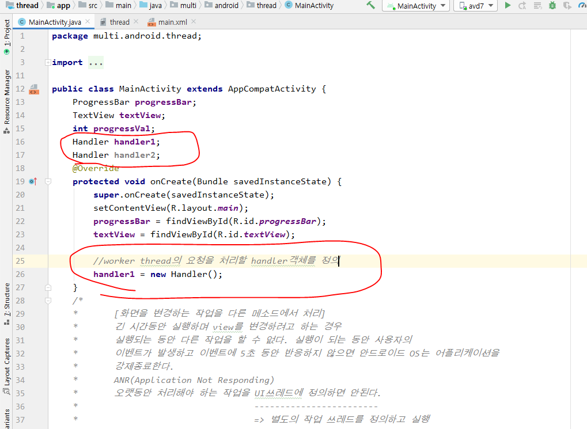

## 쓰레드

- 보통 쓰레드 클래스를 상속받지 않고 Runnable인터페이스를 구현한다.

- Runnable로 하면 start() 메소드로 쓰레드를 실행못함.
  - Runnable객체로 Thread객체를 생성하고 매개변수로 Runnable객체를 전달

### StopThread

- 계속 실행되는 쓰레드를 중지시키는 방법

- 앱에서 액티비티를 여러개 씀. 

  - 계속 데이터를 받는 액티비티가 있다고 치자. 이 액티비티는 화면이 켜져있을 때만 동작을 해야한다. 다른 액티비티를 키면 이 액티비티는 데이터를 그만 받아야 한다는 뜻이다. 이렇게 동작을 종료시킬 때 쓰는게 StopThread다. 

  - 쓰레드는 한번 종료된거는 못살림. 새로 만들어야함

- 위 코드대로 동작 시키니까 무한루프

- 변수 선언해서 StopThread시키기

- 인터럽트로 StopThread시키기

### 쓰레드에서 동기화

- 쓰레드끼리 객체를 공유할 때 발생하는 문제점을 처리하는게 동기화

- lock = 어떤 쓰레드가 공유객체를 사용하고 있을 때 다른 쓰레드에서 공유객체에 접근하지 못하도록 막는 것.

- User는 쓰레드, Toilet은 공유해서 사용하는 객체
  - 공유객체인 Toilet에 synchronized를 시키기

- 결과
  - 쓰레드가 공유객체 사용을 종료해야 다른 쓰레드가 공유객체를 사용함

#### 실습

- acc1과 acc2의 잔액을 합치기, acc1의 돈을 acc2로 이체하기

- 동기화를 시키지 않은 것의 결과

- 이제 동기화 시켜보자

- 동기화 된 후 결과

### 안드로이드에서 쓰레드를 어떻게 쓰는지

- 채팅할 때

- 현재 THREAD사용안함 버튼이 눌러져서 실행되고 있는 것.
  - 이때 다른 버튼을 누르면 다른 버튼은 작동을 못하니까 5초 뒤에 앱이 종료됨.

- 위에는 안드로이드 10버전인데 안드로이드 7버전으로 실행하면 에러뜨면서 앱이 종료됨
  - 8버전 이상부터만 진행률이 뜨면서 UI를 바꿔도 이상이 없음.
  - 이렇게 구현하면 안된다는 말.
  - 핸들러를 사용해야함. 쓰레드 안에서 UI를 변경하지 말고 핸들러에게 요청해서 UI를 변경해야한다.

- 올바른 방법
  - Worker Thread가 sendMessage()메소드로 handler에게 요청. -> handler가 handleMessage()를 호출해서 UI를 변경함.
    - sendMessage할 때 Message를 같이 보내면 handler는 이 Message를 꺼내서 UI를 변경함.

### 안드로이드에서 쓰레드 처리하기

안드로이드에서 쓰레드 처리하기1. Handler를 이용하는 방법    

1) 동시 실행흐름으로 처리할 내용을 쓰레드 객체로 구현   

 2) UI쓰레드에서 Handler객체를 생성(하위객체를 만들라는 뜻)

​		=> onCreate메소드 내부에서 Handler객체를 생성   

 3) worker thread에서 Handler객체에게 작업을 의뢰    

4) handler객체에서 worker thread로 부터 의뢰받은 내용을 처리    

​		=> handleMessage라는 메소드를 이용해서 처리(오버라이딩해서 구현해야함.)

​		=> worker thread한테 전달받은 값으로 view를 변경

​		=> 쓰레드로부터 요청이 올때마다 handleMessage메소드가 호출된다.

- 지금까지는 2번까지 한거. 이제 3번 시작.

- 4번 시작
  - 우선 반응되는거 확인

- 아래 코드로 제대로 변경

- 이제 7버전에서도 UI가 변경되었다.

- 지금은 progressVal가 멤버변수여서 위에 처럼 코드짜는게 가능했음.
  - 이제 멤버변수가 아닐때 넘기는 방법을 써보자
  - 위에꺼는 메세지 없이 자신이 갖고있는거(obtainMesage)를 넘긴거. 아래는 메시지를 직접 만든거

- 결과

