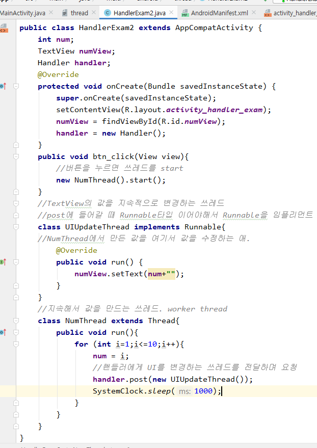
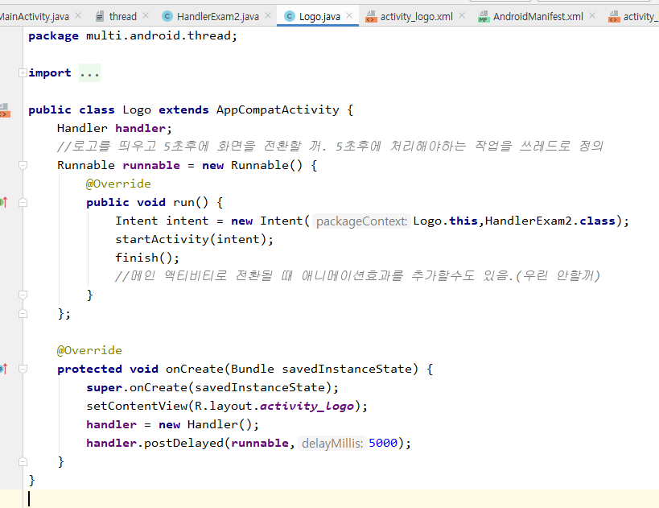
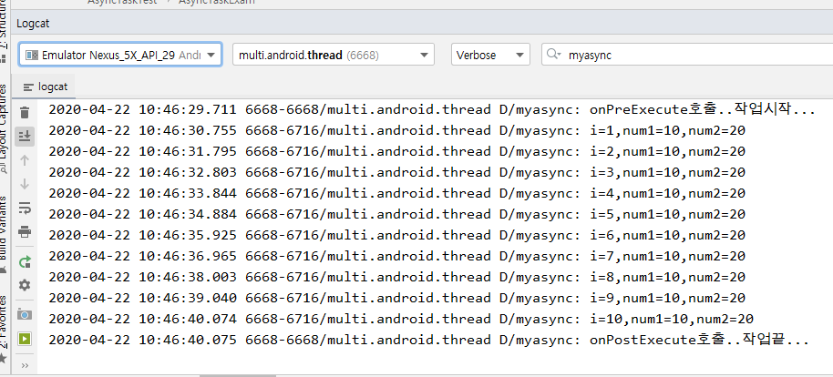

### handler로 쓰레드 하기 실습 풀이

- post메소드 사용하기(이전꺼는 sendMessage랑 handleMessage로 사용함)
  - 쓰레드를 보내줌

- 버튼을 클릭하면 btn_click메소드가 NumThread를 실행시킴 ->  NumThread에서 num을 만들어서 post메소드로 UIUpdateThread에게 값을 보냄 -> UIUpdateThread에서 UI를 변경

### 앱 킬때 로고 띄우기

- intent랑 handler이용

- 아래 사진처럼 로고가 뜨고 5초 뒤에 액티비티가 나옴.

## AsyncTask로 쓰레드하기(489p)

- FINAL프로젝트 때 쓰레드는 필수

- UI에서 호출되는 메소드는 무조건 시간이 오래걸리는 작업을 하면 안된다.

- 1번, 2번

- 3번, 4번

- onPreExecute, doInBackground, onPostExecute가 실행되는거 로그캣으로 확인

- doInBackground에서 onProgressUpdate를 호출하기

- doInBackground의 작업이 끝나고 onPostExecute가 실행됨

- 처리순서
  - onCreate에서 AsyncTaskExam객체 생성 -> execute시키면서 매개변수 넘기기 -> onPreExecute, doInBackground, onProgressUpdate, onPostExecute순서로 메소드가 작동함.

### UI에서 Thread실행

- 결과
  - 앱이 켜져있는 동안 Log가 찍힘. -> 쓰레드가 작동함
  - 앱을 종료하면 Destroy메소드 때문에 Log가 작동안함 -> 쓰레드가 종료됐다는 말

