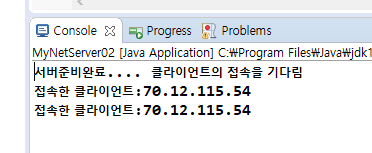
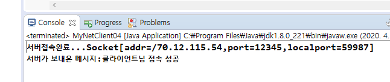
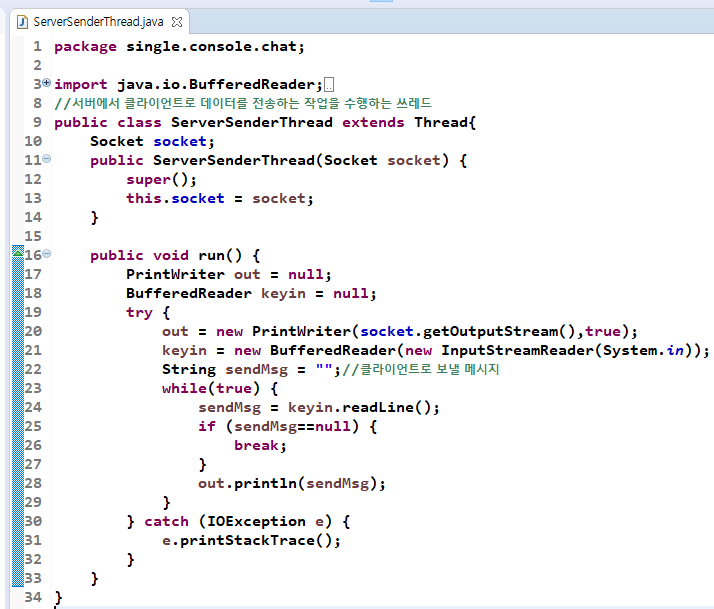
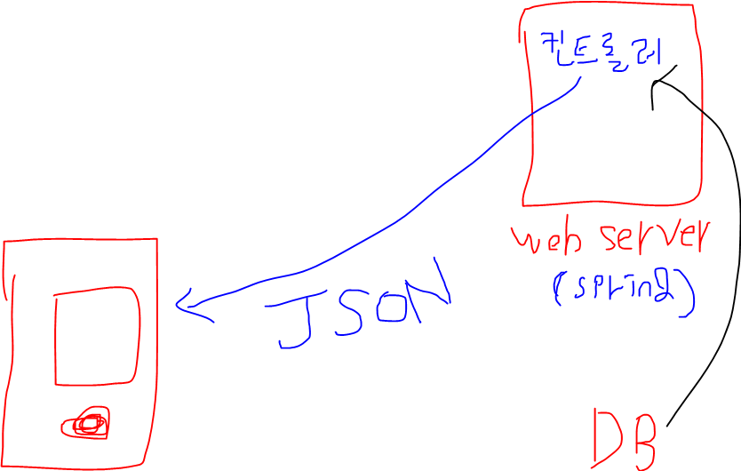

# TCP

- 클라이언트와 서버는 서로 주고받음(IN/OUTPUT)
  - 무조건 클라이언트가 output을 하면 서버는 input을 해야함
  - Thread로 독립적으로 관리해야함.
- 서버가 해야하는 일
  - 서비스 구축(기본)
    - 서버의 역할을 하기위해 서버소켓 객체를 만듬
  - port를 열고 클라이언트를 받아들이기 위한 대기를 해야함.
- 클라이언트가 해야하는 일
  - 서버의 IP를 알아야 함.
  - 서버가 열어놓은 port를 알아야함.
  - 소켓 객체를 만들어야함.

- STS에서 server랑 client 코드작성
  - 서버는 항상 열려있어야함.

- 지금은 클라이언트가 들어오니까 서버가 종료된 것.
  - 이러면 안됨. 무한루프로 계속 접속을 대기하고 있을 수 있도록 해야함.
  - 들어온 모든 클라이언트의 접속정보를 모두 기억하고 있어야함.
  - 대기하면서 클라이언트에대한 쓰레드를 계속해야함

- 클라이언트 두번 run(만들어놨던 클라이언트 코드 그대로)
  - 서버를 끊으려면 직접 terminate를 눌러야함.

- 현재 서버가 클라이언트의 소켓객체를 accept로 받은 상태
  - 서버가 클라이언트에게 데이터를 output할 수 있음. 클라이언트는 input
  - 데이터를 주고받을 수 있는 객체는 스트림.
- 서버와 클라이언트가 서로 비슷하게 IN/OUTPUT할 수 있도록 준비

- 데이터 쓰고 받기
  - 서버에서 데이터 쓰고, 클라이언트에서 데이터 받음
    - 데이터를 보내고 받는 순서가 중요

- 이제 클라이언트가 데이터를 쓰고 서버가 데이터 받기

- 결과

- 다른 사람꺼도 서버가 받을 수 있음

- BufferdReader를 주로 쓸꺼
  - 하나씩 읽는게 아니라 쌓아놨다가 한번에 보내는 애

- 결과

- PrintWriter가 autoFlush를 갖고 있는 메소드를 활용할 수 있음.
  - 결과는 같음

- 지금까지는 서버와 클라이언트가 데이터를 주고받기만 했음

## Echo

- 클라이언트가 키보드로 입력할 때마다 서버로 데이터를 보냄. 서버는 계속 데이터를 받아서 다시 클라이언트에게 메시지를 보냄. 

[실습]

[실습]

- 이제 서로 System.in으로 대화 주고받는거 해보자.

- 이렇게 하는거는 서로 한 문장씩 주고받기만 가능함.

## 채팅

- 서버와 클라이언트가 1대1로 채팅

- 서로 몇 문장을 보내든 상관없이 만드려면 들어오는 거 나가는거를 따로 만들어주면됨.

- 서버
  - ConsoleChatServer.java
- 클라이언트
  - ConsoleChatClient.java

- 클라이언트와 서버의 input/output을 쓰레드로 구현
  - 읽는것만 하는 쓰레드
    - ClientSenderThread
    - ServerSenderThread
  - 쓰는것만 하는 쓰레드
    - ClientReceiveThread
    - ServerReceiveThread

- ClientSenderThread와 ServerSenderThread가 거의 똑같음.

- ClientReceiverThread와 ServerReceiveThread가 거의 비슷

- 결과

# 서버로 데이터 주고받기

- 안드로이드 스튜디오 network프로젝트
  - manifest, JSONTestActivity

- 안드로이드 내부에 Json 라이브러리가 있음.
- AsyncTask이용.

- pom.xml에 카피

- 제이슨 어레이 안에다가 제이슨 오브젝트 만듬.

- 아래의 데이터를 안드로이드로 가져올 거
  - 제이슨 배열 형태의 데이터들임.

- url경로 연결 -> json형태로 데이터가 나옴
  - 웹 상의 리소스 = 웹 상의 데이터
  - 로그인을 할꺼면 로그인을 하는 url을 넘겨주면 됨.

