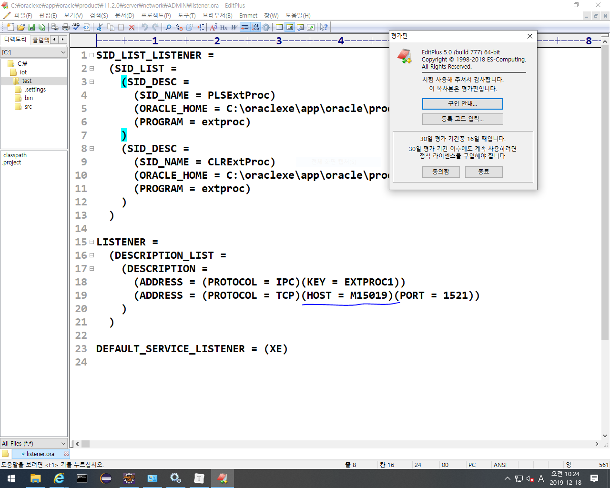
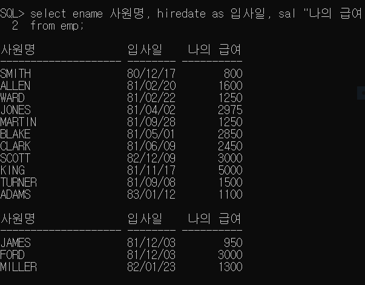
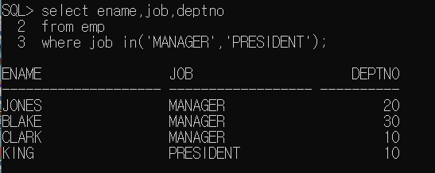

# DBMS(Oracle 설치)

시스템 -> 관리도구-> 서비스

위의 두개 실행 안되어 있으면 오라클이 실행안될 수도 있고 java와 연동하지도 못함.

위의 밑줄이 컴퓨터 이름임, 한글로 되어있으면 안됨. 영어로 바꾸고 맨위의 두개 다시실행해주기.

oracle->product->11.2.0->server->network->ADMIN->listener.ora(editplus로 오픈)

oracle data base 11e -> Run Sql 관리자 권한으로 실행-> 너비2000으로해줘야 데이터가 밑으로 안떨어져서 보기편함

ORA 에러뜨면 SQL 문에서 확인해야됨. 접속 실패했으니까 처음부터 다시해야됨. 지금은 권한부여가 안됬기때문에 접속못한 것.

밑줄친건 매번 해줘야됨.

속성->줄 바꿈선택 사용 하면 이제 내용을 편하게 복붙할 수 있다.

복붙: 드래그 -> 오른쪽마우스 -> 붙여넣기하고싶은 장소에 오른쪽 마우스클릭.

<select 조회할 컬럼 from 테이블 명>

select * from tab; => 조회구문, 내가만든 오브젝트의 리스트들을 보는 것.

select sysdate from dual; => 오늘 날짜 나옴. 

### Run SQL Command Line 사용

SQL> conn system/manager // 접속

SQL> create user scott identified by tiger; // 계정, pw만들기

SQL> grant connect,resource to scott; //사용자에게 처리권한 부여

SQL> conn scott/tiger //이거 해줘서 내가만든 계정에 접속을 해줘야됨.

SQL> set linesize 300; //매번 해주기

SQL> select sysdate from dual; //SQL구문 출력해보기,select는 table에서 행을 검사한다.

## table 만들기

기본키: 하나의 테이블에서 한 role을 구분하는 키워드

- ex) 상품코드, 주문번호, 게시판 번호 등

update,insert,delete 한 후에 commit;을 해줘야 저장이 된다.

그냥 하니까 다 안나와서 라인사이즈 설정해준것임.

select user from dual; => 현재 접속중인 계정을 출력해서 보여줌.

# SELCT 문

### Query - 기본 select

- select 컬럼명1, 컬럼명2, ...

  from 테이블명;

  - sql문은 대소문자를 구분하지 않는다.

  - ;은 sql문의 종료를 의미한다.

    ;을 입력하기 전에 여러줄로 sql문을 작성할 수 있다.

  - *는 모든 컬럼을 조회하겠다는 의미이다.

  - 컬럼에 null을 저장할 수 있다.

    null은 0이나 space만 입력해 놓은 값과 다른 값이다.

    오라클에서의 null은 아무 값도 저장이 되어있는 것을 의미한다.

    사용할 수 없고 저장되어있지 않은 상태이다.

- 컬럼명 대신 alias를 정의해서 사용할 수 있다.(열의 이름을 내맘대로 설정가능)

  select 컬럼명 alias명, 컬럼명 as alias명, 컬럼명 "alias명" => 이렇게 세 가지 구조가 있다.

  (컬럼명 "alias명"은 alias명에 공백이 있는 경우에 사용)

  

- 여러 컬럼을 합쳐서 하나의 컬럼으로 조회할 수 있다.

  |(or연산자) 이용해서 합친다.

- 오라클의 문자열, 날짜 데이터는 작은따옴표(')로 표현한다.

  

- 연산의 결과로 컬럼을 생성할 수 있다.

  (+,-,*,/, 기타함수....) 단, null이 포함되어있는 컬럼은 연산할 수 없다. 밑의 파란부분이 null

  

- 중복이 있는 경우 중복을 제거하기 위해 select문에 distinct를 추가할 수 있다.

  

위의 중복내용을 distinct를 써서 중복제거함.

[실습예제]

1. 다음과 같은 내용을 하나의 컬럼으로 출력하세요

   xxxx의 급여는 ____입니다. 

   

2. 사원번호(empno), 급여(sal),comm, 연봉(계산)을 조회한다.

   sal는 월급여로 alias추가

   연봉은 급여와 comm을 이용해서 계산하기.

   
   
   ### select절에 조건 추가하기
   
   - select[distinct] 컬럼명, 컬럼명,.......[alias명]
   
     from 테이블 명
   
     where 조건 
   
      - 조건에 만족하는 데이터만 조회하겠다는 의미
   
      - where절은 from절 다음에 정의해야함
   
      - where절은 조건식이 true가 되도록 정의해야한다.
   
      - where절에 사용할 수 있는 비교연산자(>, >=, <, <=, =, <>, !=) (<>랑 !=가 다르다는 의미)
   
      - where절에서 조건과 함께 비교하는 값을 추가해야 하는 경우 문자, 날짜는 작은 따옴표로 묶어줘야한다.
   
      - SQL은 대소문자를 구분하지 않는다. 그런데 값을 비교하는 경우는 정확하게 대소문자까지 일치해야한다.
   
        
   
        
   
     - 두 개 이상의 조건이 있는 경우 사용할 수 있는 연산자
   
       and 연산자: 모든 조건이 일치
   
       or 연산자: 모든 조건중 한개만 일치(조건이 모두 다른 컬럼인 경우 사용)
   
       between A and B: and연산과 동일(같은 컬럼에서 조건을 비교하는 경우에 사용)
   
       in 연산자: or연산자의 의미와 동일(같은 컬럼에서 값을 여러개 비교해야하는 경우 사용)
   
       ​                  컬럼명 in (비교할 값,값......)
   
       not 연산자: 부정
   
       
   
       
   
       
   
       
   
   ### null값에 대한 비교
   
   - is null: null인 데이터를 조회
   - is not null: null이 아닌 데이터를 조회
   - 

### like

- 네이버에 장동건 입력했을때 장동건이 들어간 내용을 다 조회할 수 있는것 처럼 입력값이 포함되어있으면 다 조회됨. 

- like는 대표문자(%)랑 같이씀.

- 조건비교를 위해 입력한 값이 문자열에 포함되어 있는 것을 찾는 경우

  %: 모든 문자열을 대표함

  _: 한 자리 문자를 의미 

  컬럼명 like 값%(이런 식으로 선언)

### 데이터 정렬

- select[distinct] 컬럼명, 컬럼명,.......[alias명]

  from 테이블 명

  where 조건

  order by 컬럼명 정렬기준

  - 정렬기준 주는 방법: asc, desc

  - asc: 오름차순 정렬

  - desc:내림차준 정렬

  - 정렬기준을 생략하면 기본은 오름차순

  - 위의 구조대로 써야하나 where문은 생략가능

    

# SQL-Plus에서 사용할 수 있는 명령어

cl scr: 화면지우기

set linesize 300: 화면에 보여지는 글자수 조절

desc 테이블명 : 테이블의 구조 확인하기

conn 계정/패스워드: 접속하기