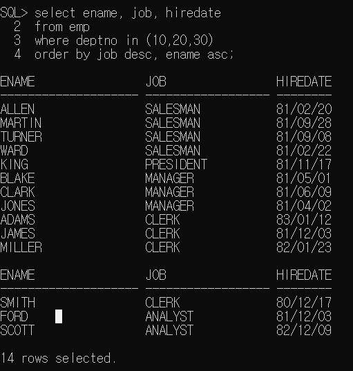
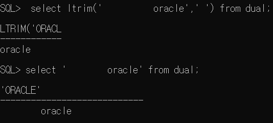
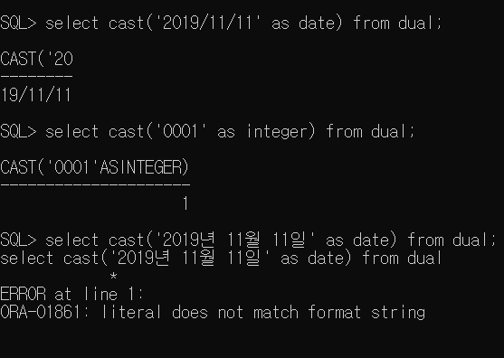
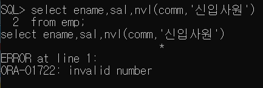
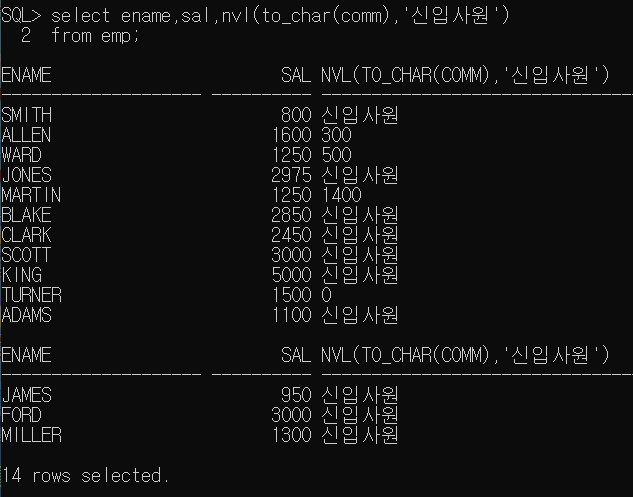
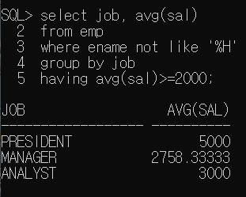

### 정렬

- order by로 한 컬럼을 또 한번 정렬할 수 있다.

  

  - null은 내림 차순일때 제일 크다. 오름차순일때는 제일 작다.

    

    
    
    오라클의 환경 변경(session):원래 한글이었는데 영어로 변경(이걸로 실험하고 다시 한글로 바꿔놨음.)
    
    
    
    
    
    
    
    # 함수
    
    - 함수의 종류에는 단일행 함수와 그룹함수가 있다. 함수는 메소드와 비슷하다.
    
    - 단일행 함수: 한 행마다 조건을 주고 검사하는 애들, 테이블의 모든 행에 각각 함수가 적용됨. select, where, order by 절에 모두 사용할 수 있다.
    
      - 문자, 숫자, 날짜,  변환, null
    
      - 1) 문자열함수
    
        - lower(문자열이나 문자열이 들어가 있는 컬럼명 쓰기): 값을 소문자로 변환
    
        - upper(문자열 or 컬럼명): 값을 대문자로 변환
    
        - initcap(문자열 or 컬럼명): 전달된 값의 첫 글자만 대문자로 변환.
    
        - substr(문자열 or 컬럼명, 시작위치, 문자열의 갯수): 문자 잘라내기, oracle에서                     index는 1부터 시작한다. 
    
        - length(문자열 or 컬럼명): 문자열의 길이를 반환
    
        - instr(문자열 or 컬럼명, 찾을 문자 지정, 찾을 위치, n번째 문자): 특정 컬럼이나 문자열에서 문자의 위치를 찾을 때 사용하는 함수. 찾을 위치나 n번째 문자에 대한 매개변수는 생략이 가능하다. 찾을 위치를 -1로 정의하면 문자열의 오른쪽 끝에서 문자를 찾는다.
    
        - concat(문자열 or 컬럼명,문자열 or 컬럼명): ||연산자와 동일. 문자열 연결.
    
        - lpad(문자열 or 컬럼명, 출력할 문자열의 길이, 남는 공간에 채울 문자.): 전체 출력할 문자열의 길이에 문자열을 출력한 후 남는 공간에 정의한 문자를 채워 출력해주는 함수.(왼쪽에 채움.) ex)주민번호
    
        - rpad(문자열 or 컬럼명, 출력할 문자열의 길이, 남는공간에 채울 문자): 전체 출력할 문자열의 길이에 문자열을 출력한 후 남는 공간에 정의한 문자를 채워 출력해주는 함수.(오른쪽에 채움.) ex)주민번호
    
        - ltrim(문자열 or 컬럼명, 제거할 문자): 컬럼에서 매개변수로 정의한 문자를 왼쪽에서 찾아 연속된 문자만 모두 제거. 주로 공백을 제거할 때 사용
    
        - rtrim(문자열 or 컬럼명, 제거할 문자): 컬럼에서 매개변수로 정의한 문자를 오른쪽에서 찾아 연속된 문자만 모두 제거. 주로 공백을 제거할 때 사용
    
          - dual은 oracle설치시 자동으로 생성되는 1행짜리 dummy table임. test용으로 쓰기 좋다.
    
          
    
          
    
          
    
          아래꺼: a를 찾을껀데 5번째 자리부터 찾을꺼야. 근데 2번째 만나는 a의 위치를 알려줘
    
          
    
          아래꺼: -1은 오른쪽 끝에서 부터 찾는것.
    
          
    
          
    
          
    
          
    
          
    
      - 2) 숫자 함수
    
        - round(숫자, 반올림할 위치): 반올림
    
          
    
      - 3) 변환 함수
    
        - 데이터의 타입을 변환하기 위한 함수.
    
        - 또 다른 함수의 매개변수로 사용하게 될 경우 타입이 컬럼의 타입과 일치해야 하기 때문에 변환 함수 사용
    
        - cast(변환할 값 또는 컬럼명 as변환할 타입)
    
          - <타입>
    
            - 날짜: date
    
            - 숫자: integer
    
              - 마지막껀 date로 바꿔야 되는데 날짜를 구분할 수 있는 '/'를 안쓰고 년월일을 글자로 써서 안된것.
    
              
    
        - to_char(변환할 데이터, 표시할 format)
    
          - 숫자를 문자로 변환하는 경우 사용할 수 있는 format: 세자리마다 콤마를 출력하고 싶은 경우
    
            - 숫자의 한 자리를 표시 => 9 또는 0
            - 콤마=> ,
            - 소수점 => .
            - 통화기호 => w,$,L(지역의 통화기호를 출력)
    
          - 날짜를 문자열로 변환: 년월일 각각의 데이터를 추출하고 싶은 경우
    
            - 년도=> YYYY(ex: 2019만  출력)
    
            - 월 => MM(ex: 12만 출력)
    
            - 일 => DD(ex: 19만 출력)
    
              
    
              
    
              
    
              
    
              
    
      - 4) 날짜 함수
    
        - sysdate: 오늘날짜. 날짜 데이터는 연산이 가능하다.
    
          
    
      - 5) null처리 함수
    
        - 실제로 null인 경우에 어떻게 할 것인지
    
          - nvl(null이 발생할 수 있는 컬럼,null인 경우 처리할 식이나 값): null인경우 대신할 식이나 값을 명시
    
            
    
            아래의 경우는 comm이 num타입인데 null자리를 문자열로 넣을라고해서 에러뜬것.
    
            
    
            문자열 변환해서 해결!
    
            
    
        - null이 아닌경우도 포함.
    
          - nvl2(null이 발생할 수 있는 컬럼, 표현값 1, 표현값 2)
    
            - 표현값1: null이 아닌 경우
    
            - 표현값2: null인 경우
    
              
    
    - 그룹 함수: 먼저 그룹으로 묶여있어야 사용가능. 그룹마다 조건을 주고 검사함. group by를 적용한 후에 사용할 함수이다. (group by: 그룹으로 묶겠어요.)
    
      - where은 한행 한행 함수를 적용하니까 그룹함수와 같이  쓸수 없다.
      - max,avg,sum,min,count 등
    
      
    
      - 아래껀 from먼저 실행되서 emp를 메모리에 올리고 where절이 실행되서 deptno가 10인 애들로 묶은 후 그룹함수들을 select하는 거니까 가능하다.
    
        
    
        - count(공백이 없는 컬럼): 인원수 셀때.
    
          - 공백이 없는 컬럼: primary key컬럼
    
            
    
    # 그룹화
    
    ```sql
    select 컬럼...
    from 테이블...
    where 조건...
    group by 그룹화할 컬럼명(함수를 포함한 식도 가능)
    having 그룹화한 것에 적용할 조건
    order by 정렬할 컬럼명
    ```
    
    - 테이블에 저장된 레코드를 그룹화 하여 분류하고 싶은 경우에 사용한다.
    
    - select절에는 group by절에 명시한 컬럼명과 그룹함수만 사용할 수 있다.
    
      
    
    - 데이터가 복잡한 경우 group by절에 두개 이상의 컬럼을 명시할 수 있다.
    
      
    
      
    
    - having절 : 그룹화한 결과에 조건 적용하기.                        													
    
      - group by 하기전에 적용해야 하는 조건은 where절에 정의
    
      - group by 한 결과에 조건을 적용해야하는 경우에는 having절을 이용한다. (조건에 그룹함수를 써야하면 having에 추가하라는 말)
    
        
    
        2->3->4->5->1->6 순서로 실행됨
    
        
    
        

# 예제 문제

### group by 문제 pdf


출력할 부분에 조건을 적용하려면 select문에서 함수적용.

값을 비교할때는 where절에서 함수적용.

원본을 가공한 후 조건을 넣을땐 group by의 having절에 그룹함수 적용


## groupby_01.pdf 문제

0) 


1) select문의 nvl의 department_id는 null이 아닌경우에 그냥 department_id로 적용이 된다. 그래서 이런 경우에는  group by에 밑에 처럼 쓰지않고 그냥 department_id로 써줘도 괜찮다.


2) 

3) 

4) 

# 조인(JOIN)

두 테이블에 연관성 있는 column이 존재해야하고 한 쪽 테이블의 컬럼이 유니크해야한다(PK),다른 한쪽은 이런 PK를 쓴다(FK) => 이렇게 되어있어야 조인을 쓸 수있음. <= 조인조건

두개의 테이블에서 원하는 값을 추출해서 쓰는 것: 조인(join)

- 작업할때 두개이상의 테이블을 활용하면 다 조인임.
  - inner join:정확하게 일치하는 데이터를 쓸때.
  - outer join: 

조인을 할때~~ = 두개이상의 테이블에서 원하는 값을 뽑아서 하나의 값을 뽑을때~ 라는 말.

- 조인 조건 주기. 누구의 deptno인지 명시!
  -  select는 내가 원하는 컬럼, from은 이 컬럼들이 있는 테이블, where은 조건.

