# JOIN

- 데이터가 계속 늘어나는데 중복된 데이터가 계속 쌓이는 것을 정규화(분리)를 해야한다.

- 테이블을 나눌때 두 테이블의 연결고리가 존재해야한다.

  - PK와 FK간의 연결고리
  - A테이블의 FK를 B테이블의 PK와 비교하며 쓸것이다~

- 조인(서로다른 테이블에 있는 컬럼을 한번에 조회하려면 이걸 써야됨.)

  - 정규화된 테이블이나 혹은 일반적으로 작성된 여러 테이블의 컬럼을 이용해서 데이터를 조회하는 것을 조인이라고 한다.

  - 조인은 관계형 데이터베이스에서 반드시 알아야하는 개념이다.

  - PK와 FK를 이용해서 테이블을 조인

    FK를 가지고 PK테이블에서 값을 비교하여 작업이 진행된다.

  - (주의~!) 조인을 하는 경우 무조건 where절에 조인조건을 정의해야 한다.
  - 테이블을 여러개 사용하는 경우 모든 테이블들의 조인조건을 정의해야하며 select절에서 사용하지 않고 조건으로만 사용한다고 하더라도 조인조건은 정의해야한다. => 사용만 한다면 무조건 조인조건을 적용해야한다는 말.

- [조인 방법]

  - from절에 조회하고 싶은 데이터가 저장된 테이블들을 모두 명시

  - 조인을 하는 경우 컬럼이 어떤 테이블의 컬럼인지 명확하게 정의하기 위해서 

    "테이블명.컬럼명"으로 엑세스한다.

  - 근데 테이블명이 길면 번거로우니까 from절에 테이블명을 정의하면서 alias를 함께 추가하여 alias를 통해 엑세스하도록 한다. (desc 테이블명 으로 필요한 컬럼명을 조회하자.)

    ```join
    select alias1.테이블1의 컬럼명, alias1.테이블1의 컬럼명, alias2.테이블2의 컬럼명...
    from 테이블1 alias1, 테이블2 alias2
    where alias1.테이블1의FK = alias2.테이블2의PK and 또 FK=PK하거나 조건들~~
    ```

  - where절에는 반드시 조인조건을 추가하며 조인조건에는 두 테이블의 값을 비교하기 위해 정의하는 것이므로 FK와 PK를 정의한다.

    FK테이블(child테이블)에 정의된 컬럼값을 PK테이블(parent테이블)에서 비교하여 정확하게 일치하는 경우 값을 가져온다.(조인의 종류에 따라서 정확하게 일치하는 경우 값을 안가져올 수도 있다.)

    (테이블이 두개 -> 조인조건1개, 테이블 세개 ->조인조건 2개 )

    FK에 해당하는 e.deptno와 PK에 해당하는 d.deptno와 일치하는 곳에가서 d.dname을 가져온다

    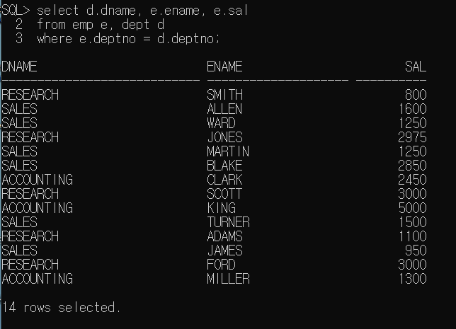

    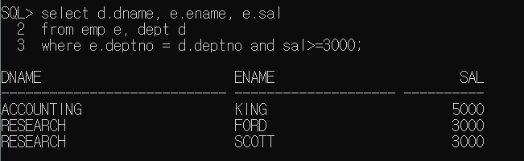

    ex) 부서별 인원수 구하기(부서명으로 출력하기)

    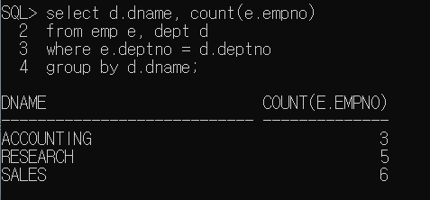

    - 일단 조인을 해야한다는 판단이 서면 where절에 무조건 FK=PK인 테이블을 써준다고 생각

      FK랑 PK는 컬럼명이 같다.

    

    - 버림.

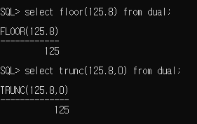

- 올림

  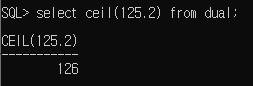

- 김샘 자바_hr계정 조인연습 문제 3번해설

  그룹을 지어주고 적용할 조건인지 그룹을 지어주기 전에 적용할 조건인지 판단해서 having절에 쓸건지 where절에 쓸건지 정하기.

  밑에 group by 절은 d.department_name으로 묶은 후 d.department_id로 묶겠다는 의미임.

- 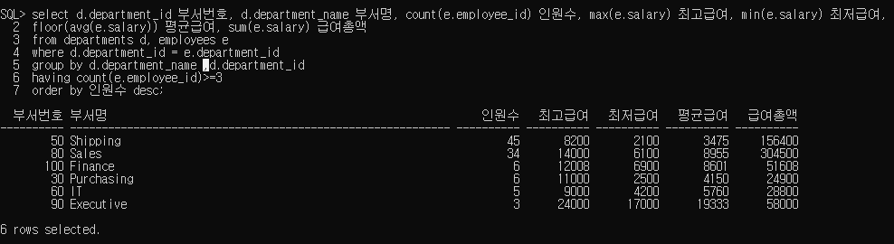

- [조인의 종류]

  - equi join(=inner join): 두 테이블에서 정확하게 일치하는 컬럼에 대한 데이터만 조회(위에 한것.)

  - outer join: 두개 이상의 테이블에 조인을 적용했을때 join조건을 만족하지 않아도 데이터를 조회하고 싶은 경우 사용. 조인조건에 (+)를 추가한다.

    join조건을 만족하지 않아도 한 쪽 테이블에 모든 테이터를 출력하고 싶을때 사용하는 조인방식으로 정보가 부족한 테이블의 컬럼에(+)를 추가한다.

    ``` outer join
    select 테이블 alias.컬럼명...
    from 테이블 alias
    where 테이블alias.컬럼명=테이블alias.컬럼명(+)
    또는
    where where 테이블alias.컬럼명(+)=테이블alias.컬럼명(+)
    
    => (+)기호는 한쪽에만 사용한다. 데이터가 확장되어야 하는 곳에 추가한다.
    ```

    - 원하는 컬럼에 데이터 넣기.

      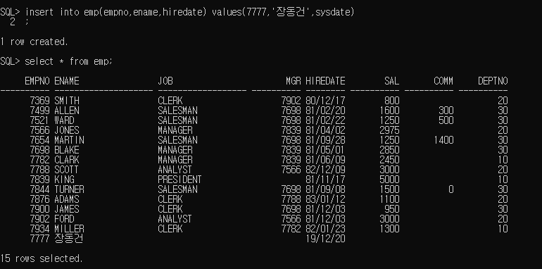

      부족한 데이터 쪽에 (+)를 붙이기. 여기선 emp테이블에 장동건이 있는데 dept에는 장동건이 없으니까 dept쪽에 (+)를 붙인것. (dept쪽에 장동건의 빈공간인 deptno가 추가된다?)

      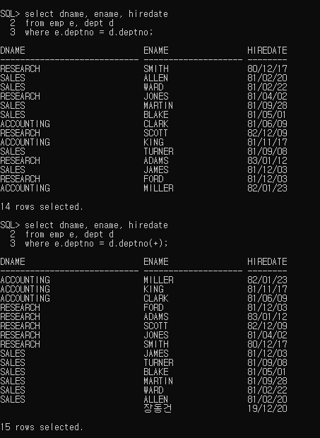

  - [실습예제]

    1. 부서별 인원수를 출력하기

    ​        단, 부서명을 출력하고 인원이 없는 부서명도 모두 출력한다.

    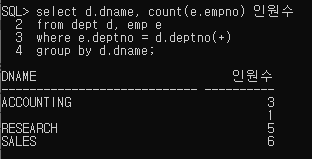

     2. 부서별 인원수를 출력하기

        단, 부서명을 출력하고 부서가 배치되지 않은 사원은 "신입사원"으로 표시한다.

        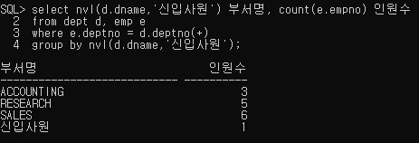

- self조인: 두개 이상의 테이블에서 조인하지 않고 같은 테이블의 컬럼들을 이용해서 조인(하나의 가상테이블) 자기 자신의 테이블을 FK, PK로 나누는것. 중복되는 레코드가 있는 컬럼이 FK다.

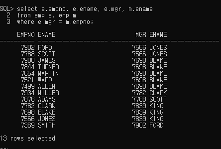

- [실습 예제]

  관리자별 인원수 구하기

  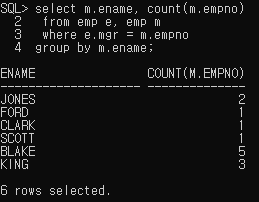
  - 위의 문제 해설: m.ename을 하든 e.ename을 하든, m.empno를 하든 e.empno를 하든지 한관없다. 왜냐하면 empno는 PK니까. 여기서 m은 내가만든 가상테이블이다. where은 FK=PK를 해줘야한다. empno가 PK이고 mgr이 empno에 속한 FK이니까 위에 처럼 해준것.

    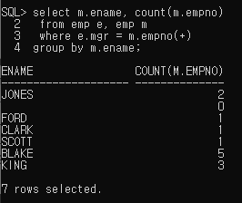

  - 위의 문제 해설: e.mgr에는 null이 있는데 m.empno에는 null이 없으니까 정보가 부족한       m.empno에 (+)를 붙여준 것이다.

    ​							


# 뷰

복잡한 테이블을 저장해 놓은 곳. 자주사용하는 테이블을 등록해놓은게 뷰. 뷰는 select문을 등록해놓은것.

테이블은 물리적으로 하드디스크에 저장되어 있음. 뷰는 실행 시점에만 보여지는 가상의 테이블.

뷰를 만들때는 가상테이블을 쓰는거니까 반드시 select 문에 alias를 해줘야됨.

뷰를 만들려면 권한부여를 해야됨.

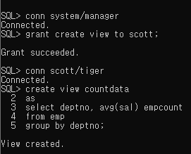

뷰의 이름을 입력하니까 실행되서 나옴.

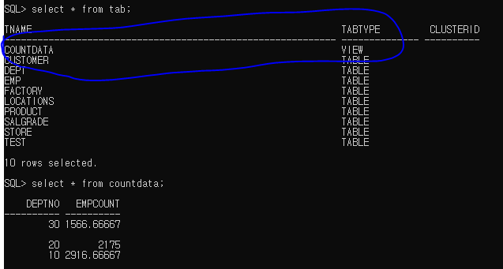

# sub Query

- SQL문에 삽입된 query. 서브쿼리가 메인쿼리보다 먼저 실행됨.

- select 문에서 주로 사용하고 select 문에 삽입된 select문에서

  바깥쪽의 query를 main query, 안쪽에 삽입된 query를 sub query라고 한다.

- sub query는 괄호로 묶어 주어야 한다.

- sub query는 main query가 실행되기 전에 한번 실행되며 그 실행 결과를 main query에서 사용한다.

  [실습]

  10번 부서의 평균 급여보다 급여를 많이 받는 사원들을 조회.

  sub query안쓰면 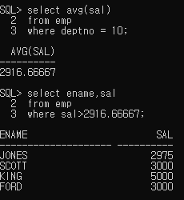

  sub query쓰면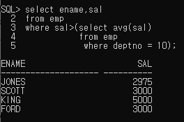

- [sub query의 종류]

  - 단일행 서브쿼리: 결과가 1행 1열인 서브쿼리.(위에 푼거.)

    ​								>,>=,<,<= 연산자와 함께 사용할 수 있다.

    ​								비교 연산자 오른쪽에 서브쿼리를 추가한다.

    - [실습]

      - 전체 평균보다 높은 급여를 받는 사원의 목록(ename,sal)

      - smith와 같은 job을 갖고 있는 사원의 목록(ename,job,hiredate)

      - 10번 부서의 근무하는 사원들의 job과 같은 job을 갖고 있는 사원 목록

        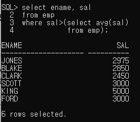

        아래 문제는 job= 서브쿼리니까 서브쿼리가 job에 대한 내용이출력되어야 한다.

        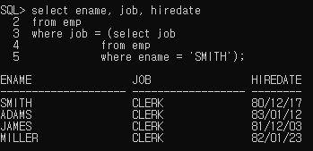

        스미스 뺀경우

        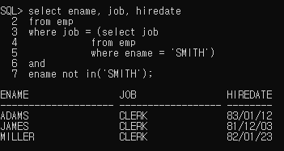

        마지막 문제, 오류 (서브쿼리의 결과값이 세개의 row가 나온다.) 다중행 서브쿼리!

        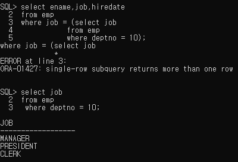

  - 다중행 서브쿼리

    - 서브쿼리의 실행결과가 열 하나의 행이 여러개인 경우

    - = 연산자와 같은 비교연산자를 사용할 수 없다.

    - in, any, all 을 쓸수있다. 

      - in: 컬럼의 값이 정확하게 일치하는 경우

      - <any : 서브쿼리 결과의 최대값 보다 작은 값을 구하는 경우

      - ```
        >any:서브쿼리 결과의 최소값보다 큰 값을 구하는 경우
        ```

      - <all: 서브쿼리 결과의 최소값 보다 작은 값을 구하는 경우

      - ```
        >all:서브쿼리 결과의 최대값 보다 큰 값을 구하는 경우
        ```

      위의 오류났던 문제 풀이.

      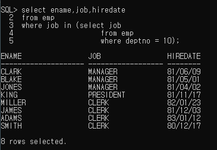

      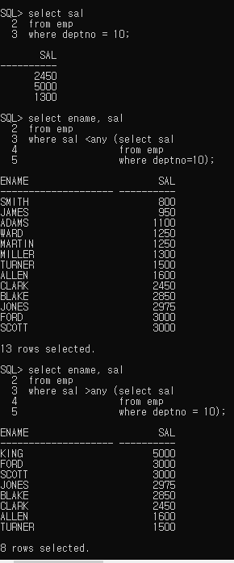

      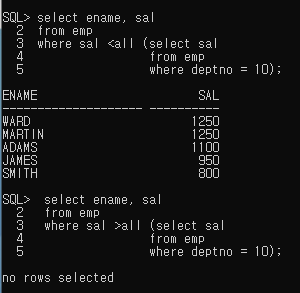

- 다중컬럼 서브쿼리

  - 두개 이상의 컬럼과 다중행을 반환하는 서브쿼리

  - 메인 쿼리의 비교 컬럼의 갯수, 종류가 서브쿼리의 반환 결과(select절)와 동일

  - ```
    where (컬럼1, 컬럼2) in (select 컬럼1, 컬럼2
    						.........);
    ```

  - [실습]

    - 각 부서별로 최소급여를 받는 사원의 정보를 출력(사원명, 부서코드, 급여, 입사일)

  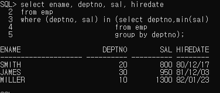

  위의 문제 해설: 서브쿼리에서 deptno를 그룹으로 묶고 출력했으니까 10,20,30이 나옴. 그리고 그 그룹에서 min(sal) 했으니까 1300,800,950이 나옴. 이제 메인쿼리에서 deptno가 10이고 sal이 1300인 사람을 출력 하는 방식으로 3명을 출력함.

  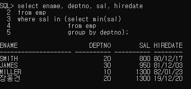

  위에껀 서브쿼리에서 deptno그룹 10,20,30의 최소값인 1300,800,950이 출력됨. 그리고 메인쿼리에서 sal만 비교하니까 deptno가 같아도 sal이 1300인 smith와 장동건이 같이나온것임.

- 상관형서브쿼리(상호연관 서브쿼리)

  - 메인쿼리의 값이 서브쿼리에서 사용되는 경우, 서브쿼리가 실행될때 메인쿼리의 값이 서브쿼리에 사용되는 경우임.

  - 메인쿼리의 한 row에 대해 서브쿼리가 한번씩 실행된다.

  - 메인쿼리의 값이 어떤 값이냐에 따라 서브쿼리의 결과가 달라진다.

  - [실행 흐름]

    - 메인쿼리에서 비교할 값을 가져온다.
    - 메인쿼리에서 받은 값을 이용해서 서브쿼리가 실행된다.
    - 서브쿼리의 실행결과로 메인쿼리가 실행된다.
    - 메인쿼리의 레코드 수 만큼 반복됨.

  - [실습]

    - 소속부서의 급여 평균보다 급여가 많은 사원들의 정보를 출력(ename, deptno, sal)

      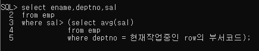

      아래가 정답.

      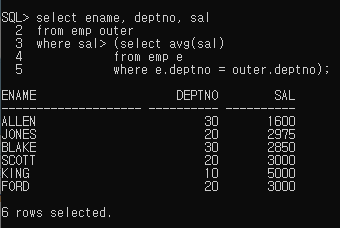

- from절에서 사용하는 서브쿼리(inline view): 뷰로 저장하는게 아니라 직접써서 작업하는것.

  - from절에 서브쿼리를 추가해서 사용 => 서브쿼리 결과를 가상테이블로 사용하겠다는 의미임.

  - from 절에 추가되는 서브쿼리는 alias를 정의해야한다.

  - from 절에 추가되는 서브쿼리 내부의 컬럼은 실제 컬럼처럼 메인쿼리에서 사용해야 하므로(서브쿼리가 메인 쿼리의 테이블이 됨.) 컬럼도 컬럼명이 존재하거나 alias를 정의해야 한다.

    ``` from절
    select 컬럼명 1, ......
    from (select 컬럼....
    	  from 테이블명
    	  where...
    	  group by...) alias
    ```

  - 

    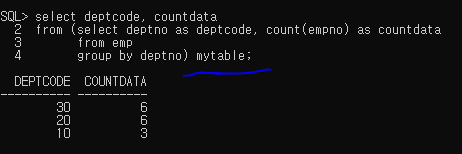

  - [실습]

    - 소속부서의 급여 평균보다 급여가 많은 사원들의 정보를 출력(ename, deptno, sal)

      -  조인과 from절에 추가하는 서브쿼리를 이용해서 작업

        아래 문제에서 계산 결과인 avg(sal)은 반드시 alias를 정해줘야 한다.

        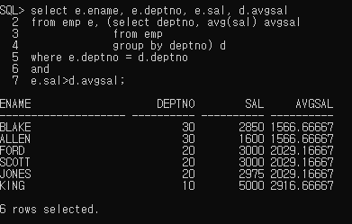

      

## insert

- 하나씩 insert
  - 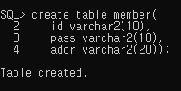
  - 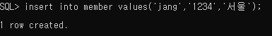
- 여러개 insert
  - dual은 아무작업도 안하겠다는 의미, insert all할때는 dual이 필수
  - 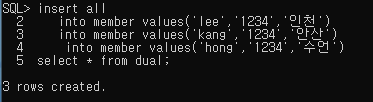
- 아무값도 안넣고 싶을때, null을 직접 쓰기
  - 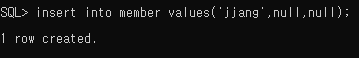
- 위에꺼 다 한 결과
  - 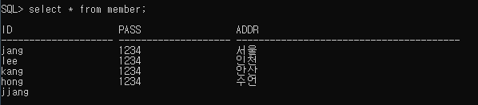

## delete

- delete 테이블명
  - 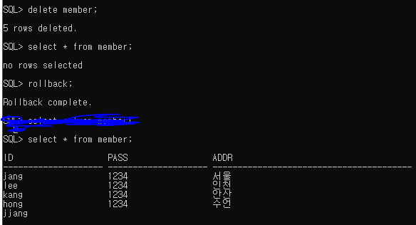
- delete from 테이블명 써도됨
  - 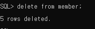

- 하나씩 지울 수도 있음. where절 추가
  - 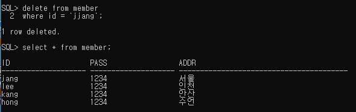
- 조건을 서브쿼리로 만들 수 있음.(밑에 update하고나서 이거 실습했음.)
  - jang의 addr을 조회해서 같은 addr인 것을 삭제.
  - 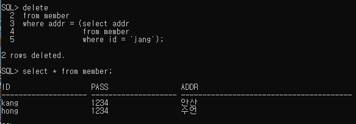

## update (수정)

- 조건을 서브쿼리로 만들 수 있다.
  - 멤버테이블을 수정할껀데 addr을 수정할껀데 id가 lee인사람의 addr을 id가 jang인 사람의 addr과 같은걸로 수정할꺼에여
  - 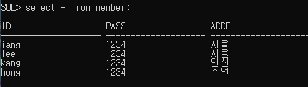


