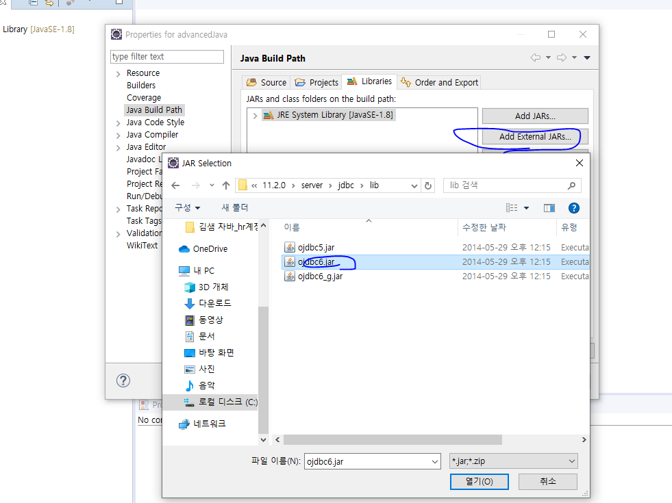

# JDBC (java database connectivity)

- 자바로 db를 엑세스하는 기술임. DBMS내부로 접근해서 SQL문을 실행하겠다는 의미.

- JDBC환경변수

  - 드라이버 다운받기

  

  

  

밑에 이게 중요함. 모든게 저 .class에 의해 시작. 근데 소스가 lock걸려있음. open되면 안되는 중요한 정보임. 그래서 다른방법으로 접근해야됨.

- 무조건 이 순서대로 할것임

  

  - 1.드라이버 로딩
    - JVM이 인식할수있게 메모리에 올리는 작업.

# 결과

- 이클립스로 tb_board 테이블에 insert성공.

# JDBC실행 순서.

1. 드라이버 파일을 JVM이 인식할 수 있는 위치에 연결하기
2. 드라이버 로딩
3. DBMS연결
4. SQL을 실행하는 기능을 갖고 있는 객체생성
5. SQL실행.