# DDL

- 테이블 정의
- 테이블 수정
- 테이블 삭제
- 제약조건
  - not null: 공백이 있으면 안된다.
  - unique: 중복이 되면 안된다.
  - pk: not null과 unique의 속성을 갖고있다.
  - fk: 데이터를 pk값 이외의 값을 정의할 수 없다.
  - check: 컬럼에 입력되는 값에 제한을 두는 것. ex) 10억 이상은 입력할 수 없게끔 제한을 둠.


## 테이블 수정

- 테이블 변경

  - 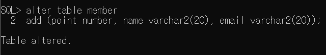

  - 데이터 타입, 길이 수정

  - 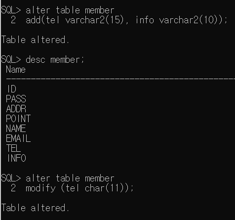

  - 컬럼 삭제

    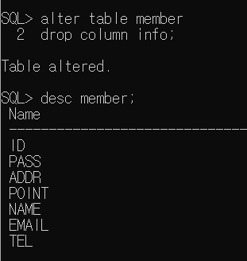

  - 컬럼명 변경

    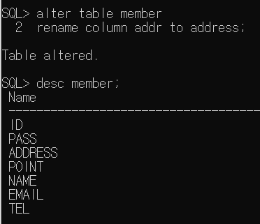

  - 테이블 삭제

    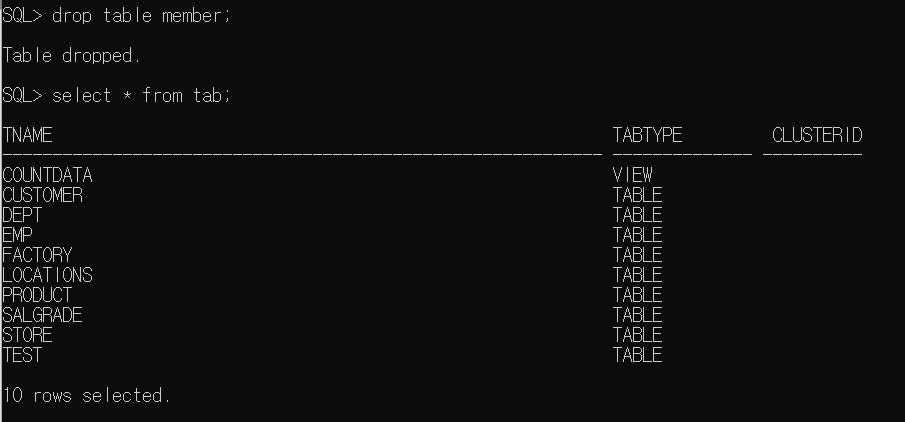

## 제약조건

- not null인 컬럼에 null을 넣었을 때

  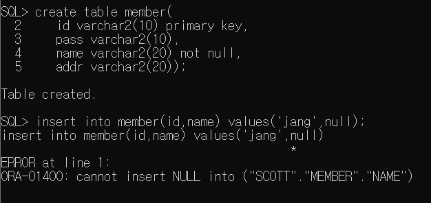

- unique

  - 1번은 unique 제약조건 이름, 2번은 컬럼명

  ​	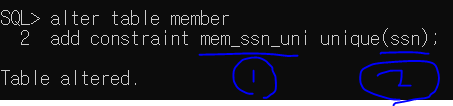

  맨 아래에 mem_ssn_uni 오른쪽에 U는 unique제약조건이란 의미. P는 primary key, C는 not null, 아래에는 없지만 R은 foreign key라는 뜻.

  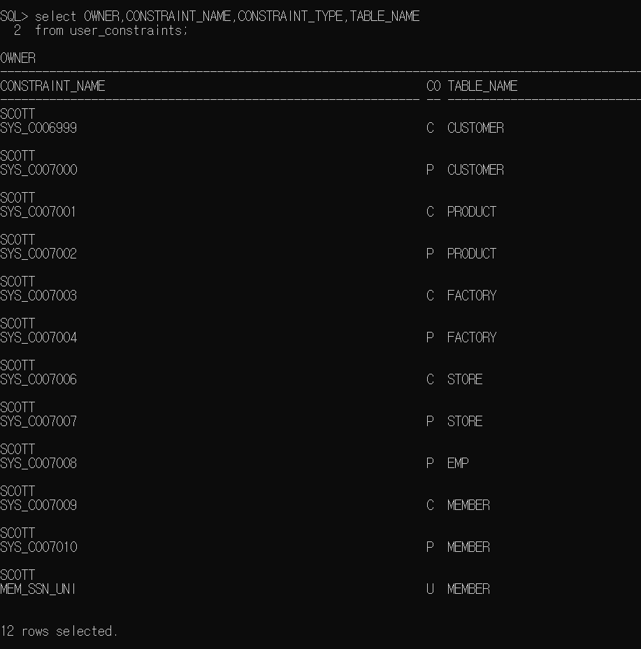

- FK

  - mydept테이블에 PK로 code를 설정하고 001,002를 저장했다. 그러고 난 후 deptcode를 FK로서 reference를 해서 설정을 했다. 근데 003을 insert를 하려고 하니까 PK에 003이 없어서 parent key not found가 에러나는 것을 볼 수 있다.

    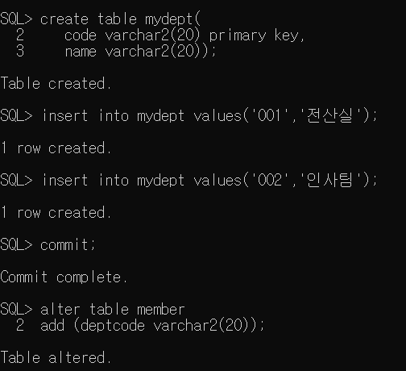

    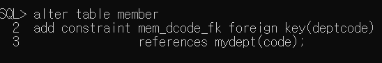

    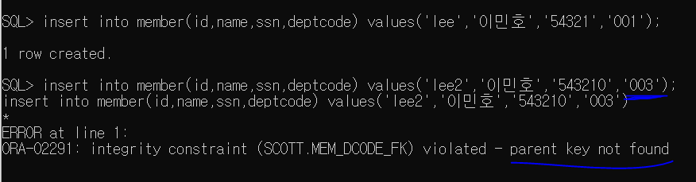

    pk와 fk관계인 테이블에서 pk테이블을 삭제할 수 없다. 지우려면 fk테이블을 지우고 난 후에 지워야한다. pk가 지워지면 fk는 참조할 pk가 없어지니까.

    pk에 없는 값을 fk에 쓸 수없다.

    pk는 바로 삭제할 수 없다.

    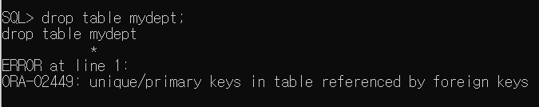

## check(지정한 값만 와야됨.)

- where절에 줬던 >,>=,and 등 쓰는거 다 가능
- addr에는 인천,서울,경기만 올 수 있게 설정.

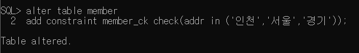

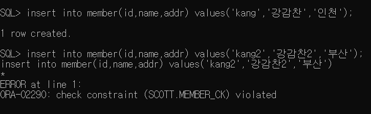

- 제약조건 제거

  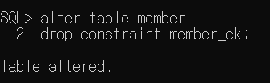

- 여기까지가 5가지 제약조건.

## 시퀀스

- 하나하나 순차적으로 증가해야되는 값이 저장되어있는 컬럼이 있을 때 사용.

  - ex) 게시판 글 번호, 주문번호,

- 테이블 두개 만들고 sequence만듬. myorder에는 일반적인거 저장할 것. order_detail에는 일반적이지 않은 것을 저장할 것(디테일한 구매내역). myorder의 내용을 order_detail이 가져다 써야됨.

- 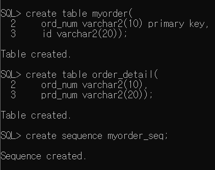

- myorder의 주문번호가 하나씩 증가해야됨

  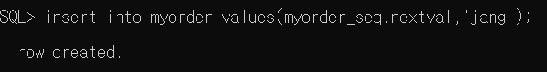

- order_detail은 myorder vlaue의 현재 주문번호를 가져와야됨.

  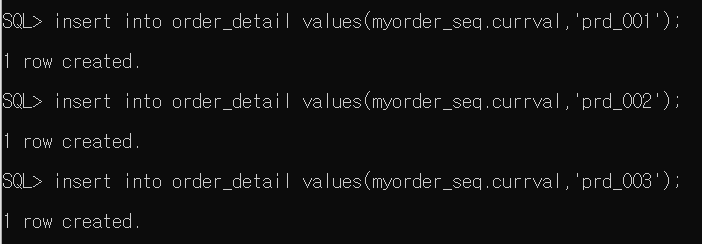

- 시퀀스 실행되는 과정

  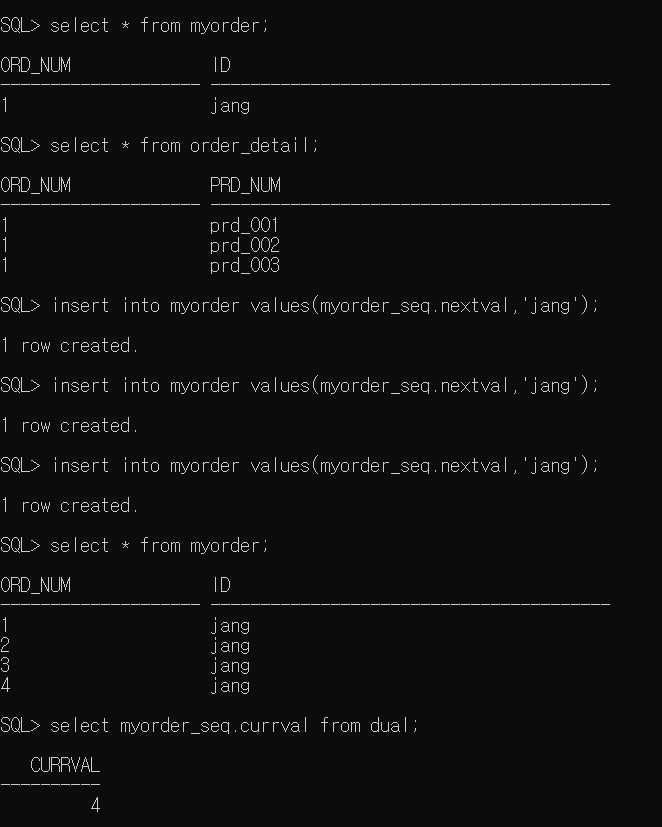

- 시퀀스 삭제

  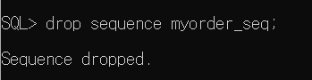

``` bash
테이블 명 변경
alter table
바꿀테이블명 rename to 바꾸려는테이블이름
```


### hit(조회수 증가)

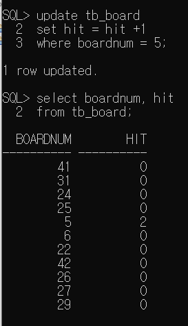