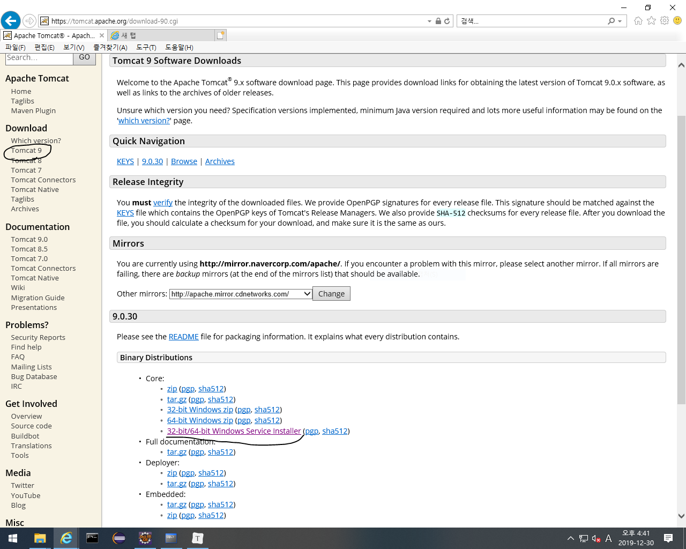
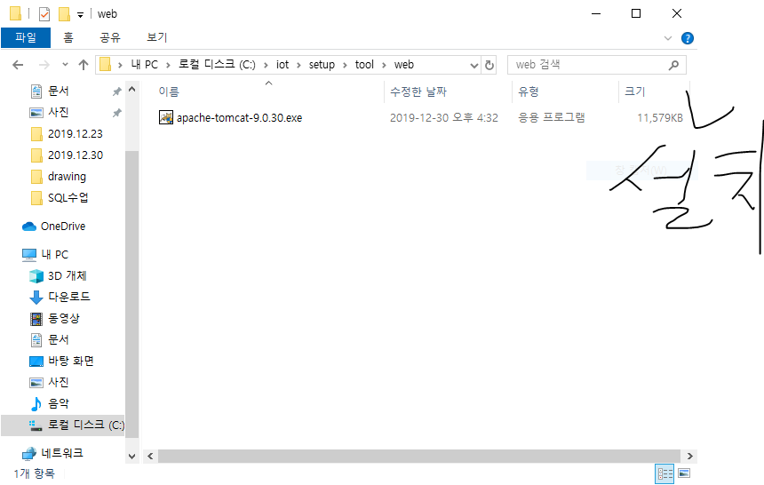
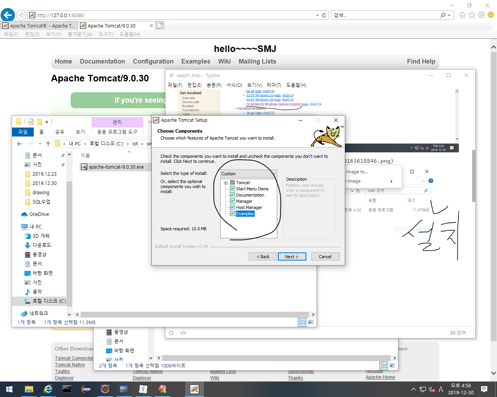
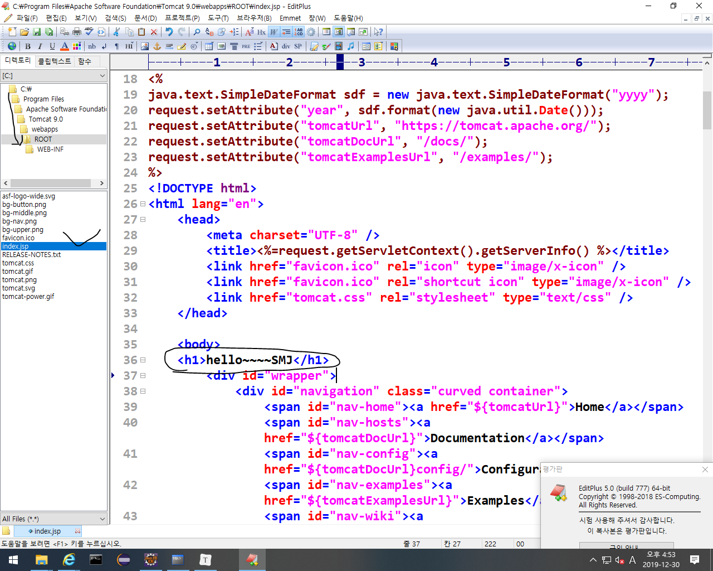
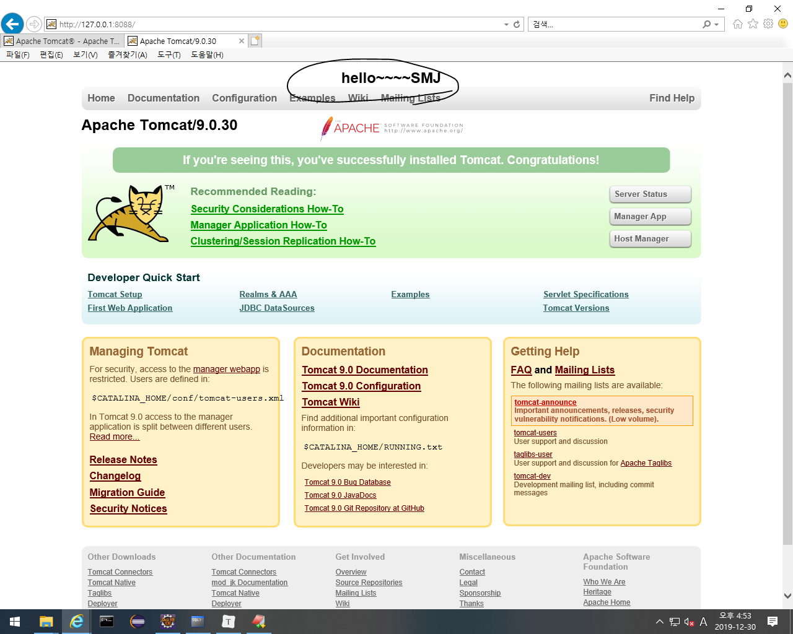

# web

- web application server(WAS)= web server의 기능을 갖고 있고 자바를 해석할 수 있는 컨테이너 기능도 갖고 있는 애

  

- 설치

인터넷에서 apache.org -> tomcat -> 아래 그림처럼 눌러서 다운로드 후 설치할 때 처음에는 전부선택, finish누르기 전에는 전부 선택취소.

모두 선택

- 설치후
  - 시작 -> Apache Tomcat 9.0 Tomcat9 -> monitor tomcat -> 오른쪽하단 빨간색 중지를 우클릭해서 service start하고 인터넷에 http://127.0.0.1:8088/ 넣으면 접속가능

editplus를 관리자 권한으로 실행 후 아래 그림처럼 폴더 들어가서 동그라미 친거 입력하면 밑의 동그라미처럼 제공되는 페이지에 글을 작성할 수 있다.<- 제공되는 페이지에 들어가서 글 작성

- html(뼈대): 웹페이지를 구성하는 글, 그림들
- css: 클라이언트가 보기좋게 웹 페이지를 꾸미는 것.

- javaScript: 클라이언트가 액션을 취하면 메세지를 뿌리는 등 응답을 함.