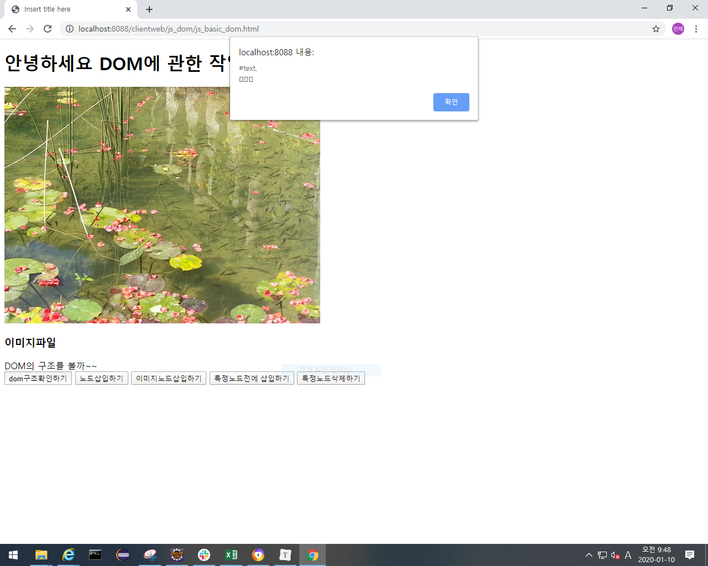
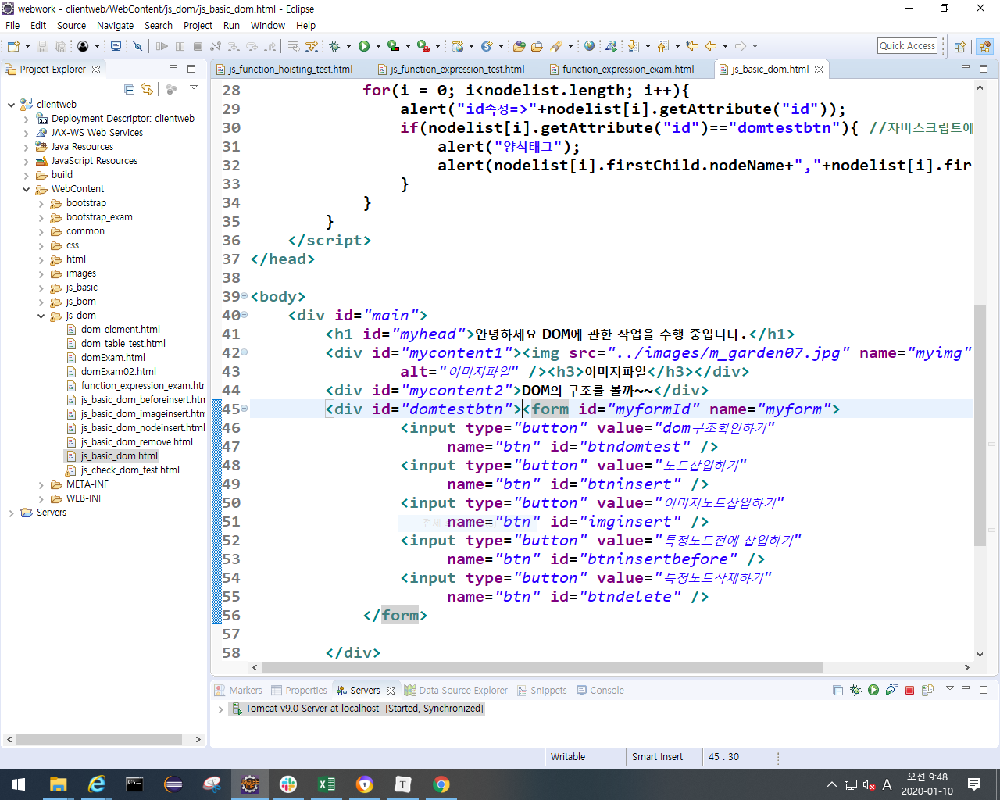
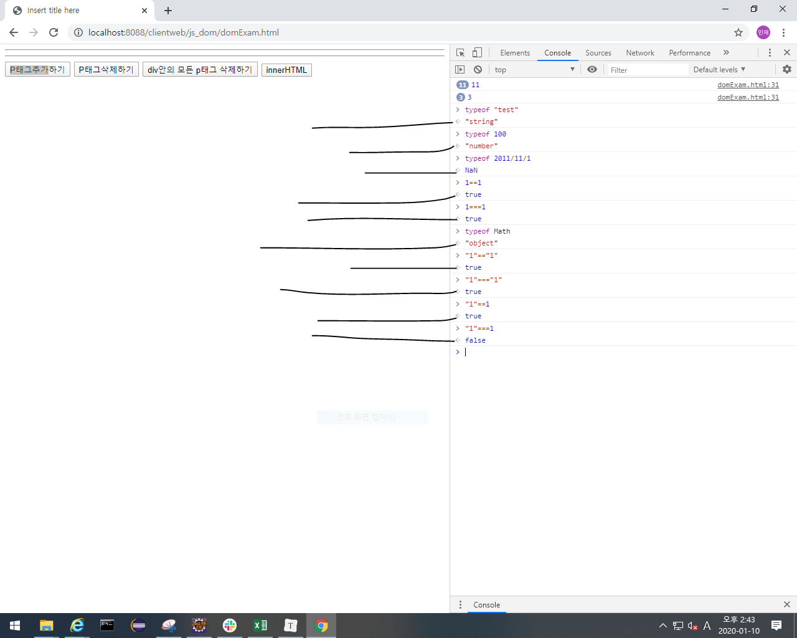

## 웹 페이지를 제어하기 위한 작업(376P)

### BOM(브라우저의 구성요소를 객체로, 391P)

- frames[] 은 안씀.
- 주로 할 일은 document에 있는 form객체를 제어해야됨.
- 체크박스는 여러개가 입력되니까 배열과 for문으로 제어해야됨

 

### DOM(문서의 요소 하나하나를 객체로) 376쪽

- javascript에서 안하고 jquery에서 작업함.

- 내가 정의하고 내가 만들어서 쓰는게 DOM임.

- xml이나 HTML문서에서 DOM이 정의됨
  - DOM parser = DOM을 분석하는 것.

- getElementsByTagName
  - getElementsByTagName은 노드의 구조와 상관없이 해당 태그를 모두 찾는다.

- getAttribute 
  - getAttribute는 노드(엘리먼트, 태그)에 정의된 속성의 값을 리턴한다.

- 위의 동그라미 실행할 때, 공백때문에 에러나니까 없애주셈. 공백도 하위 요소에 포함이 되어버리기 때문이다.

- console.log
  - 밑에 선 그어 놓은게 data type(NaN: 숫자가 아니다. 
  - 
  - "1"==1: 값만 비교하니까 true
  - 1===1 : 값만 비교하는게 아니고 타입도 비교함 false. 정교하게 비교할 땐 이걸 써야됨.