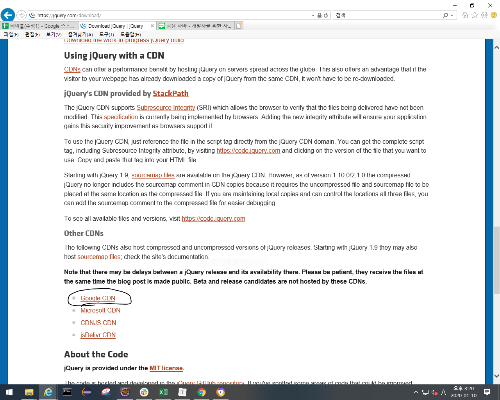
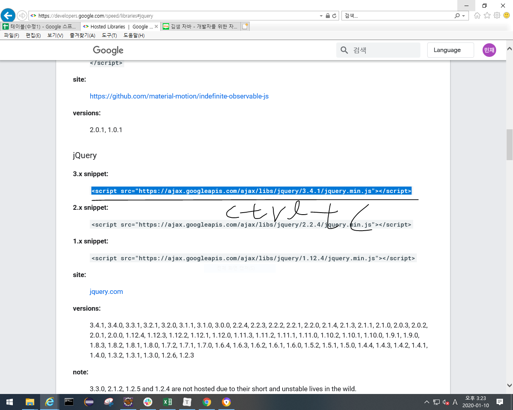
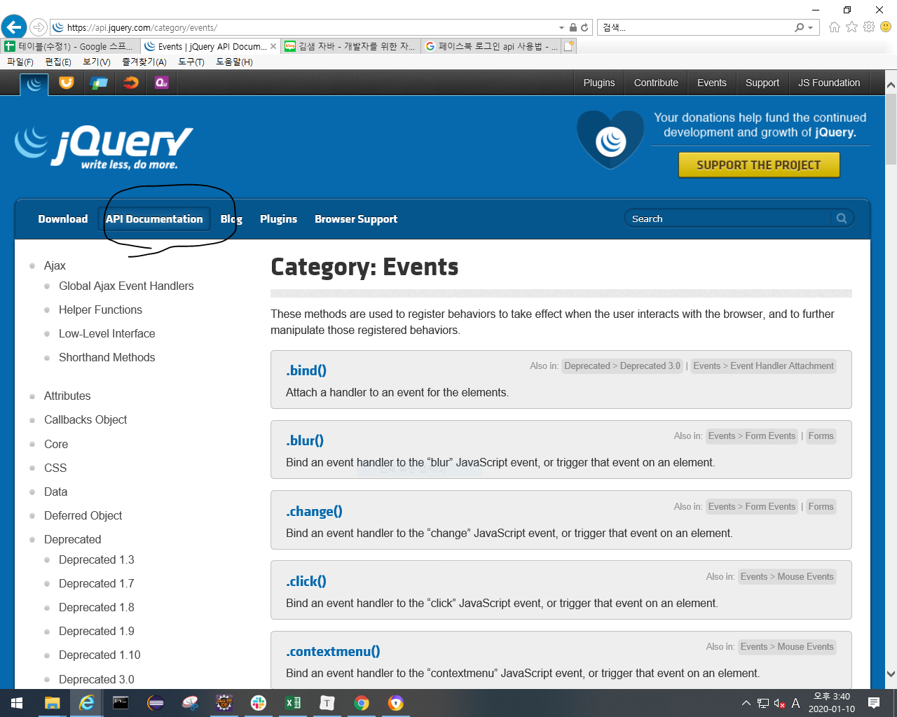
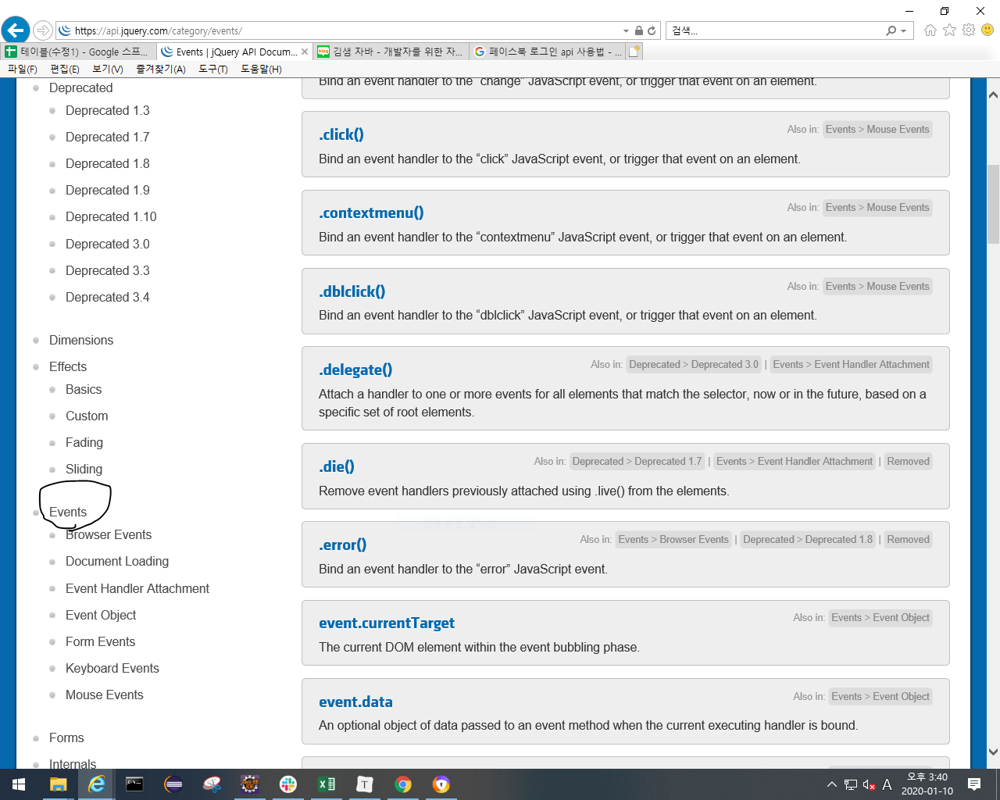

# jquery

- dom을 쉽게 쓰기 위한 것. 나중에는 Ajax도 쉽게 쓸 수 있음
- jquery는 자바스크립트의 라이브러리이다. 그래서 bootstrap처럼 cdn으로 연결해야됨. url복붙할 때 버전 체크하기!



- 밑에 복사한게 항상 있어야 jquery쓸수있음



<script src="https://ajax.googleapis.com/ajax/libs/jquery/3.4.1/jquery.min.js"></script> 

- $(선택자).____     (여기서 선택자는 css의 선택자와 같음 -> #, .)

``` jquery
$(document).ready(function() {
			
		});
-> $: jquery문법입니다.라는뜻.
```



'

- 위처럼 확인가능.