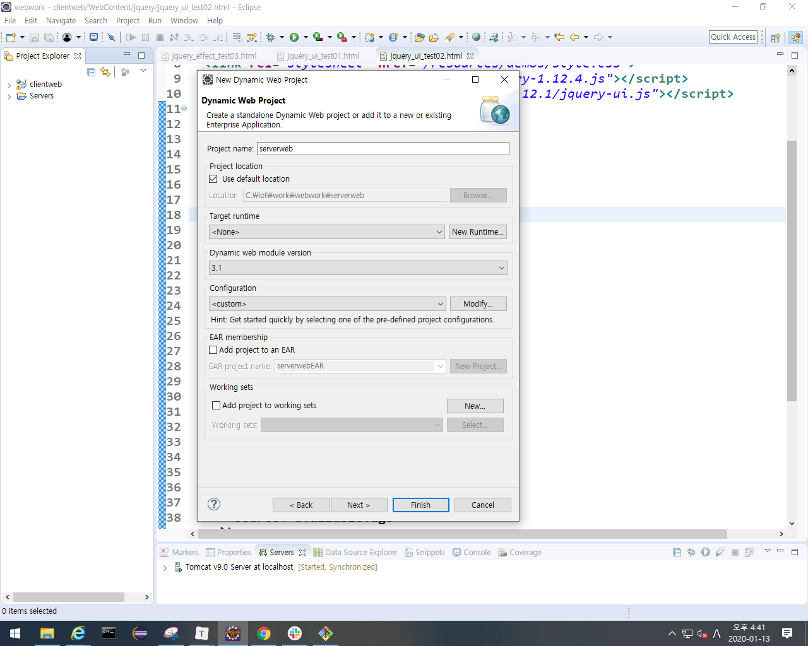
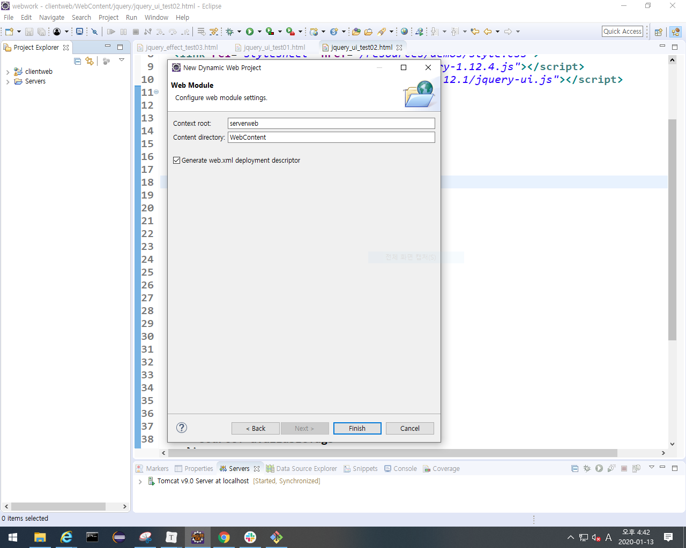
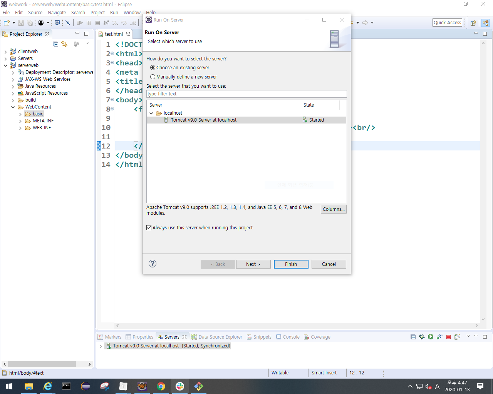
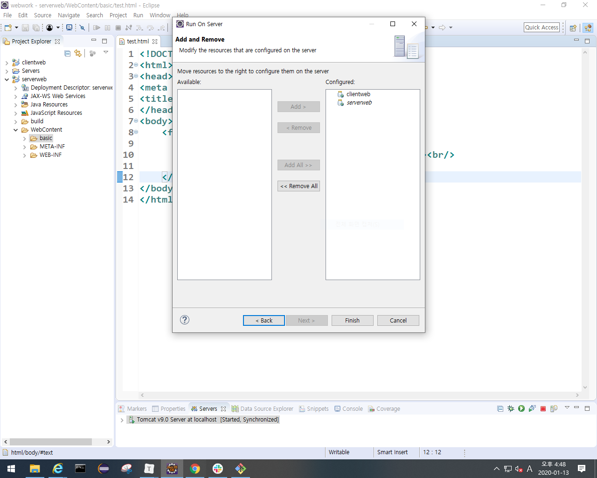
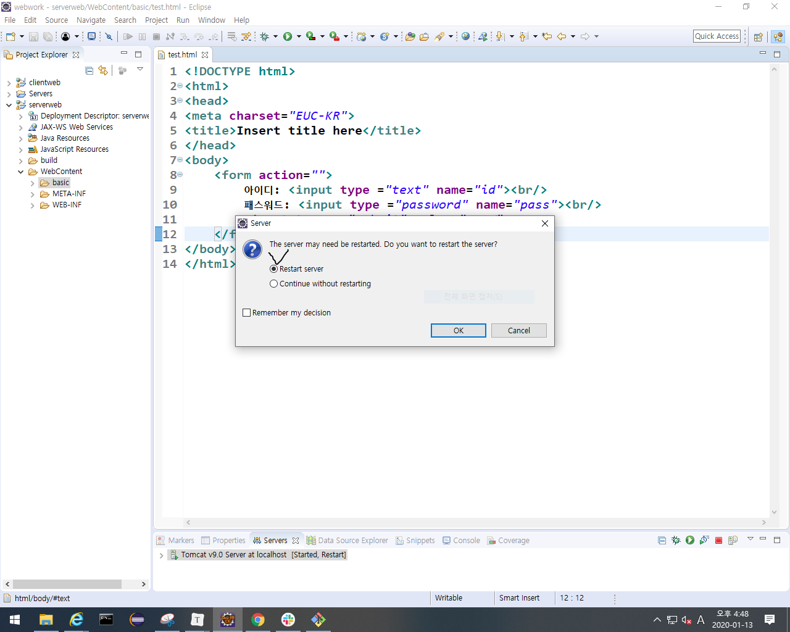
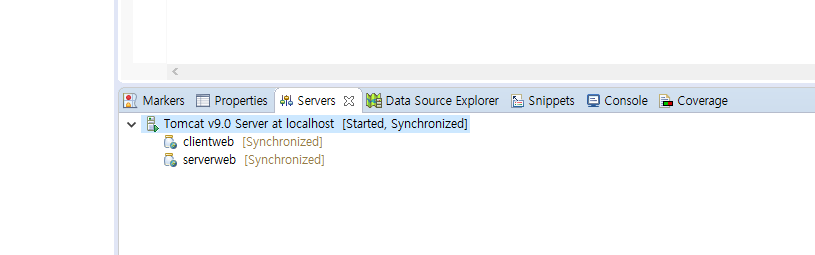
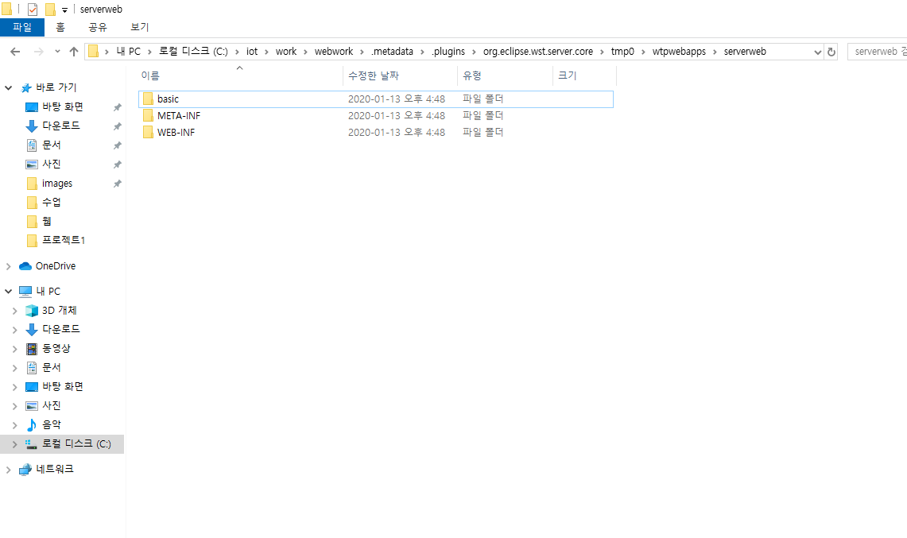
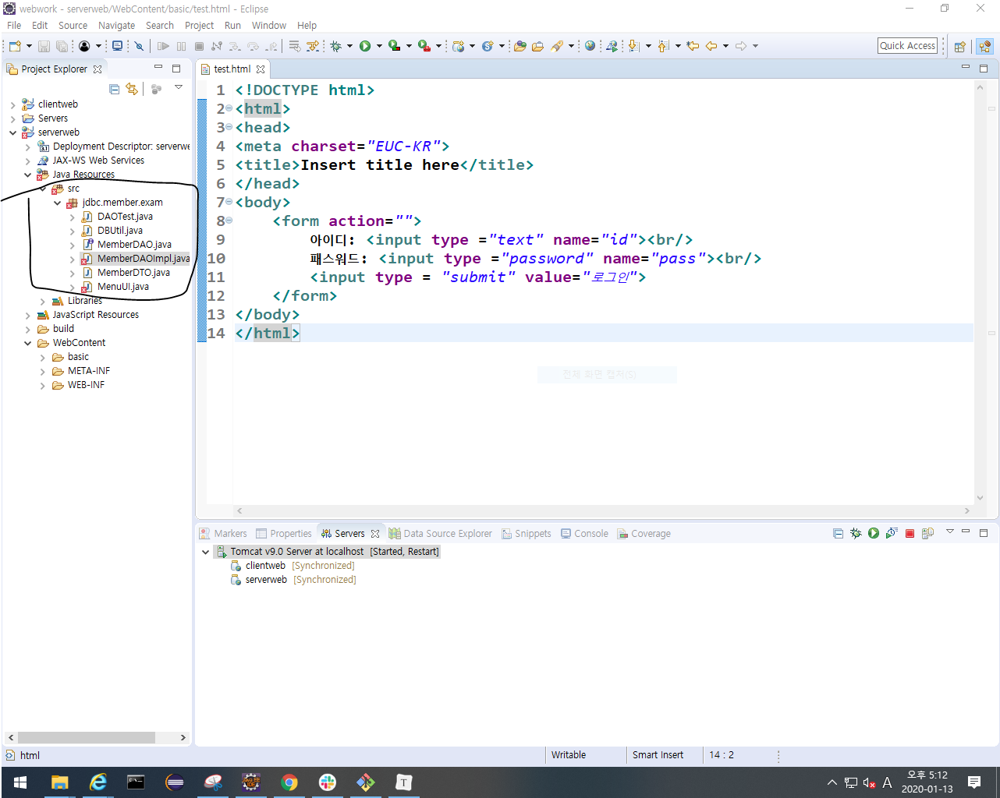
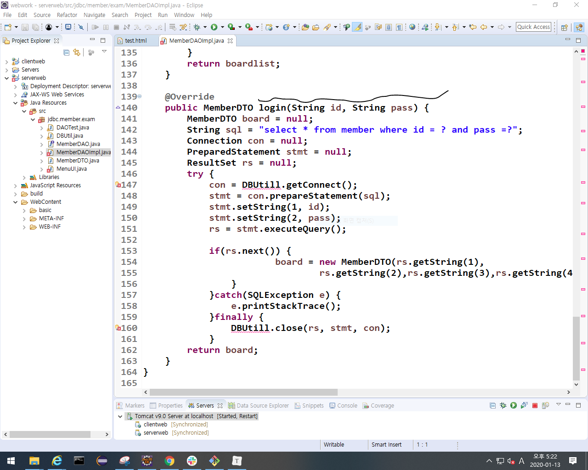

## servlet JSP

- 서버에 데이터 저장, 서버에서 데이터 가져오기

configured가 서버가 인식하는 위치

- 서버가 인식하는 위치임.
  - 김샘자바 -> 프로그래밍 -> 서블릿JSP -> 서블릿 디렉토리에 설명있음.

- 서버가 인식하는 위치
- 

- JDBC의 member폴더를 복붙

- 위 사진에서 submit버튼을 누를때 DAOImpl의 로그인이 실행되어야 한다. 자바는 html에 명시할 수 없으므로 submit버튼을 누를 때 servlet이 실행되서  DAOImpl의 로그인이 실행되도록 해줘야 한다.
  - servlet은 웹에서 자바코드를 실행되도록 해준다.

1. 서블릿을 만들때는 작성 규칙이 있다.

2. 서블릿은 공통으로 실행하는 방법이 정의되어 있다. 

   -> 누가 만들어도 다 실행되야하기 때문에.

3. 사용자가 입력한 데이터를 서블릿으로 전송하기

4. DB연동