# Servlet JSP

- 웹 플랫폼에서만 사용되는 기술.

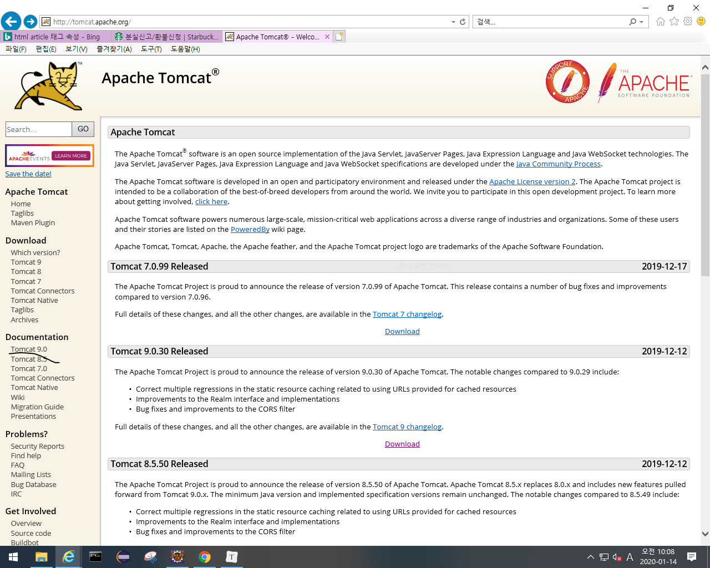

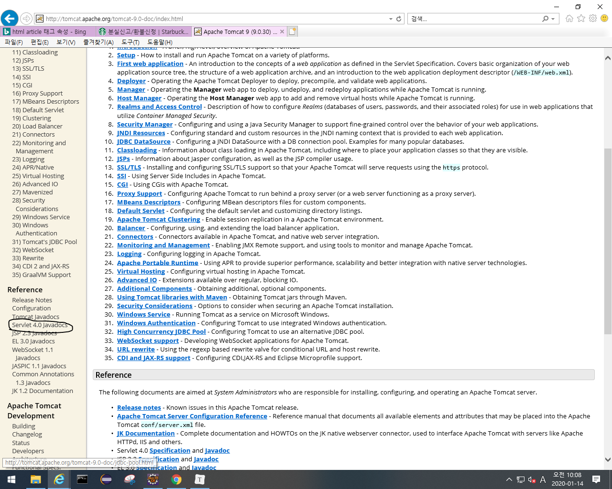

위의 동그라미 누르고 즐겨찾기에 추가해놓음.

- HttpServlet을 상속시켜서 서블릿 클래스로 만드는 방법.
  - serverweb 우클릭 -> build path -> configure...

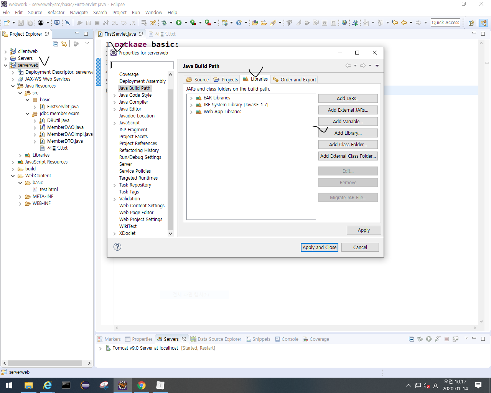

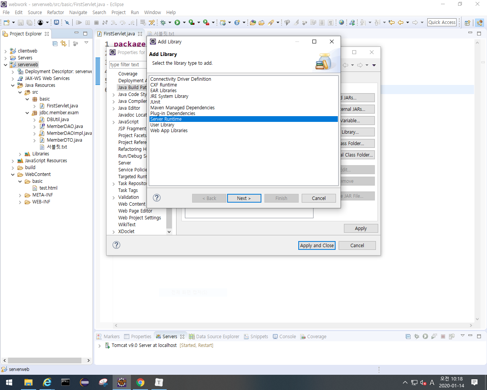

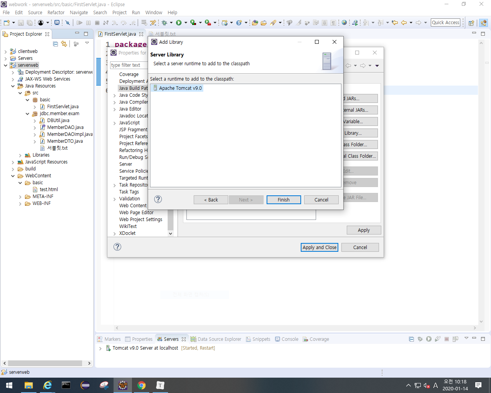

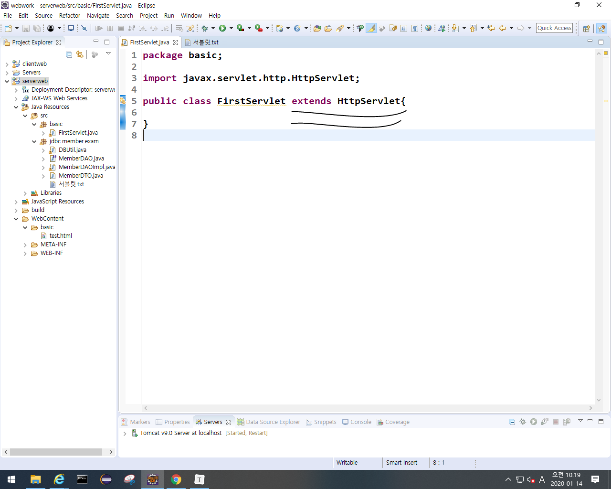

- xml 
  - 설정파일을 저장.
  - 다른 기종간의 데이터를 교환하기 위해 쓰는 언어. 근데 일일이 파싱해야해서 xml은 무겁다. 그래서 만들어진게 Json.
  - 아래 동그라미는 항상 세트임.
  - xml이 바뀌면 서버를 내렸다라 올려야됨.

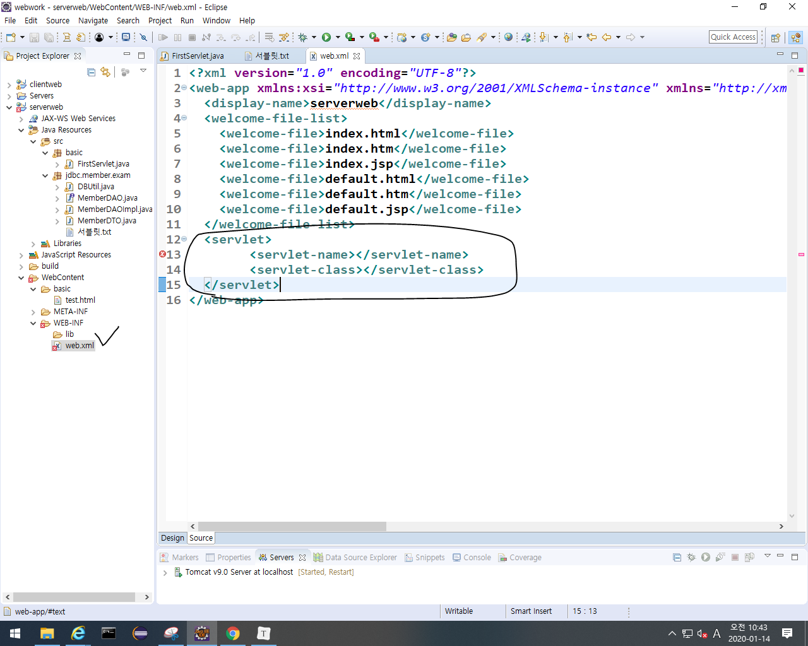

- 처음 run on server하면  서블릿 객체생성....   서블릿객체의 초기화 init().... 클라이언트의 요청 처리 service()....가 콘솔 창에 뜸.

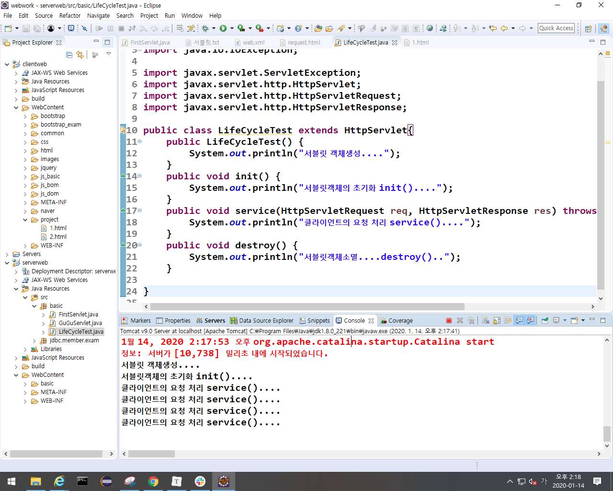

- run on server해서 생긴 아래의 창에서 F5를 누를때마다 클라이언트의 요청 처리 service().... 가 계속 생긴다. service만 요청된다는 뜻임.

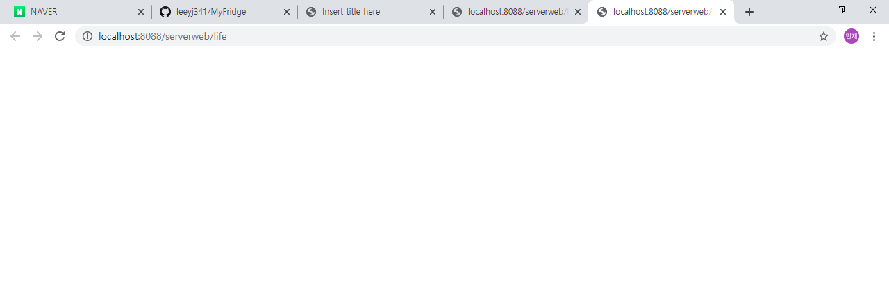

- LifeCycleTest을 수정하면  destroy가 실행되고 다시 run on server하면 객체가 생성되는거부터 시작함. (ctrl+s할때마다 destroy됨.)

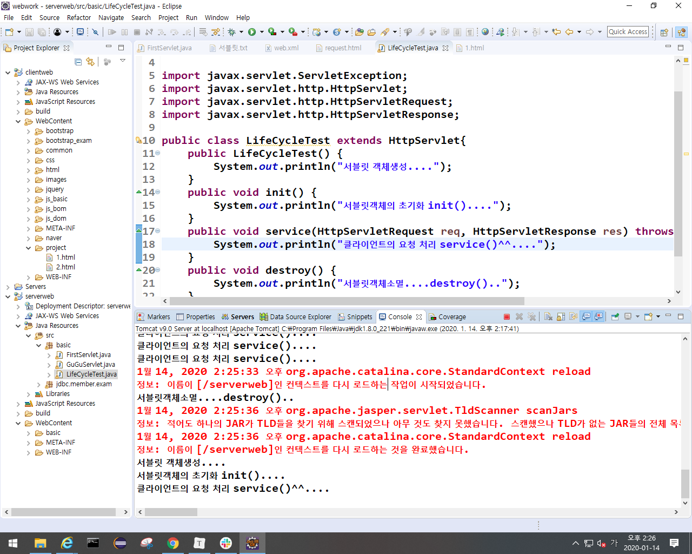

- service를 주석처리하고 doGet, doPost를 오버라이드하고 run on server후 F5연타~!! -> doGet이 계속 호출됨.
  - service 주석 해제하면 doGet이 호출이 안됨.
    - service가 호출될때  req.getMethod()로 GET인지 POST인지 판단하고 get이면 doGet호출되고 post면 doPost호출되도록 조건문 만들어줘야됨.

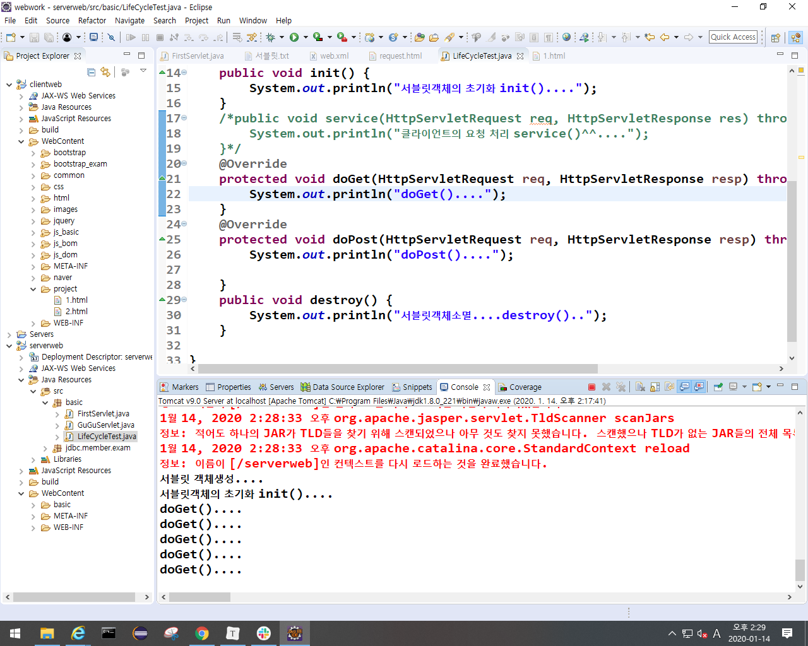

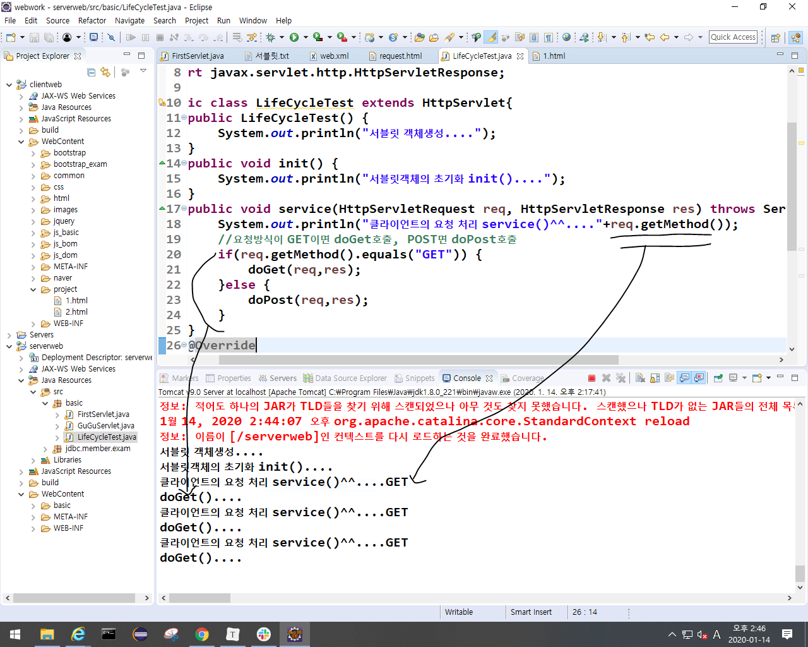

- 아래에서 run on server 해서 아래에 체크한거 전송버튼 누르면 doPost()....가 호출되는 것을 볼 수 있다.

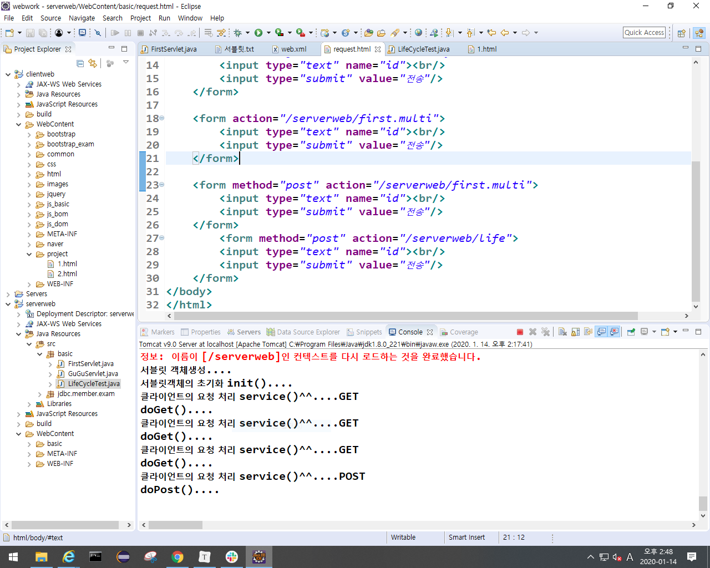

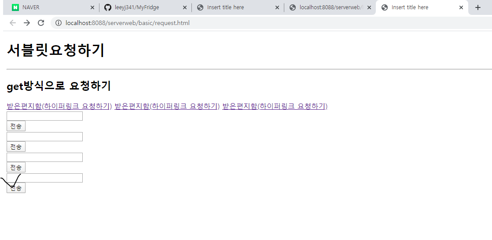

