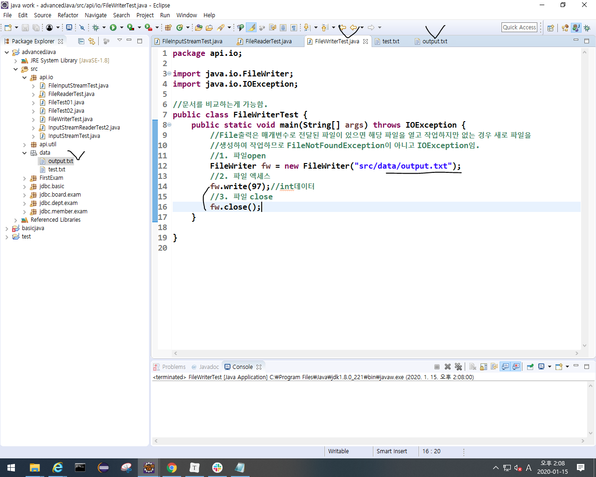
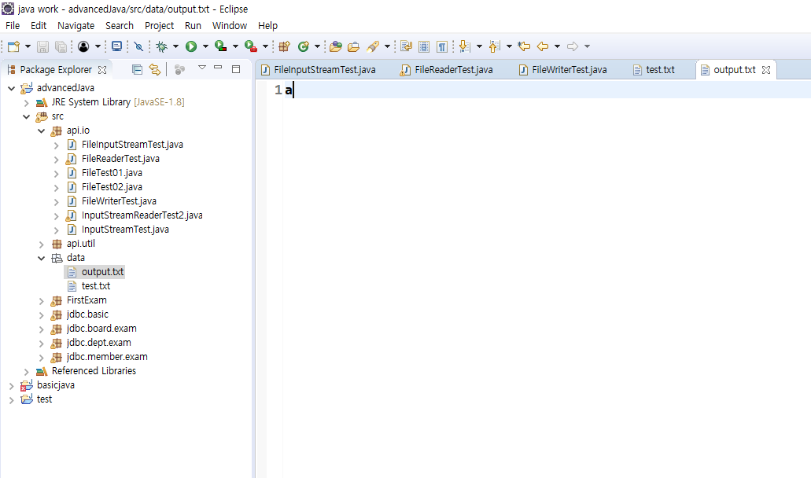

## I/O(자바2 868page)

- 자바 프로그램이 기준임.
  - 자바 프로그램으로 데이터가 들어오는게 input (파일,키보드,네트워크로부터)
  - 자바 프로그램으로부터 데이터가 나가는게 output (파일,모니터,네트워크로)

- byte 단위로 I/O
  - ~~InputStream: byte단위로 입력
  - ~~OutputStream: byte단위로 출력
- 문자 단위로 I/O
  - ~~Reader: 문자단위로 입력
  - ~~write: 문자단위로 출력

- file I/O쓸때
  - 3단계!! 모두 생성자로 처리가능.
    - open -> access -> close

#### 파일에 글 쓰기

- 코드 작성하고 data폴더에서 F5누르면 output.txt에 글 써짐.

