# Json

- Ajax는 xml데이터로 통신하는데 이건 무거워서 요즘엔 Json을 쓴다.
- 김샘자바 -> 프로그래밍 언어 -> Json
- 형태
  - 태그명{"a" : "b"; "c":[]........}
- 중괄호 {}
  - Json object를 의미 => DTO를 맵핑할 때 사용
- 대괄호 []
  - Json Array를 의미 => Array List를 맵핑할 때 사용

- 브라우저가 응답하는 타입(Mime타입)
  - application/json

- Json형태의 데이터에 접근하는 방법.
  - . 으로 타고 가면서 접근

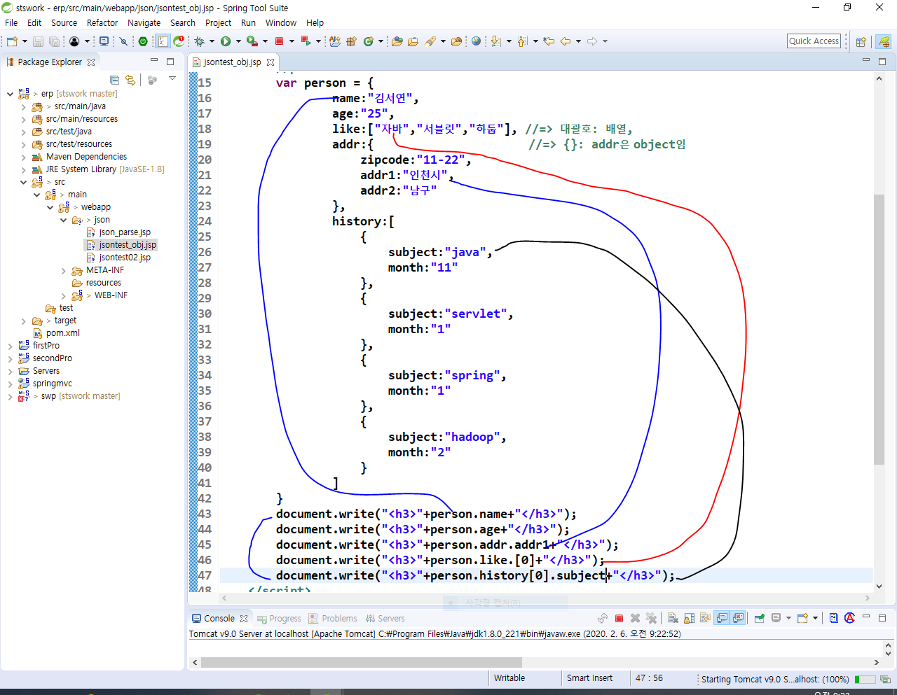

### Json validator

- 아래처럼하니까 에러
  - name에 큰따옴표 없어서 난 에러

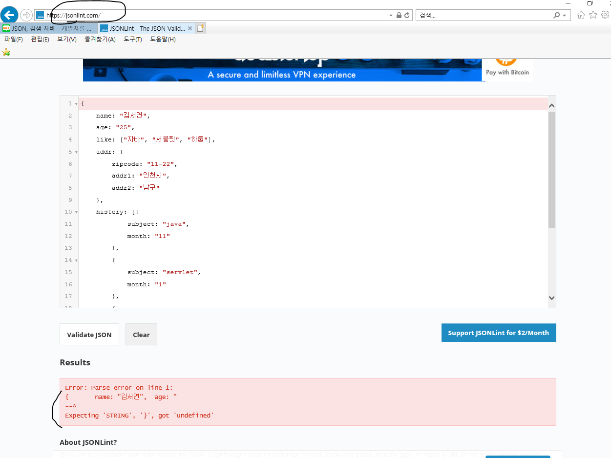

- 그래서 stswork의 jsontest2를 복붙
  - 위의 에러 해결한거

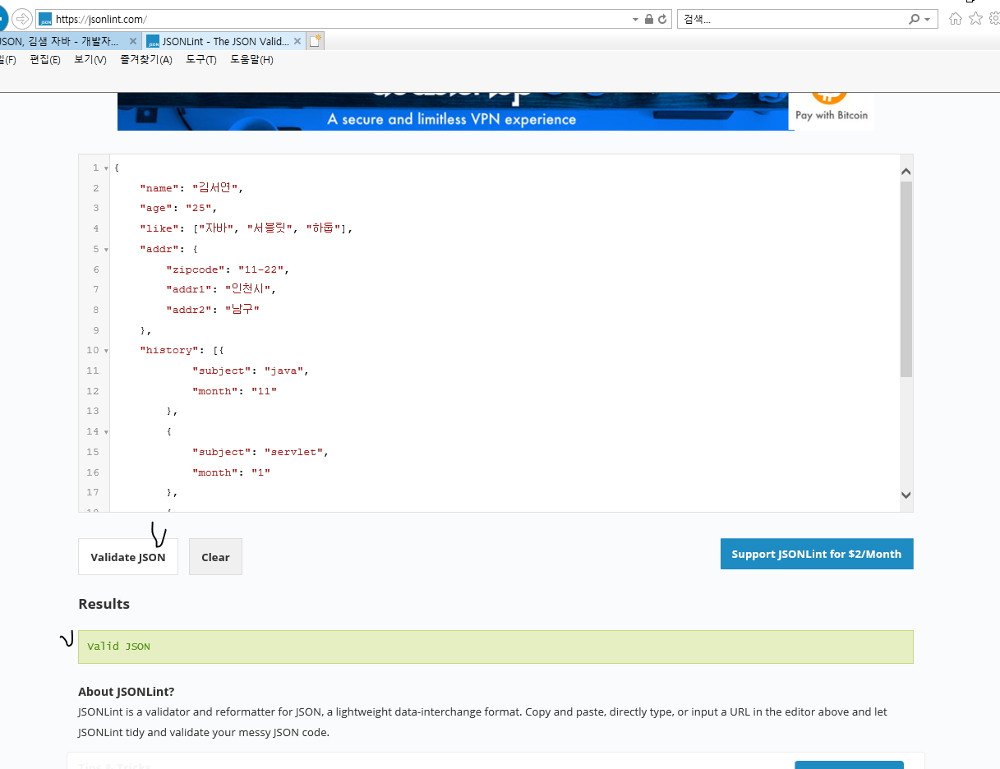

- 결국 json형태의 데이터를 파싱할 때 validator를 사용하면 유효한지 검사를 할 수 있다는 말.
  - 이걸로 코드가 틀린부분이 있나 검증

- 아래 사진에 표시한 곳을 Ajax로 처리.

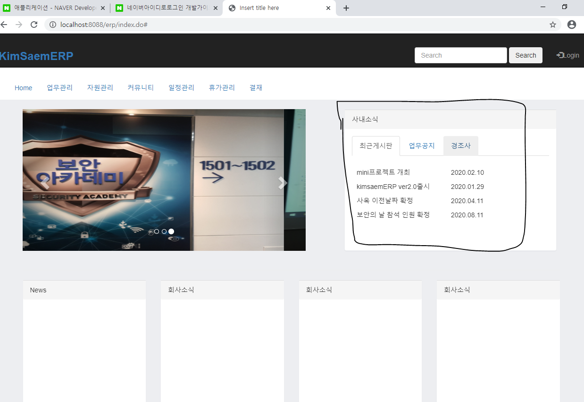

- 김샘자바 -> 프로그래밍 언어 -> 자바에서 json객체 생성하기 -> 링크 클릭

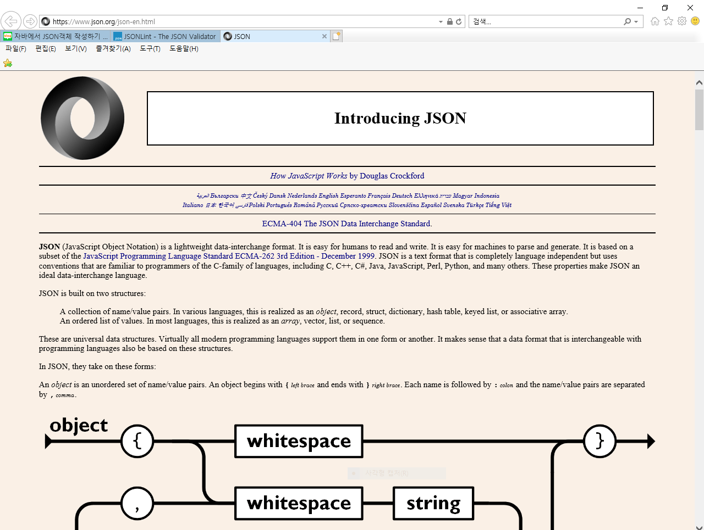

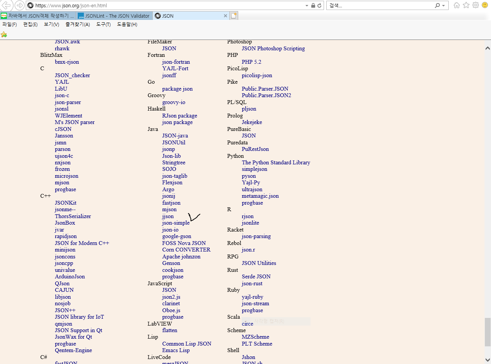

- 우리는  mavenrepository에서 두개의 라이브러리를 받을거임
  - json 파서
  - jackson 바인딩

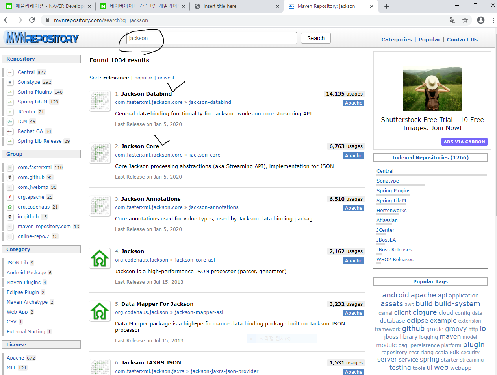

- jackson core랑 Jackson Databind 둘다 -> 2.4.6 -> dependency복사 후 stswork의 pom.xml에 복붙

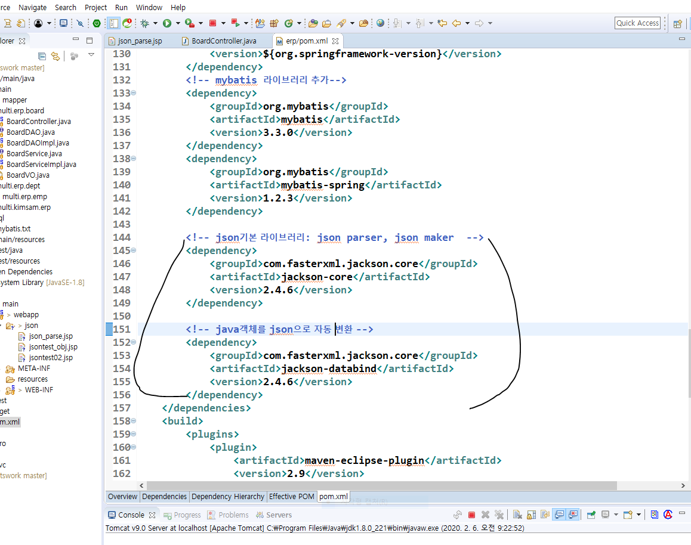

- 내가 원하는 ArrayList형식의 BoardVO만 Json형식으로 데이터를 넘김.
  - produce: 내 response타입을 json형식으로 변환해서 데이터를 넘겨주세요.
  - DAO, Service등은 여태랑 똑같이하고 컨트롤러에서만 달라짐.

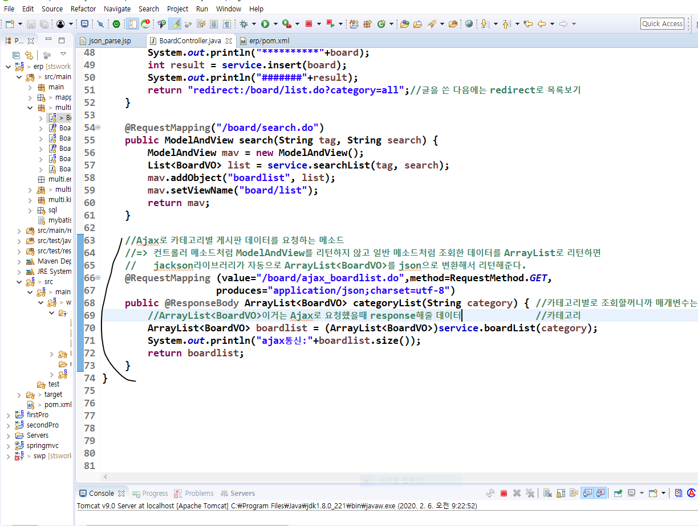

- 동적으로 뷰 만들기
  - 1번 : for문을 통해서 커뮤니티 게시판에 넣을 데이터들을 추출하는 작업
  - 2번,3번:  data배열의 요소들에 저장되어있는 BoardVO의 title과 write_date들을 가리킴
  - 4번: 커뮤니티 게시판을 클릭할 때마다 기존의 데이터는 지우고 선택된 게시판의 데이터를 추출하기 위한 작업.

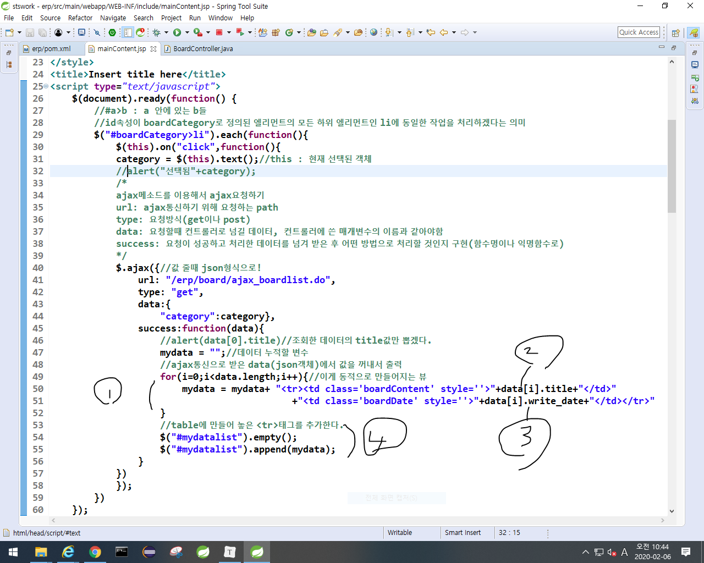

- 선택된거

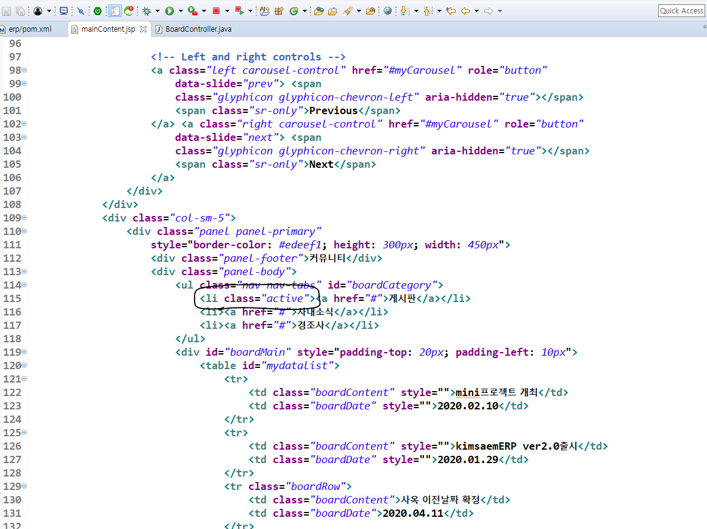

- 아래 코드 추가하면 클래스에 적용된 속성을 지우고 선택된 클래스에 active를 추가할 수 있다.
  - 위 사진에서 게시판이 active로 정해져 있는데 아래 사진의 코드를 추가하면  

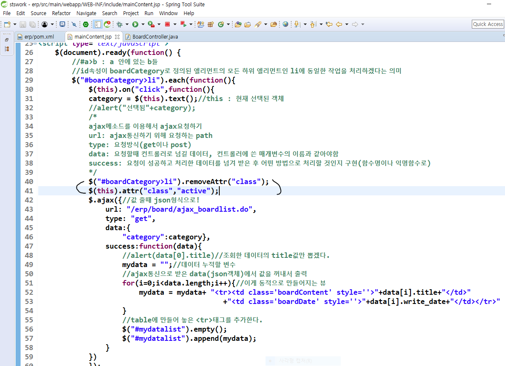

## sts에서 sql문 쓰기

- help-> instoall new software -> Name = mypligin , location = https://download.eclipse.org/datatools/1.14.0.201701131441/repository -> eclpise data tools 체크 -> next -> install 
- window -> show view -> other -> datasource