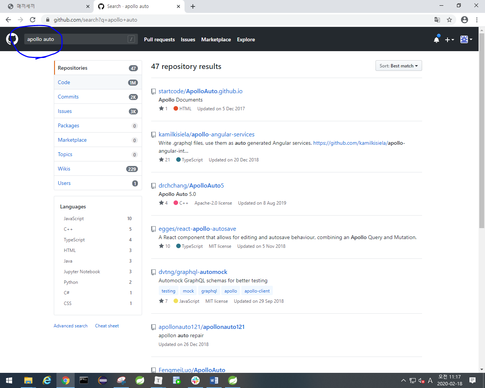

김희원 선생님 futurian@naver.com

010-2224-6128

https://kr.linkedin.com/in/heewon-kim-95531724

딥러닝, 머신러닝, 빅데이터, 인공지능분야 전문가.

# 딥러닝, 인공지능 소개

- SLAM = 자율주행, 로봇주행, 길찾기

  **SLAM**(Simultaneous localization and mapping), **동시적 위치추정 및 지도작성**은 [로봇공학](https://ko.wikipedia.org/wiki/로봇공학) 등에서 사용하는 개념으로, 임의 공간에서 이동하면서 주변을 탐색할 수 있는 로봇에 대해, 그 공간의 지도 및 현재 위치를 추정하는 문제이다.

- 데이터 가공(돈 많이 범)
  - 매우 중요함. 데이터를 갖고 있는 회사의 장래가 유망함.
  - R분석, 라벨링, 데이터 수집 및 분석,

- GITHUB
  - 프로젝트 관리용
  - 오픈소스 참고용

- papers with code(웹 사이트)
  - 논문을 볼 수 있고 code도 볼 수 있음.

- 커넥티드카에 필요한 데이터
  - 자동차 데이터, 부품데이터, 주행데이터, 센서와 장비에서 얻어지는 데이터... 

# 자율주행차/커넥티드카/스마트카

- 자율주행차 개발 현황
  - 승용차는 한참멀었음
  - 상용차, 도심용 공유이동체(자율셔틀,자율택시,PM등)은 활발함.
- ADAS 센서(초음파, 레이더,Vision, 라이다)
  - 전후측방 카메라 (초음파, 레이더, 라이다)
  - 전방, 적외선 카메라 (VISION,라이다)

- MCU와 ECU가 서로 CAN통신을 함.

#### 자율주행차 오픈소스

- apollo.auto
  - 자율주행자동차 중국 사이트. 오픈소스(??)
  - github에 접속해서 apollo auto 검색하면 오픈소스 있음.

- github.com/commaai/panda
- github.com/commaai
  - open pilot

# 학습 방향

- 프로젝트 수행
- 오픈소스 소프트웨어/하드웨어 활동
- 외국어
- 유용한 사이트
  - Github
  - 캐글 (Kaggle)
    - 딥러닝, 머신러닝 관련 문제 해결을 위한 경진대회
  - papers with code

#### 구인동향

- Restful API
  - GET, POST방식으로 데이터 교환하는 것.

- linkedin, 채용공고 등에서 필요한 기술을 확인해서 분석하기.

#### 딥러닝/머신러닝 학습 코드(text파일로 올려주심.)

- 구글이나 AWS에 계정만들어서 프로젝트 시연한거 저장해놓기.

- AWS기반 딥 러닝
- Udemy (13200원)
  - 싸네

- udacity nano degree
- 자율주행차 오픈소스
  - awosome이 들어간게 잘 정리되어있음.