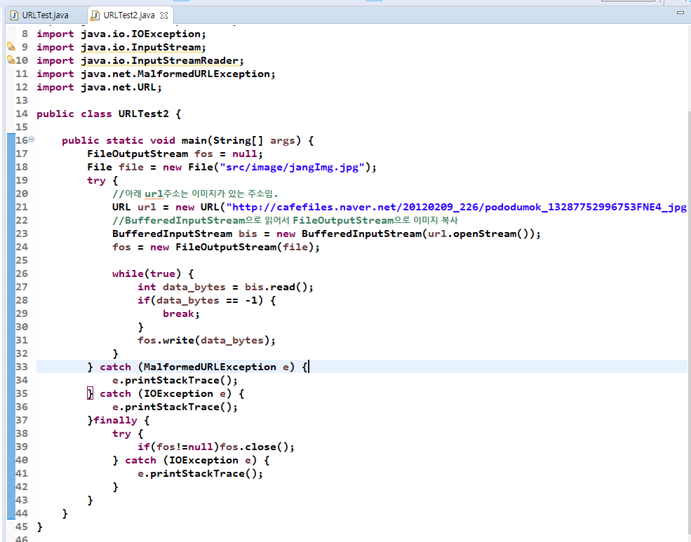

- TCP(949)

  - 연결지향

  - 데이터를 보낸 후 데이터가 잘 갔느지 확인함. 데이터가 잘 안갔다면 다시 데이터를 보냄.

### InetAddress

- 클라이언트가 서버에 접속했을 때 클라이언트가 서버의 주소를 얻을 때 씀???
- 호스트명, IP주소를 얻을 때 씀.
  - getHostName, getHostAddress

### URL클래스

- 아래 두개 사진처럼 UTF-8로 인코딩을 맞춰줘야 URL의 데이터를 가져올 때 한글이 안깨짐

- url의 자원일 읽기!!

- 결과

#### 이미지 카피해서 파일로 저장하기(이게 IO임)

- BufferedInputStream,FileOutputStream를 사용하기
  - FileOutputStream을 사용할 땐 반드시 close해서 자원반납해줘야함.

- 결과

