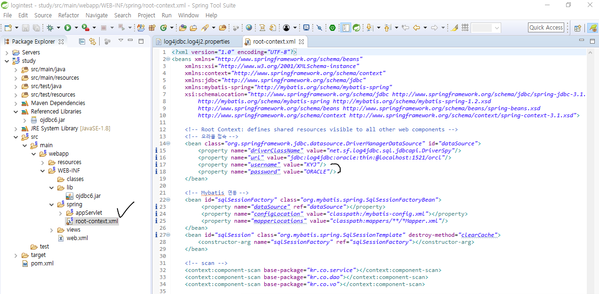
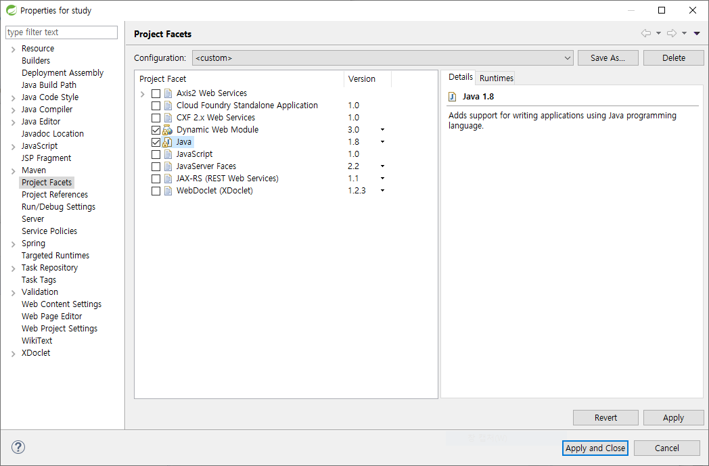
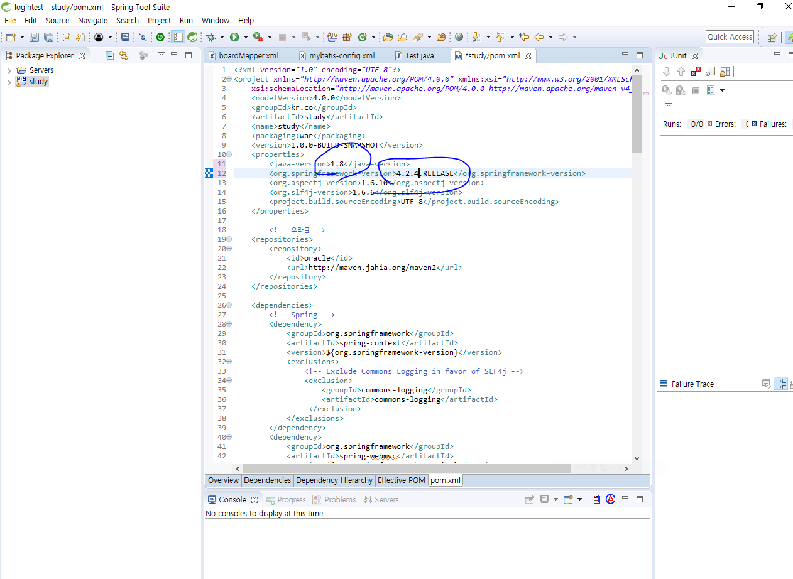
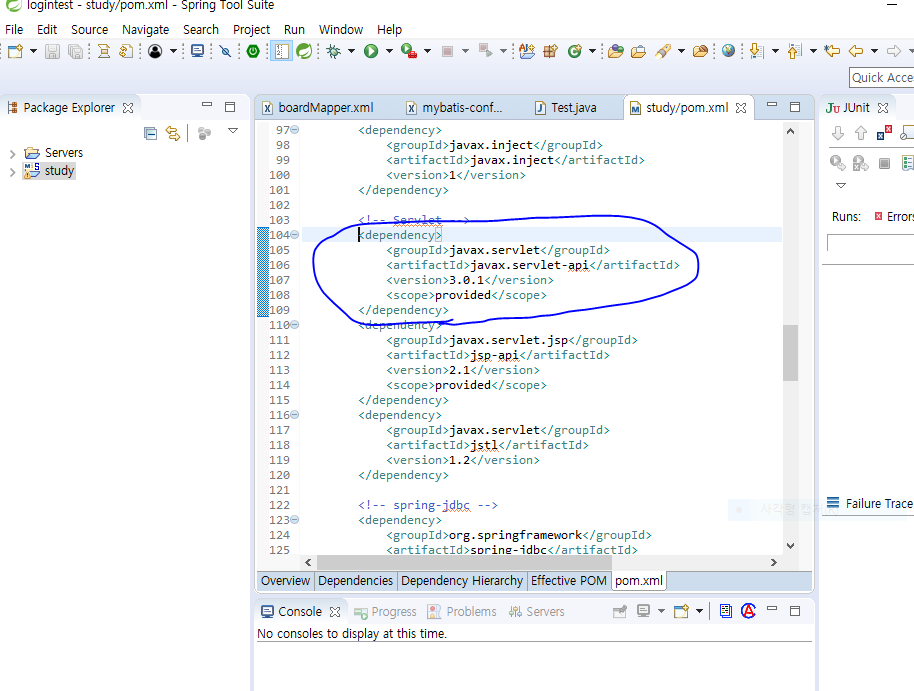
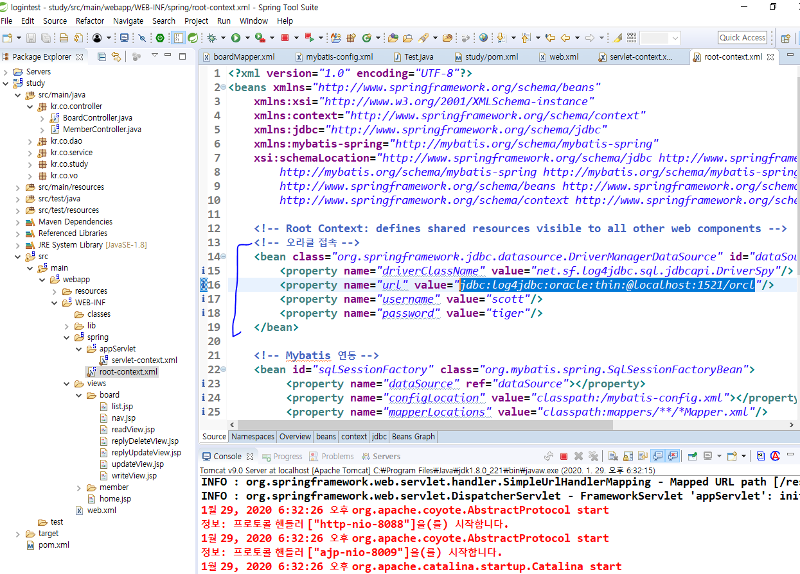
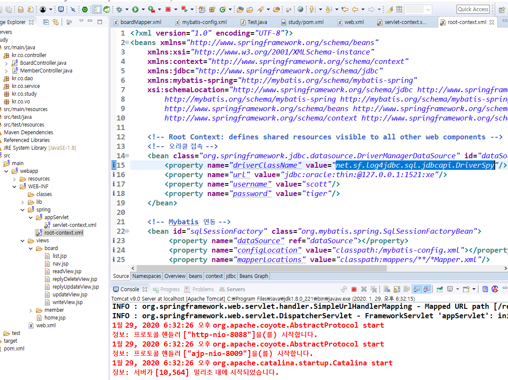

# spring으로 게시판 구성

https://bigfat.tistory.com/72?category=611606

https://melonpeach.tistory.com/37


- 오라클 계정 등록하기.



- 버전 변경 원래 dynamic = 2.5, java = 1.8이었음



- pom.xml에도 버전수정
  - 원래 java = 1.6, springframework = 3.1.1.RELEASE 였음.



- servlet의 버전도 수정
  - mvnrepository.com -> survlet -> Java Servlet API -> 3.0.1 -> 코드 복붙

``` 원래꺼
<dependency>
			<groupId>javax.servlet</groupId>
			<artifactId>servlet-api</artifactId>
			<version>2.5</version>
			<scope>provided</scope>
		</dependency>
```



- DB url등 바꾸기 ???????



